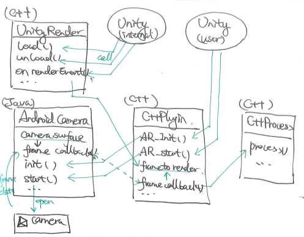
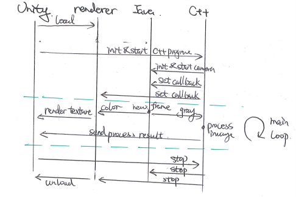

Unity Camera Renderer
================================

When making a Unity AR application, the basic problem is the structure of the process. And here we will talk about it.

The whole process of a AR application should be about:

* open camera
* receive camera frame (and other sensor data)
* process the received camera frame (and other sensor data)
* output the result
* render the view

The first problem is to assign the missions to suitable people. For our application, we have assigned the rendering task to Unity3D. However, we have not decide the others yet.
I will start from the very first step : **open camera**.

Open Camera
~~~~~~~~~~~~~~~~~~~~~

For this task, we have three choices. 

* Unity open the camera
* Android Java open the camera
* C++ call opencv to open the camera

They have different advantages and drawbacks:

* If Unity open the camera, we need to pass the image data to C++ to do further calcualtion. We need to define more plugins to realize it. As a result, our program will become unsafe, and the processing will become less efficient (as it will involve more memory gestion). However it is the fastest way to develop. As it is extremely easy to open camera with unity's "CameraTexture" class.
* All we can use Android java to opencv camera, and set the frame callback to be our C++ function. As a result, we need to build another Java plugin package along with the C++ plugin. And we need to implement the renderer plugin to avoid too much memory use. But we can still easily open camera and manger it with "android.hardware.camera".
* The third one is to C++ code in the whole process. Open camera with Opencv C++, process the image, and render image with unity low level plugin. We should have one single C++ plugin library. However, we need include dependence of Opencv (or we need to implement the whole image receive and decode process, which is very hard).

We used the first method in the very beginning of our project. And as our projcet precceding, I begin to try to realize the second method. It takes me a few days to finish it (with almost no Java experience, and limited unity exprience, but robust C++ fundation). 

Whole Process
~~~~~~~~~~~~~~~~~~~~~~~~~~
The whole process structure and a time circle is shown here. (It will be better if I use Capella, but nobody appreciate it here in the company. They always "plan" things without a clear guide, total different from what we had done in France. Nobody will read this anyway.)

   

Android Java Camera Surface
~~~~~~~~~~~~~~~~~~~~~~~

Java (ARCameraHandler)
------------------

The camera is opened with android camera surface. With three main function :

* **public void initialize(int presetWidth, int presetHeight, long handlerPtr);** Initialize the camera , set the layout, and link the C++ "C++ handler"'s pointer. Inputs are the camera stream width and height, and the pointer to the handler.
* **public void receiveCameraFrame(byte[] data, int width, int height, boolean backCamera);** This will call the callback function when receving a new image frame. The inputs are the image data, the image width and height, a bool to indicate the front/back camera.
* **public  native void setCameraFrame(byte[] paramArrayOfByte, int width, int height, long handlerPtr);** This is the callback function (which is written in C++, but use plugin to introduce here), it will go to the "C++ handler", and call the function defined in the "C++ handler" to process the image (algorithm calculation and low level rendering). The inputs are the image data array, the width and height of the image, and the pointer to the handler.

C++
----------------

And "setCameraFrame" function is defined in an JNI cpp file :

   extern "C"
   JNIEXPORT void JNICALL Java_com_moonlight_liuye_unityrenderplugin_ARCameraHandler_setCameraFrame(JNIEnv *env, jobject obj, jbyteArray dataArray, jint width, jint height, jlong handlerPtr){
      int64 timestamp = cv::getTickCount();
      jboolean isCopy = JNI_FALSE;
      signed char *yuv = env->GetByteArrayElements(dataArray, &isCopy);

      AndroidCameraInterface *cameraInterface = (AndroidCameraInterface*)handlerPtr;
      cameraInterface->receiveCameraFrame((char*)yuv, width, height, timestamp);

      env->ReleaseByteArrayElements(dataArray, yuv, 0);
   }

Jar Library
--------------

I used a "Jar" library instead of a "aar" library, so I can easily change the layout and other configuration parameters. To build a "jar" we need to add a few lines (some tasks) in the gradle build file :

   task deleteJar(type: Delete) {
        delete 'libs/cameraRender.jar'
   }

   task createJar(type: Copy){
        from('build/intermediates/bundles/release')
        into('libs/')
        include('classes.jar')
        rename('classses.jar','cameraRender.jar')
   }

   createJar.dependsOn(deleteJar, build)

Then we need to go to the gradle page(mostly at the right hand side of Android Studio) to find the methods we have defined upward to build a Jar library. Finally find the "classes.jar" and write a correct "AndroidManifast.xml", while will be later added into Unity3D project.

At the end of this step, we end up with two files **"classes.jar"** and **"AndroidManifast.xml"** . They will open the camera, set the right callback function and configurate the application layout.

C++ Handler
~~~~~~~~~~~~~~~~~~~~~

Now we need to define the handler for:

* passing its pointer to Java's camera callback
* send the image data to renderer
* and also to trigger the algorithm processing

I will talk about this three parts with more details

Connect with java
-----------------------

To connect with java, we need :

1. Find the java class by its name. (in my case, is "com/moonlight/liuye/unityrenderplugin/ARCameraHandler")
2. Find the other methods we need in the class. (Above all, the "initialize" we talked about above)
3. In the initailization of this handler, we will call the "initialize" of java ARCameraHandler. For passing the pointer of "this" object to java, for correctly setting the camera frame callback.

   jniEnv->CallVoidMethod(localObj, handlerInit, frameWidth, frameHeight, (jlong)this);

4. Define the "receiveCameraFrame" function, so we can call this function from the JNI function (as we defined above):

   void AndroidCameraInterface::receiveCameraFrame(char *yuvFrameData, int width, int height, long timestamp) {
      LOGD("[moonlight] [Camera] received camera frame %d x %d\n", width, height);
      if (grayFrame.cols != width || grayFrame.rows != height) {
         grayFrame.create(height, width, CV_8UC1);
         rgbFrame.create(height, width, CV_8UC3);
      }

      cv::Mat yuvMat(height + height / 2, width, CV_8UC1, yuvFrameData);
      cv::cvtColor(yuvMat, rgbFrame, CV_YUV420sp2RGB, 3);
      memcpy(grayFrame.data, yuvFrameData, grayFrame.total());

      frameCallback(rgbFrame.data, grayFrame.data, timestamp);
   }

5. We need "frameCallback(rgbFrame.data, grayFrame.data, timestamp)" to trigger the data processing. We can set this callback from outside the class by :

   void AndroidCameraInterface::start(FrameCallBackFunc callback, int cameraFacing) {
      LOGD("[moonlight] [Camera] starting with camera %d\n", cameraFacing);
      frameCallback = callback;

      jniEnv->CallVoidMethod(handlerObject, handlerStart, cameraFacing);
   }

Data process
------------------

**FrameCallBackFunc** is defined as:

   void AR_FrameProcess(unsigned char *colorData, unsigned char *grayData, double timestamp) {
      // process the data by algorithm
      processGrayData(grayData, timestamp);
      
      // copy the color data into a global variable to process
      pthread_mutex_lock(&renderMutex);
      memcpy(renderingFrame.data, colorData, renderingFrame.total() * renderingFrame.elemSize());
      pthread_mutex_unlock(&renderMutex);
   }

* Pass the gray scale data for algorithm processing thread.
* Save the color data to be render by renderer.

C++ Renderer
~~~~~~~~~~~~~~~~~~~~~~

Use the unity low level plugin here to render.
We need to follow the instruction from Unity offical page, to define the "Load", "unLoad" and "OnRenderEvent" functions. 
`[CSDN page] https://blog.csdn.net/weixin_44492024/article/details/102578846`_

   void UnityOpenGLCameraRenderer::renderCameraFrame(uint8_t* data) {
      if (data == NULL) {
         return;
      }
      int glErCode = glGetError();
    
      glBindTexture(GL_TEXTURE_2D, textureId);
      if ((glErCode = glGetError()) != GL_NO_ERROR) {
         LOGE("[moonlight] [Render] GL Error binding: %d \n", glErCode);
      }

      glTexSubImage2D(GL_TEXTURE_2D, 0, 0, 0, width, height, pixelFormat, pixelType, data);
      if ((glErCode = glGetError()) != GL_NO_ERROR) {
         LOGE("[moonlight] [Render] GL Error render: %d \n", glErCode);
      }
   }

