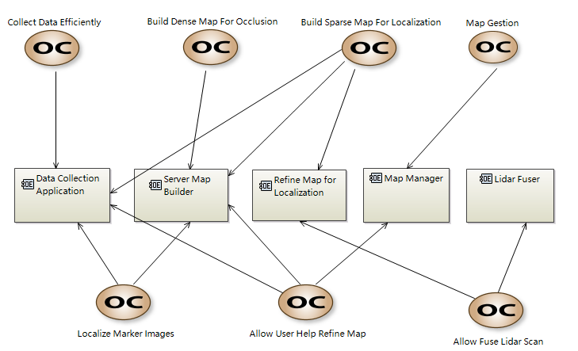

M1. MOperationalAnalysis
==============================

Here we show our main concern here : **Our User Cases**.

* To allow an efficient way of data collection, we develop a user-friendly data collection application.
* We will build both the sparse map (for single image localization) and dense map (for AR occlusion) from visual data.
* If user provides the marker image data in the map, we will also support a high accurate marker localziation process.
* If user provides the 3D lidar scan of the corresponding scene, we will support a calibration of the 3D Scan into our visual map.
* We will allow a fine manager tool for user to manager all the available maps.

The *Data collection application* will be built on mobile local devices, and the other entities will all built in the server.
