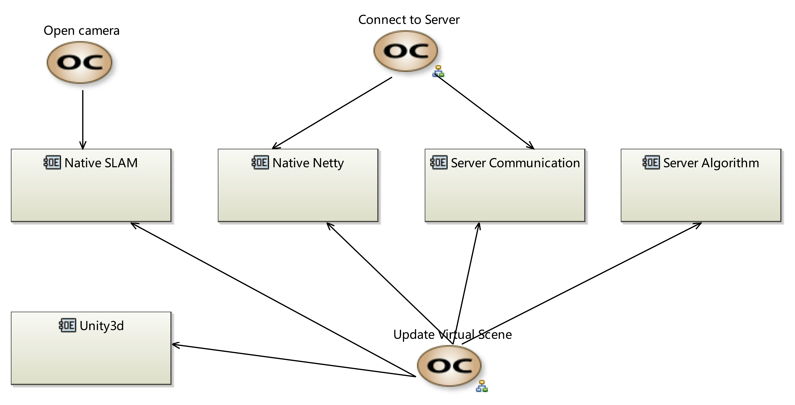

1. Operational Analysis
==========================

1.1 Operational Capabilities
--------------------------------

We have three main tasks here:

* **Open the camera**, which will be handled by the local SLAM system (for an example ArCore, ArKit, or our SLAM system).
* **Connect to server**, will use the Netty communication, while will be the main task of our server department.
* **Update Virtual Scene**, is our main task here. it consists of several steps, which will be clearified later.
