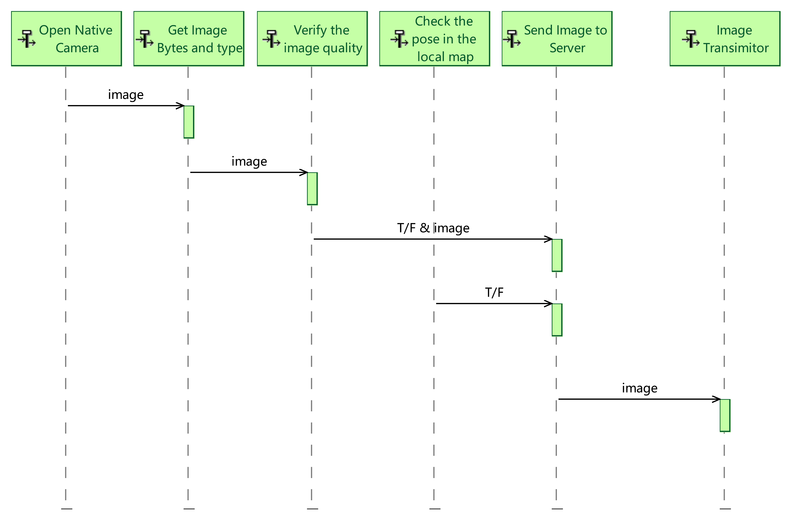
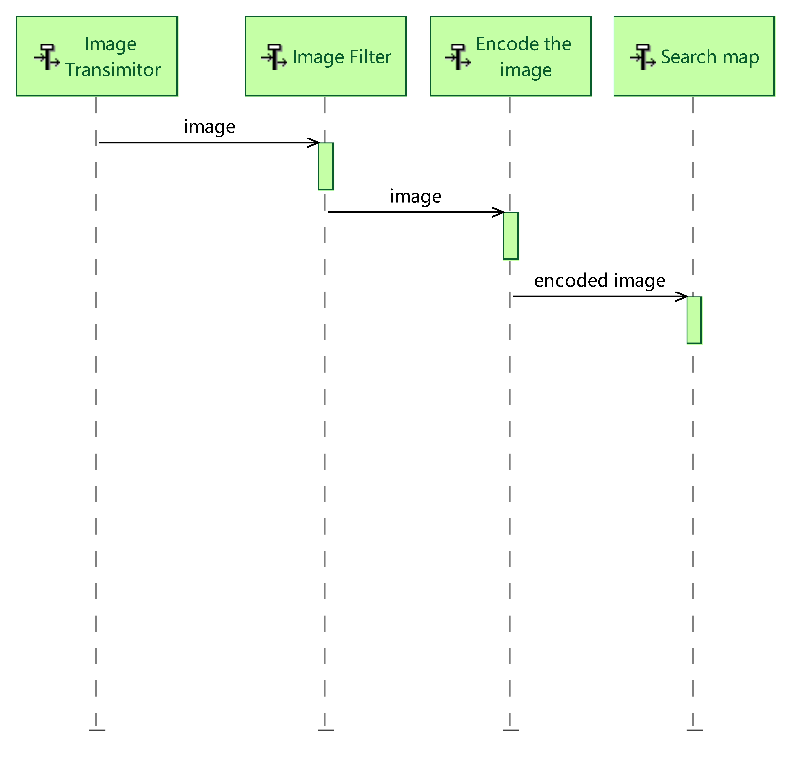
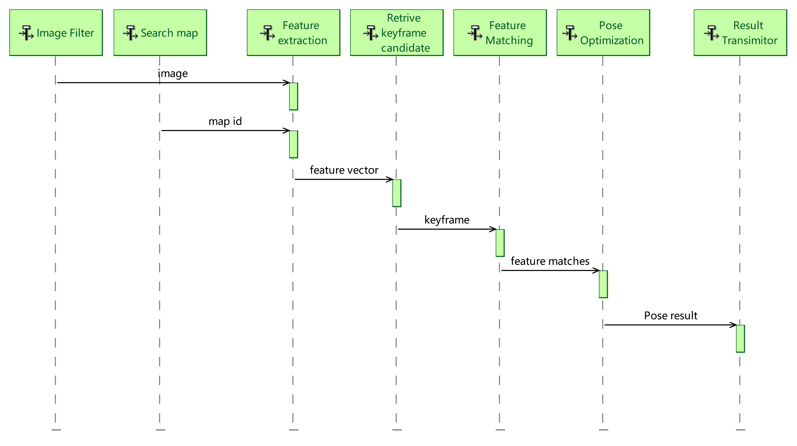
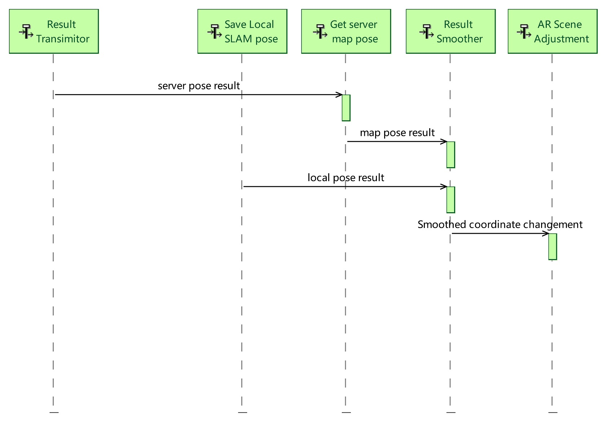

2. System Analysis
================================

1.1 Sytem Function Breakdown
----------------------------------

.. image:: images/SFBDRootSystemFunction.jpg
   :align: center
   :width: 60%

1.2 System Data Flow Blank
-------------------------------

.. image:: images/SDFBRootSystemFunction.jpg
   :align: center

1.3 Scenario
------------------------------

**Send image**:

**Search the corresponding server map**:

**Calculate pose in the map**:

**Fusion of the two coordinate system**:

