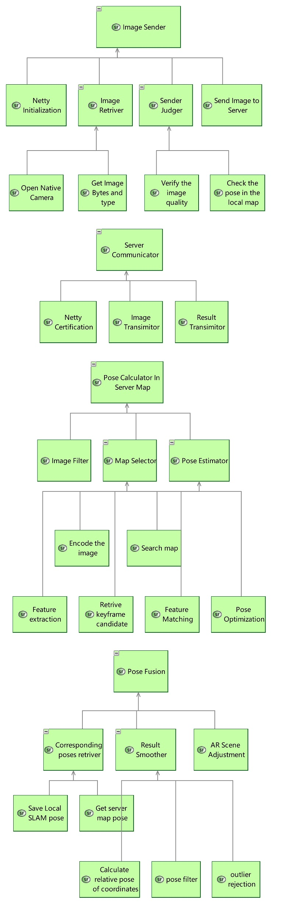

2. System Analysis
================================

1.1 Sytem Function Breakdown
----------------------------------

1.2 System Data Flow Blank
-------------------------------

.. image:: images/SDFBRootSystemFunction.jpg
   :align: center

1.3 Scenario
------------------------------

**Send image**:

.. image:: images/FSScenarioSendImage.jpg
   :align: center

**Search the corresponding server map**:

.. image:: images/FSScenarioSearchMap.jpg
   :align: center
   :width: 70%

**Calculate pose in the map**:

**Fusion of the two coordinate system**:

