11. PageRank
=======================
PageRank is a method for ranking webpages by importance using link structure in the web graph.
This is a commonly used `algorithm <http://ilpubs.stanford.edu:8090/422/>`_ for web search popularized by Google.

11.1 Web
---------------

Web is directed graph with :

* Nodes as web pages. Consider only static webpages, Ignore dark matter on the web (i.e. inaccessible material, pages behind firewalls).
* Edges as the hyperlinks. Assume all links are navigable. Transactional links (eg: like, buy, follow etc.) are not considered.

**Theorem** : Any directed graph can be represented as a combination of these two types : Strongly connected graphs, and
Directed Acyclic Graph (DAG: A graph where there are no cycles and if u can reach v, then v cannot reach u).

**Find SCC** (where G' is the graph G with inversed edges):

.. math::
  SCC = Out(v) \cap In(v) = Out(v,G) \cap Out(v, G')

**Bowtie structure** of network :

* IN : there is a directed path from each node of IN to (all the nodes of) SCC.
* OUT : containing all starting points for which the backward BFS ‘explodes’. There is a directed path from any node in the SCC to every node in OUT.

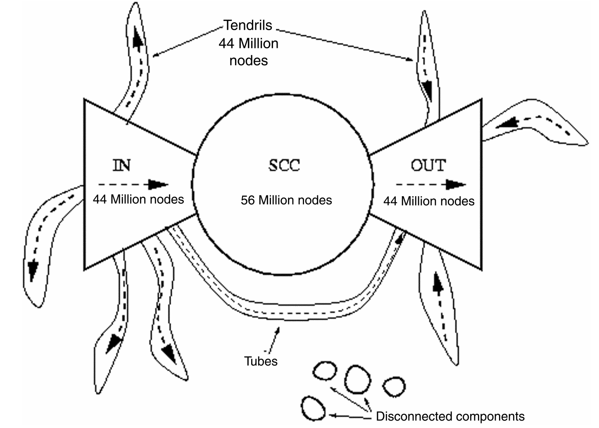

11.2 PageRank
-----------------------

Ranking nodes on the graph. Think **links as votes** (with in-links' edges having higher weight). and as a recursive process.

.. math::
  r_{j} = \sum_{i\to j}\frac{r_{i}}{d_{i,out}}, \quad r_{j\to k} = \frac{r_{j}}{d_{j,out}}

We could matrix to represent the process, with M an adjacency matrix that is column stochastic :

.. math::
  r = Mr

**Interpretation** : It’s modeling the stationary distribution of the random walker process on the graph.
Or we could see it as the equilibrium of a energy flow.

**Power law iteration** : Limiting distribution = principal eigenvector of M = PageRank.
Run the process :math:`r^{t+1} = Mr^{t}` until convergence.

**Problems**:

* **Dead ends** leak out -> Add a random teleports (add 1/N to each element of the adjacency matrix).
* **Spider traps** self-loop -> random jump with probability :math:`1-\beta`.

By solving the problems using the upper methods, we will have :

.. math::
  r_{j} = \sum_{i\to j}\beta \frac{r_{i}}{d_{i}} + (1-\beta)\frac{1}{N}

.. math::
  r = \beta Mr + \frac{[1-beta]}{N} = Ar

By adding an addition term, we make A a positive semi-definite matrix, which will have better property.

11.3 Examples
----------------------

**Bipartite : User-to-Item graph**

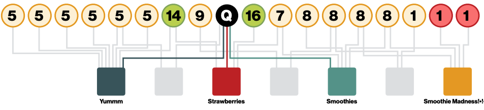

**Summary**:

* Normal pagerank: Teleportation vector is uniform.
* Personalized PageRank: Teleport to a topic specific set of pages. Nodes can have different probabilities of surfer landing there.
* Random walk with restarts: Topic specific pagerank where teleport is always to the same node. In this case, we don’t need power iteration we can just use random walk and its very fast and easy.

11.4 HW3 Q1
-----------------

Here I plot some information about the two graphs:

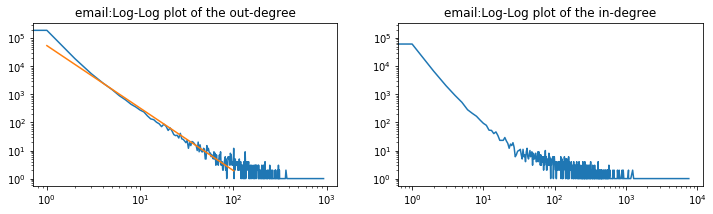

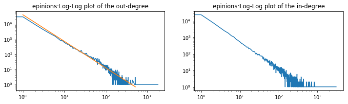

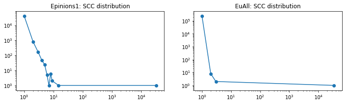

**Question 1.1** : We could roughly tell if a node is belong to SCC, IN or OUT, by the difference pf the number of nodes in the
inward BFS tree and the outward BFS tree. If the difference is relatively small, it should be in the SCC. If large, it will be in IN or OUT.
The result of this question is ::

  GT: Node 2018 in the SCC :  False
  A lot more nodes in the outward BFS tree, Node 2018 should be in IN set.
  GT: Node 224 in the SCC :  True
  Inward and outward trees have roughly the same size, Node 224 should be in SCC set.

**Question 1.2** : The question ask us to plot four images, while I plot two image by combining the inward/outward in the same image, to better illustrate the result.
And I run 1000 random walk to get a better simulation result (even it took a lot more times).

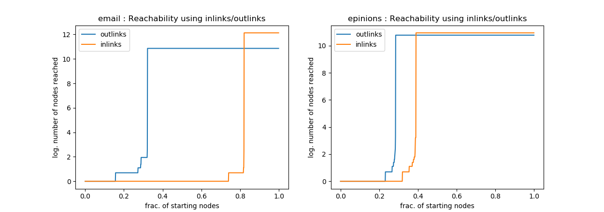

* I found the two plots (in/out) of the Epinions social network is similar to each other. Which means that most of the nodes in the graph are in the SCC, as social network is closely connected.
* While in the email graph, the difference is huge, larger part of the nodes has many outlinks, while much fewer nodes has many inlinks. which means the graph has a relative small SCC and OUT, while a very large IN group.

**Question 1.3** : We simulate random BFS from the nodes in the SCC. We know SCC+IN by the inward BFS tree node count,
and SCC+OUT by the outward BFS tree node count.
Finally, since we know the size of the largest weak component, we can subtract SCC, IN, and OUT to get TENDRILS .

+--------+--------------+--------------+------------------+--------------+--------------+
|        |  SCC         |  IN          | OUT              |TENDRILS+TUBES| DISCONNECTED |
+========+==============+==============+==================+==============+==============+
| Email  |  34203       |  151023      | 17900            |  21706       | 40382        |
+--------+--------------+--------------+------------------+--------------+--------------+
|Epinions|  32223       |  24236       | 15453            | 3965         |    2         |
+--------+--------------+--------------+------------------+--------------+--------------+

**Question 1.4** : Made a 1000 tests for each graphs (undirected situation), and gets (which is easy to Interpretate as it
could be estimated by the ratio of the largest weakly connected component) ::

  --- graph Email ---
  fraction of reachable pairs 0.698
  --- graph Epinions ---
  fraction of reachable pairs 1.0

Consider directed graph situation ::

  --- graph Email ---
  fraction of reachable pairs 0.124
  --- graph Epinions ---
  fraction of reachable pairs 0.457

In this case (Assume TUBES, TENDRILS, and DISCONNECTED all have negligible size), if start from IN, it will surly connect
to SCC and OUT node. If in SCC, then it could connect to OUT and SCC. If in OUT, than it could only connect to almost on other nodes.
As a result, the probability is :

.. math::
  p(connected) \approx \frac{IN}{TOTAL}\frac{SCC+OUT}{TOTAL} + \frac{SCC}{TOTAL} \frac{SCC+OUT}{TOTAL}

The estimated fraction for Email graph is 0.137205584, for Epinions graph is 0.46750880. Which totaly match our simulation results.

11.4 HW3 Q2
-----------------

**Question 2.1** : We could build a user-item graph, then with random walk simulation. We could get the
relationship of each teleport to other teleports. For (i) (ii) the vector could be simply get. and for
(iii) we could use a weighted sum of the teleport's vectors in the set.

**Question 2.2** : The set of linear combination of all the columns in V: :math:`\{ u\mid u = \sum_{i}\alpha_{i}V_{:,i}\}` .

**Question 2.3** : obviously.

12. Network Effects And Cascading Behaviour
================================

**Spreading through network** (disease/information/rumors/news/etc).
Formally, an “infection” event can spread contagion through main players (active/infected nodes) which constitute a propagation tree, known as a cascade.

* Decision-based: each node decides whether to activate based on its neighbors’ decisions. Deterministic rule, nodes are active players, and suited for modeling adoption.
* Probabilistic: infected nodes “push” contagion to uninfected nodes with some probability. Can involve randomness, nodes are passive, and suited for modeling epidemic spreading.

12.1 Decision Based Diffusion
------------------------

**Game Theoretic Model of Cascades: single behavior adoption** : The key intuition behind the game theoretic model
is that a node will gain more payoff if its neighbors adopt the same behavior as it. Decision is made based on payoff matrix.
This process is not inversable.

a : payoff of adopting A, b: payoff of adapting B, p : fraction of edges connected to nodes adopted A, d: degree of the node.
If we have :math:`adp > b(1-p)d \Rightarrow p> b/(a+b) =q`, then this node will adopt to A.

**Case Study: Modelling Protest Recruitment on social networks** `link <https://arxiv.org/abs/1111.5595>`_ .
Anti-austerity protests in Spain May 15-22, 2011 as a response to the financial crisis.
Undirected network of Twitter users, 70 identified hashtags associated, 581,750 tweets, 87,569 users.

*Activation Threshold Distribution* : Uniform activation threshold for users, with two local peaks :

.. image:: images/activation_threshold_distribution.jpg
   :align: center

*Information Cascades* : Most cascades are short. Successful cascade starters are central (higher k-core number).

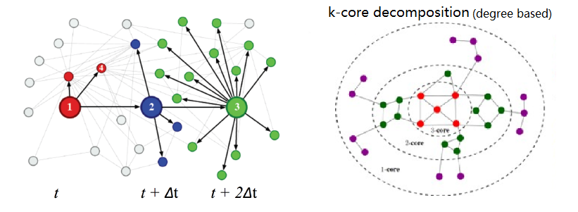

**Extending Game Theoretic Model: multi-behavior adoption** , **Node switch example** : Add state that could maintain both strategies with some cost (c).

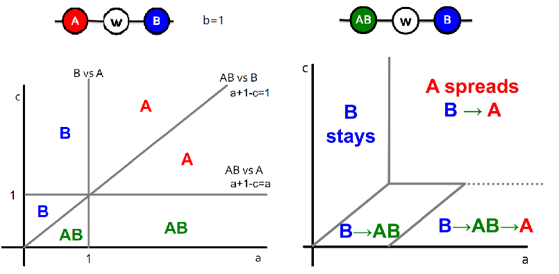

12.2(13) Probabilistic Diffusion
--------------------------

Process of contagion is complex and unobservable (and may involve randomness).

12.2.1 Basic Reproductive Number
~~~~~~~~~~~~~~~~~~~~~~~~~~~~~~~

**Probabilistic Spreading Models** epidemic model based on random trees. :math:`p_{h}` prob. a node at depth h is infected (prob infected :q).
we want to know :math:`\lim_{h\to \infty}p_{h}`

.. math::
  p_{h} = 1 - (1-q\cdot p_{h-1})^{d} = f(p_{h-1})

Fixed point :math:`f(x) = x` , :math:`f'(x)` is monotone non-increasing on [0,1].
For the epidemic to die out we need fixed point at zero, which requires :math:`f(x)` to be below :math:`y=x`.
So we need :math:`R_{0} = f'(0) = q\cdot d < 1`.

* If :math:`R_{0} \ge 1` : epidemic never dies and the number of infected people increases exponentially.
* If :math:`R_{0} < 1` : Epidemic dies out exponentially quickly.
* HIV has an :math:`R_{0}` between 2 and 5; Measles between 12 and 18; Ebola between 1.5 and 2 (low, only because it is too deadly).

**Cascades on Flickr** The basic reproduction number of popular photos is between 1 and 190.
This is much higher than very infectious diseases like measles, indicating that social
networks are efficient transmission media and online content can be very infectious.

12.2.2 Epidemic Model
~~~~~~~~~~~~~~~~~~~~~~~~

**S+E+I+R Model** General scheme for epidemic models.

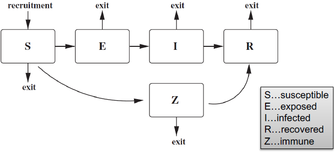

**SIR Model** : Assuming perfect mixing (The network is a complete graph) the model dynamics are:

.. math::
  \frac{dS}{dt} = - \beta SI , \ \frac{dI}{dt} = \beta SI - \delta I, \ \frac{dR}{dt} = \delta I

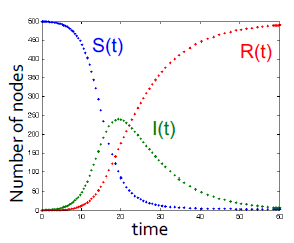

**SIS Model** Susceptible-Infective-Susceptible (SIS) model. Cured nodes immediately become susceptible.

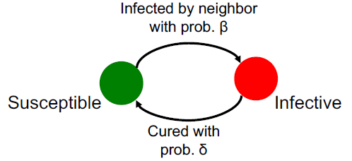

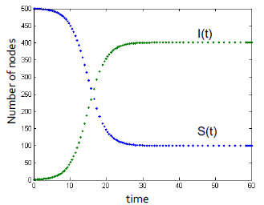

We have no epidemic if virus is not strong enough :

.. math::
  \beta / \delta < \tau = 1/\lambda_{1,A}

Where :math:`\lambda_{1,A}` is the largest eigenvalue of the adjacency matrix A of graph G.
And the initial infected number is not important.

**Example: Ebola** . `Assessing the International Spreading Risk Associated with the 2014 West African Ebola Outbreak <http://currents.plos.org/outbreaks/index.html%3Fp=40803.html>`_
and `Estimation R0 of Ebola <http://currents.plos.org/outbreaks/article/estimating-the-reproduction-number-of-zaire-ebolavirus-ebov-during-the-2014-outbreak-in-west-africa/>`_ .

12.2.2 Application Rumor spread
~~~~~~~~~~~~~~~~~~~~~~~~~~~

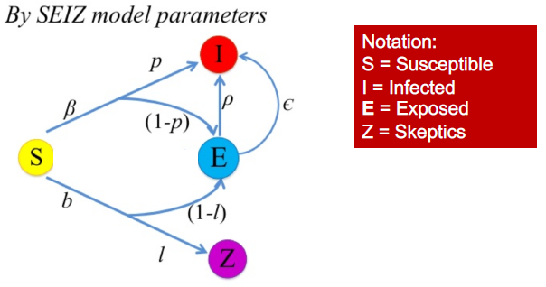

.. math::
  R_{SI} = \frac{(1-p)\beta + (1-l)b}{\rho + \epsilon}
