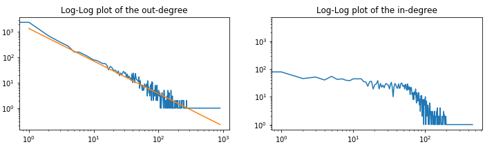
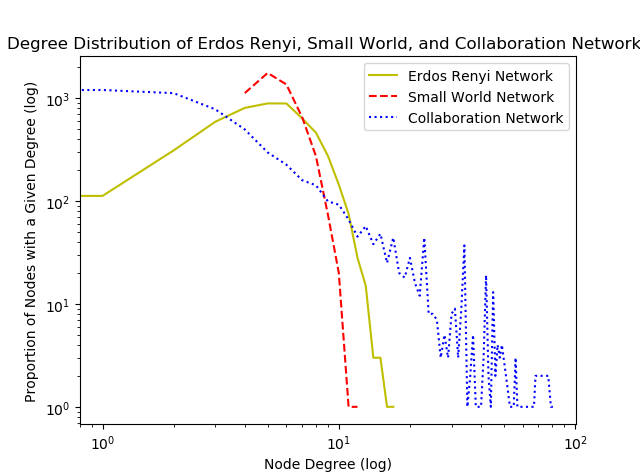

1. Introduction: Structure of Graphs
=============================

1.1 Introduction
-----------------------

*How the systems are organized? And what's their property?*

Firstly, several network examples are introcduced, mainly two classes : **natural graph and information graph**.

Then some application examples are shown, they could be classified into two classes:

* Learning the structure, in other words, learning the relationship of the network. (an example of **Biomedicine** is shown in details)
* Information cascade in the networks (more officially, marginalization inference of the networks).

1.2 Graph
----------------------

* Directed graph, undirected graph. Complete graph, bipartite graph.
* Representations: adjacency matrix, edge/adjacency list. Most of the graphs are **sparse** !
* Additional on graphs : attach more informations, add weights to edges; loops; etc.
* Connectivity of graphs , connected components, different for directed and undirected graphs.

1.3 Book Read
----------------------

Chapter 1 of book `Networks, Crowds, and Markets <http://www.cs.cornell.edu/home/kleinber/networks-book/>`_

**Behavior and Dynamics** : the connected network will result in ta dynamics influence of each entity's behavior.
As the consequence will transform based on the structure of the network. It is essential for descision making.
And help us to understand the world.

**Graph theory**

**Game theory**, the network plays a role of shared resource, while our decision will depends on the choices of ohters.
The combined actions of its users can either congest this resource or use it more efficiently.

*Markets and Strategic Interaction on Networks*

*Information networks*

*Network Dynamics: Population Effects, Structural Effects*

1.4 HW0
-------------------

**SNAP**

Stanford Network Analysis Platform `site <http://snap.stanford.edu/>`_ , in Python and C++ (core in C++).

`Python homework <https://github.com/gggliuye/VIO/blob/master/MachineLearningWithGraph/HWs/HW0-IntorSNAP.ipynb>`_

2. Properties of Networks and Random Graph Models
=============================

2.1 Properties
----------------------

* Degree distribution (P(k)) : mainly in form of a histogram.
* Path length (h) : distance, mean distance, diameter, etc.
* Clustering coefficient (C) : mainly for undirected graph, descript how the friends of a node know each other. the following equation shows (where :math:`e_{i}` = # edges between friends of i, and :math:`k_{i}` = # friends of i)

.. math::
  C_{i} = \frac{2e_{i}}{k_{i}(k_{i}-1)}

* Connectivity (S) : equals to the number of nodes in the largest connected component.

To evaluate a network, or analysis its characteristics, we need a model to compare as a reference.

2.2 Erolos-Renyi Random Graph Model
----------------------

* :math:`G_{np}` (n = # nodes, p = probability of the connection idd).
* :math:`G_{nm}` (n = # nodes, m = # edges).

The probability of degree of :math:`G_{np}` is (which is a Poisson distribution):

.. math::
  p_{k} = C_{k}^{N} p^{k}(1-p)^{N-k}

Summary:

+--------------------+--------------------------------------------------------+
| Properties         |  Expressions                                           |
+====================+========================================================+
| Average degree     |  :math:`\bar{k} = p(n-1)`                              |
+--------------------+--------------------------------------------------------+
| Average path length|  :math:`O(\log n)`                                     |
+--------------------+--------------------------------------------------------+
| Cluster coefficient|:math:`\mathcal{E}[C_{i}] = p \approx \frac{\bar{k}}{n}`|
+--------------------+--------------------------------------------------------+
| Connectivity       |   GCC exists of :math:`\bar{k}>1`                      |
+--------------------+--------------------------------------------------------+

* It is the simplest model -> a reference model.
* Helps to compare and understand properties.
* Example : the passage of a disease.

2.2.1 Paper Read
~~~~~~~~~~~~~~~~~~~~~~~~

*Random graphs with arbitrary degree distributions and their applications 2001*.
generalizes the mathematics of random graphs to non-Poisson degree distributions, and to directed and bipartite graphs.

**Motivations**:

* The normal Gnp model's degree follows Poisson distribution, while most networks dosen't e.g. social network.
* The normal Gnp model could not capture the properties of a directed network.
* Some networks are better modeled with bipartite graphs.

'Generate' the model by generating function :math:`G_{0}(x) = \sum_{i=0}^{\infty} p_{k}x^{k}`

2.3 The Small-world Model
----------------------

Has high clustering and short average path length, lots of neighbor clusterings with
some link in large range. Most people only knew their near neighbors, and a few people knew someone far
away.
Which is similar to our social networks: many closed triads, but also very short paths.

Developed in 1998, **Watts Strogatz Model**.

.. image:: images/small_world.png
  :align: center
  :width: 75%

2.3.1 Book Read
~~~~~~~~~~~~~~~~~~~~

Chapter 20 of book `Networks, Crowds, and Markets <http://www.cs.cornell.edu/home/kleinber/networks-book/>`_
The Small-World Phenomenon.

**Milgram’s experiment** really demonstrated two striking facts about large social networks:

* first, that short paths are there in abundance;
* and second, that people, acting without any sort of global “map” of the network, are effective at collectively finding these short paths.

**The Watts-Strogatz model** : the crux : introducing a tiny amount of randomness
— in the form of long-range weak ties — is enough to make the world “small,” with
short paths between every pair of nodes.

**What makes the decentralized search so effective?** one can prove that decentralized search in the Watts-
Strogatz model will necessarily require a large number of steps to reach a target — much
larger than the true length of the shortest path

2.4 Kronecker Graph Model
----------------------

* Build based on recursively apply Kronecker product.

.. math::
   A \otimes B = \begin{bmatrix}a_{1,1}B & ... & a_{1,n}B \\
   . & & . \\ . & & . \\ a_{m,1}B & ... & a_{m,n}B \end{bmatrix}

* Generate large graph with self-similarity.
* Stochastic Kronecker graph model. (apply a fast edge dropping/adding step)
* Close to real social networks.

2.5 HW1 - q1
------------------------

`Python homework <https://github.com/gggliuye/VIO/blob/master/MachineLearningWithGraph/HWs/HW1-q1-starter.py>`_

Compare three networks: Erdos-Renyi Random graph, Small-World Random network, and Real-World Collaboration Network.

**Degree Distribution**:

**Clustering Coefficient**:

* Clustering Coefficient for Erdos Renyi Network: 0.000898
* Clustering Coefficient for Small World Network: 0.284203
* Clustering Coefficient for Collaboration Network: 0.529636

The random network, will be linked randomly, which is natural that it will not have few clustering.
The small world model is designed to have small diameter, as a result, it will have larger clustering coefficient.
While the real model, which is a network represent authors of research papers on the arXiv in the General Relativity and Quantum Cosmology section
As the scientists collaborate together to work on papers, it definitely end up with the highest clustering coefficient.
