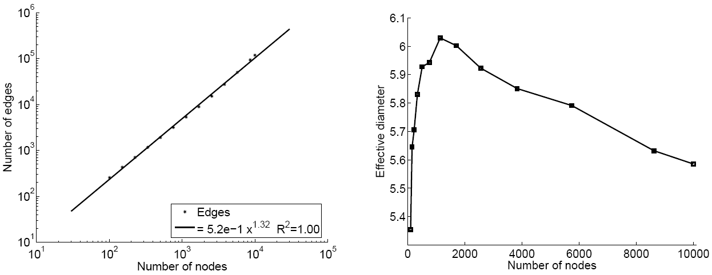
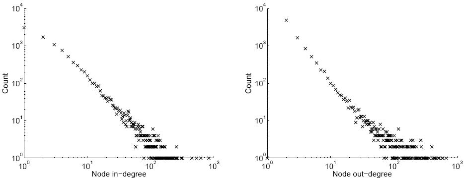
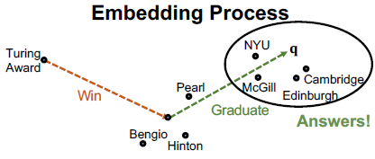
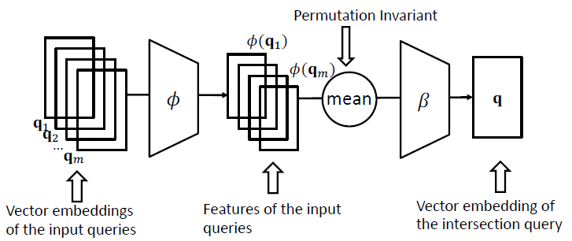
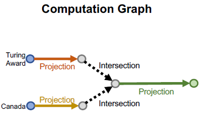
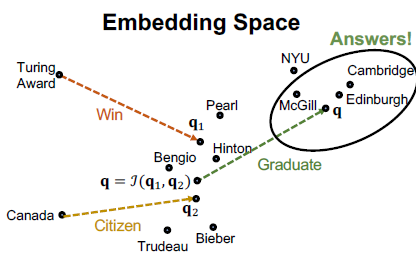
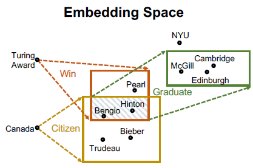
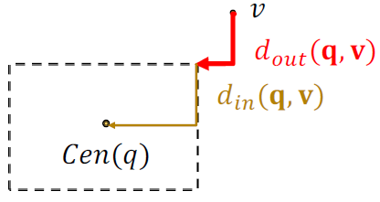

14. Influence Maximization
=============================

**Viral Marketing** :  a strategy that uses existing social networks to spread and promote a product.
A well-engineered viral marking compaign will identify the most influential customers, convince them
to adopt and endorse the product, and then spread the product in the social network like a virus.

-> find the most influential set of nodes.

14.1 Linear Threshold Model
------------------------

Each node influenced linearly by its neighbors. And get activated if supress its threshold.

* A node has a random threshold :math:`\theta_{v} \sim U[0,1]`.
* A node v influenced by each neighbor w according to a weight :math:`b_{v,w}`, such that :

.. math::
  \sum_{w\in N(v)}b_{v,w} \le 1

* A node v becomes active when at least :math:`\theta_{v}` fraction of its neighbors are active. That is :

.. math::
  \sum_{w\in N(v)\ active} b_{v,w} \ge \theta_{v}

14.2 Independent Cascade Model
---------------------------

If node v is active, it gets **one** chance to make w active, with probability :math:`p_{vw}`.

* Each edge fires only once.
* If u and v are both active and link to w, it does not matter which tries to activate w first.

14.3 Influential Maximization (of ICM)
------------------------------

**Most influential Set of size k** , (k is a user-defined parameter) is a set S
containing k nodes that if activated, produces the largest expected cascade size f(S).
optimzation problem (NP hard [1]_ ) :

.. math::
  \max_{\# S = k}f(S) = \max_{\# S = k}\frac{1}{\mid I\mid}\sum_{i \in I\ random\ simulation}f_{i}(S)

**Influence set** :math:`X_{u}` of node u, is the set of nodes that will be eventually (expected)
activated by node u.

.. math::
  f_{i}(S) = \mid \cup_{u\in S}X_{u}^{i} \mid

**Hill Climbing** that gives a sub-optimal solution (:math:`f(S)\ge (1-1/e)f(S_{opt})`) [2]_ :
At each iteration, activate the node u that gives the largest marginal gain:

.. math::
  \max_{u}f(S_{i-1}\cap \{ u\})

**Monotone** : If S is a subset of T, then :math:`f(S)\le f(T)`, and :math:`f(\emptyset) = 0`.

**Submodular** : If S is a subset of T, then for any node u [3]_ :

.. math::
  f(S\cup \{ u\}) -f(S) \ge f(T\cup \{ u\}) -f(T)

While the greedy approach is slow. **Sketch-based** algorithm to accelerate : compute small structure per node from which to estimate its influence.
Then run influence maximization using these estimates.

.. [1] See the hand-on, we could prove **Set Cover** problem (briefly take k subsets to cover the most), which is NP-hard, could be reduced to Influence maximization problem.

.. [2] As it is monotone and submodular. See the prove in the hand-on.

.. [3] Which means that adding a node to a set has less impact ("marginal gain") than adding the same node to a smaller subset of that set. f is submodular as it is a positive linear combination of submodualr functions :math:`f_{i}` .

15. Outbreak Detection
=========================

`More <https://snap-stanford.github.io/cs224w-notes/network-methods/outbreak-detection>`_

15.1 Introduction
-------------------

Example : **Detecting Contamination/Information Outbreak** to detect the cascades as fast/effective as possible.

**General Problem** : given a dynamic process spreading over a network we want to select a set of nodes to detect the process effectively.

**Problem Setup** : Given: a graph G(V,E) and data on how outbreaks spread over this G (for each outbreak i , we knew
this time T(u,i) when the outbreak i contaminates node u). Goal: select a subset of nodes S that maximize the expected
reward:

.. math::
  \begin{align}
  maximize_{S\subset U} \ & f(S) = \sum_{i}p(i)\cdot f_{i}(S)\\
  subject \ to \ & cost(S) \le B
  \end{align}

Where:

* p(i) : the probability of outbreak i occuring.
* :math:`f_{i}(S)` : rewarding (~ detecting time; ~ detected propagations; ~ number of infected people) for detecting outbreak i using "sensor" S.
* B : total budget (time, money, etc.) of placing "sensors" .

Reform the probelm as penalty reduction to prove the problem as submodular.

15.2 CELF
----------------------

CELF: Algorithm for Optimziating Submodular Functions Under Cost Constraints. `Leskovec er al. 2007 <https://www.cs.cmu.edu/~jure/pubs/detect-kdd07.pdf>`_ .
Find the best along : **unit cost greedy** and **benefit-cost greedy**.

16. Network Evolution
==========================

16.1 Denfication and Diameter
-------------------------

**Edges w.r.t. Nodes** : The growth of number of edges w.r.t. the number of nodes.

.. math::
  E(t) \propto N(t)^{a}

* a is the densification paramtere. Generally, we have :math:`1\le a \le 2` . Examples: we have a = 1.2 for internet, and a = 1.6 for citations network.
* a = 1 linear growth (constant out-degree), a = 2 quadratic growth (fully connected network).

**Diameter** shrinks over time : As the network grows the distances between the nodes slowly decreas.

* **Densification** : Densifying random graph (using a random simulation) shows increasing diameter. *There is more to shrinking diameter than just densification* .
* **Degree sequence** : generate random network following additional degree sequence perfectly match the real network. *Densification + degree sequence gives shrinking diameter* .

**Degree and Densification** : we have degree exponent :math:`\gamma_{t}` (the slop of the histogram degree-count)

* It is constant :math:`\gamma_{t} = \gamma \in [1,2]`, then we have the densification parameter :math:`a = 2/\gamma` . While for real networks, :math:`\gamma_{t}` could have huge varaiance.
* If :math:`\gamma_{t} = \frac{4n_{t}^{x-1}-1}{2n_{t}^{x-1}-1}`, then a = x . (:math:`\gamma_{t}\to 2` as :math:`n_{t}\to \infty`).

**Forest Fire Model** : to model graphs that densify and have shrinking diameters. (intuition : find references for paper writing -- find references of a reference)
For a directed graph have forward/backward burning probabilities.

If we fix the backward probability r and vary forward burning prob. p.
Notice a sharp transition between sparse and clique-like graphs.

.. image:: images/forestfiremodel_phase.png
  :align: center
  :width: 40%

* The dash line represents denficiation parameter a (left y axis), in the sparse graph phase, adding one node, will just create one link (no denficiation). while in the clique-like graph, once a new node added into the graph, it will burn everyone else (denficiation happens).
* The full line represents the diameters :math:`\gamma` (right y axis). The diameters begin with slowly increasing, followed by a sharp decrease, then finally stay constant.

16.2 Temporal Networks
-------------------------

*How edges are coming and leaving.*

**Temporal network** : A sequence of static directed graphs over the same (static) set of nodes 𝑉 .
Each **temporal edge** is a timestamped ordered pair of nodes (:math:`e_{i} = (u,v) , t_{i}`), where :math:`u,v \in V`
and :math:`t_{i}` is the timestamp at which the edge exists. *Examples* : communication, proximity networks, transportation, cell biology, etc.

**A temporal path** : is a sequence of edges :math:`\{ u_{j}, u_{j+1}, t_{j}  \}_{j}`, where :math:`t_{1} < t_{2}< ... < t_{j} < ...` and each node is visited at most once.
(i.e. we could take a sequence of "trains"(temporal edges) to go to node j). Use TPSP-Dijikastra algorithm to find temporal shortest path.

**Temporal Closeness** : Measure of how close a node is to any other node in the network at time interval [0, 𝑡] (higher the value, more in center), where d is the temporal shortest path
from y to x until time t.

.. math::
  c_{close}(x,t) = \frac{1}{\sum_{y}d(y,x\mid t)}

**Temporal PageRank** by applying random walk on temporal paths with P the probability of a temporal path. And As :math:`t\to \infty`,
the temporal PageRank converges to the static PageRank [1]_ .

.. math::
  P[(u,x,t_{2}) \mid (v,u,t_{1})] = \beta^{\mid\Gamma_{u} \mid}

.. math::
  \Gamma_{u} = \{ (u,y,t') \mid t'\in [t_{1}, t_{2}], y\in V \}

**Temporal PageRank** :

.. math::
  r(u,t) = \sum_{v\in K}\sum_{k=0}^{t}(1-\alpha)\alpha^{k}\sum_{z\in Z(v,u\mid t) \mid z\mid=k}P[z\mid t]

* :math:`Z(v,u\mid t)` is a set of all possible temporal walks from c to u unitl time t.
* :math:`\alpha` is the probability of starting a new walk.

**Temporal Personalized PageRank** :

.. math::
  r(u,t) = \sum_{v\in K}\sum_{k=0}^{t}(1-\alpha)\alpha^{k} \frac{h^{*}(v)}{h'(v)}\sum_{z\in Z(v,u\mid t) \mid z\mid=k}P[z\mid t]

* h* is the personalization vector.
* h' is the walk probability vector :math:`h'(u) = \frac{\mid (u,v,t)\in E:\forall v\ in V \mid}{\mid E\mid}`

.. [1] As :math:`t\to\infty`, :math:`\beta^{\mid\Gamma_{u} \mid}` becomes the uniform distribution. Which will be a regular PageRank.

17. Reasoning over Knowledge Graphs
=========================

**Knowledge in graph form** : Capture entities (nodes), types (node lables), and relationships (edges).

**Datasets** : FreeBase, Wikidata, Dbpedia, YAGO, NELL, etc. **Massive** : millions of nodes, and edges and **Incomplete** : many true edges are missing

17.1 Link prediction
-------------------

**TransE** (see `TransE <https://vio.readthedocs.io/zh_CN/latest/GNN/7GraphRepresentation.html?highlight=transe#transe>`_ )
use TransE to predict links.

17.2 Path Queries
----------------------

**Path Query** (e.g. “Where did Turing Award winners graduate?”)

* Brute Force. The graph could be imcomplete, and the time complexity of traversing a dense KG will be :math:`O(\mid V\mid^{n})` , which intractable.
* Traversing KG in vector space (embed queries): generalize TransE to multi-hop reasoning :math:`q = v_{a} + r_{1}+...+ r_{n}` (time complexity : :math:`O(\mid V\mid)`) .

17.3 Conjunctive Queries
----------------------------

Start from multiple anchor nodes.
(e.g. “Where did Canadian citizens with Turing Award graduate?”)
Also : embed queries in vector space.

**Neural Intersection Operator** , which should be permutation invariant. Input: current query embeddings :math:`q_{1},...,q_{m}`,  Output: intersection query embedding 𝐪.
Same training strategy as TransE.

Taking the intersection between two vectors is an operation that does not follow intuition.
Can we define a more expressive geometry to embed the queries?

17.4 Query2Box
------------------------

**Reasoning with Box Embeddings** (Center, Offset). Intersection of boxes is well-defined !
Boxes are a powerful abstraction, as we can project the center and control the offset to model
the set of entities enclosed in the box.

Geometric Projection Operator 𝒫 :math:`\mathcal{P} : Box\times Relation \to Box`:

.. math::
  Center(q') = Center(q) + Center(r)

.. math::
  Offset(q') = Offset(q) + Offset(r)

Geometric Intersection Operator ℐ  :math:`\mathcal{J} : Box\times ...\times Box \to Box`:
(using weighted average by operator :math:`\bigodot` the dimension-wise product)

.. math::
  Center(q_{inter}) = \sum_{i}w_{i}\bigodot Center(q_{i})

.. math::
  Offset(q_{inter}) = \min (Offset(q_{1}), ..., Offset(q_{n})) \bigodot \sigma(Deepsets(q_{1},..,q_{n}))

**Entity-to-Box distance** :

.. math::
  d_{box}(q,v) = d_{out}(q,v) + \alpha\cdot d_{in}(q,v), \ 0<\alpha<1

.. math::
  L = - \log \sigma (\gamma - d_{box}(q,v)) - \log\sigma(d_{box}(q,v_{i}') - \gamma)
