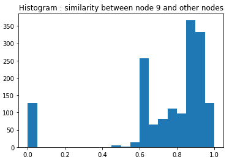
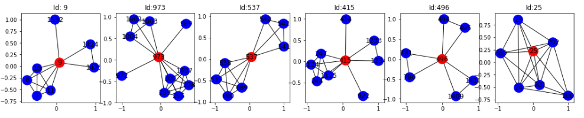

3. Motifs and Structral Rules in Network
=======================================

3.1 Subgraphs
--------------------------

The idea here is to characterize and discriminiate networks using the **subgraphs**.

* **Motifs** : Global level subgraph metric. Recurring significant patterns of inter-connection. Using the parameter **Significance profile**, count the appearance of a motif compared with a randomly generated model [1]_ with similar properties.

.. math::
  Z_{i} = (N_{i}^{real} - \bar{N}_{i}^{rand})/std(N_{i}^{rand})

.. math::
  SP_{i} = Z_{i}/(\sum_{j}Z_{j}^{2})

* **Graphlets** : Node level subgraph metric. Node feature vectors. Using the parameter **Graphlet degree vector** (GDV) [2]_ , reflects the node's level network topology.

.. [1] Random model generated using *Configuration model* or *Switching*, will have same #edges, #nodes, and same distribution of degree (to try to capture the properties of the real network).

.. [2] A vector for each node, the length is # possible orbit positions of different graphlet(usually take graphlets of 5-8 nodes), each element is the number of orbit positions of different graphlet types that the node participates.

*Find motifs and graphlets* in a graph. consists of two steps:

* **Enumerating** : introduces method *Exact subgraph enumeration* (ESU) which find two set :math:`V_{subgraph}` for the current subgraph nodes and :math:`V_{extansion}` for the candidate new nodes. It will iteratively adding new nodes from :math:`V_{extansion}` to :math:`V_{subgraph}` until reaches the objective properties (#nodes).

* **Counting** : to filter duplicated graphs, using isomorphisms test (Mckay's nauty algorithm 1989), try to find a mapping to make two graphs identical.

3.2 Role
---------------

**Role** : 'functions' of nodes in a network. (~ profession, job). Measured by structural properties.

**Communications/Groups** : well-connected nodes.

Find the structural equivalent nodes. Or find structural 'similar' nodes, which could be used to identify roles.

**RolX** (Role eXtraction : Structural Role Extraction & Mining in Large Graphs) :
an unsupervised learning approach for automatically extracting structural roles from general network data sets.
find feature vectors for all the nodes to help identify roles. Obtained by the Adjacency matrix. The vector captures
features of different scale : **local** (properties of the node itself), **egonet** (properties of neighbors, similar to a
convolution step), and **recursive** (mean/sum of neighbors, similar to a pooling step). Followed by a clustering process,
we could find nodes grouped by similar roles.

3.3 HW1 - q2
------------------------

`Python homework <https://github.com/gggliuye/VIO/blob/master/MachineLearningWithGraph/HWs/HW1-q2.ipynb>`_

In this problem, we will explore the structural role extraction algorithm Rolx and its recursive
feature extraction method ReFex.

**Local Feature**, the top-5 similar node in the graph for node 9::

  Top 1  similar node ID is : 415 with score 0.999615754068427
  Top 2  similar node ID is : 288 with score 0.9963436806278279
  Top 3  similar node ID is : 286 with score 0.9963436806278279
  Top 4  similar node ID is : 1054 with score 0.9961182380000688
  Top 5  similar node ID is : 1336 with score 0.9961182380000688

**Recursive Features** with two iterations, the top-5 similar node in the graph for node 9::

  Top 1  similar node ID is : 973 with score 0.9959848829010806
  Top 2  similar node ID is : 537 with score 0.9946130044020561
  Top 3  similar node ID is : 415 with score 0.9937284425239259
  Top 4  similar node ID is : 496 with score 0.9922839741918225
  Top 5  similar node ID is : 25 with score 0.9922413199302673

*Histogram : similarity between node 9 and other nodes* :

*Subgraphs of nodes of the top 5 similar* and the subgraph of node 9.

We could see from the upper histogram that the similar nodes of node 9 are well clustered. As the histogram
only has values of very close nodes, and very far nodes. Which show that the Rolx model could well capture
some properties of the roles. And from the upper subgraphs, we see the node with similar feaure vector do
looks close to each other.

4. Community Structure in Networks
=====================================

Identify nodes closely connected to each other.

4.1 Edge overlap
----------------------------

The Prof started the topic from the example *How people find new jobs?* by Mark Granovetter in 1960s `link <https://sociology.stanford.edu/publications/strength-weak-ties>`_ . It shows that
people find opportunitise through personal contacts, while, more through acquaintances rather than
close friends.

He included another view of friendship to explain it :

* Interpersonal : the weight of the friendship edge.
* Structural :
    * Structurally embedded edge -> stronger connection, while have redundant information. -> **Triadic closure**.
    * Long-range edge -> weak connection, while have more information. -> better job opportunity.

**Edge overlap** -> Communities

.. math::
  O_{i,j} = \frac{\mid (N(i) \cap N(j)) \setminus \{i,j\} \mid} {\mid (N(i) \cup N(j) \setminus \{i,j\})\mid}

If O equal 0, then the edge is a local bridge. If O equals one, then the two nodes of the edge are structural equivalent.

Granovetter's theory suggests that network are composed of tightly connected sets of nodes.

4.2 Network Communities
----------------------------

**Network Communities** : sets of nodes with lots of internal connections and few external ones (to the rest of the network).
Famerous example *Zachary's Karate clue network*.

**Modularity Q** : (in range [-1,1]) a measurement of how well a network is partitioned into communities. Need a null model [3]_ for meansre the 'expected' number.
In practice say 0.3-0.7 to be significant community structure. Negative value : nodes should link with each other while actully not (e.g. enemy).

.. math::
  Q \propto \sum_{s\in S} [(\#edges\ within\ group\ s) - (expected\ \#edges \ within \ group \ s)]

.. math::
  Q(G,S) = \frac{1}{2m} \sum_{s\in S}\sum_{i\in s}\sum_{j\in s}(A_{ij} - \frac{k_{i}k_{j}}{2m})

Where :math:`A_{ij}` is the weight of the edge, and :math:`m = (1/2)\sum_{ij}A_{ij}`

.. [3] Given G = (V,E) (n nodes and m edges)construct rewired network G' as a multigraph : expected #edges within group s :math:`= (1/2)\sum_{i} \sum_{j}k_{i}k_{j}/(2m) = m`

**Louvain Algorithm** Greedy algorithm (O(nlogn)), to identify communities by maximizing modularity. `paper link <https://arxiv.org/pdf/0803.0476>`_

* Initialize communities.
* Phase 1. Assign nodes to communities. Whether move node i from C to D, judged by :math:`\Delta Q = \Delta Q(i\to C) + \Delta Q(D\to i)` .
* Phase 2. The identified communities are aggregated into super-nodes to build a new network (Rebuild phase). Then go back to phase 1.
* Stop as no increase of modularity is possible, or stop as we want.

**Problem 1.** : Convergence ? Find answer in the paper : this algorithm may converge to local minimal.

**Problem 2.** : The resolution limit problem of modulaity (due to the intrinsic multi-level nature of the algorithm), see more
details in the paper, also see in the HW1 Q3.3-3.4 .

4.3 Overlapping Communities
-------------------------

`paper link <http://infolab.stanford.edu/~crucis/pubs/paper-nmfagm.pdf>`_

* Step 1. Define a generative model for graphs that is based on node community affiliations **Community Affiliation Graph Model (AGM)** [4]_.
* Step 2.
    * Given graph G, make the assumption that G was generated by AGM. (Graph Fitting: Maximum likelihood estmation :math:`P(G\mid F)` [5]_)
    * Find the best AGM that could have generated G. (randomly initialize F, and apply gradient descent)
    * And this way we discover communities.

.. [4] Start from the communities of nodes, randomly connect the node in same community. If have multiple common communities, we should have high probability.

.. [5] :math:`P(G\mid F) = \sum_{(u,v)\in G}P(u,v) \sum_{(u,v)\notin G}(1-P(u,v))` probability graph model. BigCLAM Model : strength of edges -> probabilities.
