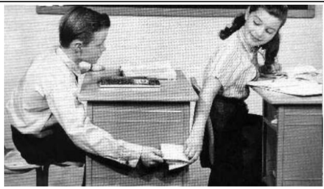

5. Spectral Clustering
=================================

For community detection using eigenvectors and eigenvalues.

* Pre-processing : matrix representation : (noramlized) **Laplacian matrix**.
* Decomposition : **second** eigenvalue and eigenvector.
* Grouping : take the **sign** / maximize **eigengap**.

5.1 Concepts
-----------------

**Cut** : :math:`cut(A,B) =\sum_{i\in A, j\in B} w_{i,j}`, but it sometimes could not
capture the inner properties of the groups.

**Conductance** : :math:`\phi(A,B) = cut(A,B)/ \min(vol(A), vol(B))`, will produce more
balanced partitions. While optimize it is NP-hard.

**Spectral graph partitioning** : using spectral properties to have approximation to
conductance optimization problem.

5.2 Spectral Clustering
-------------------------

* The property of the adjacency matrix A, with the label vector x.
* Introudce the **Laplacian matrix** :math:`L = D-A`.
    * L has degrees in the disagonal part, and negative edge weight at the other part.
    * Non-negative real eigenvalues, and real eigenvectors.
    * We have :math:`L \mathbb{1} = 0`, :math:`\lambda_{1} = 0`, and :math:`\mathbb{1}` is its corresponding eigenvector.
* Use normalized laplacian matrix :math:`\bar{L} = D^{-1/2}LD^{-1/2}` for better performance. (see the proof in HW1-Q4)

The problem could be reformed to :

.. math::
  \begin{align*}
  &minimize \quad x^{T}Lx \\
  &subject\ to \quad x^{T}x = 1, \ x^{T}\mathbb{1} = 0
  \end{align*}

We could prove that its optimal value is :math:`\lambda_{2}`, and we also
have :math:`x^{T}Lx = \sum_{(i,j)\in E}(x_{i}-x_{j})^{2}`. (See the details in
my hand writing notes or in the course slides.)
Then the problem reduce to find the second eigenvalue and eigenvector of the Laplacian matrix.

**Relationship with modularity** see in HW1-Q4.

**Questions** : The upper problem is actually a L2-minimization problem.
While the problem is better modeled as a cardinality problem, should we use l1 heuristic to get a better result?

5.3 K Clustering
--------------------

* **Find K**: maximize the **eigengap** :math:`\Delta k = \mid \lambda_{k} - \lambda_{k-1}\mid`
* Select the K eigenvectors, then apply K-mean clustering.

5.4 Motif-based spectral clustering
-----------------------------

Generalize the 'edge' definitation to motif level.

* Motif cut.
* Motif count.

.. math::
  \phi_{M}(S) = \frac{\#motif\ cut}{motif\ volume}

Example in the gene regulation show the **feedward loops**, exactly the same as shown in the course
Human Behavioral Biology BIO150.

5.5 HW1 - q4
------------------

`Hand writing homework <https://github.com/gggliuye/VIO/blob/master/MachineLearningWithGraph/HWs/HW1-q4.pdf>`_ :
**Normalized laplacian matrix** and **Relationship with modularity**.

6. Message Passing and Node Classification
===================

Start of **Machine Learning** with Graphs.

Message Passing and Node Classification : Given a network with
labels on some nodes, assign labels to all other nodes in the network.

* Relational classification
* Iterative classification
* Belief propagation

6.1 Correlations
--------------------

* Homophily : the tendency of individuals to associate and bond with similar others.
* Influence : social connections can influence the individual characteristics of a person.
* Cofounding : both of the upper two acting together.

Leverage the correlation : **Guilt-by-association** If I am connected to a node with label 𝑋,
then I am likely to have label 𝑋 as well.
Motivation: the close relationship of *Lable*, *Feature*, and *Neighborhood*.

Problem: Given the adjacency matrix and the initial label vector, predict the full label.

6.2 Collectivce classification
-----------------------

**Collectivce classification**  (based on Markov assumption) the exact inference is NP-hard, so we will look at approximation inference.

* Local classifier : initial assignment.
* Relation Classifier : capture correlations between nodes (use the graph information).
* Collective inference : propagate correlations through network. Apply to each node iteratively, for minimize the inconsistency between neighboring nodes' labels.

6.3 Probabilistic Relational Classifier
------------------------------

A flow process driven by the potential energy.

.. math::
  P(Y_{i} = c) = \frac{1}{\mid N_{i}\mid}\sum_{(i,j)\in E}W(i,j)P(Y_{j}=c)

* The convergence not guaranteed.
* Cannot use node feature information, only use the graph information.

See HW2 Q1.1 for an example.

6.4 Iterative Classification
---------------------------

Classify also based on the attributes of neighbor set. (plays a key role in Graph Neural Network)
Each node maintains a vector of neighborhood labels.

* **Bootstrap phase** , a warm start.
* **Iteration phase** , repeatly update relational features and classify.
* However, convergence is also not guaranteed.

Example, `Fake Review Spam <https://cs.stanford.edu/~srijan/pubs/rev2-wsdm18.pdf>`_ . Using the property that *graph structure of the reviews is hard to fake*.

6.5 Brief Propagation
-----------------------------

**Message Passing**

.. math::
  m_{i\to j}(Y_{j}) = \alpha \sum_{Y_{i}\in L}\psi(Y_{i}, Y_{j})\phi_{i}(Y_{i}) \prod_{k\in N_{i} \setminus j} m_{k\to i}(Y_{i})

It contains the message of ith node multiplied by the edge weight, and all the messages node i received. (See HW2 Q1.2 for an example.)

.. math::
  b_{i}(Y_{i}) = \alpha \phi_{i}(Y_{i}) \prod_{j\in N_{i}}m_{j\to i }(Y_{i}), \ \forall  Y_{i}\in L

Summary of all states, the production of label-label potential, the prior, and all messages sent by the neigbors from
previous round. Message Loop could cause bad effect, and convergence is also not guaranteed.

`Fraud Detection in Online Auction Networks <http://www.cs.cmu.edu/~christos/PUBLICATIONS/netprobe-www07.pdf>`_
