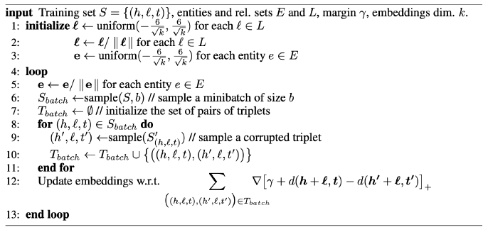
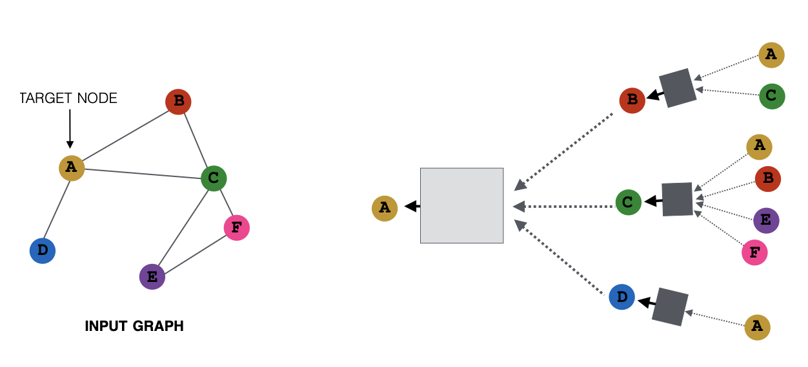
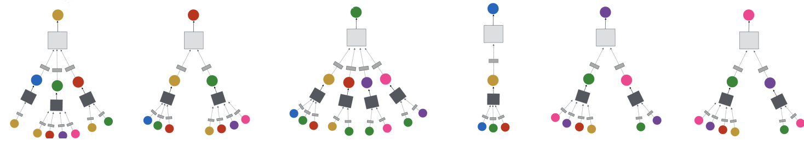
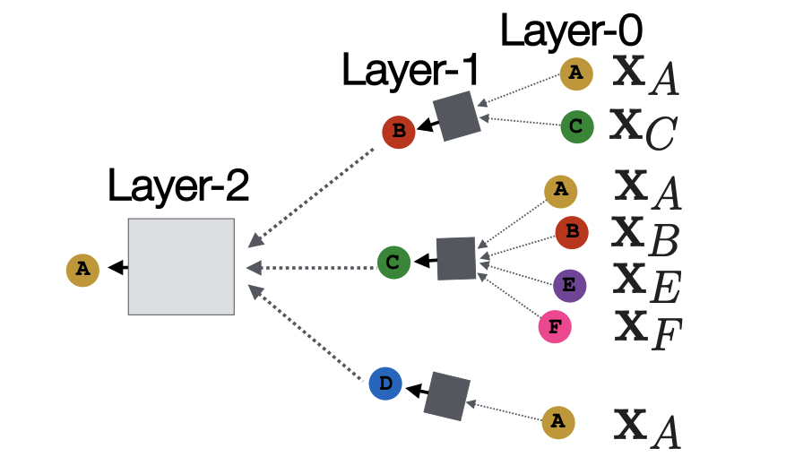
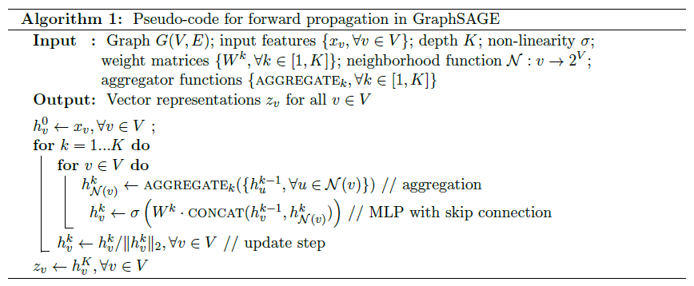
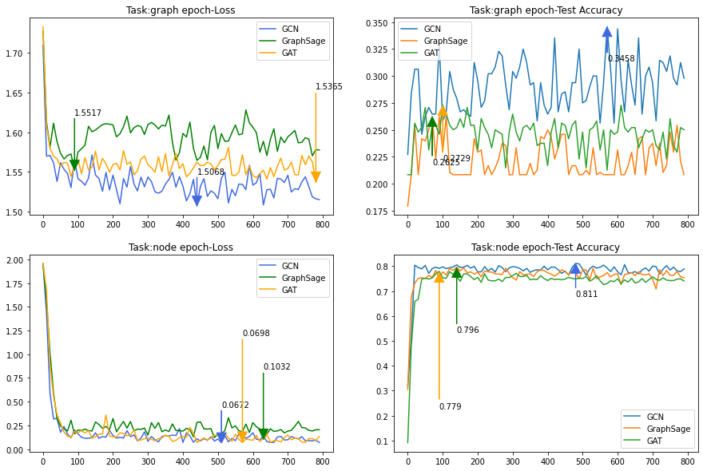
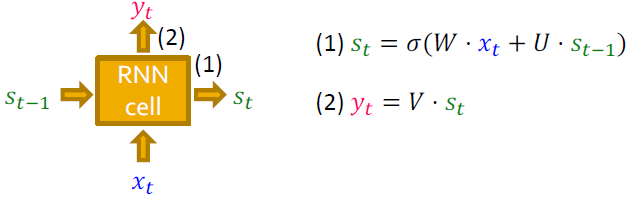
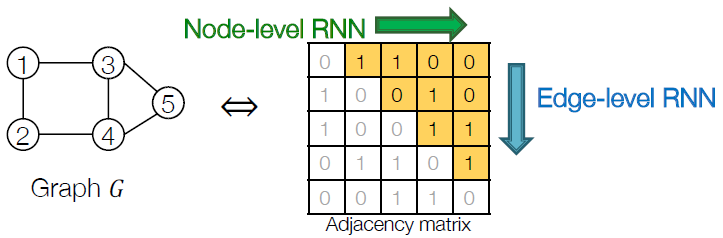

7. Graph Representation Learning
===============================

This chapter focus the **Node Emedding** based on Machine Learning methods.

7.1 Introcution
---------------

**Supervised Learning** :

* Raw Data -> Structural Data -> Learning Algorithm -> Model.
* Main part : *feature engineering*, ML/DL: automatically learn the features.

**Efficient feature learning**: :math:`f: u\to \mathcal{R}^{d}`. *network embedding*.

**Difficulty** : modern DL toolbox is designed for simple sequence or grids (example, chain for NLP,
2D grid for image processing, etc). But real graph is much more complicate and could be dynamic.

7.2 Node Embedding
----------------------

.. math::
  ENC(v) = z_{v} \ \in \mathcal{R}^{d}

In order to realize :

.. math::
  similarity (u,v) \approx z_{v}^{T}z_{u}

* Define an encoder (e.g. *Shallow encoding* :math:'ENC(v) = Zv, \ Z\in \mathcal{R}^{d\times \mid V\mid}'). e.g., DeepWalk, node2vec, TransE.
* Mode simiarity function.
* Optimize the parameters.

7.3 Random Walk
--------------------

Interpretation: :math:`z_{v}^{T}z_{u}` approximate the probability that u and v co-occur in a random walk over the network.
Different random work setup could capture different properties. **It is efficient and expressive**.

**Summary** :

* Run short fixed-length random walks starting from each node on the graph using some strategy R.
* For each node u collect :math:`N_{R}(u)`, the multiset of nodes visited on random walks starting from u.
* Optimize embeddings using Stochastic Gradient Descent (We can efficiently approximate this using negative sampling [1]_ )

.. math::
  \begin{align*}
  \mathcal{L} &= \sum_{u\in V}\sum_{v\in N_{R}(u)} - \log (P(v\mid z_{u})) \\
  & =  \sum_{u\in V}\sum_{v\in N_{R}(u)} -\log(\frac{\exp(z_{v}^{T}z_{u})}{\sum_{n\in V}\exp(z_{n}^{T}z_{u})})
  \end{align*}

.. [1] Computational expensive, as the denominator is intractable. Method : Noise Contrastive Estimation (NCE), randomly sample the approximate the lower part of the expression of P (softmax fcn), to lower the computaional cost.

7.4 Node2Vec
-------------------

Goal: Embed nodes with similar network neighborhoods close in the feature space, with a more flexible notion of network
neighborhood.

Method : Different random walk parameters for local and global obejctive (parameter p: 1/p probability for return last node, for local property; and parameter q : 1/q
probability for moving outwards, for global property). Choose parameters p and q could generate specified random walks.

The node2vec algorithm:

* Compute random walk probabilities.
* Simulate r random walks of length l starting from each node u.
* Optimize the node2vec objective using Stochastic Gradient Descent

Applications :

* Clustering using the embedded feature vectors.
* Calculate :math:`f(z_{i})` for node classifications.
* Calculate :math:`f(z_{i}, z_{j})` for link predictions.

7.5 TransE
--------------------

**Represent the relationships as a linear translation in the embedding space** : :math:`h+l\approx t` , head+ relation = tail.

The obejective loss function could be defined as :

.. math::
  \mathcal{L} = \sum_{(h,l,t)\in S} (\sum_{(h',l,t')\in S'} [\gamma + d(h+l,t) - d'(h'+l,t')]_{+})

Where S' is the negative samples generated (which are not real).

7.6 Graph Embedding
-------------------

The former descussed the node embedding, here we consider the embedding of the whole graph (for an example, for graph classification tasks) .
Here shown some cases for realize it:

* Simple summary :math:`z_{G} = \sum_{v\in G} z_{v}`.
* Introduce a virtual node to represent the (sub)graph and run a standard graph embedding technique. (see *Li et al., Gated Graph Sequence Neural Networks (2016)*)
* Anonymous walk embeddings : keep tracking the index of its first time visit in a random walk, other than the specific node.

7.7 HW2 Q123
--------------------

`HW2 Q123 <https://github.com/gggliuye/VIO/blob/master/MachineLearningWithGraph/HWs/HW2-q123.pdf>`_

8. Graph Neural Networks
=============================

Here we learned :

* GCN
* Graph SAGE
* GAT

8.1 Introduction
---------------------

* Encoding function : network structure. (ML/DL)
* Similarity function : loss function.

Graph Neural Network (multiple layers of nonlinear transformations of graph structure) -> Graph convolution (:math:`\approx \sum_{i}w_{i}h_{i}`)

Graph Neural Networks (GNNs) are a class of neural network architectures used for deep learn-
ing on graph-structured data. Broadly, GNNs aim to generate high-quality embeddings of nodes
by iteratively aggregating feature information from local graph neighborhoods using neural net-
works; embeddings can then be used for recommendations, classication, link prediction or other
downstream tasks. Two important types of GNNs are GCNs (graph convolutional networks) and
GraphSAGE (graph sampling and aggregation).

An implementation and tests of the three algorithms could be found in `HW2 Q4 <https://github.com/gggliuye/VIO/tree/master/MachineLearningWithGraph/HWs/q4_starter_code>`_ .

8.2 GCN
------------------

The key-element of GCN is the neighborhood computation graph (neighborhood aggregation), shown as follows:

And we could find the graph for all the nodes in the example graph:

The basic structure is shown in the following image.

* We don't need to much layers, as we don't want to capture the whole network, while we want to explore more the local properties.
* Each element block is a Graph convolution element, we could apply a summary/average/pooling/etc and following a neural network, finally apply a nonlinear activation function. For average GCN we have :

.. math::
  h_{v}^{k} = \sigma(w_{k}\sum_{u\in N(v)} \frac{h_{u}^{k-1}}{\mid N(v)\mid} + B_{k}h_{v}^{k-1} )

* Trainning of the network could using unsupervised method (last lecture), or supervised method using loss function, here we show an example of the node classification loss function (e.g. for application of drug-drug graph safe/toxic classification):

.. math::
  \mathcal{L} = \sum_{v\in V}y_{v}\log(\sigma(z_{v}^{T}\theta)) + (1-y_{v})\log(1-\sigma(z_{v}^{T}\theta))

* It has steps : **Message computation** (calculate H), **Aggregation** (:math:`D^{-1/2}AD^{-1/2}`), **Update**(in GCNs, a multi-layer perceptron (MLP) is used), **Pooling** (usually done for the purposes of graph classication).

Matirx representation:

.. math::
  H^{k} = D^{-1}AH^{k-1} = D^{-1/2}AD^{-1/2}H^{k-1}

For GCN the following equation is used:

.. math::
  h^{k} = \sigma(D^{-1/2}AD^{-1/2}h^{k-1}W^{k})

where :math:`\sigma` is non-linear function, it could be activation function, drop-out function , etc. and :math:`W^{k}` is the
learnable parameter.

8.3 Graph SAGE
---------------------

It introduce a more general aggregation function choices here.

.. math::
  h_{v}^{k} = \sigma([W_{k}AGG( \{ h_{u}^{k-1}, \forall u\in N(v)  \})  ,B_{k}h_{v}^{k-1} ])

There are some commonly used aggregation functions:

* Mean: :math:`AGG = \sum_{u\in N(v)}h_{u}^{k-1}/\mid N(v)\mid`.
* Pooling : :math:`AGG = \gamma (\{ Qh_{u}^{k-1}, \forall u\in N(v)  \})` .
* LSTM : (applied to several randomly reshuffled neighbors) :math:`AGG=LSTM(\{ h_{u}^{k-1}, \forall u\in \pi(N(v))\})`

The realization of GraphSage in pytorch is ::

  class GraphSage(pyg_nn.MessagePassing):
      """Non-minibatch version of GraphSage."""
      def __init__(self, in_channels, out_channels, reducer='mean',
                   normalize_embedding=True):
          super(GraphSage, self).__init__(aggr='mean') # /space

          self.lin = nn.Linear(in_channels, in_channels)
          self.agg_lin = nn.Linear(in_channels+in_channels, out_channels)

          self.normailze_agg = False
          if normalize_embedding:
              self.normalize_emb = True

      def forward(self, x, edge_index):
          # remove the self edges, as we will concate the self features in the update stage.
          edge_index, _ = pyg_utils.remove_self_loops(edge_index)
          return self.propagate(edge_index, x=x)

      def message(self, x_j, edge_index):
          if(self.normailze_agg):
              row, col = edge_index
              deg = pyg_utils.degree(col, x_j.size(0), dtype=x_j.dtype)
              deg_inv_sqrt = deg.pow(-0.5)
              norm = deg_inv_sqrt[row] * deg_inv_sqrt[col]
              return norm.view(-1, 1) * x_j
          else :
              return x_j

      def update(self, aggr_out, x):
          concat_out = torch.cat((x, aggr_out), 1)
          aggr_out = F.relu(self.agg_lin(concat_out))
          if self.normalize_emb:
              aggr_out = F.normalize(aggr_out, p=2, dim=1)
          return aggr_out

8.4 Graph Attention Networks
---------------------------

In the GCN, we take the summary of all the neighbors with the same weight :math:`1/\mid N(v)\mid`, we also equally count the neighbors in Graph SAGE too.
So the motivation here is to dynamically choose different weights for nodes, based on **Attention Mechanism**.

.. math::
  e_{vu} = a(W_{k}h_{u}^{k-1}, W_{k}h_{v}^{k-1})

Then apply a softmax for the normalization of the weights :

.. math::
  \alpha_{vu} = exp(e_{vu})/(\sum_{k\in N(v)} exp(e_{vk}))

.. math::
  \alpha_{vu} = \exp(LeakyReLU(e_{vu}))/(\sum_{k\in N(v)} \exp(LeakyReLU(e_{vk})))

Therefore we have :

.. math::
  h_{v}^{k} = \sigma(\sum_{u\in N(v)} \alpha_{vu}W_{k}h_{u}^{k-1})

And its realization in pytorch ::

  class GAT(pyg_nn.MessagePassing):
      def __init__(self, in_channels, out_channels, num_heads=1, concat=True,
                 dropout=0, bias=True, **kwargs):
          super(GAT, self).__init__(aggr='add', **kwargs)

          self.in_channels = in_channels
          self.out_channels = out_channels
          self.heads = num_heads
          self.concat = concat
          self.dropout = dropout
          self.lin = nn.Linear(self.in_channels, self.out_channels * self.heads)
          self.att = nn.Parameter(torch.Tensor(1, self.heads, self.out_channels * 2))
          if bias and concat:
              self.bias = nn.Parameter(torch.Tensor(self.heads * self.out_channels))
          elif bias and not concat:
              self.bias = nn.Parameter(torch.Tensor(out_channels))
          else:
              self.register_parameter('bias', None)
          nn.init.xavier_uniform_(self.att)
          nn.init.zeros_(self.bias)

      def forward(self, x, edge_index, size=None):
          x = self.lin(x)
          return self.propagate(edge_index, size=size, x=x)

      def message(self, edge_index_i, x_i, x_j, size_i):
          [shape0, shape1] = x_j.shape
          x_i = x_i.view(-1, self.heads, self.out_channels)
          x_j = x_j.view(-1, self.heads, self.out_channels)
          alpha = (torch.cat([x_i, x_j], dim=-1) * self.att).sum(dim=-1)
          alpha = F.leaky_relu(alpha, 0.2)
          alpha = pyg_utils.softmax(alpha, edge_index_i)
          alpha = F.dropout(alpha, p=self.dropout, training=self.training)
          out = (x_j * alpha.view(-1, self.heads,1)).view(shape0, shape1);
          return out

      def update(self, aggr_out):
          # Updates node embedings.
          if self.concat is True:
              aggr_out = aggr_out.view(-1, self.heads * self.out_channels)
          else:
              aggr_out = aggr_out.mean(dim=1)

          if self.bias is not None:
              aggr_out = aggr_out + self.bias
          return aggr_out

Example : PinSAGE.

8.5 Test Results
-------------------

First I test for different number of layers. The table below shows the graph classfication results
of layer 3. And if I further increase the layer number, the accuracy will all converge to 0.2083,
which means that if we imply too much layers, we could over smooth the result and will not get ideal prediction (as is shown in HW2).

+--------+-------+-----------+-------+
| Model  | GCN   | GraphSAGE | GAT   |
+========+=======+===========+=======+
|Accuracy|0.3583 | 0.2083    | 0.2083|
+--------+-------+-----------+-------+

I also test the number of layers for node classification tasks, I found 2 layers may be reasonable for our data.
And more than 3 layers will produce a very bad result.
So the latter results are  all done with 2 layers.

+--------+-------+-----------+-------+
| Model  | GCN   | GraphSAGE | GAT   |
+========+=======+===========+=======+
|Graph   |0.3458 | 0.2625    | 0.2729|
+--------+-------+-----------+-------+
|Node    |0.811  | 0.796     | 0.779 |
+--------+-------+-----------+-------+

I found the origianl GCN got the best result.

10. Graph RNN
==============================

**Deep generative models for graphs**.

10.1 GCN review
-------------------------
**Deep Graph Encoder**:

* GCN Intuition: Nodes aggregate information from their neighbors using neural networks.
* Graph Convolutional Neural Networks: Basic variant: Average neighborhood information and stack neural networks.
* GraphSAGE: Generalized neighborhood aggregation.
* GAT : with attention model.

10.2 Graph Generation
----------------------

**Deep Graph Decoder**.

Objective :

* Realistic graph generation.
* Goal-directed graph generation.

Difficulty :

* Graph size could be huge.
* Complexity of the adjacency matrix.
* Non-unique representation of a graph.
* Long-range dependence in a graph (which may require long term connection).

Methods :

* **Given**: Graphs sampled from :math:`p_{data}(G)` , the training data.
* **Goal** : learn the distribution based on some model parameters :math:`p_{model}(G\mid \theta)`, and could sample from this distribution.
* Objective function **Maximum Likelihood** :

.. math::
  \theta^{*} = \arg\max_{\theta}\mathbb{E}_{x\sim p_{data}} \log p_{model}(x\mid \theta)

* **Sample** from :math:`p_{model}` : step one, sample from asimple noise distribution :math:`z_{i}\sim N(0,1)`; step two, transform the noise via f :math:`x_{i} = f(z_{i};\theta)`. And we assume Markov property for the graph sampling process [1]_ .

.. math::
  p_{model}(x;\theta) = \prod_{t=1}^{n}p_{model}(x_{t}\mid x_{1}, x_{2},...,x_{t-1};\theta)

.. [1] It is a graph generation sequence, where :math:`x_{t}`is the action of generate a graph (in our case here), which is adding a node or an edge. And it will be described later.

10.3 Graph RNN
---------------------

**Theorem : Model Graphs as Sequences** Graph G with node ordering :math:`\pi` can be uniquely mapped into a sequence of node
and edge addition actions :math:`S^{\pi}`.

Based on the upper theorem, the Graph RNN could **transformed graph generation problem into a sequence generation problem** with two steps :

* Node-Level RNN : generate nodes.
* Edge-Level RNN : generate edges (~ adjacency matrix generation ). Iterate for each generated node, decide whether to add edge with each of the previous nodes.

Each RNN cell [2]_ will be shown in the image below, where s is the history state, x the input action and y the output action.

To make it a random process, we will model :

.. math::
  x_{t+1} \sim y_{t-1} = p_{model}(x_{t}\mid x_{1},..,x_{t-1};\theta)

The whole process is :

Training :

* Teacher forcing : Replace input and output by the real sequence.
* Loss 𝐿 : Binary cross entropy.

.. [2] We could use some more expressive cells : GRU, LSTM, etc.

10.4 Tractability
------------------

**Problem** : Any node can connect to any prior node -> Too many steps for edge generation.

**Solution** : Breadth-First Search node ordering. Reorder the nodes, to make each node connects only to a few nearby
previous nodes (will make the adjacenecy matrix block diagonal).

10.5 Applications
------------------

* Optimize a given objective (High scores) : e.g., drug-likeness (black box).
* Obey underlying rules (Valid) : e.g., chemical valency rules.
* Are learned from examples (Realistic) : e.g., Imitating a molecule graph dataset.

Example : GCPN 
