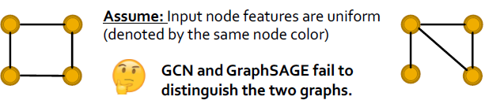
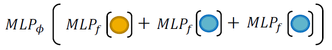
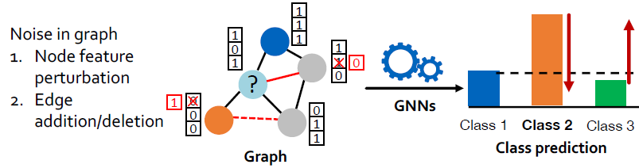
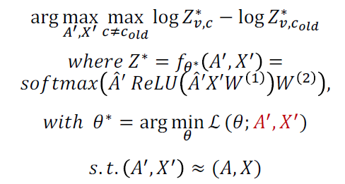
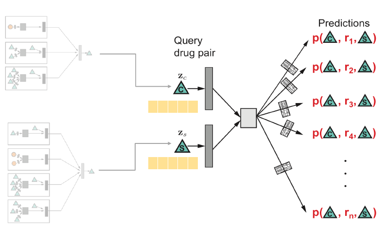
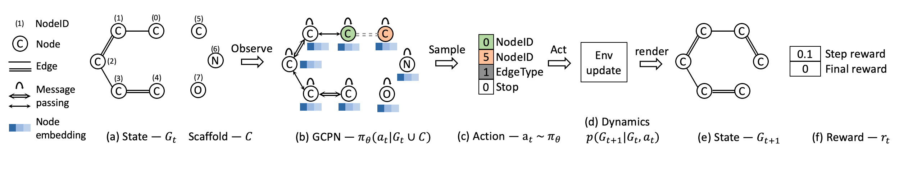

18. Limitations of GNN
============================

Recap `GNN <https://vio.readthedocs.io/zh_CN/latest/GNN/7GraphRepresentation.html#graph-neural-networks>`_ :
**Aggregate Neighbors** **Computation Graph** **Graph Pooling**.

Many model variants have been proposed with different choice of neural networks.

* GCN [Kipf & Welling ICLR'2017]
* GraphSAGE [Hamilton+ NeurIPS’2017]

Applications:

* Node classification [Kipf+ ICLR’2017]
* Graph Classification [Ying+ NeurIPS’2018]
* Link Prediction [Zhang+ NeurIPS’2018]

18.1 Limitation : Graph Structure
----------------------------

**Graph Structure** Some simple graph structures cannot be distinguished by conventional GNNs.
-> **graph isomorphism test problem** .

Node representation captures rooted subtree structure : Most discriminative GNNs map different subtrees
into different node representations.
-> **Injectivity** [1]_ of the funtion to map to different graph structure.
-> **Injective Neighbor Aggregation** . Entire neighbor aggregation is injective if
every step of neighbor aggregation is injective.

**Multi-set Functions** : Neighbor aggregation is essentially a function over multi-set (set with repeating elements).
Discriminative Power of GNNs can be characterized by that of **multi-set functions** .

* GCN (mean pooling) will fail to distinguish proportionally equivalent multi-sets.
* GraphSAGE (max pooling) will even fail to distinguish multi-set with the same distinct elements.

**Injective Multi-set Functions** Theorem: Any injective multi-set function can be expressed by, where  𝜙 and 𝑓 are non-linear functions  :

.. math::
  \phi(\sum_{x\in S}f(x))

We can model 𝜙 and 𝑓 using Multi-Layer-Perceptron (MLP) (Note: MLP is a universal approximator).

Graph Isomorphism Network (GIN) [Xu+ ICLR’2019], using MLP + sum pooling.
So far: GIN achieves maximal discriminative power by using injective neighbor aggregation.
GIN fits training data much better than GCN, GraphSAGE.
GIN is closely related to Weisfeiler-Lehman (WL) [2]_ Graph Isomorphism Test (1968).
-> GIN is as discriminative as the WL test.

.. [1] Function is injective if it maps different elements into different outputs.

.. [2] WL test has been known to distinguish most of the graphs, except for some corner cases.

18.2 Limitation : Graph Noise
--------------------

**Graph Noise** GNNs are not robust to noise in graph data.

Adversaries are very common in applications of graph neural networks, e.g., search engines,
recommender systems, social networks, etc.

**Semi-supervised node classification** using Graph Convolutional Neural Networks (GCN) [Kipf+ ICLR’2017]

.. image:: images/attack.PNG
  :align: center
  :width: 80%

**Net Attack** : Zügner+, Adversarial Attacks on Neural Networks for Graph Data, KDD’18.
*Maximize (Change of predicted labels of target node) Subject to (Limited noise in the graph)* .

* Some heuristics have been proposed to efficiently obtain an approximate solution (see the original paper).
* The GCN prediction is easily manipulated by only 5 modifications of graph structure (|V|=~2k, |E|=~5k)
* GCN does neighbor aggregation : only local attack will work.

**GNNs are not robust to adversarial attacks!**

18.2 Future Directions
------------------------

Science Domains:

* Chemistry: Molecular graphs.
* Biology: Protein-Protein Interaction Networks.

Challenges of Applying GNN:

* Scarcity of labeled data : Labels require expensive experiments -> Models overfit to small training datasets.
* Out-of-distribution prediction : Test examples are very different from training in scientific discovery -> Models typically perform poorly.

Pre-training GNNs [Hu+ 2019] : Pre-train GNNs on relevant, easy to obtain graph data.

19. Applications of GNN
==========================

19.1 GNN recommendation (PinSage)
----------------------
`Recap ML Bipartite <https://vio.readthedocs.io/zh_CN/latest/GNN/11PageRank.html#examples>`_

* Given : Users interacts with items.
* Goal: Learn what items are related -> Recommend items users might like.

**Define similarity** :

* Content-based: User and item features, in the form of images, text, categories, etc.
* Graph-based (collaborative filtering): User-item interactions, in the form of graph/network structure (Estimate what X will like based on what similar others like).

**Recommendations via Embeddings** :
Goal: Learn embeddings for items. Find the closest embedding by nearest neighbor. Recommend it.

**PinSage** graph convolutional network : Goal: Generate embeddings for nodes (e.g., pins) in the
Pinterest graph containing billions of objects.  Key Idea: Borrow information from nearby nodes.

**Data Set** : Positive pair: Two pins that are consecutively saved
into the same board within a time interval (1 hour) ; Negative pair: A random pair of 2 pins.

**Max-margin loss** :

.. math::
  L = \sum_{(u,v)\in D} \max(0, -z^{T}_{u}z_{v} + z^{T}_{u}z_{n} + \Delta)

**Four key innovations** :

* On-the-fly graph convolutions : Perform a localized graph convolution around a particular node, Does not need the entire graph during training.
* Selecting neighbors via random walks, as performing aggregation on all neighbors is infeasible. Personalized PageRank can help, and Define Importance pooling.
* Efficient MapReduce inference to avoid repeated computation. Problem: Many repeated computation if using localized graph convolution at inference step.
* Use harder and harder negative samples (using random walk) : Force model to learn subtle distinctions between pins.

19.2 Heterogeneous GNN (Decagon)
---------------------------
*Model and predict side effects of drug pairs*

**Polypharmacy** : use multiple drugs for a disease. *High risk of side effects due to interactions* . Difficult to identify manually.
Idea: Computationally screen/predict polypharmacy side effects.

**Heterogeneous (multimodal) graphs** : graphs with different node types and/or edge types.
Goal: Given a partially observed graph, predict labeled edges between drug nodes.

* *heterogenous graph -> node embeddings* : Compute GNN messages from each edge type, then aggregate across different edge types.
* *Node embeddings of query drug pairs -> predicted edges* : Use pair of computed node embeddings to make edge predictions.

19.3 Goal-directed generation (GCPN)
-------------------------------

`Recap Graph RNN <https://vio.readthedocs.io/zh_CN/latest/GNN/7GraphRepresentation.html#graph-rnn>`_ [You et al., ICML 2018].
Generating graphs via sequentially adding nodes and edges. `code github <https://github.com/bowenliu16/rl_graph_generation>`_

Including “Black-box” in ML: (Environment is a blackbox to the agent)
Objectives like drug-likeness are governed by physical law, which are assumed to be unknown to us!
-> **Solution : Reinforcement Learning** : A ML agent observes the environment, takes
an action to interact with the environment, and receives positive or negative reward.
The agent then learns from this loop.

Policy: Agent behavior, which maps observation to action. Policy-based RL: An agent directly learns an
optimal policy from data.

**Graph Convolutional Policy Network** combines graph representation + RL:

* Graph Neural Network captures complex structural information, and enables validity check in each state transition (Valid).
* Reinforcement learning optimizes intermediate/final rewards (High scores).
* Adversarial training imitates examples in given datasets (Realistic).

* (a) Insert nodes/scaffolds
* (b) Compute state via GCN
* (c) Sample next action
* (d) Take action (check chemical validity)
* (e, f) Compute reward
