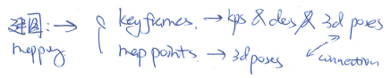
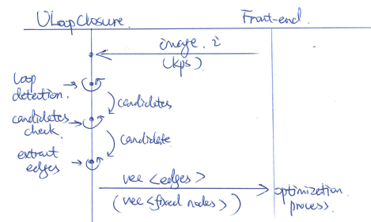
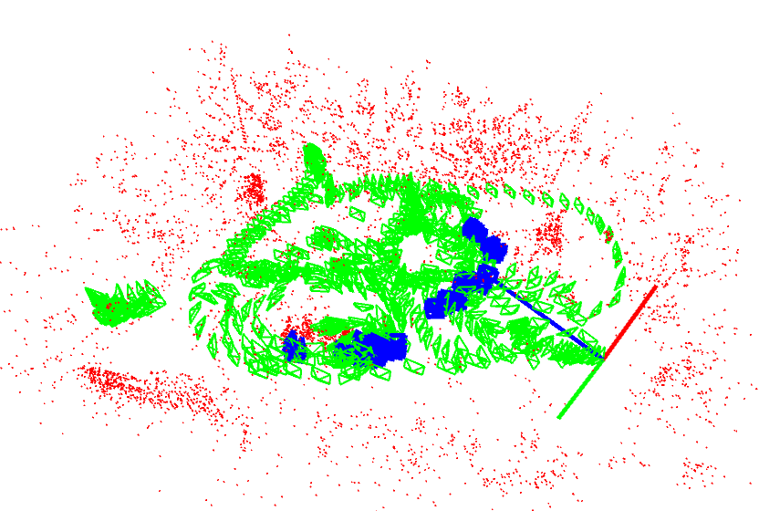
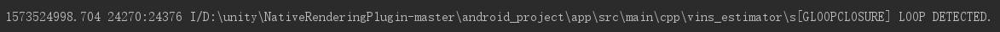
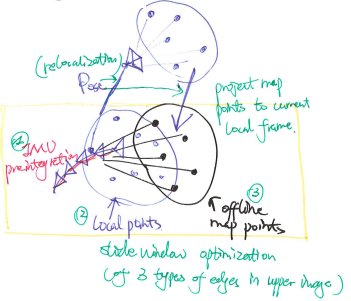

G Loop Closure
=======================

The motivation of this article is to develop a method to reuse a offline refined map, by another online SLAM application. As we was developping a AR application, who objective to offer a good user experience. The biggest problems we have faced are, firstly the accumulcated draft of SLAM, and secondly correspondence between the online map and the visual effects made before.  All the two problems can be solved by the reuse of a prebuilt well-refined map. 

Firstly, we need a prebuilt map, with map points, keyframes and their links.

The basic scenario is descripted above. 

Save/Load Map
--------------------

* Save and load map points and keyframes using binary encoding.
* After loading the data, we need to reindex the map points and the keyframes to BOW index, and make extension connection between them to accelerate the later calculations.

Loop Detection
-------------------

1. Use BOW(bag of words) to find possible candidates.
2. Loop through all the candidates with high enough score, to find feature points matches based on BOW vocabulary tree (try to match features belong to the same node). 
3. If found enough matched point pairs, using PnP RANSAC algorithm to calculate transformation matrix. 
4. If PnP success, we will use its result as the initialization for nonlinear optimization.
5. After the first optimization, we will have a relative good estimation of pose, however, we still want to have more pairs of matched points. So we project the points in matched keyframe to the current frame to find more possible pair of matches.
6. With the additional match pairs, we will do another optimization. As there are possible some outliers, we used robust loss function. 
7. With the pose estimation calculated above, we will calculate the residual of each matched pair. if the loss is too large, we can say it is possibly a outlier match, so we will remove this match. After remove all outliers, we will do our final optimization. 
8. At the end of the process, if a candidate ends up with enough match points. We will call it a success, and pass the matched pairs(image pixel <-> map point in world reference) to the next step.

Experiments
~~~~~~~~~~~~~~~

1. Test on PC linux, using data set taken from phone.

2. Test on cell phone. Load the prebuilt data, and go to the corresponding scene to test.

Loop Correction
--------------------

1. Initialize relocalization relative pose with the first loop detected.
2. Project all the detected matched map points into the current local reference with the relocalization relative pose. 
3. Add the loop match points edges to slide window optimization process. Optimize the slide window.
4. Recover the global pose by relocalization pose.

