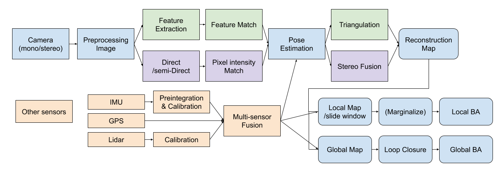
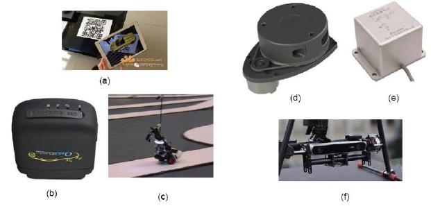

Introduction of SLAM
===================================

`Link of the Site <https://vio.readthedocs.io/en/latest/index.html>`_

SfM(structure from motion)
~~~~~~~~~~~~~~~~~~~~~~~~~

Marker Based mehtods
~~~~~~~~~~~~~~~~~~~~

SLAM
-----------------------------

SLAM **Simultaneous Localization and Mapping** is a complex system.

In most SLAM structure design, the whole system will be seperated into three threads : Tracking, Local Mapping, and Global Mapping.

In a complete SLAM framework, the three threads should run together, but with different frequences.
For an example, for ORBSLAM, Tracking thread will run for each input frame, Local Mapping will run when new keyframe is selected, and Global Mapping will be run when a loop is detected.

Probability problem
--------------------------
SLAM is actully a probability problem, given a series of control "u", sensor observation "o", over a discrete time step "t" to compute an estimate of the state "x". (for SLAM, given image and other sensors, to estimate camera pose "p" and the map "m"). 
Also, the system has noise, which will be modeled as Gaussian distribution in most cases. If using the probabilistic model, we can write the observation model to be :

.. math::
    P(\mathbf{o}_{t+1} \| \mathbf{x}_{t+1}, \mathbf{u}_{t})  

And our objective is to estimate the state given obeservation and contrl:

.. math::
    P( \mathbf{x}_{t+1} \| \mathbf{u}_{t} , \mathbf{o}_{t+1} )

Normally, we do not have any control in a SLAM system, we can ignore "u" here. Then, applying Bayes' rule:

.. math::
    P( \mathbf{x}_{t+1} \| \mathbf{o}_{t+1} ) = \frac{P(\mathbf{o}_{t+1} \|  \mathbf{x}_{t+1} ) P(\mathbf{x}_{t+1}) }{P(\mathbf{o}_{t+1})}

Ignoring the down mark "t+1":

.. math::
    P( \mathbf{x} \| \mathbf{o} ) = \frac{P(\mathbf{o} \|  \mathbf{x} ) P(\mathbf{x}) }{P(\mathbf{o})}

Using **MAP** (Maximum a posteriori estimation) the best estimation of the system become:

\bar{\mathbf{x}} = arg \max _{x}  P( \mathbf{x} \| \mathbf{o} ) 

What is it?
------------------

Two basic questions:
>>>>>>>>>>>>>>>>>>>>>>>>>>>>>
 * where am I?
 * What is the environment around me?

Sensor
>>>>>>>>>>>>>>>>>>>>>>>>>>>

Robots(or devices) use sensor to "feel" the outside world.

* inner sensor : IMU(acc, gyr), encoder, etc.
* outter sensor : camera, lidar, trace, etc.

Some sensors are limitted by the environment. (GPS by the buildings, Marker and traces need flat environment to be set).
So we need some stable sensor, to offer stable information

Camera
>>>>>>>>>>>>>>>>>>>>>>>
Receive images as a frequence, and generate videos (normally 30 FPS).

* Monocular camera.
* Stereo camera (Two-view as human eyes to offer distances) (two view geometry).
* Depth camera (RGBD). It uses more sensor to offer a depth image in addition (physics methods).
* Other: Event camera, panorama camera, etc.

A simple camera has no scale info, which is essential for computer vision.

SLAM structure
>>>>>>>>>>>>>>>>>>>>>
* front end : Visual Odometry (use close frames to calculate poses, feature points based methods or direct methods)
* back end : Optimization (Filter based methods, graph optimization methods)
* Loop Closing : Detection and Correction
* Mapping : Make the map

Math description
>>>>>>>>>>>>>>>>>>>>

（to do）

Usage
---------

Hand hold device localization 
>>>>>>>>>>>>>>>>>>>>>>>>>
For example, localize a camera, to help guide the user

Self Drive localization 
>>>>>>>>>>>>>>>>>>>>>>>>>>
They will use more sensor, as high accurate IMU, GPS, LIDAR, and camera.

AR Argumented Reality
>>>>>>>>>>>>>>>>>>>>>>>>>>>>
Use camera to localize and make a map, to place virtual objects and interact with them.

