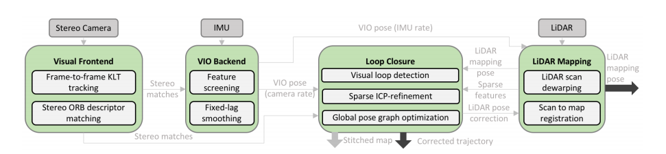

Lidar SLAM
=========================

LOAM
-----------------------

`LOAM <https://github.com/laboshinl/loam_velodyne>`_

A-LOAM
-------------------------

LeGO LOAM
--------------------

HDL-GRAPH-SLAM
----------------------

IMLS-SLAM
-------------------
Implicit Moving Least Squares(IMLS) surface represetation is used to handle large amount and sparisty of acquired data. It makes me proud to see some schoolmates made such a contributional work. `paper <https://arxiv.org/abs/1802.08633>`_

Pretreatment
~~~~~~~~~~~~~~~~~~
1. Unwarp lidar scan, It is done b linear interploation using the last relative pose. 

.. math::
    \bar{\tau}(t_{k}) = \tau(t_{k-1}) * \tau(t_{k-2})^{-1} * \tau(t_{k-1})
    
.. math::
    \tau(t) = Interpolation(\bar{\tau}(t_{k}), \tau(t_{k-1}), t), t \subseteq (t_{k-1}, t_{k})

2. remove small size segmented point cloud, and grouped cloud with small bounding box.

Scan sampling
~~~~~~~~~~~~~~~~~~~

* Classic ICP uses random sampling method, this may fail in many cases.
* A selected suitable sampling method was proposed to improve ICP. But computational expensive.
* This article proposed a sampling method based on the observability of the point of different angle and of the unkown translations. To choose better and fewer points for matching.

Scan-Model Match
~~~~~~~~~~~~~~~~~~~

* Kinect fusion uses TSDF for scan-to-model match, but TSDF surface is defined by a voxel grid (empty . SDF, known) and then is usable only in a small volume space. As a result, TSDF cannot be used in large outdoor environment.
* This article uses IMLS (Implicit Moving Least Square) surface (the set of zeros of a function)

VIL-SLAM
-------------------

It is a Stereo Visiual Inertial Lidar SLAM. Compared to VLOAM, this work uses a tightly coupled VIO (VLOAM uses a loosely coupled one), and VIL-SLAM has a Lidar enhanced loop closure.
`paper <https://arxiv.org/abs/1902.10741>`_

1. Stereo visual KLT optical flow tracking and ORB feature matching. 
2. IMU preintegartion, and tightly coupled VIO (until this part, it is tha same as VINS-Fusion).
3. Use the VIO output pose to unwarp the lidar scan. 
4. Loop clousre.
    1. Propose candidates by Bag-of-Words.
    2. PnP(Perspective-n-Point) to obtain relative pose initial estimation.
    3. Use ICP to refine the estimation.

In my point of view, this work is a mixture of a tightly coupled VIO (VINS) and a loosely coupled Lidar Visual (VLOAM). Still need to check its optimizatio backend.
