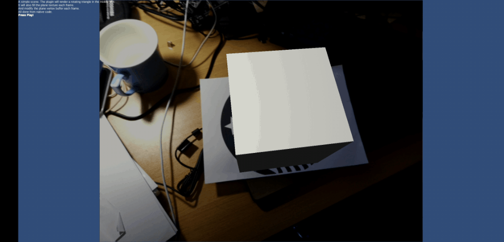

Image(Marker) Localization
===================================

The point here, is to make a image(marker) localization algorithm, with the similar effect as the one Vuforia did. With high precise and fast processing.

Pipeline
------------------------

**Marker Maker**:

* Extract infomation we need
    - several features(TYPE a) with descriptors 
    - more features(TYPE b) but without descriptors
    - infomation of marker's real size 
* Save the infomation to a data file

**Process Loop**:

* Load the marker data
* for each new input image :
    1. Extract a certain amount of features(TYPE a) and calculate its descriptors.
    2. Match the features with the features of marker by their descriptors.
    3. Use the matched features to calculate homography matrix between marker and the input image.
    4. Project the features (TYPE b) of the marker by the homography matrix to the input image. And also project a rectangle patch surrounding the features to the image.
    5. Use NCC (or other methods) to find the best match of the patch in the image, and calculate its position.
    6. If have done enough iteration or the error is small enough, go to the final step
    7. Go back to step 4.
* Out put the homography matrix, and calculate the 4 times 4 transformation matrix with PnP method (using the marker's real size)

PreTreatment
--------------------
Before we start calcuation, we need to preprocess the input image. And also prepare the marker data.

Marker Prepare
~~~~~~~~~~~~~~~~~~~~~~~
We should choose marker image with enough features and "good" layout, more details can be seen in Vuforia home page. As most marker localization algorithms share the same criteria for choosing marker.

If we need connection with other localization applization, we have to obtain the real scale of the image (the best for unit all localization measurement is to use the standard meter). So we need to measure the exact size of the printed marker.

What's next is the camera calibration process. All obtain the camera intrinsic parameters from camera devices.

Image Preprocess
~~~~~~~~~~~~~~~~~~~~~~~~

To realize fast processing, we need to resize both the marker image and the input image to have suitable size. (Remember to record ratio we used so we can calculate its real scale, to keep its connection with the real world)

    imageResizeRatio = std::max(
                MARKER_STANDARD_HEIGHT * 1.0 / std::min(src.cols, src.rows),
                MARKER_STANDARD_WIDTH * 1.0 / std::max(src.cols, src.rows));

    cv::resize(src, dst, Size(), imageResizeRatio, imageResizeRatio);

And we didn't do any more preprocessing here to avoid redundant calculation.

Feature Extraction
----------------------

There can be many way to extract the features. We used FAST cornor points(for both TYPE a and b) and BRIEF descritpors (will only be calculated for TYPE a feautures).

Patch Match
-------------------

Here I use "Patch match" as the title, but it is different from the PatchMatch algorithm you may know. 

Coefficient
~~~~~~~~~~~~~~~~~~

We simply use NCC (where Iij is the image pixel corresponding to the patch pixel Pij):

.. math::
    \frac{  \sum_{i,j} (I_{i,j}P_{i,j})  -  \sum_{i,j} I_{i,j} * \sum_{i,j} P_{i,j} * \frac{1}{N} } 
    {\sqrt{  \sum_{i,j} P_{i,j}^{2} - \frac{1}{N} * \sum_{i,j} P_{i,j}  * \sum_{i,j} P_{i,j} * ( \sum_{i,j} I_{i,j}^{2} - \frac{1}{N} * \sum_{i,j} I_{i,j}  * \sum_{i,j} I_{i,j} ) } }

We used NEON(These built-in intrinsics for the ARM Advanced SIMD extension are available when the -mfpu=neon switch is used) commond to optimize the calculation process.

        uint16x8_t xImageSums = vdupq_n_u16(0);
		uint32x4_t xImageSqSums = vdupq_n_u32(0);
		uint32x4_t xCrossSums = vdupq_n_u32(0);

		uint16x8_t xImageSq;
		uint16x8_t xCross;
		uint8x8_t xImage;
		uint8x8_t xTemplate;

		for (int i = 0; i < patch.rows; ++i) {
			uchar *patchRow = patch.data + i * patch.step;
			uchar *imageRow = image.data + (i + pt.y - patchRadius) * image.step
			+ pt.x - patchRadius;

			xImage = vld1_u8(reinterpret_cast<uint8_t*>(imageRow));
			xTemplate = vld1_u8(reinterpret_cast<uint8_t*>(patchRow));

			xImageSums = vaddq_u16(xImageSums, vmovl_u8(xImage));

			xImageSq = vmull_u8(xImage, xImage);
			xImageSqSums = vpadalq_u16(xImageSqSums, xImageSq);

			xCross = vmull_u8(xImage, xTemplate);
			xCrossSums = vpadalq_u16(xCrossSums, xCross);
		}

		imageSum = Sum_16(xImageSums);
		imageSqSum = Sum_32(xImageSqSums);
		imageCrossSum = Sum_32(xCrossSums);

Match Process
~~~~~~~~~~~~~~~

The match patch processing loop functions as following :

    cv::Point2f searchCenter;
    cv::Mat markerPatch;
    cv::Rect searchROI;
    cv::Point2f matchLoc;
    for (int i = 0; i < nPoints; ++i) {
        searchCenter = projectedPoints[i];
        if (searchCenter.x < searchRadius || searchCenter.y < searchRadius
                || searchCenter.x >= frame.cols - searchRadius
                || searchCenter.y >= frame.rows - searchRadius) {
            continue;
        }
        // and project the corresponding patch with warpPatch method
        markerPatch = ImageUtils::warpPatch(homography,
                markerInfo.markerImage, markerPoints[i], PATCH_SQUARE_WIDTH,
                PATCH_SQUARE_WIDTH);
        searchROI = cv::Rect(searchCenter.x - searchRadius,
                searchCenter.y - searchRadius, SEARCH_SQUARE_WIDTH,
                SEARCH_SQUARE_WIDTH);

        // calculate if the warped Path is corresponding with the original patch
	// and find the best path aroung warped path
        ImageUtils::CCoeffPatchFinder patchFinder (markerPatch);
        matchLoc = patchFinder.findPatch(frame, searchROI, PATCH_NCC_THRESHOLD);
        if (matchLoc.x >= 0 && matchLoc.y >= 0) {
            matchedMarkerPoints.push_back(markerPoints[i]);
            matchedImagePoints.push_back(matchLoc);
        }
    }

With SLAM
---------------------

we can make a link with the result of other SLAM algorithms.

.. image:: outputMarkerXslam.gif
    :width: 80%
    :align: center

Further update thought
--------------------

* No need to extract feature (TYPE b), as we can better choose some patch from the marker image, with other methods. As features are designed for points, but here we need match of patches. If we can better choose the patch , we should get better result.
* Feature extraction method choose. We can find a better and faster feature extraction method for our algorithm.
* The connection of the history (or more precisely, the last frame). we can use optical flow to faster get point matches, which will reduce the need of feature descriptor calculation.
     1. Assume we have find the marker and calculated its transformation matrix of the last frame.
     2. Use optical flow to track features, and calcualte the inital homography matrix (or we can simply use the homography matrix of the last frame)
     3. Return to the step 4 - step 7 of the original algorithm.
     4. If lost the marker. Go back to step 1 of the original algorithm.

