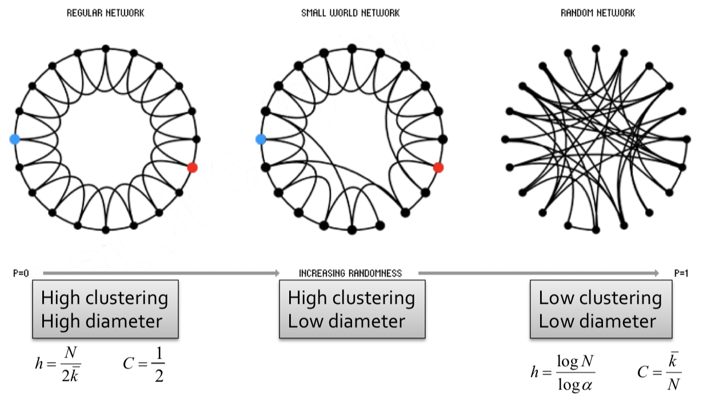

Machine Learning with Graphs
================================

CS224W Stanford `note page <https://snap-stanford.github.io/cs224w-notes/>`_

1. Introduction: Structure of Graphs
---------------------------------

1.1 Introduction
~~~~~~~~~~~~~~~~

*How the systems are organized? And what's their property?*

Firstly, several network examples are introcduced, mainly two classes : **natural graph and information graph**.

Then some application examples are shown, they could be classified into two classes:

* Learning the structure, in other words, learning the relationship of the network. (an example of **Biomedicine** is shown in details)
* Information cascade in the networks (more officially, marginalization inference of the networks).

1.2 Graph
~~~~~~~~~~~~~~~~

* Directed graph, undirected graph. Complete graph, bipartite graph.
* Representations: adjacency matrix, edge/adjacency list. Most of the graphs are **sparse** !
* Additional on graphs : attach more informations, add weights to edges; loops; etc.
* Connectivity of graphs , connected components, different for directed and undirected graphs.

2. Properties of Networks and Random Graph Models
----------------------------------------

2.1 Properties
~~~~~~~~~~~~~~~~~~~~~

* Degree distribution (P(k)) : mainly in form of a histogram.
* Path length (h) : distance, mean distance, diameter, etc.
* Clustering coefficient (C) : mainly for undirected graph, descript how the friends of a node know each other. the following equation shows (where :math:`e_{i}` = # edges between friends of i, and :math:`k_{i}` = # friends of i)

.. math::
  C_{i} = \frac{2e_{i}}{k_{i}(k_{i}-1)}

* Connectivity (S) : equals to the number of nodes in the largest connected component.

To evaluate a network, or analysis its characteristics, we need a model to compare as a reference.

2.2 Erolos-Renyi Random Graph Model
~~~~~~~~~~~~~~~~~~~~~~~~~~~~~~~~

* :math:`G_{np}` (n = # nodes, p = probability of the connection idd).
* :math:`G_{nm}` (n = # nodes, m = # edges).

+--------+--------------+
| Properties |  Expressions |
+========+==============+
| Average degree     |  :math:`\bar{k} = p(n-1)`     |
+--------+--------------+
| Average path length     |  :math:`O(\log n)`     |
+--------+--------------+
| Cluster coefficient  |   :math:`\mathcal{E}[C_{i}] = p \approx \frac{\bar{k}}{n}`   |
+--------+--------------+
| Connectivity  |   GCC exists of :math:`\bar{k}>1`   |
+--------+--------------+

* It is the simplest model -> a reference model.
* Helps to compare and understand properties.

2.3 The Small-world Model
~~~~~~~~~~~~~~~~~~~~~~~~~~~~~~

Has high clustering and short average path length, lots of neighbor clusterings with
some link in large range . Which is similar to our social networks.

Developed in 1998, **Watts Strogate Model**.

