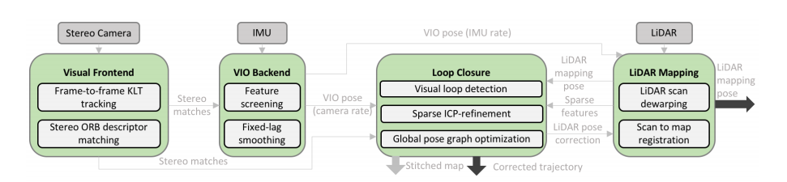

Lidar SLAM
=========================

LOAM
-----------------------

`LOAM <https://github.com/laboshinl/loam_velodyne>`_

* LOAM use a new defined feature system (corner and flat point), for the detail see its article.
* LOAM suppose linear motion within the scan swap (VLOAM further uses visual odometry to estimate it), and undistort the lidar points.
* LOAM has a low frequence optimization thread.

A-LOAM
-------------------------

* LOAM has IMU refinement.
* Lack feature filter in A-LOAM.
* LOAM implies the LM solver itself. A-LOAM uses Ceres solver.
* LOAM use analytical derivatives for Jacobians, but A-LOAM uses the automatic derivatives offered by Ceres (which is exact solution but a little bit slower).

Performance:

• A-LOAM seems good,less redundant points.
• but has more error in far edges.
• LOAM method has no assumption of a consistent “floor”, that is better for our case.
• A-LOAM has the same logical with LOAM, but its performance is much worse.

.. image:: https://img-blog.csdnimg.cn/20191008113931408.png?x-oss-process=image/watermark,type_ZmFuZ3poZW5naGVpdGk,shadow_10,text_aHR0cHM6Ly9ibG9nLmNzZG4ubmV0L3dlaXhpbl80NDQ5MjAyNA==,size_16,color_FFFFFF,t_70
  :align: center

* ALOAM - scan refistration
  the maximum time is : 0.034434
  the mean of time is : 0.0148146394612
* ALOAM - odometry
  the maximum time is : 0.027296
  the mean of time is : 0.0157431030928
* ALOAM - mapping
  the maximum time is : 0.326849
  the mean of time is : 0.257764385093

LeGO LOAM
--------------------

vs LOAM:

* Faster and similar accuracy as LOAM, and has a better global map visual effect.

Difference LOAM:

* Add segmentation before processing (gound extraction and image-based segmentation)
* Sub-divide the range image before feature extraction → more evenly distributed features.
* Label match
* Two step LM. Seperate the optimization based on different property of edge and planar points. Becomes faster while similar accuracy.
* Difference map storage method, can use pose graph optimization and use loop closure.

Performance:

• lego slam has the best result, error is small.
• Flat plane has good look, achieve a dense map, while keep its consistence.

.. image:: https://img-blog.csdnimg.cn/20191008115008483.png?x-oss-process=image/watermark,type_ZmFuZ3poZW5naGVpdGk,shadow_10,text_aHR0cHM6Ly9ibG9nLmNzZG4ubmV0L3dlaXhpbl80NDQ5MjAyNA==,size_16,color_FFFFFF,t_70
   :align: center

* LEGO LOAM - image projection
  the maximum time is : 0.029819
  the mean of time is : 0.0123906096595
* LEGO LOAM - feature association
  the maximum time is : 1.226773
  the mean of time is : 0.0126770831335
* LEGO LOAM - map optimization
  the maximum time is : 0.427468
  the mean of time is : 0.30585172524

For one input scan, it takes 0.0249s in average. It is about 25% faster than ALOAM.

HDL-GRAPH-SLAM
----------------------

* It is basically a graph optimization algorithm.
* Use ICP-based or NDT-based methods to register new point cloud, and match candidates of loop closure.
* Assumed a shared ground plane.
* For the graph optimization part, it use the most sample edge for consecutive frames, along with the floor observation edge.
* Too simple loop closure processing.
* In summary, it uses the most basic algorithms, however it has a complete structure.

Performance:

• not that much error for the far points, as it has loop closure
• lots of redundant points as it has no optimization on point cloud, floors and walls are very thick in the global map.

* HDL - prefiltering
  the maximum time is : 0.395365
  the mean of time is : 0.00943357786885
* HDL - floor detection
  the maximum time is : 0.856617
  the mean of time is : 0.0456638586777
* HDL - odometry
  the maximum time is : 0.309964
  the mean of time is : 0.0742533234078
* HDL - graph slam
  the maximum time is : 2.140327
  the mean of time is : 0.13695704878

Its processing time is much more than the other two methods, as it use NDT, while the other use feature points.

IMLS-SLAM
-------------------
Implicit Moving Least Squares(IMLS) surface represetation is used to handle large amount and sparisty of acquired data. It makes me proud to see some schoolmates made such a contributional work. `paper <https://arxiv.org/abs/1802.08633>`_

Pretreatment
~~~~~~~~~~~~~~~~~~
1. Unwarp lidar scan, It is done b linear interploation using the last relative pose.

.. math::
    \bar{\tau}(t_{k}) = \tau(t_{k-1}) * \tau(t_{k-2})^{-1} * \tau(t_{k-1})

.. math::
    \tau(t) = Interpolation(\bar{\tau}(t_{k}), \tau(t_{k-1}), t), t \subseteq (t_{k-1}, t_{k})

2. remove small size segmented point cloud, and grouped cloud with small bounding box.

Scan sampling
~~~~~~~~~~~~~~~~~~~

* Classic ICP uses random sampling method, this may fail in many cases.
* A selected suitable sampling method was proposed to improve ICP. But computational expensive.
* This article proposed a sampling method based on the observability of the point of different angle and of the unkown translations. To choose better and fewer points for matching.

Scan-Model Match
~~~~~~~~~~~~~~~~~~~

* Kinect fusion uses TSDF for scan-to-model match, but TSDF surface is defined by a voxel grid (empty . SDF, known) and then is usable only in a small volume space. As a result, TSDF cannot be used in large outdoor environment.
* This article uses IMLS (Implicit Moving Least Square) surface (the set of zeros of a function)

VIL-SLAM
-------------------

It is a Stereo Visiual Inertial Lidar SLAM. Compared to VLOAM, this work uses a tightly coupled VIO (VLOAM uses a loosely coupled one), and VIL-SLAM has a Lidar enhanced loop closure.
`paper <https://arxiv.org/abs/1902.10741>`_

1. Stereo visual KLT optical flow tracking and ORB feature matching.
2. IMU preintegartion, and tightly coupled VIO (until this part, it is tha same as VINS-Fusion).
3. Use the VIO output pose to unwarp the lidar scan. And registre the scan by Edge and planar points (LOAM method)
4. Loop clousre.
    1. Propose candidates by Bag-of-Words.
    2. PnP(Perspective-n-Point) to obtain relative pose initial estimation (of VIO).
    3. Use ICP to refine the estimation (of Lidar Odometry).

In my point of view, this work is a mixture of a tightly coupled VIO (VINS) and a loosely coupled Lidar Visual (VLOAM). Can be seen as a update version of V-LOAM.
