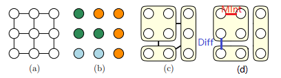
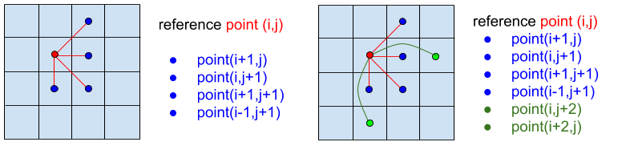

PGM
===========================
Probabilistic graphical model is a method combining probabilistic mothods with graph model for solving problem. It is consist of:

1. Build the model.
2. Propagate the probability.
3. Learn the parameters (solve the problem).

It can be solved via a Maximum a posteriori (MAP) inference of a Bayseian inference. Only when having a gaussian assumpution they will obtain the same result. Here, we consider the Maximum a posteriori (MAP) inference which is to optimize the energy function E (which has been proven to be equal to Brief propagation algorithm [1]_ ).

Here we want to solve image segmentation task with energy minimization using PGM theory.

Efficient Graph-based
------------------------

**Problem formulation** : Having a graph G = (V, E), where V is the set of nodes(pixels in our case), and E is the set of edges (undirected, and represent the relationship between pixels in our case). :math:`w(v_{i}, v_{j})` is the weight of the edge between node i and node j. The objective is to find a segmentation S, which divide G into G' = (V', E'). Such that G' contains distinct components of C. [2]_  

And the segmentations are defined by **Predicate D**, to determines whether there is a boundary for segmentations, D segments G into G', and :math:`C_{i} \subset G`, such that it satisfies :

.. math::
    D(C_{i}, C_{j}) = \begin{cases} true, & \mbox{if } Diff(C_{i}, C_{j}) > MInt(C_{i}, C_{j})  \\
                                 false, & \mbox{otherwise} \end{cases}

where, **Diff** defines the difference between two components (the minimal distance between elements in two components). **Int** is the maximum edge weight within a component. **MInt** is the minial internal difference of the two component. **MST** represents Minimum Spanning Tree.

.. math:: 
    Diff(C_{i}, C_{j}) = \min_{v_{i} \in C_{i}, v_{j} \in C_{j}, (v_{i},v_{j}) \in E } w(v_{i}, v_{j})

.. math:: 
    MInt(C_{i}, C_{j}) = min(Int(C_{i})+ \tau(C_{i}), Int(C_{j})+ \tau(C_{j}))

.. math::
    Int(C) = \max_{e \in MST(C,E)} w(e)

.. math:: 
    \tau(C) = k / \| C \|

Parameter k in :math:`\tau(C)` helps to control the component. Large k leads to a larger object(As large k will lead to a large MInt, then lead to two components to merge into one). For small components, we require stronger evidence for a boundary.

However, the definition of **Diff** only reflects the smallest edge weight between two component, but not a global one. Changing the definition to median weight or other quantiles will improve the result. 

As a result, if the difference two components are smaller than the internal difference within the two components, we should merge these two componencts.

**Algorithm**: 

1. Rank all the edges based on their weights
2. Loop through all the edges and start from the edge with smallest weight:
    3. Compare the two components, which the edge's nodes belong to, by the Predicate D. To determine whether merge these two components.

Graph Edge
---------------------

* **Grid Graph** can be used to build the graph model, where all the neighbor pixels have connected edges.

* **Nearest Neighbor Graph** is another method to connect edges. All the nodes are projected into another space ((u,v) to (u,v,r,g,b) in our case), then nearest neighbors have edges to connect them. In the experiment [2]_ , this method shows more global properties.

Graph Weight
-------------------
1. Use RGB color difference.
2. Convert to HSV (hue, saturation, value) space, use a weighted sum of distance in the three channels of HSV image.

Mine Implementation
-------------------

` Github page <https://github.com/gggliuye/graph_based_image_segmentation>`_ can be found. 

* **buildSegmentationGraph()**: construction of the graph(grid graph here), build the vertices and the edges.
* **segmentGraph()** : segment the graph into multiple components using the algorithm descripted above. 
* **postProcessComponents()** : delete the component with small size, by merge it into its edge-neighbor. 

Reference
-----------------

.. [1] Yedidia J S, Freeman W T, Weiss Y. Constructing free-energy approximations and generalized belief propagation algorithms[J]. IEEE Transactions on information theory, 2005, 51(7): 2282-2312.

.. [2] Felzenszwalb P F, Huttenlocher D P. Efficient graph-based image segmentation[J]. International journal of computer vision, 2004, 59(2): 167-181.

.. [3] Kim T, Nowozin S, Kohli P, et al. Variable grouping for energy minimization[C]//CVPR 2011. IEEE, 2011: 1913-1920.
