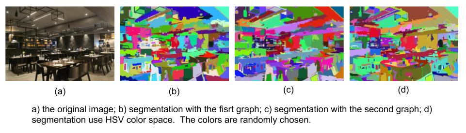
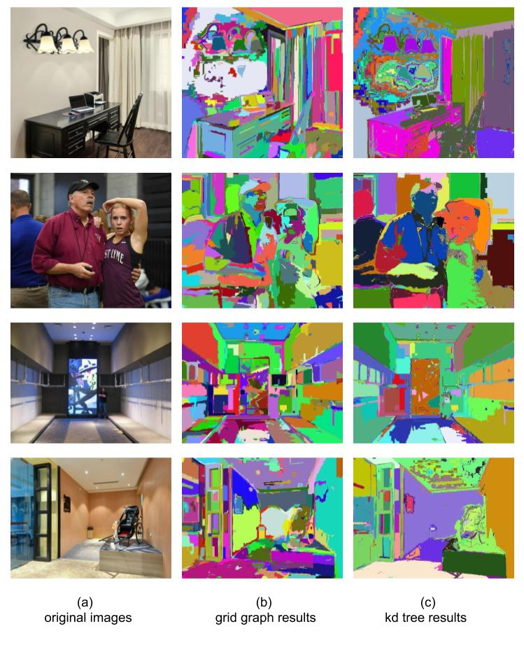

Probabilistic graphical model based image segmentation
===========================

Abstract
--------------------

Image segmentation is a hot topic right now, but most of the solution is based on deep learning, neural network. However, the expersive computation cost makes them hard to run in realtime unless offering a high level hard device. 
This article is focused on solving segmentation problem using Probabilistic graphical model (PGM) to achieve realtime performance, while maintain accuracy. This article has two main parts, one focus on graph based image segmentation, the other focus on graph cut background/foreground segmentation. We got a staisfying result at the end of this article.

1. Introduction
-------------------

Probabilistic graphical model is a method combining probabilistic mothods with graph model for solving problem. It is consist of:

1. Build the model.
2. Propagate the probability.
3. Learn the parameters (solve the problem).

It can be solved via a Maximum a posteriori (MAP) inference of a Bayseian inference. Only when having a gaussian assumpution they will obtain the same result. Here, we consider the Maximum a posteriori (MAP) inference which is to optimize the energy function E (which has been proven to be equal to Brief propagation algorithm [1]_ ).

Here we want to solve image segmentation task with energy minimization using PGM theory. The arrangement of this article will be : chatper 2 will use gragh based and kd tree based representation method to solve a more general image segmentation task. chapter 3 will use maxflow/minuct algorithm to solve background/object segmentation in image processing. Each chapter will begin with the explanation of the theory and followed by C++ implementation with its results.

2. Efficient Graph-based
------------------------

**Problem formulation** : Having a graph G = (V, E), where V is the set of nodes(pixels in our case), and E is the set of edges (undirected, and represent the relationship between pixels in our case). :math:`w(v_{i}, v_{j})` is the weight of the edge between node i and node j. The objective is to find a segmentation S, which divide G into G' = (V', E'). Such that G' contains distinct components of C. [2]_  

.. image:: images/segmentation2.PNG
    :align: center

And the segmentations are defined by **Predicate D**, to determines whether there is a boundary for segmentations, D segments G into G', and :math:`C_{i} \subset G`, such that it satisfies :

.. math::
    D(C_{i}, C_{j}) = \begin{cases} true, & \mbox{if } Diff(C_{i}, C_{j}) > MInt(C_{i}, C_{j})  \\
                                 false, & \mbox{otherwise} \end{cases}

where, **Diff** defines the difference between two components (the minimal distance between elements in two components). **Int** is the maximum edge weight within a component. **MInt** is the minial internal difference of the two component. **MST** represents Minimum Spanning Tree.

.. math:: 
    Diff(C_{i}, C_{j}) = \min_{v_{i} \in C_{i}, v_{j} \in C_{j}, (v_{i},v_{j}) \in E } w(v_{i}, v_{j})

.. math:: 
    MInt(C_{i}, C_{j}) = min(Int(C_{i})+ \tau(C_{i}), Int(C_{j})+ \tau(C_{j}))

.. math::
    Int(C) = \max_{e \in MST(C,E)} w(e)

.. math:: 
    \tau(C) = k / \| C \|

Parameter k in :math:`\tau(C)` helps to control the component. Large k leads to a larger object(As large k will lead to a large MInt, then lead to two components to merge into one). For small components, we require stronger evidence for a boundary.

However, the definition of **Diff** only reflects the smallest edge weight between two component, but not a global one. Changing the definition to median weight or other quantiles will improve the result. 

As a result, if the difference two components are smaller than the internal difference within the two components, we should merge these two componencts.

**Algorithm**: 

1. Rank all the edges based on their weights
2. Loop through all the edges and start from the edge with smallest weight:
    3. Compare the two components, which the edge's nodes belong to, by the Predicate D. To determine whether these two components should be merged or not. 
    4. If merge the two components, update the parameters. Then go to the next edge.

Graph Edge
~~~~~~~~~~~~~~~

* **Grid Graph** can be used to build the graph model, where all the neighbor pixels have connected edges.

* **Nearest Neighbor Graph** is another method to connect edges. All the nodes are projected into another space ((u,v) to (u,v,r,g,b) in our case), then nearest neighbors have edges to connect them. In the experiment [2]_ , this method shows more global properties.

Graph Weight
~~~~~~~~~~~~~~~~~~~~
1. Use RGB color difference.
2. Convert to HSV (hue, saturation, value) space, use a weighted sum of distance in the three channels of HSV image.

Grid Graph Implementation
~~~~~~~~~~~~~~~~~~~~

The C++ implementation `Github page <https://github.com/gggliuye/graph_based_image_segmentation>`_ can be found. 

* Preprocess the image 

|        // gaussian blur the image to avoid noise
|        cv::GaussianBlur(image, imageOrigin, cv::Size(3, 3), sigma, sigma);
|
|        // convert to HSV color space if it is not a gray image
|        // As we will see that HSV will lead to better result
|        if(!isGray && useHSV){
|            cvtColor(imageOrigin,imageOrigin,CV_BGR2HSV);
|        }
    
* **buildSegmentationGraph()**: construction of the graph(grid graph here), build the vertices and the edges. I have build a grid graph based on the following two type of loop. The first one will connect all the pixel with the 8 pixels around it. The second one will connect additional with the 4 pixels, to which distances are 2 pixel size, hoping it can obtain more global properity.

.. image:: images/PGM_graph_image.png
    :align: center
    :width: 80%

|        // initialize the edge array
|        // one edge will contain two pixels (pxiel i and j)
|        // and the weight of the edge
|        edges = new edge[initsize];
|    
|        for(int i = 0; i < imageOrigin.rows; i++){
|            for(int j = 0; j < imageOrigin.cols; j++){
|                // loop through all the pixels to build the graph
|                // (skip a great amount of code)    
|                edges[count].pixel_i.i = xx;
|                edges[count].pixel_i.j = xx;
|                edges[count].pixel_j.i = xx;
|                edges[count].pixel_j.j = xx;
|                assignEdgeWeight(&edges[count]);
|            }	
|        }

* **segmentGraph()** : segment the graph into multiple components using the algorithm descripted above.

|        // create "component" strcture, and a componentTree class
|        // in the initial state, each pixel is a component
|        // through the loop, the componets will be joined together
|        componentTree = new ComponentTree(verticesSize, c);
|        
|        // sort the edges based on their weight
|        std::sort(edges, edges + edge_count);
|        
|        // for each edge, in non-decreasing weight order...
|        for (int i = 0; i < edge_count; i++) {
|            edge *edge_i = &edges[i];
|            // components conected by this edge
|            int idx_a = edge_i->pixel_i.i * cols + edge_i->pixel_i.j;
|            int idx_b = edge_i->pixel_j.i * cols + edge_i->pixel_j.j;
|            int a = componentTree->findParent(idx_a);
|            int b = componentTree->findParent(idx_b);
|            if (a != b) {
|                if((edge_i->weight <= componentTree->getMInt(a)) &&
|	           (edge_i->weight <= componentTree->getMInt(b))) {
|	            componentTree->join(a, b, edge_i->weight);	
|                }    
|            }
|        }

* **postProcessComponents()** : delete the component with small size, by merge it into its edge-neighbor. 

|        // for two different components, if the size is small.
|        // we will join them togehter based on the edge connection
|        if ((a != b) && ((componentTree->sizeOfComponent(a) < min_size) 
|              || (componentTree->sizeOfComponent(b) < min_size)))
|                componentTree->join(a, b, -1);

    
Experiment Results
~~~~~~~~~~~~~~~~~~~~~~~~~~

The results are shown below. The two type of graphs result in similar result (figure (b) and (c)). When I found it cannot handle well the back wall, which has great light diversity. This is the motivation to switch to HSV color space. 

Firstly, I used opencv method to convert the image, this will project the H channel into a range of 0 to 180, and S V channels to the range of 0 to 255. I assiged different weight for the three channel(2 for H, and 0.5 for S V), to make the color more important than light differences. The result is shown in the last figure (figure (d)). We can see, it do handle better the light difference.

KD TREE Implementation
~~~~~~~~~~~~~~~~~~~~~~~~~~~~~

* **Build the KD tree** : the KD tree distance is based on 5 values, (u,v) for the pixel positions and (r,g,b) or (h,s,v) for image color space. And I choose different weights for the three HSV channels (2.0,0.3, and 0.3 in experiments).
* **Retrive Close nodes from the tree** : then find the close points in the set, here I choose all the close points, as they can possible contribute to the graph model.
* **Solve the model** : the models are solved based on the same methods as mentioned above in grid graph.

In the experiments, I tested various choice of the close radius of KD tree. And using KD tree require more calculation cost, as a result, they may run relatively slow compare to grid model. But the results shows more global property, we can see in next section.

All Results
~~~~~~~~~~~~~~~~~~~~~~~~~~~~~~~~~

Here shows many result, KD tree graph shows more global property, we can find that especially in the segmentation of walls and some seperated object parts. But It does not work well with great light change, as in the first image. 

3. Graph Cut
------------------------
Another task for image segmentation is to seperate background and object pixels. The most common utils for this task is graph cut (maxflow/mincut). Here I used maxflow from `IST Austria <http://pub.ist.ac.at/~vnk/software.html>`_ a implentation of [4]_ .

Graph Cut is to build a graph model of the input image, assign each pixel with a label indicates whehter it belongs to a object or the background. All the pixels in the image are corresponding to the nodes, and the edge is defined based on pixel differences. After built the graph model, the labels will be solved based on **min cut** algorithm. Mincut is too cut the graph into two seperate parts (source and sink), by cutting in edge with relatively small weight (Energy). Mincut is equal to find a cut, which minimize the free energy.

The energy in our case, has two parts : node part and edge part. 

.. math::
    E = \sum_{p,q}B(p,q) + \sum_{p}R(p)

Where R is the node energy, it is defined as follows, where p is pixel, :math:`\mathcal{O} ` is the object pixel set, :math:`\mathcal{B} ` is the backgroud pixel set.

.. math::
    R(p, S) = \begin{cases} C, & \mbox{if } p \in \mathcal{O}   \\
                         0 , & \mbox{if } p \in \mathcal{B}   \\
                         \lambda_{s}  & \mbox{otherwise}   \end{cases}
                         
.. math::
    R(p, T) = \begin{cases} 0, & \mbox{if } p \in \mathcal{O}   \\
                         C , & \mbox{if } p \in \mathcal{B}   \\
                         \lambda_{t}  & \mbox{otherwise}   \end{cases}

And B is the edge energy, it is based on pixel difference:

.. math::
    B(p,q) = exp(- \frac{ (I_{p} -I_{q})^{2} } { 2 \sigma^{2} })

The build of the graph can be seen in "example/cut.cc" file.

**Algorithm**:

1. Build the model, assign the nodes and the edges.
2. Find min cut.

Result
~~~~~~~~~~~~~~~~~~~~~~~~~

I build the graph using the edge connection mentioned above, and assign the weight based on RGB color space and HSV color space seperately. And give the graph two guide rectangles, one in green, indicates the object, the other in red, indicates the background. The result is shown below.

.. image:: images/graphcutresult.jpg
    :align: center

We can see that HSV color space has a much better result than normal RGB color space. And the algorithm works well in our task. But we always need some guide to let algorithm work, further work should be the reduction of user guide.

Reference
-----------------

.. [1] Yedidia J S, Freeman W T, Weiss Y. Constructing free-energy approximations and generalized belief propagation algorithms[J]. IEEE Transactions on information theory, 2005, 51(7): 2282-2312.

.. [2] Felzenszwalb P F, Huttenlocher D P. Efficient graph-based image segmentation[J]. International journal of computer vision, 2004, 59(2): 167-181.

.. [3] Kim T, Nowozin S, Kohli P, et al. Variable grouping for energy minimization[C]//CVPR 2011. IEEE, 2011: 1913-1920.

.. [4] Boykov Y, Kolmogorov V. An experimental comparison of min-cut/max-flow algorithms for energy minimization in vision[J]. IEEE Transactions on Pattern Analysis & Machine Intelligence, 2004 (9): 1124-1137.
