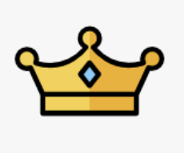
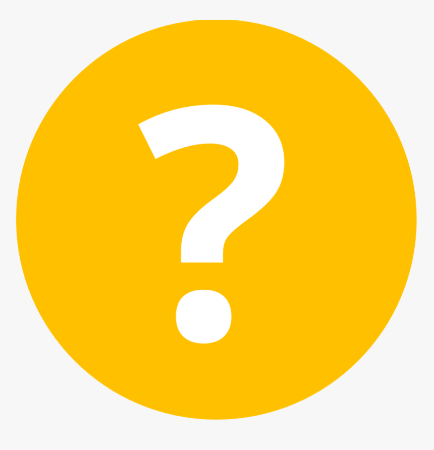

Specific Subjects
==================

ICP covariance
---------------

**ICP error source**:

* wrong convergence (to local minimial), error of the initial pose estimation.
* under-constrainted situation: the problem is indeterminted.
* miss match.
* sensor noise.

|thumbs|  `An accurate closed-form estimate of ICP's covariance 2007 <https://ieeexplore.ieee.org/document/4209579>`_.
Use hessien matrix as the estimation of the covariance (but this method in some cases greatly over-estimates thte true covariance):

.. math::
  cov(\hat{x}) \approx 2\frac{residual}{K-3} [\frac{\partial^{2}}{\partial x^{2}}residual]^{-1}

This paper develop the following closed-form method : 

.. math::
  cov(x) \approx [\frac{\partial^{2}}{\partial x^{2}}J]^{-1} [\frac{\partial^{2}}{\partial z\partial x}J]^{T} cov(z) [\frac{\partial^{2}}{\partial z\partial x}J] [\frac{\partial^{2}}{\partial x^{2}}J]^{-1}

|thumbs| `A Closed-form Estimate of 3D ICP Covariance 2015 <https://sites.google.com/site/icpcovariance/>`_.
Based on the upper paper, and solve for point-to-point case.

|thumbs| `On the Covariance of ICP-based Scan-matching Techniques 2016 <https://arxiv.org/abs/1410.7632>`_.
Analysis the upper hessien based method. Find that the upper method fit for point-to-plane icp, but not for point-to-point icp.

|thumbs| `A New Approach to 3D ICP Covariance Estimation 2019 <https://arxiv.org/abs/1909.05722>`_.
Add an additional term for the covariance from the initial pose estimation.

Point cloud generation
---------------

* (local method) 3d grid (TSDF, ESDF) + matching cube. (binary classification problem for octree vertices)
* (global method) point cloud + possion reconstruction.
* Delaunnay triangulation
* Deep learning method

 |chrown0| `(ONet) Occupancy networks: Learning 3d reconstruction in function space <https://arxiv.org/abs/1812.03828>`_

|thumbs| `SSRNet: Scalable 3D Surface Reconstruction Network <https://arxiv.org/pdf/1911.07401.pdf>`_

.. |chrown| image:: images/chrown.png
    :width: 3%

.. |thumbs| image:: images/thumbs.png
    :width: 3%

.. |unhappy| image:: images/unhappy.png
    :width: 3%

