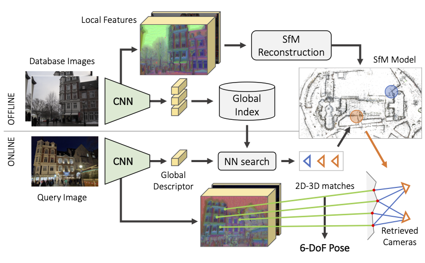

Visual Mapping
===================

2021
--------------

|chrown0| `GVINS: Tightly Coupled GNSS-Visual-Inertial Fusion for Smooth and Consistent State Estimation <https://github.com/HKUST-Aerial-Robotics/GVINS>`_
It offers a complete model of GPS measurement. Makes fusion with GPS very solid.

|unhappy| `DSP-SLAM: Object Oriented SLAM with Deep Shape Priors <https://jingwenwang95.github.io/dsp-slam/>`_
ORBSLAM2 + object tracking

|chrown0| `V-SLAM: Unconstrained Line-based SLAM Using Vanishing Points for Structural Mapping <https://arxiv.org/abs/2112.13515>`_
Plucher coordinate line only has normal residual term, cannot fix degeneracy cases (line on epipolar plane).
This paper introduces a new residual based on vanishing point measurements.

2020
--------------------

|chrown|  `hloc Hierarchical-Localization <https://github.com/cvg/Hierarchical-Localization>`_.
`CVPR2020 <https://www.visuallocalization.net/workshop/cvpr/2020/>`_ winner.

* `SuperPoint 2017 <https://arxiv.org/abs/1712.07629>`_, `SuperGlue <https://arxiv.org/abs/1911.11763>`_ with `colmap 2016 <https://colmap.github.io/>`_ for building map.
* `Hierarchical Localization 2019 <https://arxiv.org/abs/1812.03506>`_ for localization. (Roughly speaking, using `NetVLAD 2016 <https://arxiv.org/abs/1511.07247>`_ match submap with a global descriptor, then match with reference image).

|chrown| `Online Invariance Selection for Local Feature Descriptors <https://github.com/rpautrat/LISRD>`_
Mainly for image retrieval.
A light-weight meta descriptor approach to automatically select the best invariance of the local descriptors given the context.
Learning the best invariance for local descriptors.

|chrown0| `Online Visual Place Recognition via Saliency Re-identification <https://arxiv.org/pdf/2007.14549.pdf>`_.
`github project <https://github.com/wh200720041/SRLCD>`_ .

* Perform both saliency detection and retrieval in frequency domain (2D Fourier transformation).
* Saliency map : IFFT of the difference w.r.t. average filtered log spectral. Kernel cross-correlator (KCC) to match.
* No offline trainning needed. Low cost, higher recall rate than DBoW2 (as shown in the paper).

|chrown0| `Learning Feature Descriptors using Camera Pose Supervision <https://github.com/qianqianwang68/caps>`_,
use camera pose (re-projected distance to epipolar line) error as loss function to train NN.

|chrown0|  `Kapture: Robust Image Retrieval-based Visual Localization using Kapture <https://arxiv.org/pdf/2007.13867.pdf>`_
data-driven features. Instead of manually describing how keypoints or image descriptions should look like, a
large amount of data is used to train an algorithm to make this decision by itself.

|chrown0|  `Multi-View Optimization of Local Feature Geometry <https://github.com/mihaidusmanu/local-feature-refinement>`_
Refining the geometry of local image features from multiple views without known scene or camera geometry.
Optimize feature keypoints' position based on multiple views.

* Process feature extraction and feature matching steps.
* Calculate visual flow :math:`T_{u\to v}(x_{u})` between feature matches (as the jacobians), using CNN method.
* Perform optimization for each feature track. Residual is weighted :math:`(x_{v} - x_{u} - T_{u\to v}(x_{u}))`

|thumbs|  `Cross-Descriptor Visual Localization and Mapping <https://arxiv.org/pdf/2012.01377.pdf>`_.
 “translates” descriptors from one representation to another, using NN method.

|unhappy|  `Attention Guided Camera Localization <https://github.com/BingCS/AtLoc>`_.
Roughly speaking, `MapNet 2018 <https://github.com/NVlabs/geomapnet>`_ with attention.

2019
-------------

|thumbs| `OANet <https://github.com/zjhthu/OANet>`_ Learning Two-View Correspondences and Geometry
Using Order-Aware Network. In short, GNN based feature matches outlier rejection.

|unhappy| `DIFL-FCL <https://github.com/HanjiangHu/DIFL-FCL>`_ Domain-Invariant Feature Learning with Feature Consistency Loss.
Train DL features which are robust to environment change (using GAN to generate train set).
It may help when we are lack of real training images, while mostly it won't happen.

|unhappy| `Multi-Process Fusion <https://github.com/StephenHausler/Multi-Process-Fusion>`_ .
Ensemble methods for image retrieval process.

2018
-----------

|thumbs|  `ToDayGAN <https://arxiv.org/abs/1809.09767>`_. Use GAN to transform night image to bright day, then use the
transformed image for image retrieval task.

|unhappy| `Efficient adaptive non-maximal suppression algorithms for homogeneous spatial keypoint distribution <https://github.com/BAILOOL/ANMS-Codes>`_

* ANMS(Adaptive non-maximal suppression) based on Tree Data Structure (TDS).
* Suppression via Square Covering (SSC)

.. |chrown| image:: images/chrown.png
    :width: 3%

.. |chrown0| image:: images/chrown0.png
    :width: 3%

.. |thumbs| image:: images/thumbs.png
    :width: 3%

.. |unhappy| image:: images/unhappy.png
    :width: 3%

.. |question| image:: images/question.png
    :width: 3%
