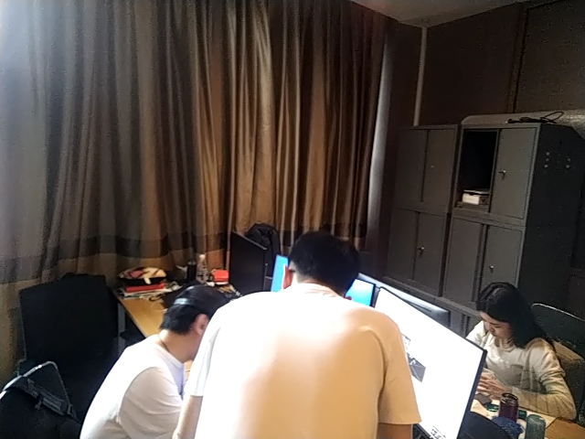
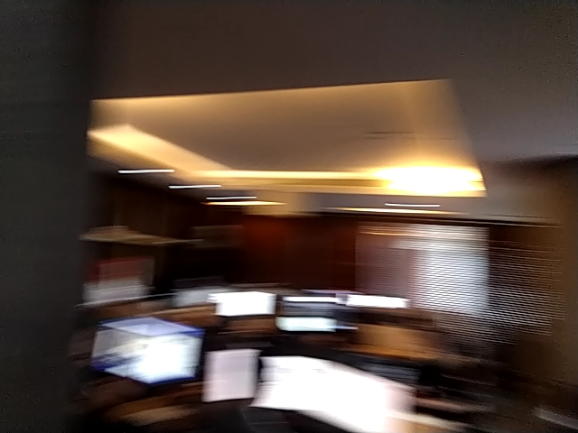
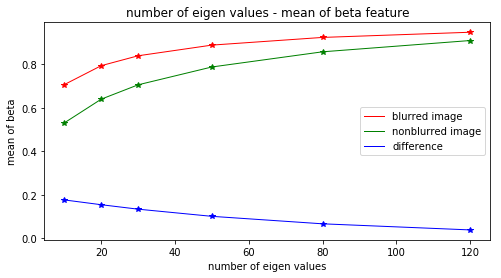
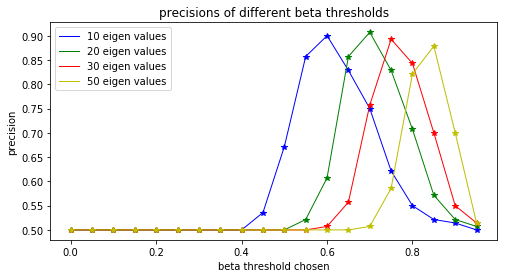

Pretreatments
==========================

Lie group and Lie algebra
-----------------------------------

 `Group Theory <https://en.wikipedia.org/wiki/Group_theory>`_

A group is a set, G, together with an operation • (called the group law of G) that combines any two elements a and b to form another element, denoted a • b or ab. To qualify as a group, the set and operation, (G, •), must satisfy four requirements known as the group axioms:
 
**Closure** :
For all a, b in G, the result of the operation, a • b, is also in G.

**Associativity** :
For all a, b and c in G, (a • b) • c = a • (b • c).

**Identity element** :
There exists an element e in G such that, for every element a in G, the equation e • a = a • e = a holds. Such an element is unique (see below), and thus one speaks of the identity element.

**Inverse element** :
For each a in G, there exists an element b in G, commonly denoted a−1 (or −a, if the operation is denoted "+"), such that a • b = b • a = e, where e is the identity element.

The result of an operation may depend on the order of the operands. In other words, the result of combining element a with element b need not yield the same result as combining element b with element a; the equation: a • b = b • a

Calibration Camera (IMU LIDAR)
---------------------------------

Camera
>>>>>>>>>>>>>>>

Camera calibration is extremely important for SLAM system. Matlab and `OpenCV <https://docs.opencv.org/2.4/doc/tutorials/calib3d/camera_calibration/camera_calibration.html>`_ image calibration tool boxes are the most used tools (they basicly use the same algorithm,  however different in realize method. For example, they use different non-linear optimization methods).

Pin-hole model is most used camera in an AR application. 
Calibrate a pinhole camera is to estimate the parameters of a lens and image sensor,
which will be used to correct for lens distortion, measure the size of an object in world units, or determine the location of the camera in the scene.There are mainly two parts in camera calibration. Firstly, to project the 3D world to the camera sensor plane, secondly transform the image from the real world unit to pixel level. 

.. math::
   Z\begin{bmatrix} x\\y\\1\end{bmatrix}
   =\begin{bmatrix}
   f_{x} & 0 & 0\\0 & f_{y} & 0 \\ 0 & 0 & 1
   \end{bmatrix}
   \begin{bmatrix} X\\Y\\Z\end{bmatrix}
   
.. math::
    \begin{bmatrix} x_{pixel}\\y_{pixel}\\1\end{bmatrix}
    =\begin{bmatrix}
       \delta_{x} & 0 & c_{x}\\0 & \delta_{y} & c_{y} \\ 0 & 0 & 1
    \end{bmatrix}
    \begin{bmatrix} x\\y\\1\end{bmatrix}

.. math::
    Z\begin{bmatrix} x_{pixel}\\y_{pixel}\\1\end{bmatrix}
    =\begin{bmatrix}
       \delta_{x} & 0 & c_{x}\\0 & \delta_{y} & c_{y} \\ 0 & 0 & 1
    \end{bmatrix}
    \begin{bmatrix}
     f_{x} & 0 & 0\\0 & f_{y} & 0 \\ 0 & 0 & 1
    \end{bmatrix}
    \begin{bmatrix} X\\Y\\Z\end{bmatrix}
    = \begin{bmatrix}
       f_{x}\delta_{x}  & 0 & c_{x}\\0 & f_{y}\delta_{y}  & c_{y} \\ 0 & 0 & 1
    \end{bmatrix} \begin{bmatrix} X\\Y\\Z\end{bmatrix}
    = \kappa \begin{bmatrix} X\\Y\\Z\end{bmatrix}

The distortion is represented as follows:

.. math::
    x_{distorted} = x(1 + k_{1}r^{2} + k_{2}r^{4} + k_{3}r^{6}  )
    
    x_{distorted} = x + ( 2p_{1}xy + p_{2}(r^{2}+2x^{2}) )

IMU (Inertial measurement unit)
>>>>>>>>>>>>>>>>>>>>>>>>>>>>>>>>>>>>>>
**Accelerometer(offer acceleration) + Gyroscope(offer angle velocity)**

The most important parameters for IMU are **bias** and **white noise**.

.. math::
    \omega_{measure} = \omega_{true} + bias_{\omega} + n_{noise}

    acc_{measure} = acc_{true} + bias_{acc} + n_{noise}

They can be calibrated with Allan variance model.
Example can be seen  `Example  <https://github.com/gggliuye/VIO/blob/master/IMU/allan%20plot.ipynb>`_

|pic1| and |pic2|

.. |pic2| image:: Tracking/images/allancurves.PNG
   :width: 45%

.. |pic1| image:: Tracking/images/idealallan.PNG
   :width: 45%

The bias can be effacted by **temperature**, we can use a temperature-dependent bias/scale factor model to calibrate it. (for an example, for Aerial Vehicles there always exist a thermometer to measure temperature to feed to the model.)

Besides, there are **scale** error and **misalignment** for an Accelerometer , which can be summarized as :

.. math::
    \begin{bmatrix} l_{ax}\\l_{ay}\\l_{az}\end{bmatrix}
    =\begin{bmatrix}
       s_{xx} & m_{xy} & m_{xz}\\ m_{yx} & s_{yy} & m_{yz} \\ m_{zx} & m_{zy} & m_{zz}
    \end{bmatrix}
    \begin{bmatrix} a_{x}\\a_{y}\\a_{z}\end{bmatrix} 
    + \begin{bmatrix} b_{ax}\\b_{ay}\\b_{az}\end{bmatrix} 

LIDAR
>>>>>>>>>>>>>>>>>
(to do)

gamma correction
-----------------------

`Code Example <https://github.com/gggliuye/VIO/blob/master/pretreatment/ImagePerprocessing.cc>`_

.. math::
    I_{i}^{\gamma} = ( I_{i} / 255) ^{\gamma} * 255

Example of indoor scene:

.. image:: images/bc_images.png
   :width: 100%

.. image:: images/bc_hists.png
   :width: 100%

Example of outdoor scene:

.. image:: images/night_images.png
   :width: 100%

.. image:: images/night_hists.png
   :width: 100%

Image Blurry
------------------

Cameras
>>>>>>>>>>>>>>>>>

There are several types of cameras: global shutter cameras, rolling shutter cameras, event cameras, etc. The following image shows the different effect of global shutter camera and rolling shutter camera (from camera_compares_ ). Global shutter cameras take a snapshot of the entire scene at a single instant in time. However rolling shutter cameras scans across the scene rapidly, either vertically or horizontally.

.. _camera_compares: https://www.diyphotography.net/this-video-helps-you-understand-the-rolling-shutter-effect/

.. image:: images/cameracompare.png
    :width: 80%
    :align: center
    
**Rolling shutter** cameras will generally cause jerry effect, to reduce the effect, we can model the motion of the camera, and find the correct synchronization of pixels, for an example in Spline Fusion [#]_ . 

**Event cameras** are used more and more now adays, they are used to measure not the intensity of a ray, but rather detect the change of received light intensity. They are more robust to fast move, light condition, those cameras are mostly used in Drones now. And there emerges many SLAM algorithms based on event cameras. For example " Real-time Visual-Inertial Odometry for Event Cameras using Keyframe-based Nonlinear Optimization [#]_ ", an example video can be seen `here <https://www.youtube.com/watch?v=F3OFzsaPtvI>`_ .  

For our cases, most phone cameras and AR glasses cameras are **Global shutter cameras** . For global shutter cameras, the most signification problem is image blur, which are mostly two types : **Defocus Blur** and **Motion Blur** .

**Defocus Blur** is also called out-of-focus blur, as its name indicates, it references the blurry cause from "incorrect" focus. As it can also produce great image effect `Bokeh <https://en.wikipedia.org/wiki/Bokeh>`_ , it is also used in photography. There are also several work to do with it, but it is not our main issue. Our devices will automaticlly use the correct focus at most time.

**Motion Blur** is our main issue, it is produced by global shutter camera, as all the pixels are taken at the same time period (exprosure time), however fast movement will cause some pixels to spread in an area. Either camera motion or object motion can cause a motion blur. For our case, AR application, camera motion is our main concern. The moving objects should not be used to localization, the blurry of their pixels are helpful to us, on the contrary.

.. [#] Lovegrove S, Patron-Perez A, Sibley G. Spline Fusion: A continuous-time representation for visual-inertial fusion with application to rolling shutter cameras[C]//BMVC. 2013, 2(5): 8.

.. [#] Rebecq H, Horstschaefer T, Scaramuzza D. Real-time Visual-Inertial Odometry for Event Cameras using Keyframe-based Nonlinear Optimization[C]//BMVC. 2017.

Point Spread Function (PSF)
>>>>>>>>>>>>>>>>>>>>>>

We can express an image by its singular value decomposition (SVD) :
  
.. math::
    I = U \Lambda V^{T}

where U,V are orthogonal matrices and \Lambda is a diagonal matrix that is compose of multiple singular values arranged in decreasing order. We can further use these eigen values (elements of Lambda) to decomprose the image into multiple rank 1 matrices :

.. math::
    I = \sum_{i=1}^{n} \lambda_{i} ( \mathbf{ u_{i} v_{i}^{T} } )

Suppose we have an image I, which is convoluted with a Point Spread Function (PSF) H as following [#]_ :

.. math::
    I * H = \sum_{i=1}^{n} \lambda_{i} ( \mathbf{ u_{i} v_{i}^{T} } ) * H

where the convolution operator tends to increase the scale-space of the eigen-images and accordingly causes a loss of high frequence details. Those small singular values that match to small scale space eigen-images correspond to larger scale-space eigen-images after convultion. As a result, the image details are weakened and those large scale-sapce eigen-images get higher weights. 

Blurry Degree
>>>>>>>>>>>>>>>>>>>>>>>>>>

Our problem can be seen as a classification problem : input an image, we should tell whether it is blurred or it is non blur.

As a result of the upper analysis, a measure of degree of burry can be proposed based on the weights of the first few most significant eigen-images :

.. math::
    \beta_{1} = \frac{\sum_{i=1}^{k}\lambda_{i} } {\sum_{i=1}^{n}\lambda_{i}}

|pic3| |pic4|

To analysis the this beta value, we made our own data set of 140 images (of size 640 times 480) with 70 blurred images and 70 non blur images. Two example images are shown above. (left: non blur image , right : motion blurred image) 
Beta burry degree values of these two example images are shown below, as the x axis is k (the number of eigen values taken), and the y value represents the beta values. We should two images (with the right one, an enlarged version). From these images we can clearly see that the blurred image do has a larger beta values, especially when k is small.

.. image:: images/beta1compare.png
    :align: center

To better choose the k value (number of eigen values taken in beta calculation), we tested though our dataset for different k choose, and compare the means of beta of the two classes (blur and non blur). And the output the distance between the two classes. We found that the lower k will produce larger difference.

We also test our classification, by predict through our dataset. Below we should the precisions of different beta threshold choosen.

In summary, for our data set, We should choose k = 10 and the corresponding beta threshould should be about 0.6.

Image Deblur
>>>>>>>>>>>>>>>>>>>>>

* image blind-deconvolution_  for image deblur, etc. 

.. _blind-deconvolution: https://nl.mathworks.com/help/images/ref/deconvblind.html

.. [#] Su B, Lu S, Tan C L. Blurred image region detection and classification[C]//Proceedings of the 19th ACM international conference on Multimedia. ACM, 2011: 1397-1400.

