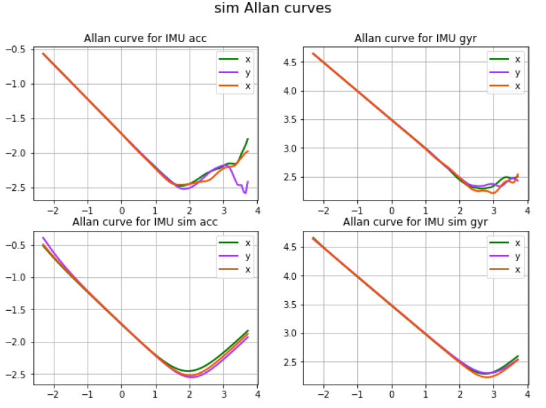
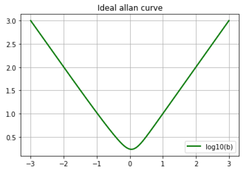
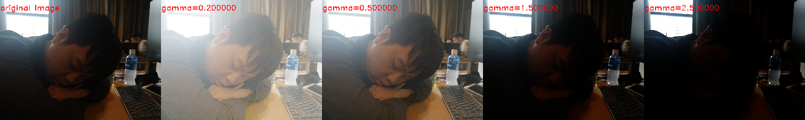
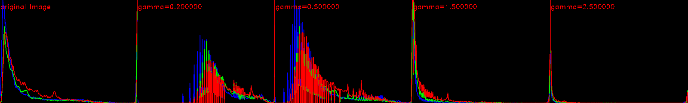

Pretreatments
==========================

Lie group and Lie algebra
-----------------------------------

 `Group Theory <https://en.wikipedia.org/wiki/Group_theory>`_

A group is a set, G, together with an operation • (called the group law of G) that combines any two elements a and b to form another element, denoted a • b or ab. To qualify as a group, the set and operation, (G, •), must satisfy four requirements known as the group axioms:
 
**Closure** :
For all a, b in G, the result of the operation, a • b, is also in G.

**Associativity** :
For all a, b and c in G, (a • b) • c = a • (b • c).

**Identity element** :
There exists an element e in G such that, for every element a in G, the equation e • a = a • e = a holds. Such an element is unique (see below), and thus one speaks of the identity element.

**Inverse element** :
For each a in G, there exists an element b in G, commonly denoted a−1 (or −a, if the operation is denoted "+"), such that a • b = b • a = e, where e is the identity element.

The result of an operation may depend on the order of the operands. In other words, the result of combining element a with element b need not yield the same result as combining element b with element a; the equation: a • b = b • a

Calibration Camera (IMU LIDAR)
---------------------------------

Camera
>>>>>>>>>>>>>>>

Camera calibration is extremely important for SLAM system. Matlab and `OpenCV <https://docs.opencv.org/2.4/doc/tutorials/calib3d/camera_calibration/camera_calibration.html>`_ image calibration tool boxes are the most used tools (they basicly use the same algorithm,  however different in realize method. For example, they use different non-linear optimization methods).

Pin-hole model is most used camera in an AR application. 
Calibrate a pinhole camera is to estimate the parameters of a lens and image sensor,
which will be used to correct for lens distortion, measure the size of an object in world units, or determine the location of the camera in the scene.There are mainly two parts in camera calibration. Firstly, to project the 3D world to the camera sensor plane, secondly transform the image from the real world unit to pixel level. 

.. math::
   Z\begin{bmatrix} x\\y\\1\end{bmatrix}
   =\begin{bmatrix}
   f_{x} & 0 & 0\\0 & f_{y} & 0 \\ 0 & 0 & 1
   \end{bmatrix}
   \begin{bmatrix} X\\Y\\Z\end{bmatrix}
   
.. math::
    \begin{bmatrix} x_{pixel}\\y_{pixel}\\1\end{bmatrix}
    =\begin{bmatrix}
       \delta_{x} & 0 & c_{x}\\0 & \delta_{y} & c_{y} \\ 0 & 0 & 1
    \end{bmatrix}
    \begin{bmatrix} x\\y\\1\end{bmatrix}

.. math::
    Z\begin{bmatrix} x_{pixel}\\y_{pixel}\\1\end{bmatrix}
    =\begin{bmatrix}
       \delta_{x} & 0 & c_{x}\\0 & \delta_{y} & c_{y} \\ 0 & 0 & 1
    \end{bmatrix}
    \begin{bmatrix}
     f_{x} & 0 & 0\\0 & f_{y} & 0 \\ 0 & 0 & 1
    \end{bmatrix}
    \begin{bmatrix} X\\Y\\Z\end{bmatrix}
    = \begin{bmatrix}
       f_{x}\delta_{x}  & 0 & c_{x}\\0 & f_{y}\delta_{y}  & c_{y} \\ 0 & 0 & 1
    \end{bmatrix} \begin{bmatrix} X\\Y\\Z\end{bmatrix}
    = \kappa \begin{bmatrix} X\\Y\\Z\end{bmatrix}

The distortion is represented as follows:

.. math::
    x_{distorted} = x(1 + k_{1}r^{2} + k_{2}r^{4} + k_{3}r^{6}  )
    
    x_{distorted} = x + ( 2p_{1}xy + p_{2}(r^{2}+2x^{2}) )

IMU (Inertial measurement unit)
>>>>>>>>>>>>>>>>>>>>>>>>>>>>>>>>>>>>>>
**Accelerometer(offer acceleration) + Gyroscope(offer angle velocity)**

The most important parameters for IMU are **bias** and **white noise**.

.. math::
    \omega_{measure} = \omega_{true} + bias_{\omega} + n_{noise}

    acc_{measure} = acc_{true} + bias_{acc} + n_{noise}

They can be calibrated with Allan variance model.
Example can be seen  `Example  <https://github.com/gggliuye/VIO/blob/master/IMU/allan%20plot.ipynb>`_

|pic1| and |pic2|

The bias can be effacted by **temperature**, we can use a temperature-dependent bias/scale factor model to calibrate it. (for an example, for Aerial Vehicles there always exist a thermometer to measure temperature to feed to the model.)

Besides, there are **scale** error and **misalignment** for an Accelerometer , which can be summarized as :

.. math::
    \begin{bmatrix} l_{ax}\\l_{ay}\\l_{az}\end{bmatrix}
    =\begin{bmatrix}
       s_{xx} & m_{xy} & m_{xz}\\ m_{yx} & s_{yy} & m_{yz} \\ m_{zx} & m_{zy} & m_{zz}
    \end{bmatrix}
    \begin{bmatrix} a_{x}\\a_{y}\\a_{z}\end{bmatrix} 
    + \begin{bmatrix} b_{ax}\\b_{ay}\\b_{az}\end{bmatrix} 

LIDAR
>>>>>>>>>>>>>>>>>
(to do)

Pre-Processing
--------------

Before any further treatment, we need pretreat the image, to reduce some error or noise.
For example:

gamma correction
>>>>>>>>>>>>>>>>>>>>>
`Code Example <https://github.com/gggliuye/VIO/blob/master/pretreatment/ImagePerprocessing.cc>`_

.. math::
    I_{i}^{\gamma} = ( I_{i} / 255) ^{\gamma} * 255

Example of indoor scene:

Example of outdoor scene:

.. image:: images/night_images.png
   :width: 100%

.. image:: images/night_hists.png
   :width: 100%

Motion Blur
>>>>>>>>>>>>>>>>>>>>>>
* image blind deconvolution(https://nl.mathworks.com/help/images/ref/deconvblind.html) for image deblur, etc. 

Environment Setting
----------------------

.. image:: images/envo.PNG
   :width: 100%

