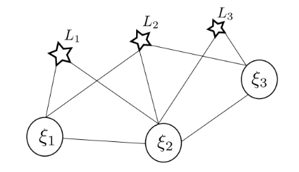
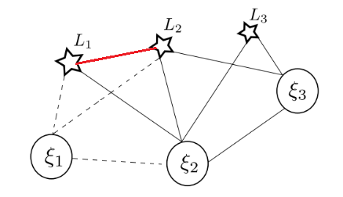
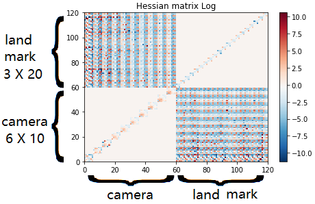
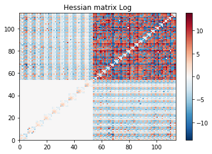
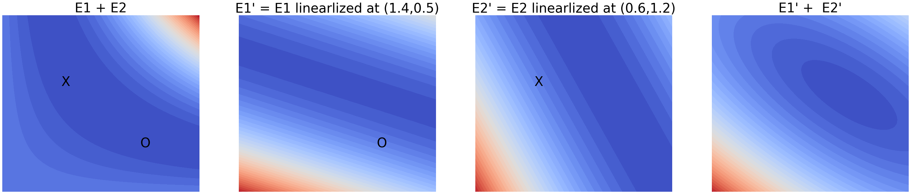
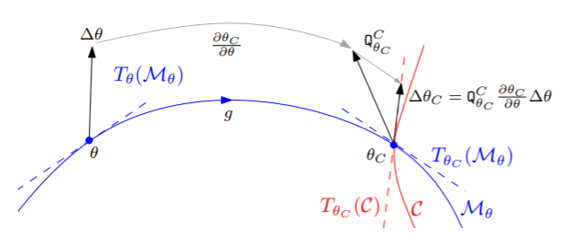
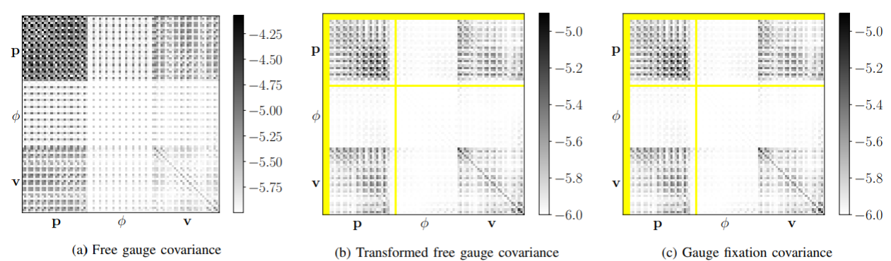

Hessian Matrix
=====================

Simulation 1
----------------------

At a certain time, the cameras and landmarks seen of a SLAM system can be seen as the image below. xi is the camera pose, L represents the observed landmark. When a landmark k was seen by ith camera in the world frame, the reprojection error is noted as r(xi_i, L_k)

**1.1 the information matrix of the upper system** :

In our system, the state variable x can be written as :

.. math::
    \mathbf{x} = \begin{bmatrix}  \xi_{1} & \xi_{2} & \xi_{3} & L_{1} & L_{2} & L_{3}   \end{bmatrix}

As a result, we have seven elements in the reprojection error term:

.. math:: 
    r_{1,1} = r(\xi_{1}, L_{1}) , r_{1,2} = r(\xi_{1}, L_{2})

.. math:: 
    r_{2,1} = r(\xi_{2}, L_{1}) , r_{2,2} = r(\xi_{2}, L_{2}), r_{2,3} = r(\xi_{2}, L_{3})

.. math:: 
    r_{3,2} = r(\xi_{3}, L_{2}) ,  r_{3,3} = r(\xi_{3}, L_{3})

Add the constrains between cameras :

.. math::
    r_{8} = r(\xi_{1}, \xi_{2}), r_{9} = r(\xi_{2}, \xi_{3})
    
The system jacobian can be written as :
    
.. math::
    J = \frac{\partial \mathbf{r}}{\partial \mathbf{x}}
    = \begin{bmatrix}
    \frac{\partial r_{1,1}}{\partial \xi_{1}} & 0 & 0 & \frac{\partial r_{1,1}}{\partial L_{1}} & 0 & 0 \\
    \frac{\partial r_{1,2}}{\partial \xi_{1}} & 0 & 0 & 0 & \frac{\partial r_{1,2}}{\partial L_{2}} & 0 \\
    0 & \frac{\partial r_{2,1}}{\partial \xi_{2}} & 0 & \frac{\partial r_{2,1}}{\partial L_{1}} & 0 & 0 \\
    0 & \frac{\partial r_{2,2}}{\partial \xi_{2}} & 0 & 0 & \frac{\partial r_{2,2}}{\partial L_{2}} & 0 \\
    0 & \frac{\partial r_{2,3}}{\partial \xi_{2}} & 0 & 0 & 0 & \frac{\partial r_{2,3}}{\partial L_{3}} \\
    0 & 0 & \frac{\partial r_{3,2}}{\partial \xi_{3}} & 0 & \frac{\partial r_{3,2}}{\partial L_{2}} & 0 \\
    0 & 0 & \frac{\partial r_{3,3}}{\partial \xi_{3}} & 0 & 0 & \frac{\partial r_{3,3}}{\partial L_{3}} \\     
    \frac{\partial r_{8}}{\partial \xi_{1}} & \frac{\partial r_{8}}{\partial \xi_{2}} & 0 & 0 & 0 & 0   \\
    0 & \frac{\partial r_{9}}{\partial \xi_{2}} & \frac{\partial r_{9}}{\partial \xi_{3}} & 0 & 0 & 0   
    \end{bmatrix}

.. math::
    J^{T}
    = \begin{bmatrix}
    (\frac{\partial r_{1,1}}{\partial \xi_{1}})^{T} & (\frac{\partial r_{1,2}}{\partial \xi_{1}})^{T} & 0 & 0 & 0 & 0 & 0 & (\frac{\partial r_{8}}{\partial \xi_{1}})^{T} & 0 \\
    0 & 0 & (\frac{\partial r_{2,1}}{\partial \xi_{2}})^{T} & (\frac{\partial r_{2,2}}{\partial \xi_{2}})^{T} & (\frac{\partial r_{2,3}}{\partial \xi_{2}})^{T} & 0 & 0 & (\frac{\partial r_{8}}{\partial \xi_{2}})^{T} & (\frac{\partial r_{9}}{\partial \xi_{2}})^{T}  \\
    0 & 0 & 0 & 0 & 0 & (\frac{\partial r_{3,2}}{\partial \xi_{3}})^{T} & (\frac{\partial r_{3,3}}{\partial \xi_{3}})^{T} & 0 & (\frac{\partial r_{9}}{\partial \xi_{3}})^{T} \\
    (\frac{\partial r_{1,1}}{\partial L_{1}})^{T} & 0 & (\frac{\partial r_{2,1}}{\partial L_{1}})^{T} & 0 & 0 & 0 & 0 & 0 & 0\\
    0 & (\frac{\partial r_{1,2}}{\partial L_{2}})^{T} & 0 & (\frac{\partial r_{2,2}}{\partial L_{2}})^{T} & 0 & (\frac{\partial r_{3,2}}{\partial L_{2}})^{T} & 0 & 0 & 0\\
    0 & 0 & 0 & 0 & (\frac{\partial r_{2,3}}{\partial L_{3}})^{T} & 0 & (\frac{\partial r_{3,3}}{\partial L_{3}})^{T} & 0 & 0    
    \end{bmatrix}
    
The corresponding covariance matirx is :

.. math::
    \mathbf{\Sigma} = Diag(
    \begin{bmatrix} \Sigma_{1,1} & \Sigma_{1,2} & \Sigma_{2,1} & \Sigma_{2,2} & \Sigma_{2,3} & \Sigma_{3,2} & \Sigma_{3,3} & \Sigma_{8} & \Sigma_{9} \end{bmatrix}
    )
    
.. math::
    \mathbf{\Sigma}^{-1} = Diag(
    \begin{bmatrix} \Sigma_{1,1}^{-1} & \Sigma_{1,2}^{-1} & \Sigma_{2,1}^{-1} & \Sigma_{2,2}^{-1} & \Sigma_{2,3}^{-1} & \Sigma_{3,2}^{-1} & \Sigma_{3,3}^{-1} & \Sigma_{8}^{-1} & \Sigma_{9}^{-1} \end{bmatrix}
    )

With the expression of the non linear problem : 

.. math::
    \Lambda = J^{T}\Sigma^{-1} J

.. math::
    \Lambda = J^{T} 
     \begin{bmatrix}
    \Sigma_{1,1}^{-1}\frac{\partial r_{1,1}}{\partial \xi_{1}} & 0 & 0 & \Sigma_{1,1}^{-1}\frac{\partial r_{1,1}}{\partial L_{1}} & 0 & 0 \\
    \Sigma_{1,2}^{-1}\frac{\partial r_{1,2}}{\partial \xi_{1}}  & 0 & 0 & 0 & \Sigma_{1,2}^{-1}\frac{\partial r_{1,2}}{\partial L_{2}} & 0 \\
    0 & \Sigma_{2,1}^{-1}\frac{\partial r_{2,1}}{\partial \xi_{2}} & 0 & \Sigma_{2,1}^{-1}\frac{\partial r_{2,1}}{\partial L_{1}} & 0 & 0 \\
    0 & \Sigma_{2,2}^{-1}\frac{\partial r_{2,2}}{\partial \xi_{2}} & 0 & 0 & \Sigma_{2,2}^{-1}\frac{\partial r_{2,2}}{\partial L_{2}} & 0 \\
    0 & \Sigma_{2,3}^{-1}\frac{\partial r_{2,3}}{\partial \xi_{2}} & 0 & 0 & 0 & \Sigma_{2,3}^{-1}\frac{\partial r_{2,3}}{\partial L_{3}} \\
    0 & 0 & \Sigma_{3,2}^{-1}\frac{\partial r_{3,2}}{\partial \xi_{3}} & 0 & \Sigma_{3,2}^{-1}\frac{\partial r_{3,2}}{\partial L_{2}} & 0 \\
    0 & 0 & \Sigma_{3,3}^{-1}\frac{\partial r_{3,3}}{\partial \xi_{3}} & 0 & 0 & \Sigma_{3,3}^{-1}\frac{\partial r_{3,3}}{\partial L_{3}} \\
    \Sigma_{8}^{-1}\frac{\partial r_{8}}{\partial \xi_{1}} & \Sigma_{8}^{-1}\frac{\partial r_{8}}{\partial \xi_{2}} & 0 & 0 & 0 & 0   \\
    0 & \Sigma_{9}^{-1}\frac{\partial r_{9}}{\partial \xi_{2}} & \Sigma_{9}^{-1}\frac{\partial r_{9}}{\partial \xi_{3}} & 0 & 0 & 0   \\
    \end{bmatrix}

.. math:: 
    = \begin{bmatrix}
   \Lambda_{1,1} & (\frac{\partial r_{8}}{\partial \xi_{1}})^{-1}\Sigma_{8}^{-1}\frac{\partial r_{8}}{\partial \xi_{2}} & 0 & (\frac{\partial r_{1,1}}{\partial \xi_{1}})^{T}\Sigma_{1,1}^{-1}\frac{\partial r_{1,1}}{\partial L_{1}} & (\frac{\partial r_{1,2}}{\partial \xi_{1}})^{T}\Sigma_{1,2}^{-1}\frac{\partial r_{1,2}}{\partial L_{2}} & 0 \\
    (\frac{\partial r_{8}}{\partial \xi_{2}})^{-1}\Sigma_{8}^{-1}\frac{\partial r_{8}}{\partial \xi_{1}} & \Lambda_{2,2} & (\frac{\partial r_{9}}{\partial \xi_{2}})^{-1}\Sigma_{9}^{-1}\frac{\partial r_{9}}{\partial \xi_{3}} & (\frac{\partial r_{2,1}}{\partial \xi_{2}})^{T}\Sigma_{2,1}^{-1}\frac{\partial r_{2,1}}{\partial L_{1}} & (\frac{\partial r_{2,2}}{\partial \xi_{2}})^{T}\Sigma_{2,2}^{-1}\frac{\partial r_{2,2}}{\partial L_{2}} & (\frac{\partial r_{2,3}}{\partial \xi_{2}})^{T}\Sigma_{2,3}^{-1}\frac{\partial r_{2,3}}{\partial L_{3}} \\
    0 & (\frac{\partial r_{9}}{\partial \xi_{3}})^{-1}\Sigma_{9}^{-1}\frac{\partial r_{9}}{\partial \xi_{2}} & \Lambda_{3,3} & 0 & (\frac{\partial r_{3,2}}{\partial \xi_{3}})^{T}\Sigma_{3,2}^{-1}\frac{\partial r_{3,2}}{\partial L_{2}} & (\frac{\partial r_{3,3}}{\partial \xi_{3}})^{T}\Sigma_{3,3}^{-1}\frac{\partial r_{3,3}}{\partial L_{3}} \\
    (\frac{\partial r_{1,1}}{\partial L_{1}})^{T}\Sigma_{1,1}^{-1}\frac{\partial r_{1,1}}{\partial \xi_{1}} & (\frac{\partial r_{2,1}}{\partial L_{1}})^{T}\Sigma_{2,1}^{-1}\frac{\partial r_{2,1}}{\partial \xi_{2}} & 0 & \Lambda_{4,4} & 0 & 0  \\
    (\frac{\partial r_{1,2}}{\partial L_{2}})^{T}\Sigma_{1,2}^{-1}\frac{\partial r_{1,2}}{\partial \xi_{1}} & (\frac{\partial r_{2,2}}{\partial L_{2}})^{T}\Sigma_{2,2}^{-1}\frac{\partial r_{2,2}}{\partial \xi_{2}} & (\frac{\partial r_{3,2}}{\partial L_{2}})^{T}\Sigma_{3,2}^{-1}\frac{\partial r_{3,2}}{\partial \xi_{3}} & 0 & \Lambda_{5,5} & 0 \\
    0 & (\frac{\partial r_{2,3}}{\partial L_{3}})^{T}\Sigma_{2,3}^{-1}\frac{\partial r_{2,3}}{\partial \xi_{2}} & (\frac{\partial r_{3,3}}{\partial L_{3}})^{T}\Sigma_{3,3}^{-1}\frac{\partial r_{3,3}}{\partial \xi_{3}} & 0 & 0 & \Lambda_{6,6}
    \end{bmatrix}

.. math::
    \Lambda_{1,1} =  (\frac{\partial r_{1,1}}{\partial \xi_{1}})^{T}\Sigma_{1,1}^{-1}\frac{\partial r_{1,1}}{\partial \xi_{1}} + (\frac{\partial r_{1,2}}{\partial \xi_{1}})^{T}\Sigma_{1,2}^{-1}\frac{\partial r_{1,2}}{\partial \xi_{1}} + (\frac{\partial r_{8}}{\partial \xi_{1}})^{-1}\Sigma_{8}^{-1}\frac{\partial r_{8}}{\partial \xi_{1}}
    
.. math::
    \Lambda_{2,2} =  (\frac{\partial r_{2,1}}{\partial \xi_{2}})^{T}\Sigma_{2,1}^{-1}\frac{\partial r_{2,1}}{\partial \xi_{2}} + (\frac{\partial r_{2,2}}{\partial \xi_{2}})^{T}\Sigma_{2,2}^{-1}\frac{\partial r_{2,2}}{\partial \xi_{2}} + (\frac{\partial r_{2,3}}{\partial \xi_{2}})^{T}\Sigma_{2,3}^{-1}\frac{\partial r_{2,3}}{\partial \xi_{2}} + (\frac{\partial r_{8}}{\partial \xi_{2}})^{-1}\Sigma_{8}^{-1}\frac{\partial r_{8}}{\partial \xi_{2}} + (\frac{\partial r_{9}}{\partial \xi_{2}})^{-1}\Sigma_{9}^{-1}\frac{\partial r_{9}}{\partial \xi_{2}}
    
.. math::
    \Lambda_{3,3} = (\frac{\partial r_{3,2}}{\partial \xi_{3}})^{T}\Sigma_{3,2}^{-1}\frac{\partial r_{3,2}}{\partial \xi_{3}} + (\frac{\partial r_{3,3}}{\partial \xi_{3}})^{T}\Sigma_{3,3}^{-1}\frac{\partial r_{3,3}}{\partial \xi_{3}} + (\frac{\partial r_{9}}{\partial \xi_{3}})^{-1}\Sigma_{9}^{-1}\frac{\partial r_{9}}{\partial \xi_{3}}

.. math::
    \Lambda_{4,4} = (\frac{\partial r_{1,1}}{\partial L_{1}})^{T}\Sigma_{1,1}^{-1}\frac{\partial r_{1,1}}{\partial L_{1}} + (\frac{\partial r_{2,1}}{\partial L_{1}})^{T}\Sigma_{2,1}^{-1}\frac{\partial r_{2,1}}{\partial L_{1}}

.. math::
    \Lambda_{5,5} =  (\frac{\partial r_{1,2}}{\partial L_{2}})^{T}\Sigma_{1,2}^{-1}\frac{\partial r_{1,2}}{\partial L_{2}} + (\frac{\partial r_{2,2}}{\partial L_{2}})^{T}\Sigma_{2,2}^{-1}\frac{\partial r_{2,2}}{\partial L_{2}} + (\frac{\partial r_{3,2}}{\partial L_{2}})^{T}\Sigma_{3,2}^{-1}\frac{\partial r_{3,2}}{\partial L_{2}} 

.. math::
    \Lambda_{6,6} = (\frac{\partial r_{2,3}}{\partial L_{3}})^{T}\Sigma_{2,3}^{-1}\frac{\partial r_{2,3}}{\partial L_{3}} + (\frac{\partial r_{3,3}}{\partial L_{3}})^{T}\Sigma_{3,3}^{-1}\frac{\partial r_{3,3}}{\partial L_{3}}

**1.2 marginalize xi_1** :

.. math::
   \Lambda =  \left[
    \begin{array}{c|ccccc}
   \Lambda_{1,1} & \Lambda_{1,2} & 0 & \Lambda_{1,4} &  \Lambda_{1,5} & 0 \\ \hline
    \Lambda_{2,1} & \Lambda_{2,2} & \Lambda_{2,3} &  \Lambda_{2,4} &  \Lambda_{2,5} &  \Lambda_{2,6} \\
    0 & \Lambda_{3,2} & \Lambda_{3,3} & 0 &  \Lambda_{3,5} &  \Lambda_{3,6} \\
    \Lambda_{4,1} &  \Lambda_{4,2} & 0 & \Lambda_{4,4} & 0 & 0  \\
     \Lambda_{5,1} &  \Lambda_{5,2} &  \Lambda_{5,3} & 0 & \Lambda_{5,5} & 0 \\
    0 &  \Lambda_{6,2} &  \Lambda_{6,3} & 0 & 0 & \Lambda_{6,6}
   \end{array}
   \right]
    = \begin{bmatrix} \mathbf{\Lambda_{mm}} & \mathbf{\Lambda_{mr}} \\
        \mathbf{\Lambda_{rm}} & \mathbf{\Lambda_{rr}}  
       \end{bmatrix}

By the schur complement:

.. math::
    \Lambda_{p} = \Lambda_{rr} - \Lambda_{rm}\Lambda_{mm}^{-1} \Lambda_{mr}
        
We shuold have:

.. math::
    \Lambda_{p}= \Lambda_{rr} - \begin{bmatrix}
    \Lambda_{2,1}\Lambda_{1,1}^{-1}\Lambda_{1,2} & 0 & \Lambda_{2,1}\Lambda_{1,1}^{-1}\Lambda_{1,4} & \Lambda_{2,1}\Lambda_{1,1}^{-1}\Lambda_{1,5} & 0 \\
    0 & 0 & 0 & 0 & 0 \\
    \Lambda_{4,1}\Lambda_{1,1}^{-1}\Lambda_{1,2} & 0 & \Lambda_{4,1}\Lambda_{1,1}^{-1}\Lambda_{1,4} & \Lambda_{4,1}\Lambda_{1,1}^{-1}\Lambda_{1,5} & 0 \\
    \Lambda_{5,1}\Lambda_{1,1}^{-1}\Lambda_{1,2} & 0 & \Lambda_{5,1}\Lambda_{1,1}^{-1}\Lambda_{1,4} & \Lambda_{5,1}\Lambda_{1,1}^{-1}\Lambda_{1,5} & 0 \\
    0 & 0 & 0 & 0 & 0 \\
    \end{bmatrix}
         
.. math::
    \Lambda_{p}= \begin{bmatrix}
    \Lambda_{2,2}-\Lambda_{2,1}\Lambda_{1,1}^{-1}\Lambda_{1,2} & \Lambda_{2,3} & \Lambda_{2,4}-\Lambda_{2,1}\Lambda_{1,1}^{-1}\Lambda_{1,4} & \Lambda_{2,5}-\Lambda_{2,1}\Lambda_{1,1}^{-1}\Lambda_{1,5} & \Lambda_{2,6} \\
    \Lambda_{3,2} & \Lambda_{3,3} & 0 & \Lambda_{3,5} & \Lambda_{3,6} \\
    \Lambda_{4,2}-\Lambda_{4,1}\Lambda_{1,1}^{-1}\Lambda_{1,2} & 0 & \Lambda_{4,4} - \Lambda_{4,1}\Lambda_{1,1}^{-1}\Lambda_{1,4} & -\Lambda_{4,1}\Lambda_{1,1}^{-1}\Lambda_{1,5} & 0 \\
    \Lambda_{5,2}-\Lambda_{5,1}\Lambda_{1,1}^{-1}\Lambda_{1,2} & \Lambda_{5,3} & -\Lambda_{5,1}\Lambda_{1,1}^{-1}\Lambda_{1,4} & \Lambda_{5,5} - \Lambda_{5,1}\Lambda_{1,1}^{-1}\Lambda_{1,5} & 0 \\
    \Lambda_{6,2} & \Lambda_{6,3} & 0 & 0 & \Lambda_{6,6} \\
    \end{bmatrix}

The corresponding state variable vector is : 

.. math::
    \mathbf{x} = \begin{bmatrix}  \xi_{2} & \xi_{3} & L_{1} & L_{2} & L_{3}   \end{bmatrix}

As a result, the magrinalization of the first camera pose, introduces the correlationship between the Landmark 1 and the Landmark 2.

.. math::
   \Lambda_{p} =  
    \begin{bmatrix}
    \Lambda'_{1,1} & \Lambda'_{1,2} & \Lambda'_{1,3} & \Lambda'_{1,4} &  \Lambda'_{1,5}\\ 
    \Lambda'_{2,1} & \Lambda'_{2,2} & 0 &  \Lambda'_{2,4} &  \Lambda'_{2,5} \\
    \Lambda'_{3,1} & 0 & \Lambda'_{3,3} & \Lambda'_{3,4} &  0 \\
    \Lambda'_{4,1} &  \Lambda'_{4,2} & \Lambda'_{4,3} & \Lambda'_{4,4} & 0 \\
    \Lambda'_{5,1} &  \Lambda'_{5,2} & 0 & 0 & \Lambda_{5,5}    \end{bmatrix}

Simulation 2
--------------------

**1.1** Simulation with 10 camera poses and 20 landmarks. Data shown in the following image (with the first the frame as the reference):

.. image:: images/sim.png
   :width: 60%
   :align: center

The objective is to minimize the reprojection error:

.. math::
    argmin\lVert \mathbf{e} \lVert_{2}^{2} = argmin \frac{1}{2} \sum_{i=1}^{n} \lVert \mathbf{u}_{i} - \frac{1}{s_{i}} \mathbf{K} exp([\mathbf{\xi}]_{X}) \mathbf{P}_{i}   \lVert_{2}^{2}

**1.2 for the Landmark points** :

.. math::
    J_{\mathbf{P}} = \frac{\partial \mathbf{e}}{\partial \mathbf{P}} = \frac{\partial \mathbf{e}}{\partial exp([\mathbf{\xi}]_{X}) \mathbf{P}}  \frac{\partial exp([\mathbf{\xi}]_{X}) \mathbf{P}}{\partial \mathbf{P}}

We note:

.. math::
    \mathbf{P}' = exp([\mathbf{\xi}]_{X}) \mathbf{P}_{i} = \mathbf{R}\mathbf{P} + \mathbf{t}
                = \begin{bmatrix} X' & Y' & Z'  \end{bmatrix} ^{T}

We can easily get:

.. math::
    \frac{\partial \mathbf{P'}} {\partial \mathbf{P}} = \mathbf{R}

For the other term:

.. math::
    s\mathbf{e} = \begin{bmatrix} su \\ sv \\ s  \end{bmatrix} - 
                \begin{bmatrix} f_{x} & 0 & c_{x}\\
                                0 & f_{y} & c_{y} \\
                                0 & & 1   \end{bmatrix} ^{T}
                \begin{bmatrix} X' \\ Y' \\ Z'  \end{bmatrix}
                =  \begin{bmatrix} su - f_{x} X' - c_{x} Z' \\
                                   sv - f_{y} Y' - c_{y} Z' \\ 
                                   s - Z'  \end{bmatrix}

To minimize error, we have s = Z' from the third equation. The error will left two terms, the derivative should be 2 times 3.

.. math::
    \mathbf{e} =  \begin{bmatrix} u - f_{x} X' / Z' - c_{x} \\
                                   v - f_{y} Y' /Z'- c_{y} \end{bmatrix}

.. math::
    \frac{\partial \mathbf{e}}{\partial \mathbf{P'}} 
    = \begin{bmatrix} \frac{e_{1}}{X'} & \frac{e_{1}}{Y'} & \frac{e_{1}}{Z'}  \\
         \frac{e_{2}}{X'} & \frac{e_{2}}{Y'} & \frac{e_{2}}{Z'}  \end{bmatrix}
    = \begin{bmatrix} - f_{x}/Z' & 0 & f_{x}X'/Z'^{2}  \\
         0 & - f_{y}/Z' & f_{y}Y'/Z'^{2}  \end{bmatrix}

Finally, the jacobian of landmark points is:

.. math::
    J_{\mathbf{P}} = \begin{bmatrix} - f_{x}/Z' & 0 & f_{x}X'/Z'^{2}  \\
         0 & - f_{y}/Z' & f_{y}Y'/Z'^{2}  \end{bmatrix}  \mathbf{R}

**1.3 for camera poses**:

.. math::
    J_{\mathbf{\xi}} = \frac{\partial \mathbf{e}}{\partial \mathbf{\xi}} = \frac{\partial \mathbf{e}}{\partial \mathbf{P'}} \frac{\partial \mathbf{P'}}{\partial \mathbf{\xi}}

Use the left disturbance model:

.. math::
    \frac{\partial \mathbf{P'}} {\partial \mathbf{\xi}} 
    = \lim_{\delta \xi \rightarrow 0}\frac{ exp( [\delta \xi]_{X} ) \mathbf{P'} - \mathbf{P'} }{\delta \xi } 
    = \lim_{\delta \xi \rightarrow 0}\frac{ (\mathbf{I} + [\delta \xi]_{X} )\mathbf{P'} - \mathbf{P'} }{\delta \xi } 

.. math::
    \frac{\partial \mathbf{P'}} {\partial \mathbf{\xi}}  = \lim_{\delta \xi \rightarrow 0}\frac{ [\delta \xi]_{X} exp([\xi]_{X} )\mathbf{P} }{\delta \xi }

Or if we try to keep P' as variables:

.. math::
    \frac{\partial \mathbf{P'}} {\partial \mathbf{\xi}}  = \lim_{\delta \xi \rightarrow 0}\frac{ [\delta \xi]_{X} \mathbf{P'} }{\delta \xi } 
    = \lim_{\delta \xi \rightarrow 0}\frac{ - [\mathbf{P'}]_{X} \delta \xi }{\delta \xi }
    = - [\mathbf{P'}]_{X}

Finally get the camera pose term jacobian:

.. math::
    J_{\mathbf{\xi}} = 
        \begin{bmatrix} - f_{x}/Z' & 0 & f_{x}X'/Z'^{2} & f_{x}X'Y'/Z'^{2} & - f_{x} - f_{x}X'^{2}/Z'^{2} & f_{x}Y'/Z' \\
         0 & - f_{y}/Z' & f_{y}Y'/Z'^{2} & f_{y} + f_{y}Y'^{2}/Z'^{2} & -f_{y}X'Y'/Z'^{2} &  -f_{y}X'/Z'  \end{bmatrix} 

The negative operator will be canceled out, as the Hessian matrix is basicly the 'square' of Jacobian matirx.

**1.4 Hessian**

We defined the jacobian matrix of camera i and point j to be : 

.. math::
    J_{i,j} = \begin{bmatrix} J_{Ti} & J_{Pj}  \end{bmatrix}

As a result, the Hessian matrix can be calculated as follows, and we take Sigma to be ones.

.. math::
    H = \sum_{i} \sum_{j} H_{i,j} = \sum_{i} \sum_{j} J_{i,j}^{T} \Sigma_{i,j}  J_{i,j}
    
.. math::
    H_{i,j} = J_{i,j}^{T} J_{i,j}
            = \begin{bmatrix} J_{Ti}^{T} \\ J_{Pj}^{T}  \end{bmatrix} 
              \begin{bmatrix} J_{Ti} & J_{Pj}  \end{bmatrix}
            = \begin{bmatrix} J_{Ti}^{T}J_{Ti} & J_{Ti}^{T}J_{Pj} \\
               J_{Pj}^{T}J_{Ti} & J_{Pj}^{T}J_{Pj}\end{bmatrix}

We can take a sum of all the Jacobian part to get our final result.
Then we can re-range the order of state variables (camera poses at the beginning, following we set the points positions). The result Hessian matirx has 120 * 120 elements. We show the log values of the Hessian in the follwoing image:

As it shown, there is no corelation between different cameras nor between different landmarks.

If we calculate the eigen values of this matrix, we found the last seven eigen values to be almost zero. This system should have multiply solutions. And we need 7 more constrains to make it a singal solution problem.

* scale : 1 
* original reference frame : 6 

**1.5 Marginalization**

We test to marginalize the first camera pose, and recalculate the Hessian matrix:

As we can see, if we marginalize one camera pose, all the landmarks seen by this frame will gain corelationship, as the infomation in the first camera is left to these landmarks (in the top right part the image). The hessian has been changed to a dense matrix from a sparse one. And the zero space remain 7.

**1.6 add new observation**

Then we explanded the matrix, and add a new observation frame, get the new Hessian matrix.

.. image:: images/hessian_new.png
   :align: center

The result zero space remains 7.

Nullspace
-------------------------------

In the upper simulations, we can see that for a visual only SLAM system Hessian has 7 dimension of nullspace. For a VIO VISLAM system, the Hessian matrix has 4 dimension of nullspace.  However it is shown that the perporty of Hessian matrix may change due to the different linearlization points selections [#]_ . Which will introduce inconsistency to the SLAM system. 

Example 
~~~~~~~~~~~~~~~~~~~

The following images shown the energy function and its results with different linearlization points. 
`code example <https://github.com/gggliuye/VIO/blob/master/docs/deepblue/zero%20space.ipynb>`_

.. math::
    E = E_{1} + E_{2} =  (xy - 1)^{2} + (xy - 1)^{2}

.. math::
    E_{1, x_{0}, y_{0}}'(x , y) = E_{2, x_{0}, y_{0}}'(x , y) = E_{1}(x_{0}, y_{0}) + J_{x} dx + J_{y} dy + J_{x}J_{x}dx^{2}
                                + J_{y}J_{y}dy^{2} + 2J_{x}J_{y}dxdy
                                
.. math::
    dx = x - x_{0}, dy = y - y_{0}

:math:`E_{1}` is linearlized at point (1.4, 0.5), and :math:`E_{2}` is linearlized at point (0.6, 1.2). 
  
.. math::
    E' =  E_{1}' + E_{2}'

As the upper images shown the energy functions, for the original problem, the optimal solution is apparently "xy = 1" (1 dimension nullspace). However with :math:`E_{1}` , :math:`E_{2}` linearlized at different points, the final solution is collapsed into a point. 

As a result, **Never combine linearizations around different linearization points, especially in the present of non-linear nullspace! it will render unbservable dimensions observable and corrupt the system.**

First Estimate Jacobian
~~~~~~~~~~~~~~~~~~~

Here comes the FEJ (first esimate jacobian) as its solution. **Use the same linearization point for evaluating Jacobian**. For most cases, the jacobian will be only calculated once to keep its consistency. It has been used in MSCKF, OKVIS, DOS, etc. And this has been shown to make the system more robust, and introduce better performance.

Gauge Freedom
-----------------------

This article  [#]_  talks about the influence of  **Gauge Freedom** to VI (visual inertial) system.  **Gauge Freedom** can be seen as the uncertainty of the system, the variables we cannot obeserve, and the null(zero) space of Hessian matrix. For visual only SLAM, its Gauge Freedom equals to seven (six for the initial pose, and one the scale). But for VI system, we have additional infomation about the gravity, as a result its Gauge Freedom is 3 (two for translatio and one the yam angle).

Analysis methods
~~~~~~~~~~~~~~~~~~~~~~~~~~~~

In order to solve the VI slam system stably, we need to deal with these four degrees of freedom. In this paper, three methods are discussed, and numerical analysis and discussion are made respectively.

1. **fixing** the unobservable states to some given values.  :math:`p_{0}^{0}, R_{0}^{0}` 。
2. setting a **prior** on such states. Add prior knowledge to these non observable measures. Specifically, a priori information is added to the Hessian matrix corresponding to the initial pose in the form of a superimposed diagonal matrix.
3. letting the states evolve **freely** . 

The prior method is equivalent to the average of the other two methods. As with the fixation method, it also adds constraints to the non observable measurement, but at the same time adds the uncertainty of the state. So:

* If the element value of the superimposed diagonal matrix is very large, the result will be basically the same as that of the Fixing gauge.
* If the stacked diagonal elements are very small and close to zero, the result will be the same as free gauge.

In terms of analysis, three directions are analyzed:

1. Accuracy, first align the trajectory of the result. After that, the position error is measured by the physical distance of the keyframe, and the rotation error is measured by the relative angle.
2. Computational cost. By simulating 50 times of optimization, the total time, the number of iterations and the time of each iteration are measured respectively.
3. Estimated covariance. Because they are not unified in the fractal space, the author adopts the form of linear transformation to unify them in the high-dimensional parameter space, and then analyzes them.

The **residuals** residuals of the VI system contain IMU items and visual items, which are simulated by the same model as the general vio: vision uses the re projection model, IMU uses the prediction and measurement differences.

**The simulation data** uses the combination of plane points and random points, in addition, the initial position also adds some disturbance, and B splines is used to simulate IMU data. In addition, euroc's **real data** is also used for comparison.

Problem elaboration
~~~~~~~~~~~~~~~~~~~~~~~~~~~
In vislam, due to the lack of global translation and yaw angle observation, the system has multiple sets of solutions (no unique solution). So many solutions can be described as: flow pattern in **parameter space (~ special high-dimensional geometry)**, all points on this flow pattern **m** are system solutions. In order to get a unique solution, you can choose to add constraints in space. The constraints will be represented in the form of another high-dimensional geometry **c**, and the solution after constraints will surely fall on the intersection of **m** and **c** (the geometric junction of parameter space).

.. image:: images/maniford.PNG
   :width: 50%
   :align: center
   
As shown in the figure above, the result of fixation gauge will be at the junction of  **m** and **c**, and the result of free gauge will fall on **m** (the specific location will be affected by the initial start value). According to the previous analysis, the result of the prior gauge method will fall between the other two methods, and the specific location is determined by the prior information matrix.

Prior Gauge
~~~~~~~~~~~~~~~~~~~~~

The author analyzes the influence of different prior information matrix on the system, and uses :math:`\sigma` to measure the information matrix. Discovered

* When :math:`\sigma` is small, it will affect the system to different degrees. The iteration time and the final error of the system are not stable.
* When :math:`\sigma` is too large, the system will be very stable. This is because the influence of prior error is too large, and the influence of other residual terms is almost ignored in optimization, leading to chaos of the system.
*When :math:`\sigma` is large, the convergence state of the system is stable.

* In fact, I think this is because: the information of :math:`\sigma` is large enough compared with other items, which makes this item almost a fixed top. The current system is very close to the situation of fixation gauge. The author's later simulation results also prove this point, using a larger one: the result of :math:`\sigma` is almost the same as that of fixation gauge. **I think it's better to take a relatively small** :math:`\mathbf{\sigma}` **to analysis**.

Error and cost result
~~~~~~~~~~~~~~~~~~~~~~~~

.. image:: images/eurocResult.PNG
   :width: 70%
   :align: center
   
In general:

* The error results of fix and prior are very consistent, almost no difference. Free has the smallest error.
* However, prior needs more iteration time than fix, which is because although they are almost the same in fact, prior still has four more variables, and its iteration time is always long.
* Fix has the shortest iteration time, but more iterations.
* Free has fewer iterations, with the longest iteration time each time, but the lowest total iteration time.

Covariance processing
~~~~~~~~~~~~~~~~~~~~~~~~~~~~~

It can be found from the above parametric space graph that the covariance matrix obtained by several methods is actually not uniform, and it can not be directly compared.

From the direct covariance matrix results, we can see that:

* The "distribution" of the mean covariance of free gauge is on all variables.
* Due to the increase of constraints, the covariance of the first pose of the fixation gauge is zero (because it is fixed), and then the covariance of the pose will continue to increase (because the error will continue to accumulate, which is very consistent with the physical reality).

So the covariance results of free gauge are transformed as follows.

1. Translate the result of free gauge :math:`\theta` and :math:`\Delta \theta` to the intersection position of **c** on **m** flow pattern.
2. At this position, decompose :math:`\theta` and :math:`\Delta \theta` on the tangent plane of **c** and take out the components in the tangent direction.
3. Calculate the new corresponding covariance matrix, which is obtained from the simultaneous linear translation :math:`\Delta \theta` (see the original article for the specific expression).

The covariance matrix of free gauge after linear translation transformation is basically the same as that of fixation gauge. For the author's simulation data set, the gap is 0.11%, while euroc's result gap was 0.02%. It can be considered that the covariance of the two systems is the same.

Reference
--------------------------

.. [#] Dong-Si T C, Mourikis A I. Consistency analysis for sliding-window visual odometry[C]//2012 IEEE International Conference on Robotics and Automation. IEEE, 2012: 5202-5209.

.. [#] Jauffret C. Observability and Fisher information matrix in nonlinear regression[J]. IEEE Transactions on Aerospace and Electronic Systems, 2007, 43(2): 756-759.

.. [#] Huang G P, Mourikis A I, Roumeliotis S I. A first-estimates Jacobian EKF for improving SLAM consistency[C]//Experimental Robotics. Springer, Berlin, Heidelberg, 2009: 373-382.

.. [#] Zhang Z, Gallego G, Scaramuzza D. On the comparison of gauge freedom handling in optimization-based visual-inertial state estimation[J]. IEEE Robotics and Automation Letters, 2018, 3(3): 2710-2717.
