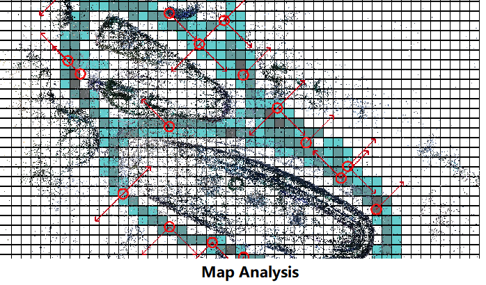

SLAM and Server Localization
===================================

1. Netty
----------------------------

* C++负责调用Java，开启Netty（可以自定义IP），并且负责触发信息发送。
* 使用ArCore的Unity接口（实际还是调用的Arcore的Android SDK，如果可以直接从Android调用会更好），获取当前帧的图像数据。
* 将图像数据（byte[]）传递给C++端，并且在C++实现数据的格式转换，得到Java的Array数据。
* C++调用Java的Netty服务将图片传递给服务器。
* Java的Netty服务收到信息之后直接调用Unity的回调函数。

1.1 Unity
~~~~~~~~~~~~~~~~~~~~~~

C# import C++ native plugins ::

  [DllImport("TextureDecoder")]
  private static extern void AR_SetNettyParameters(int a, int b, int c, int d, int port, double focus, int mapid, int devicetype);

  [DllImport("TextureDecoder")]
  private static extern void AR_InitNetty();

  [DllImport("TextureDecoder")]
  private static extern void AR_SendImageNetty(byte[] data, int size);

Netty initialization in C# ::

  SetTextureFromUnity(Frame.CameraImage.Texture.GetNativeTexturePtr());
  txt.text = "Init Netty " + ip[0] + "." + ip[1] + "." + ip[2] + "." + ip[3] + ":" + ip[4];
  AR_InitNetty();
  AR_SetNettyParameters(ip[0], ip[1], ip[2], ip[3], ip[4], focus, map_id, device_type);
  txt.text = "Init Done";
  nettyinited = true;

1.2 ArCore
~~~~~~~~~~~~~~~~

ArCore的Unity项目中提供了从它的SDK中获取图像帧的接口，其中包含了很多图像的数据，都在**Frame**类中。

ArCore还提供了许多的功能，但是这里只着重于图像数据的获取。

Here we use the **Frame** class in ArCore for obtain the image ::

  using (GoogleARCore.CameraImageBytes image = Frame.CameraImage.AcquireCameraImageBytes())
  {
      if (!image.IsAvailable)
      {
          txt.text = "Image Not available.";
          return;
      }
      // Move raw data into managed buffer.
      int bufferSize = image.YRowStride * image.Height;
      byte[] s_ImageBuffer = new byte[bufferSize];

      // Move raw data into managed buffer.
      System.Runtime.InteropServices.Marshal.Copy(image.Y, s_ImageBuffer, 0, bufferSize);
      initCameraPose.RecordCureentPoseWhenSentImage();

      AR_SendImageNetty(s_ImageBuffer, bufferSize);
      txt.text = "Sent image " + bufferSize;
      is_waiting = true;
  }

2. Image Send Judger
----------------------

Module build for Unity C# for judge whether to send image to server for a localization request.

2.1. Use a reduced Map
~~~~~~~~~~~~~~~~~~~~~~~~~~~~~

* Reduce the map to keyframes' poses only.
* Using the keyframes poses, we will generate a distribution of the directions in a grid map (which is shown below).
* Each new request image has a corresponding pose estimtaion (based on SLAM tracking), we will use this pose estmation to check if this view direction is roughly covered in the local map. If covered, we will allow to send this image, as it is potential possible to get a success result.

I developped the module in C++, and make the native plugin package for C# ::

  [DllImport("SaveDataManager")]
  private static extern bool MapSenderManager_Init(string map_path, int check_range);

  [DllImport("SaveDataManager")]
  private static extern bool MapSenderManager_CheckFrame(float px, float py, float pz,
      float qw, float qx, float qy, float qz);

  [DllImport("SaveDataManager")] // which will also call the debug rendering draw
  private static extern bool MapSenderManager_CheckFrameAndDraw(float px, float py, float pz,
      float qw, float qx, float qy, float qz);

And corresponding calling function is ::

  Quaternion q_camera = ArCoreCameraParent.transform.localRotation * ArCoreCamera.transform.localRotation;
  Vector3 p_camera = ArCoreCameraParent.transform.localRotation * ArCoreCamera.transform.localPosition
      + ArCoreCameraParent.transform.localPosition;
  // send the transformed pose to native
  if(MapSenderManager_CheckFrame(p_camera.x, -p_camera.y, p_camera.z, q_camera.w, -q_camera.x, q_camera.y, -q_camera.z))
  {
      pServerMessageHandlerArcore.SendImageCallFromScript();
      debug_txt.text = "Will Send Image";
  } else {
      debug_txt.text = "Won't Send Image";
  }

In my `video experiment <https://www.bilibili.com/video/BV1NZ4y1j7Ba?p=7>`_ , it shows great result (in the demo we could see the
outputs : *Will Send Image* or *Won't Send Image* ).
However, we need an addition map file for the local device, which will require additional server function to development.
Which will cost our server java department a great amount of time, and further impede my development.
So I develop the following method, which will use total C#, and will not require additional server function.

2.2. Use #keypoints
~~~~~~~~~~~~~~~~~~~~~~

* Use the input feature point cloud.
* Check the number of 2d feature points in the camera view grid (we use a 32*24 2d grid).
* If get enough grids filled with point(s). we will then allow to send image.

As it will loop through all feature points, it will be slightly slower than the upper method. While this module won't need any further
development, which will be extremely easy for other departement to use.

Firstly, initialize the module by giving the point cloud ply file ::

  tSenderJudgerFeatures = new SenderJudgerFeatures("cloud_sparse.ply", initCameraPose.colmapScale);

Then, in the main loop, give the camera pose in the map reference frame, along with the camera parameters ::

  Quaternion q_camera = cameraParent.transform.localRotation * initCameraPose.slamCamera.transform.localRotation;
  Vector3 p_camera = cameraParent.transform.localRotation * initCameraPose.slamCamera.transform.localPosition
            + cameraParent.transform.localPosition;
  int count = tSenderJudgerFeatures.CheckToSendImage(q_camera, p_camera, (float)focus, 640, 480);
  txt_sender.text = count + " points in current view.";

Finally, judge by the occupied grid count.
