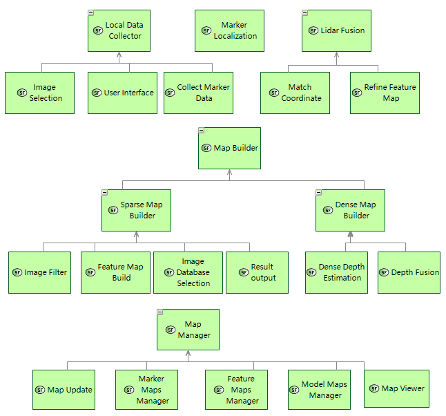
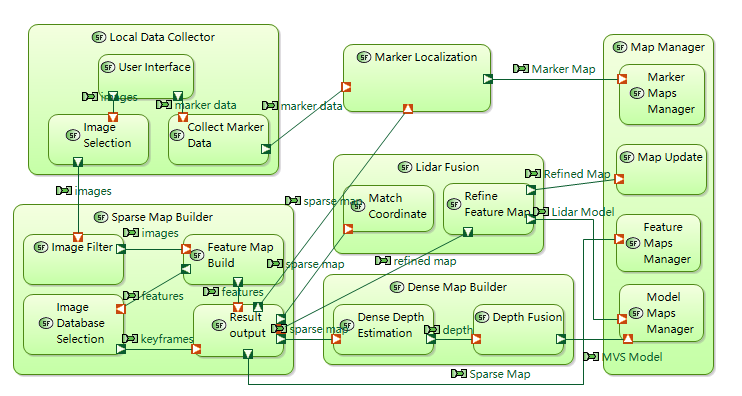
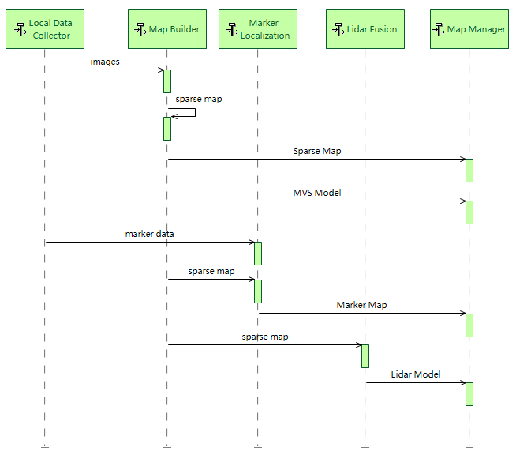

M2. System Analysis
==============================

1.1 Sytem Function Breakdown
----------------------------------

1.2 System Data Flow Blank
-------------------------------

1.3 Scenario
------------------------------

* First Collect the map data.
* Build the Visual sparse map (SFM map) and MVS map.
* Build marker map, if marker infomation offered.
* Mattre in corresponing the lidar map, if lidar scan offered.
