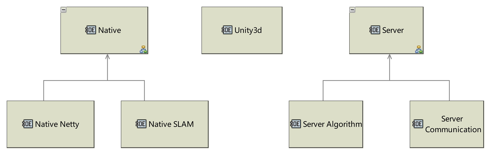
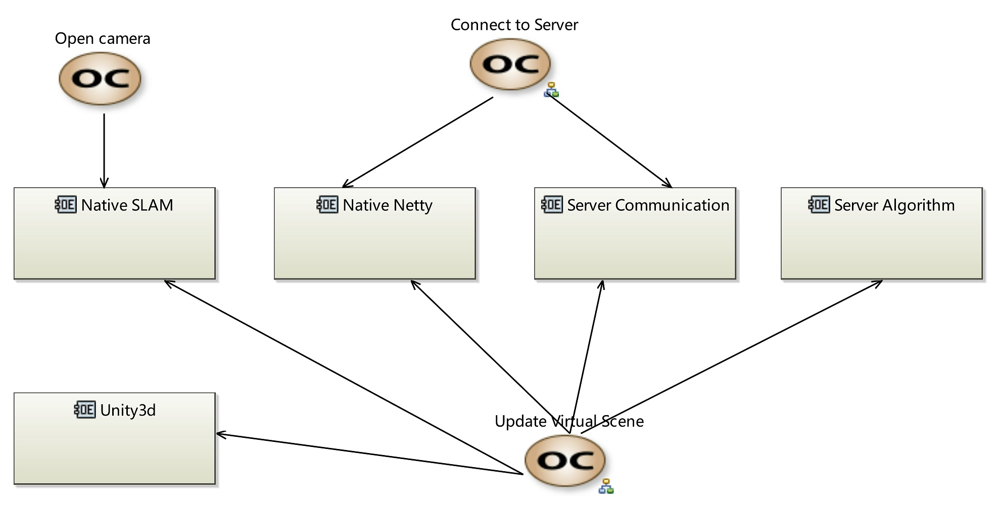
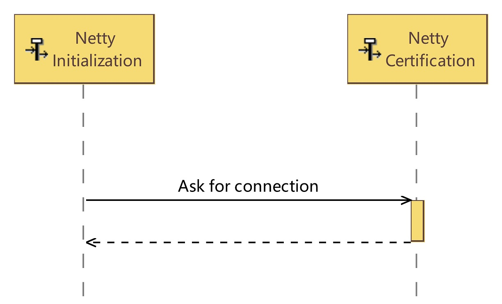
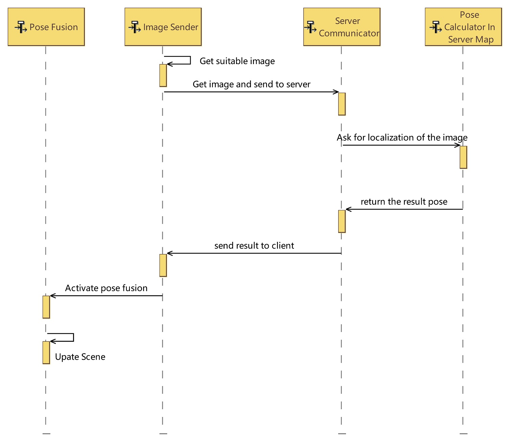

L1. Operational Analysis
==========================

1.1 Operational Entity Breakdown
----------------------------

We have the upper three main entities here : **Native**, **Unity3D**, and **Server**.

1.2 Operational Capabilities
--------------------------------

We have three main tasks here:

* **Open the camera**, which will be handled by the local SLAM system (for an example ArCore, ArKit, or our SLAM system).
* **Connect to server**, will use the Netty communication, while will be the main task of our server department.
* **Update Virtual Scene**, is our main task here. it consists of several steps, which will be clearified later.

1.3 Operational Activity Breakdown
------------------------------

.. image:: images/OABDRootOperationalActivity.jpg
   :align: center
   :width: 70%

We have these activities, and they will be all involving in the **Operational Capabilities** we defined above.
Details will be shown in the **Activity Scenario**.

1.4 Activity Scenario
--------------------------

**Initialize Netty**

**Localization Main Process**

