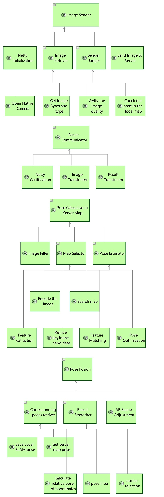
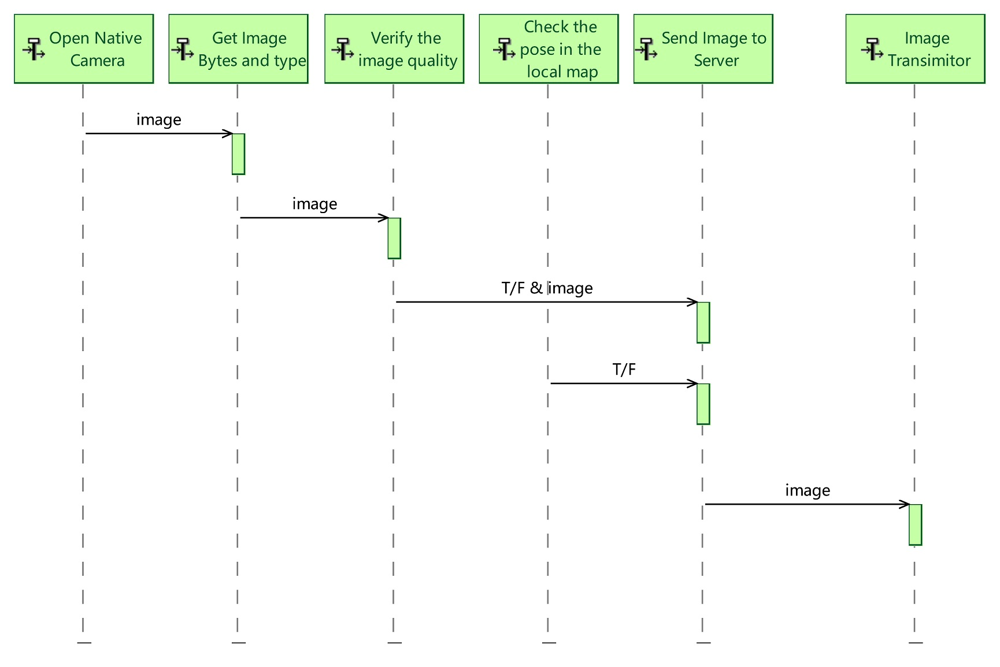
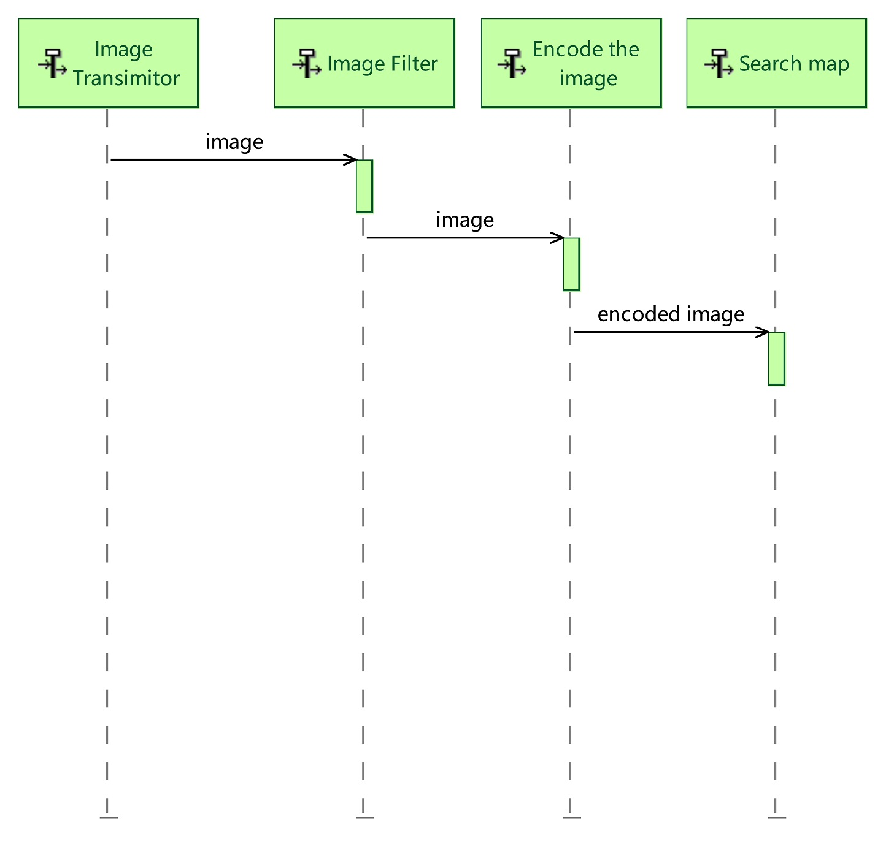
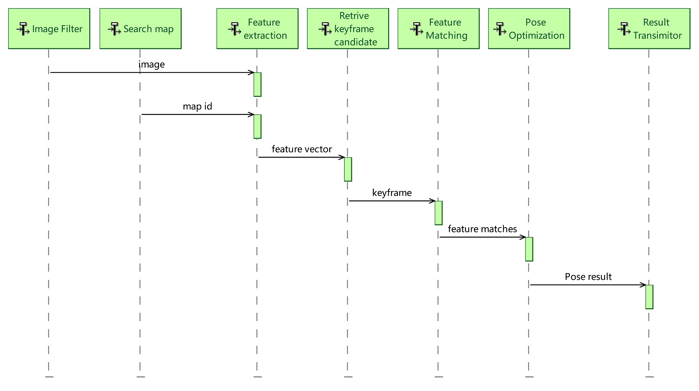
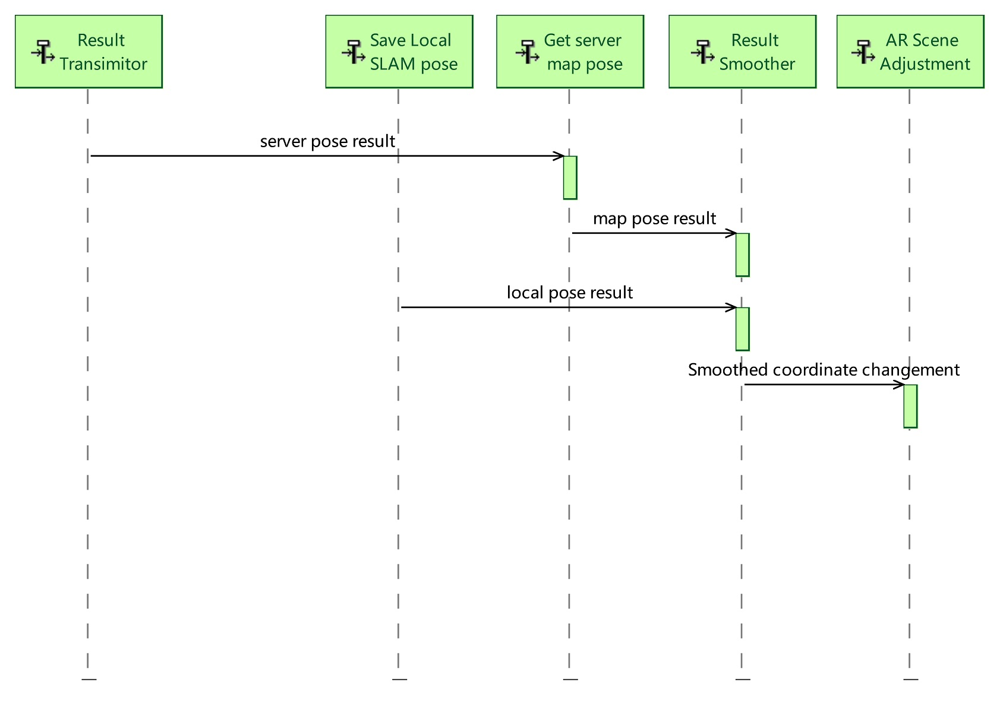

L2. System Analysis
================================

1.1 Sytem Function Breakdown
----------------------------------

1.2 System Data Flow Blank
-------------------------------

.. image:: images/SDFBRootSystemFunction.jpg
   :align: center

1.3 Scenario
------------------------------

**Send image**:

* Retrive image from the native camera(Using interface function offered by ArCore/ArKit/SLAM system).
* Get the correct format of image data and length, etc (for decode image bytes in the server).
* Verify the image quality (for an example, filter the blurred image).
* Also check the pose of the current AR camera, to filter images (for an example, facing the ground).
* If the image passed these upper two filtering stages, we will send the image to server.
* Image Transmittor belongs to the server, will transform the image to the next component for algorithm calculation.

**Search the corresponding server map**:

As we have multiple offline maps in the server, we need to first determine which map is this image belong to.
To realize this function,  we have two choice: one by GPS, and another by the following steps.

* Filter low quality image.
* Encode the image using deep learning method into a **global descriptor**(which could represent the whole image).
* Search in our map database by the global descriptor.

**Calculate pose in the map**:

* Get the corresponding image and the map (identify by its ID), to our algorithm built in server.
* Feature extraction , and image global descriptor calculation.
* Use global descriptor to retrive the best match keyframe, also filter badly matched keyframes with geometry validation.
* Use the keyframe as initialization, to find a suitable local map for further feautre matching step.
* Using the mathed features from the upper stage to estimate a pose, followed by outlier rejection (or robust estimation), and finally using optimization based method to get our final output.

**Fusion of the two coordinate system**:

* Get the image's pose in the local SLAM system (get by SLAM interface), and the pose in the server map coordinate system (get from server response).
* Calculate the relative transformation matrix of the two coordinate system (the local SLAM system , and the server map system).
* Using smooth method (we will use a Kalman filter) to find a better result.
* Adjust the virtual scene in the application, at the right moment, with the right method.

