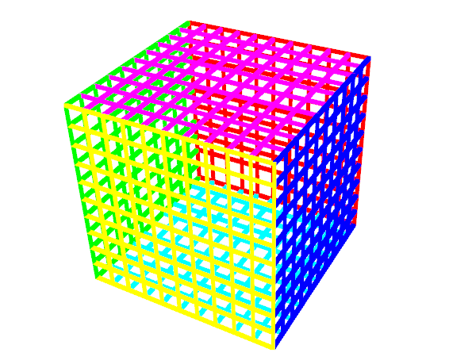
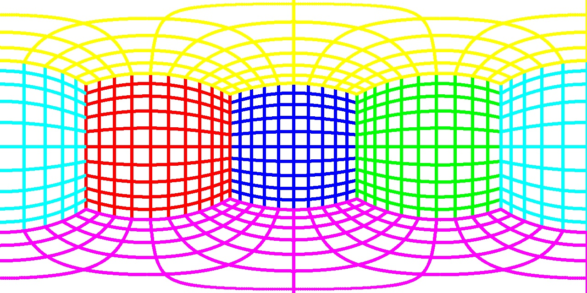
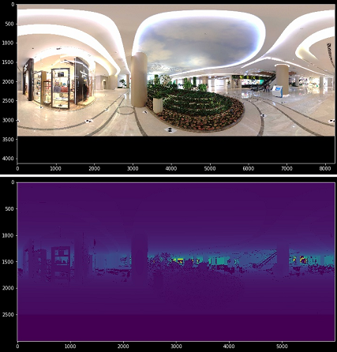
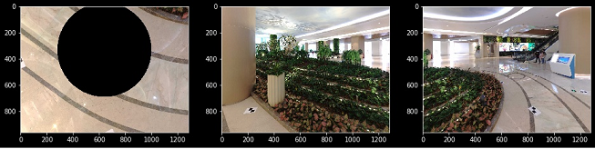
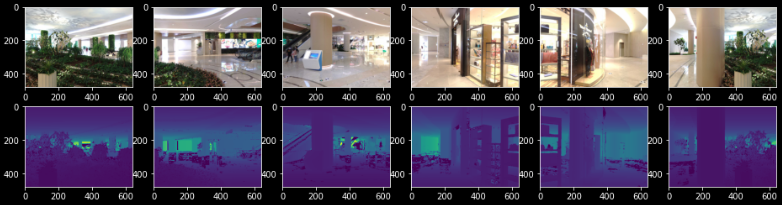
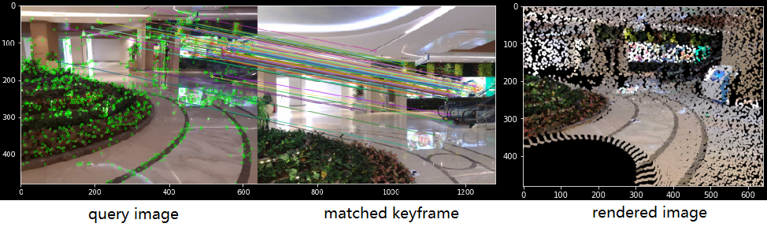
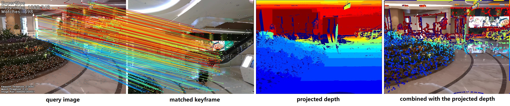

Panorama Match
=======================

Match the SFM/MVS generated point cloud with 3D panorama scan point cloud.

1. Panorama Image
------------------

Use the panorama image to estimate.

* Localize the panorama images in our prebuilt map.
* ICP to estimate relative transformation.

1.1 Panorama camera model
~~~~~~~~~~~~~~~~~~~~~~~~~~~~~~~

Generate a cube point cloud for simulation

Generate the panorama image using the `scripts <https://github.com/gggliuye/VIO/blob/master/pretreatment/Panorama_Distort.ipynb>`_

There exist variations on the sphere model center. While we can always obtain a fine result.
Using some simple method we can transform the panorama image into a pinhole camera image (for an example `python <https://github.com/adynathos/panorama_to_pinhole>`_ ).

2. Faro Scan
--------------------

We also tried to use the raw image from faro, unfortunately it is of bad quality.

* It is captured by a spinning device -> lack of uniform exterior calibration.
* About 40% of the image is consist of the outer shell of the Lidar Device.
* It is registered by the lidar scan data -> hard for us to calibration.

We turn to the unified panorama image output of Faro. We found the lower part is hidden.
So we complete the missing part, and apply the camera model to the lidar scan, result in an
accurate RGB image with aligned depth image.

Using the `code <https://github.com/gggliuye/VIO/blob/master/panorama_images/panorama_extraction_perfect_sphere.ipynb>`_
We can get the aligned depth image :

And some sample of pinhole camera images:

3. Localization using SIFT
------------------------------

This is for test the possiblity of using a simple SIFT for a large scene localization.
For a validation of this thought, we only apply one panorama image and some reasonable query images for test.
The objective here is to test this method, and to offer a base.

* Firstly, create several keyframe images (in pinhole camera model) and its corresponding aligned depth, using the 3D Lidar Scan data.

* Then, realize a simple SIFT (using RootSIFT) feature matching system with PnP pose estimation process.
The results are shown below:

* The left image is the query image, the middle image is the matched keyframe, the right image is the rendered image using the panorama scan and the estimated pose.

From the upper test, we found the following problems:

* SIFT could only match a limited number of features (some well structed points), while it cannot handle some hard cases (for the plants).
* With the limited matches, the pose estimation is far from ideal.
* We need a better feature extraciton and matching strategy, for an example using SuperPoint + SuperGlue.

3. Localization using DL
------------------------------
Here we test the pipeline of Deep learning.

* **Make the dataset** : we make a dataset of the indoor complicated scene, with 133 lidar scans. Which includes indoor plants scene, indoor market, and some outdoor views.
* **Pretreatment** : for matching with query image, we project the panorama images to several pinhole model images, as is shown in the chapters before.
* **NetVLAD Index** : here we extract the global descriptor for the database images using a VGG-encoded NetVLAD network. And using SQLite3 for save the results.
* **Feature extraction** : we use SuperPoint (pretrained model) as our feature extraction.
* **Feature matcher** : we use SuperGlue (indoor pretrained model) as our feature matcher.
* **Pose Estimation** : we use a RANSAC iterative based PnP method for pose estimation.
* **Pose Refinement** : TODO : we will use P3P-RANSAC for the fast pose estimation, and using optimization tools for pose refinement.

We got ideal results. The follwoing image shows the result for the same query image, as the former chapter.

Where the first image is the query image, the second image is the matched reference keyframe proposed by NetVLAD. SuperGlue matches are shown
in the images. Using these matches we got our pose estimation T. Using T we project the whole panorama image into the virtual camera plane,
with the depth image shown in the third column. To compare the error, we extract the edges in the depth image, then praint them into our query image,
which results in the fourth column.

Summary :

* We get much more robust feature extraction and matching.
* **TODO** need to refine the pose refinement process.
* **TODO** the performance of the pretrained NetVLAD is not ideal, better to train in our dataset.
