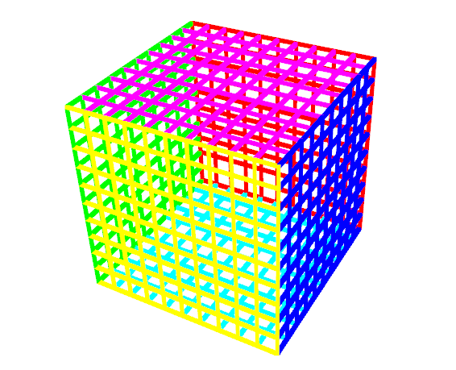
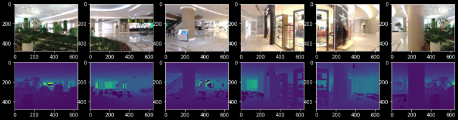
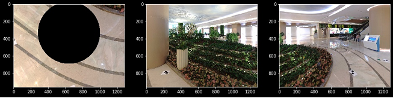
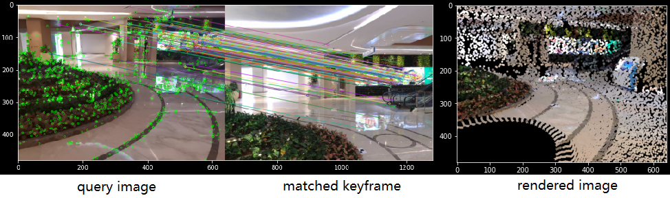
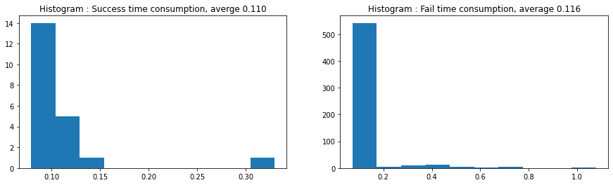

Super Panorama (中文)
=======================

使用深度学习的，建立在激光扫描数据集基础上的 **单张图片定位系统** 。

* 全景相机的标定。
* 激光扫描，数据集的建立。
* 传统计算机视觉方法测试（视觉词袋+SIFT特征点+FLANN特征点匹配+PnP位姿估计+最小二乘优化方法的位姿优化）。
* 深度学习方法测试（NetVLAD深度学习图像检索+SuperPoint深度学习特征点提取+SuperGlue深度学习特征点匹配+PnP位姿估计+凸优化的位姿优化）。

1. 全景相机模型
------------------

为了更好的使用我们的数据集，首先我们分析研究全景相机的图像模型。

1.1 全景相机模型
~~~~~~~~~~~~~~~~~~~~~~~~~~~~~~~

我们虚拟生成了一个三维的立方体，以研究全景相机模型。

生成的虚拟全景图片将使用如下代码： `scripts <https://github.com/gggliuye/VIO/blob/master/pretreatment/Panorama_Distort.ipynb>`_

.. image:: images/panorama_1.jpg
  :align: center
  :width: 60%

在全景相机模型中，存在可以调节的参数（主要是全景相机的光心位置，由于Faro没有提供他们的全景相机模型的参数，我们需要额外标定他们的相机数据）。
为了和用户定位的图像相匹配，我决定 **将全景图转化为针孔相机模型** ，以实现图片模型的统一。

1.2. Faro Scan
~~~~~~~~~~~~~~~~~~~~~~~~~~~~~~~

首先，我们尝试使用法如的原始RGB图像（全景拼接前），但是这些图像缺少很多信息：缺少标定参数，缺少有效图像区域的范围参数。而且缺少和激光扫描的外参标定。

**全景标定** ：

* 法如的相机模型存在问题，输出的全景图的高度并不对应于180度， 而是存在一个角度缺失。
* 另外没有统一的宽度输出（标准的输出宽度将对应水平视野360度，而法如的输出有时多，有时少），进一步增加了误差。
* 另外法如相机和激光的外参没有标定的数据输出，需要我们进行标定。

最终我们解决了以上问题，实现了标定，并且通过激光数据生成了对应的深度图像。实现的代码见： `code <https://github.com/gggliuye/VIO/blob/master/panorama_images/panorama_extraction_perfect_sphere.ipynb>`_ 。
通过标定好的相机模型，我们生成了如下几个针孔相机图像的例子：

**其他问题** ：标定结束后，Faro的数据仍然存在一下几个问题：

* 由于Faro全景图的水平视野不能保证都是360度，有个别出现的全景图出现了拼接间隔的问题。（见下图左，在图像中存在明显的数值的黑色空白区域。）
* 由于在测量的时候，我们无法进行清场（由于运营的原因），深度数据中存在很多的噪声（见下右图中的“鬼影”）。

.. image:: images/problematic_images.png
   :align: center
   :width: 80%

**模型重建** ：为了完善这个数据集，我简单进行了TSDF的地图重建，并且进行了简单的模型简化（~一百万面）。模型可以在如下地址下载 `Baidu Drive with code arot <https://pan.baidu.com/s/1OSKP5dQl62NMPHtp_x7rTQ>`_ ,
或者 `Google Drive <https://drive.google.com/file/d/11LVCc8Yi5HtLM5OBz-wjPoneXxJ7ZAlO/view?usp=sharing>`_ .

2. 传统方法的定位实现
------------------------------

使用传统方法的实现，主要是为了测试方法的可行性，建立算法的框架，并且为深度学习方法的结果提供简单的对比（另外，我们也可以使用Colamp图像重建的结果进行对比）。

我们使用RootSIFT进行特征点的匹配，使用PnP-RANSAC进行位姿的估计。并且，我们把激光扫描的三维使用，使用位姿估计的结果，投影为虚拟的针孔图像，以便于输入图像进行对比。

传统方法存在一下问题：

* 特征点的匹配质量收到环境限制，完全无法处理植物。
* 由于没有足够的匹配点，位姿估计的结果也很糟糕。

3. 深度学习方法的实现
------------------------------

* **数据集的建立** ： 133站全景扫描，扫描数据包含室内室外，存在大量移动的噪音。每张全景数据分为若干（我们使用了9张）RGBD针孔模型的数据。测试图像拍摄至少有一个月的时间差。
* **图像预处理** ： 通过如上章节的相机模型对图像进行处理，提取SuperPoint特征点，并且使用SuperPoint的描述子生成图像的Global全局描述子（用作图像检索）。
* **图像检索** ：我分别测试了NetVLAD和Bow方法。
* **特征点** ： 我使用magicleap公开的SuperPoint特征点和SuperGlue特征点匹配方法（基于深度学习Pytorch）。
* **位姿估计** ：使用P3P-RANSAC作为外点提取和位姿粗估计。
* **位姿优化** ：我分别比较了简单的迭代的最小二乘优化(opencv方法)，和使用了鲁棒和函数的最小二乘优化（使用C++ Ceres的凸优化方法）。

3.1 实验结果
~~~~~~~~~~~~~~~~~~~~~~~~~~~~~

非算法工作人员在两层楼随机拍取1800张各式图片的成功率在75%以上。
更多的测试结果图像 `Baidu rqmy <https://pan.baidu.com/s/1icp7K-1BXvT_ykWb9-d1Rg>`_ 。

**运行时间** :

我使用了i7的CPU和RTX2080的GPU进行测试。对于数据库中得到的检索图像，每一张候选关键帧的处理时间平均为0.1s。
实际测试中，我们将选取三张候选关键帧，所以实际的测试中，每一张输入图像的处理时间大约0.3s。

**成功案例** : 第一列为输入的定位图像。第二列为寻找到的匹配关键帧。第三列中我们将激光的深度数据通过位姿估计的结果，
投影为模拟的深度图。最后一列中，我提取深度图中的边缘，并渲染到输入图像中（以比较模拟的深度边界和真实图像中的边界，以可视化误差）。

.. image:: images/sg_succeed.png
  :align: center

**Unity Demo** : 我将整个系统和手机本地的SLAM系统（我们使用了ArCore）集成，以实现大场景的AR应用。

.. raw:: html

    

        <iframe src="//player.bilibili.com/player.html?aid=626953712&bvid=BV1et4y1S778&cid=229955696&page=2" scrolling="no" border="0" frameborder="no" framespacing="0" allowfullscreen="true" style="position: absolute; top: 0; left: 0; width: 100%; height: 100%;"> </iframe>
    

3.5 优势
~~~~~~~~~~~~~~~~~~~~~~~

* 对于环境光照的变化更加鲁棒了（可以应对白天黑夜情况）。
* 对于视角的变化更加鲁棒了（需要更少的数据集关键帧）。
* 很好的处理了植物和其他的（传统方法无法处理的）视觉特征，大大提高了匹配质量和定位的成功率。
* 由于匹配的质量提高了（数量和精度），位姿估计的结果精度更高。
* 同时可以直接提供对应的模型数据。

3.6 问题
~~~~~~~~~~~~~~~~~~~~~~

* 遇到几乎完全相同的场景，无法区分（比如下图中，一楼和二楼几乎完全相同的角落，导致匹配误差）

* 测试图像拍取时，场景出现了非常非常大的变动（关键帧匹配和大致的位姿是正确的，但是误差极大）。

* 区分度太过小的场景（人类专家都无法分辨的场景），如下图中的植物柱子, 和花坛植物太过迷惑的例子。

.. image:: images/sg_failed.png
  :align: center

4. TODOs
------------------------

* **数据集问题** ： 数据集中的噪音和干扰进行处理（见上面章节1）。
* **NetVLAD** ：需要重新针对我们的场景训练神经网络，以加速系统的匹配（争取做到图像检索的百分比正确率，以大大提高处理效率）。
* **参数选取** ： 在SuperPoint和SuperGlue中需要更加精致的参数选取。
