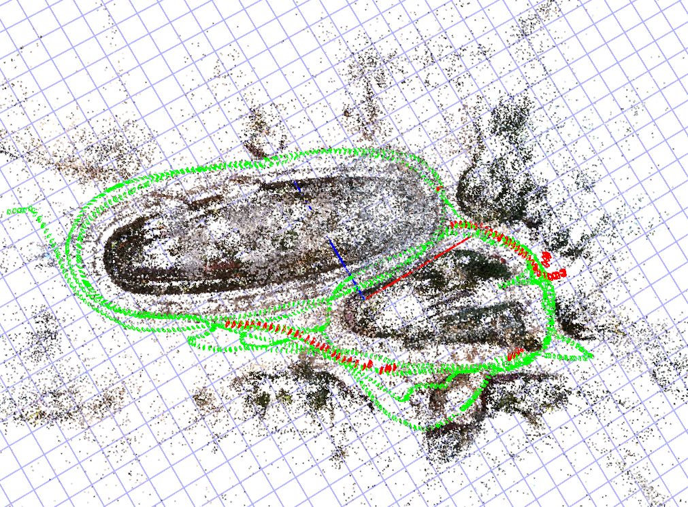
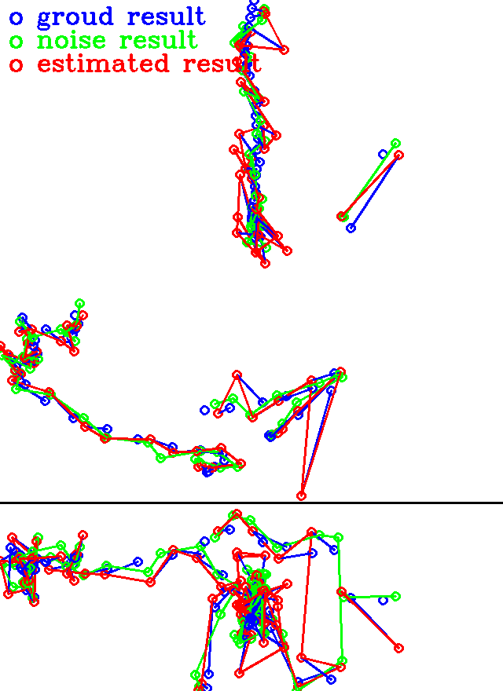

Local Map
===================

Process the localization process at local devices.

* Make offline map, extract needed data.
* Make test data for development usage. (query images, and reference pose estimations)
* Use pose odometry result as initial pose to refine the pose with the map data.

1. Prepare the test data
------------------------

Using the new version of my map (made by LiuYe), which is made using the image captured from our new scan application.
Using tools_map for process.
The map info ::

 [MAP INFO] sparse feature map
            camera number : 1
            point number : 174385
            image number : 1258

**Saved localization binary map.** ::

  ./Save_map /home/viki/Lucas/garden/garden_v2/database.db /home/viki/Lucas/garden/garden_v2/sparse/ /home/viki/Lucas/garden/garden_v2/SavedMap.dat /home/viki/Lucas/garden/garden_v2/keyframes.txt

Result in a 236Mb map file, with 1258 keyframes inside.

**Image frames with pose localized using the BoW method** (process using GPU acceleration) ::

  ./Test_video_images /home/viki/Lucas/garden/garden_v2/database.db /home/viki/Lucas/garden/garden_v2/sparse/ /home/viki/Lucas/garden/garden_v2/VocIndex.bin /home/viki/UTOPA/Server_Localization/Maps/winter_garden_test/ 596.1

Here is the result pose show picture, with green frames being the reference keyframes, red frames being the localization result. 

The performance show ::

  ==> Success rate 0.546154 [ 71 / 130 ]
  ==> Average time,  success: 0.318083, fail : 0.388475

2. Run the localization process
----------------------

Process pipeline:

* Find candidate frames using the pose differences.
* Project the map points to courrent frame (using the initial pose guess).
* Use PnP RANSAC to get final pose estimation.
* All the processes are done using CPU.

Parameters able to be changed:

* Number of features.
* Feature match search reigon radius.
* Feature descriptor match thresholds, orientation threshold, and scale thresholds.
* PNP RANSAC parameters.

.. image:: images/test.png
   :align: center
   :width: 50%

Run in this project ::

  ./Test_video_images /home/viki/Lucas/garden/garden_v2/SavedMap.dat /home/viki/UTOPA/Server_Localization/Maps/winter_garden_test/ /home/viki/Lucas/garden/garden_v2/sparse/video_result.txt 596.1
  
  ==> Success rate 0.898734 [ 71 / 79 ]
  ==> Success average runtime : 0.521522
  ==> Average noise translation distance is 0.181593, Average estimated translation distance is 0.204277

The result trajectory shown here (upper: top view, lower: side view):

The algorithm could find some correct feature matches. While it was affected greatly by the noise. And the
plants' features are similar to each other, using the local matching process will surly produce error.
