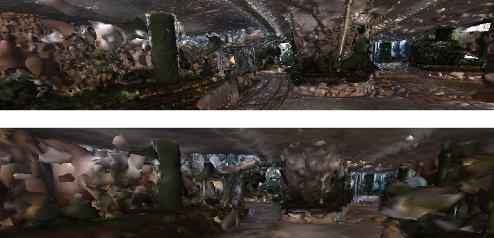

Dense Reconstruction
===============================

1. Using Lidar Scan
----------------------

As shown in the Chapter of "Super Panorama", we get a model for total three floors of the "winter garden" scene
with about 1,000,000 faces. with reasonable quality.

2. Colmap MVS
------------------------

* Using the colmap MVS results (using Patch Match algorithm).
* Modeling with poisson reconstruction.
* Simplify the model using Meshlab Quadric Edge Collapse Decimation.

We have a quiet satisfying result in our garden scene (one layer garden part, built with about 1200 images).
It has about 11,000,000 faces before simplification.

Problems :

* Still too much faces need to be about O(100,000) faces.
* The depth estimation is not complete, result in holes. **Try TV reconstruction**
* The reflection of the ground, and some textureless areas, will lead to poor reconstruction. **Using Deep Learning image segmentation**

3. L1 Total Variance
--------------------------

To try to **fill the depth estimation** .
We try to apply the L1 Total variance reconstruction (see more detail in `my convex optimization document <https://cvx-learning.readthedocs.io/en/latest/>`_ )
to refine the depth result of Colmap patch match MVS. (see the example show in `jupyter notebook <https://github.com/gggliuye/SuperPanoama/blob/master/PanoMapping/Mapping_test.ipynb>`_ )

.. image:: resonstructions/tv_test.jpg
  :align: center

Problems:

* Too slow. **Use ADMM or other faster algorithms**
* Still errors, **Using Deep Learning image segmentation labels**

4. Image Segmentation
------------------------

We using the `Pytorch Encoding Library <https://hangzhang.org/PyTorch-Encoding/model_zoo/segmentation.html>`_ .
And it offers image segmentation models for two datasets (ADE20K Dataset: for indoor scene, and Pascal Context Dataset for outdoor scene).
We use the best result in its dashtable: resnet+deeplab models. And we found the ADE20K Dataset pretrained models are very suitable for our task.
