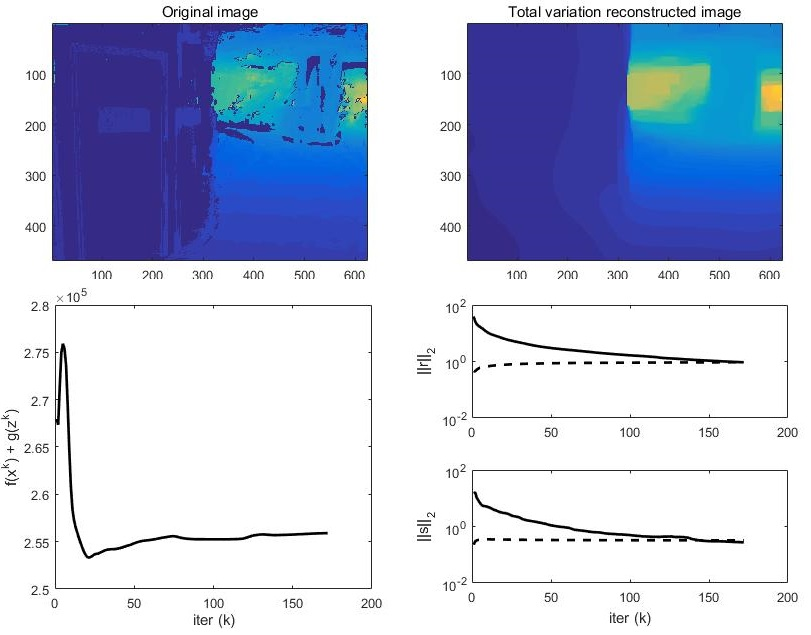

Dense Reconstruction
===============================

As shown in the Chapter of "Super Panorama", we get a model for total three floors of the "winter garden" scene
with about 1,000,000 faces. with reasonable quality.

We want our image reconstruction to produce a model with similar quality.
We offers two test datasets : `Small indoor scene <https://pan.baidu.com/s/1B3Ar_lXJjYyUNtLQro1NSg>` with code "cuxz".
and `Indoor Garden scene <https://pan.baidu.com/s/1aLhItQQ4DRrwEe-cITI9cQ>` with code 4em9.

1. Deep Learning
----------------------

* Deep learning MVS method.
* `Depth Completion <https://paperswithcode.com/task/depth-completion>`_

The Deep Learning methods are just not stable enough. And training in every datasets is too expensive.

1.1 DeepMVS
~~~~~~~~~~~~~~~~~~~~

We tried DeepMVS in our scene.

Problems:

* It only capture the relative relationship, not the real distance. (see more in `my report <https://gitee.com/gggliuye/VIO/tree/master/DeepMVS>`_ )
* It can only have good result in some scene, while cannot be applied to general cases. It greatly limit its application, as it costs a lot to train in a new scene (main the cost to make the dataset).

1.2 NetMVS
~~~~~~~~~~~~~~~~~~~~~~~~~

Problem:

* The offical NetMVS shows great results, while we found its test data is far too simple. We test it in our own scene, it produces a terrible result. (see `my report jupyter notebook <https://gitee.com/gggliuye/VIO/blob/master/MVSNet/MVSNet_Test.ipynb>`_ )
* The algorithm (we use a `pytorch implementation version <https://github.com/xy-guo/MVSNet_pytorch>`_ ) costs too much GPU memory. Its officical results are built with D=256 (see the explanation of the parameter from the project), while in our 8G GTX1080 GPU, we could only add 10 source images, with D set to 80. Which may explain the poor result.

1.3 CSPN
~~~~~~~~~~~~~~~~~~~~~~~~

We test the pretrained model of `CSPN <https://openaccess.thecvf.com/content_ECCV_2018/papers/Xinjing_Cheng_Depth_Estimation_via_ECCV_2018_paper.pdf>`_ , `github project <https://github.com/XinJCheng/CSPN/tree/master/cspn_pytorch>`_ .
Our results could be seen `here <https://gitee.com/gggliuye/VIO/blob/master/Depth%20Completion/Depth_completion_cspn.ipynb>`_ .
The result is just not satisfying.

.. image:: resonstructions/test_cspn.png
  :align: center

1.4 Sparse-to-Dense
~~~~~~~~~~~~~~~~~~~~~~~~
We test the pretrained model of `sparse-to-dense <https://arxiv.org/pdf/1709.07492.pdf>`_ , `github project <https://github.com/fangchangma/sparse-to-dense.pytorch>`_ .
Our results could be seen `here <https://gitee.com/gggliuye/VIO/blob/master/Depth%20Completion/Depth_completion_sparse_to_dense.ipynb>`_ .
The result is just not satisfying.

2. Colmap MVS
------------------------

* Using the colmap MVS results (using Patch Match algorithm).
* Modeling with poisson reconstruction.
* Simplify the model using Meshlab Quadric Edge Collapse Decimation.

We have a quiet satisfying result in our garden scene (one layer garden part, built with about 1200 images).
It has about 11,000,000 faces before simplification, and 200,000 after simplification.

.. image:: resonstructions/colmap_poisson.png
  :align: center
  :width: 80%

Problems :

* Still too much faces need to be about O(100,000) faces.
* The depth estimation is not complete, result in holes. **Try TV reconstruction**
* The reflection of the ground, and some textureless areas, will lead to poor reconstruction. **Using Deep Learning image segmentation**

3. L1 Total Variance
--------------------------

To try to **fill the depth estimation** .
We try to apply the L1 Total variance reconstruction (see more detail in `my convex optimization document <https://cvx-learning.readthedocs.io/en/latest/>`_ )
to refine the depth result of Colmap patch match MVS. (see the example show in `jupyter notebook <https://github.com/gggliuye/SuperPanoama/blob/master/PanoMapping/Mapping_test.ipynb>`_ )

Problems:

* Too slow. **Use ADMM or other faster algorithms**
* Still errors, **Using Deep Learning image segmentation labels**

4. Image Segmentation
------------------------

We using the `Pytorch Encoding Library <https://hangzhang.org/PyTorch-Encoding/model_zoo/segmentation.html>`_ .
And it offers image segmentation models for two datasets (ADE20K Dataset: for indoor scene, and Pascal Context Dataset for outdoor scene).
We use the best result in its dashtable: resnet+deeplab models. And we found the ADE20K Dataset pretrained models are very suitable for our task.
