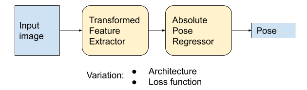

Related Works
==========================

This page shows some works of single image based localization task.

1. InLoc
----------------------

`InLoc: Indoor Visual Localization with Dense Matching and View Synthesis <https://arxiv.org/abs/1803.10368>`_

* Need dense map (lidar devices scanned map) for match query single images.
* Have open source Maplab code.
* Basic prcess : Deep learning feature extraction -> NetVLAD -> DensePE -> DensePV.
* Provides database for offical CVPR evaluation.

**Database** : Indoor scene (Washington University) with panoramic 3D scans at 177 distinct positions. 329 test query images (took by iphone7).
The difficulty of indoor scenes are they are dominated by weakly textured rooms and repeating geometric patterns.

**Map** : built with lidar 3D scans, of high accuracy, with depth map provided.

**Feature** : use multi-scale dense CNN features. This paper uses VGG-16 for global descriptor, and use DenseSIFT [1]_ extractor and its RootSIFT [2]_ [3]_
descriptors from `VLFeat <https://www.vlfeat.org/overview/dsift.html>`_ for local features.

**Image Retrive** : NetVLAD. Will evaluate the top-10 matched images.

**Pose Estimation** : use RANSAC-based dense feature match, dense pose estimation (DensePE), and dense pose validation
(DensePV). These 'Dense' processes are mainly pixel-wise comparison of the query image with the synthesized view (rendered image) using 3D scans.

**Result** rate (%) of correctly localized querier within given distance(m) threshold and within 10 degree angular error:

+--------+--------------+--------------+------------------+--------------+
|        |  Direct2D-3D |  BoW-SparsePE| NetVLAD+SparsePE |        InLoc |
+========+==============+==============+==================+==============+
| 0.25m  |  11.9        |  20.1        |  21.3            |  38.9        |
+--------+--------------+--------------+------------------+--------------+
| 0.5m   |  15.8        |  29.5        |  30.7            |  56.5        |
+--------+--------------+--------------+------------------+--------------+
| 1.0m   |  22.5        |  41.0        |  42.6            |  69.9        |
+--------+--------------+--------------+------------------+--------------+

Another paper is also mentioned to be closly related to its DensePE process `Fixing the Locally Optimized RANSAC <https://www.researchgate.net/publication/259338571_Fixing_the_locally_optimized_RANSAC>`_ , which proposed LO+-RANSAC (has improvements in two aspects).
LO-RANSAC adds a local optimzation (LO) step to RANSAC, which is done after the verification phase. LO-RANSAC is slower but much more accurate than the original RANSAC. While LO+-RANSAC uses a randomly sampled subset to perform local optimization,
to accelarate the algorithm. And LO+-RANSAC uses a truncate quadratic cost function to the LO process.

.. [1] **DenseSIFT** The main advantage of using vl_dsift over vl_sift is speed, and the obvious difference is that with dense SIFT you get a SIFT descriptor at every location, while with normal sift you get a SIFT descriptions at the locations determined by Lowe's algorithm.

.. [2]  **RootSIFT**: L1 normalize the SIFT vector, then take square root of each element. Then, compare RootSIFT descriptors using Euclidean distance is equivalent to using the Hellinger kernel to compare the orignal SIFT vectors (it is benefit to use Hellinger kernel to compare histogram distance) .

.. [3] From the paper `Arandjelovic and Zisserman, 2012 <https://www.robots.ox.ac.uk/~vgg/publications/2012/Arandjelovic12/arandjelovic12.pdf>`_ *Three things everyone should know to improve object retrieval*. This paper contributs three parts: **RootSIFT** (as descripted above). Secondly, **DQE** (Discriminative query expansion) which is a linear SVM discriminative for image retrival. And finally **AUG** (Database-side feature augmentation).

2. Is This the Right Place?
--------------------------

`Is This the Right Place? Geometric-Semantic Pose Verification for Indoor Visual Localization <https://arxiv.org/abs/1908.04598>`_

This paper focus on the **Pose Validation** step. It shows that combining different modalities namely appearance, geometry, and semantics,
considerably boost pose verification and consequently pose accuracy.
Mainly surface normals and semantic segmentation results.

3. Pose Regression
------------------------

Deep learning based end-to-end image localization task (input image, directly output the pose estimation).

3.1 PoseNet
~~~~~~~~~~~~~~~~~

PoseNet, a convolutional network for realtime 6-dof camera relocalization, 2016.
Univerity of Cambridge.

* Train the model to learn the corresponding scene.
* Runtime input : image , output : estimated pose.
* For outdoor scene (50,000 :math:`m^{2}`) error within 2m and 6 degree.

3.2 MapNet
~~~~~~~~~~~~~~~~~~~

Geometry-Aware Learning of Maps for Camera Localization, 2018.

* Use additional sense for help.
* Could apply optimizing during inference.

3.3 Leaning Less is More
~~~~~~~~~~~~~~~~~~~~~~~~~~~

Learning Less is More - 6D Camera Localization via 3D Surface Regression, 2018.

* Given 3D environment.
* Phase one : input RGB image, output scene coodinate prediction.
* Phase two : run phase one multiple times to have pose hypothese, than refine to get a final estimation.

3.4 Limitations
~~~~~~~~~~~~~~~~~~~~~~~~~~

`Understanding the Limitations of CNN-based Absolute Camera Pose Regression <https://arxiv.org/abs/1903.07504v1>`_ , 2019, TUM , ETH, Microsoft.

* This paper develops a theoretical model for camera pose regression, shows that pose regression is more closely related to pose approximation via image retrieval than to accurate pose estimation via 3D structure.
* Both theoretically and through experiments that there is no guarantee that absolute pose regression (APR) methods, unlike structure-based method, generalize beyond their trainning data.
* APR performance is much closer to a handcrafted retrival baseline.

