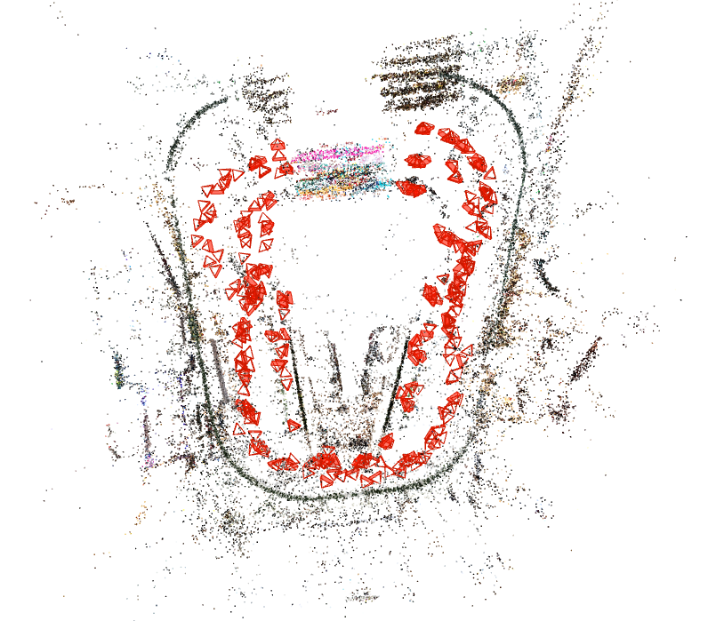
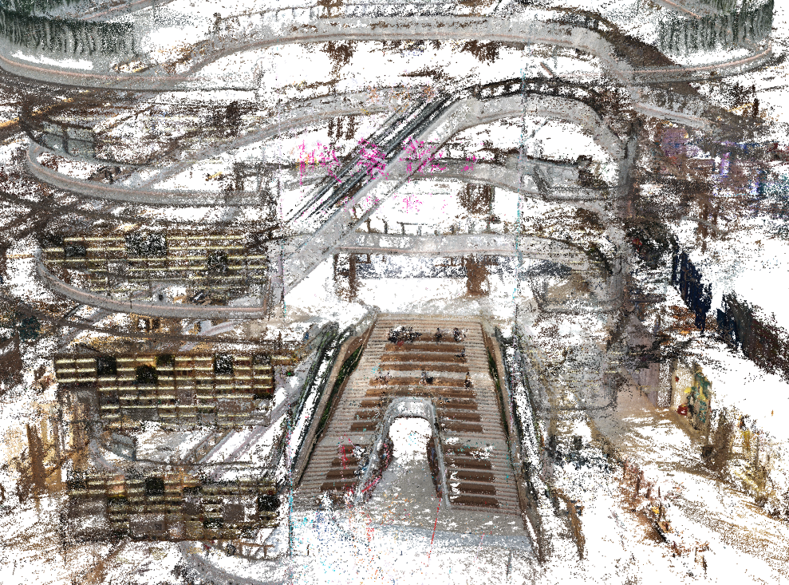
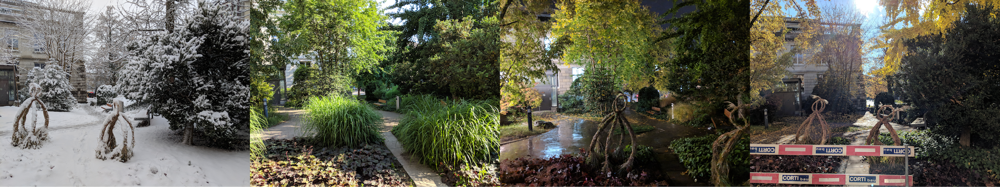
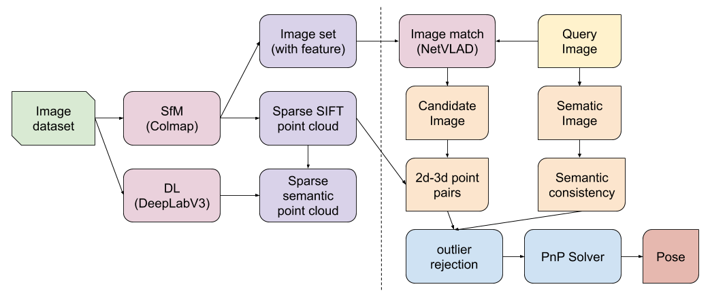
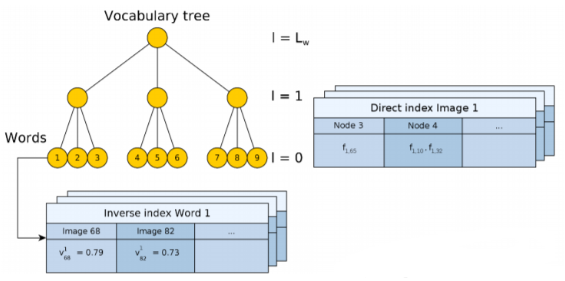
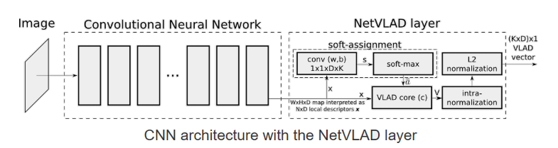
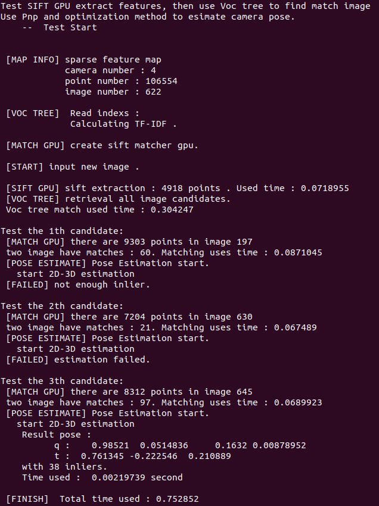

Visual Localization
===================

SFM
-------------

SfM (structure from motion), is an other useful tool for localization and mapping.
Basicly, SfM uses the same technique as SLAM system : feature point extraction, matching algorithms, multiple view geometry, and non linear optimization(bundle adjustment).
At the same time SfM and SLAM have many differences, mostly in their pipeline (SLAM uses a realtime pipeline, however SfM has three main types: **incremental** , **global**  and **hierarchical** ) and some algorithm details.

* Incremental SfM has the most close structure to SLAM. It is fast and robust.
* Global SfM is a process, try to initialize all camera posese, and triangulation, then do global bundle adjustment directly.
It is more accurate, however takes longer to calculate. And its result dependents heavily on the initialization.
* Hierachical SfM is the between of the upper two methods. It initialize multiply submaps optimization each of them, then take then together.

Here is SFM result built with `colmap <https://colmap.github.io/>`_ , with images taken from Winter Plaze, GuangZhou.

Triangulation
~~~~~~~~~~~~~~~~~~~~

Triangulation is mainly two view geometry, to generate depth with stereocopy view. In **Colmap** , only two view triangulation is used. So we describe triangulation details here.

Suppose we have two observations from two camera view :

.. math::
    \mathbf{x} = P \mathbf{X}, \mathbf{x'} = P' \mathbf{X}

The depths of this point in two views are unknown, however we know that x and X should be in the same line. As a result, their cross production should be a zero vector:

.. math::
    \mathbf{x} \times (P\mathbf{X}) = \mathbf{0}

The upper function can be write as :

.. math::
    x(p^{3T}\mathbf{X}) - (p^{1T}\mathbf{X}) = 0

.. math::
    y(p^{3T}\mathbf{X}) - (p^{2T}\mathbf{X}) = 0

.. math::
    x(p^{2T}\mathbf{X}) - y(p^{1T}\mathbf{X}) = 0

We can find that the thrid function is redundant (as it can be derivated from the first two functions).
If we have two points, we can rewrite the problem to be a linear optimization problem:

.. math::
    \mathbf{AX} = 0

.. math::
    \mathbf{A} = \begin{bmatrix}
    xp^{3T} - p^{1T} \\  yp^{3T} - p^{2T} \\ x'p'^{3T} - p'^{1T} \\  y'p'^{3T} - p'^{2T}
    \end{bmatrix}

**Homogeneous method (DLT)**

The problem becomes:

.. math::
    \min \lVert \mathbf{AX} \Vert ^{2} =  \min \mathbf{X^{T}A^{T}AX}

From basic in Calculus, we know that the solution must fulfill:

.. math::
    \triangledown \mathbf{X^{T}A^{T}AX} = \gamma \triangledown \mathbf{X^{T}X}  \Leftrightarrow
    2\mathbf{A^{T}AX} = \gamma 2 \mathbf{X}
    \Leftrightarrow \mathbf{A^{T}AX} = \gamma \mathbf{X}

Because of the special shape of ATA we compute the eigenvectors efficiently using the so called Singular Value
Decomposition (SVD).

.. math::
    A = USV^{T}

where U and V are orthogonal, and S is diagonal matrix. Then,

.. math::
    A^{T}A = (USV^{T})^{T}USV^{T}= VS^{T}U^{T}USV^{T} =  VS^{T}SV^{T}

The diagonal elements of STS are ordered decreasingly σ1^2, σ2^2, σ3^2, ...
Thus, to find an eigenvector corresponding to the smallest eigenvalue we should select the last column of V.

Colmap
~~~~~~~~~~~~~~~~~~~~

In my opinion, Colmap is the best open source SFM tools. It offers userfriendly interface, various algorithm options, uniform output structures, and reliable results. Many applications are built based on it. We will introduce some of the basic idea of Colmap, and its pipeline.

**Database format**:

All the data is saved into a **database.db** file.

* cameras : recording different camera models and all the image associated to it.
* keypoints : float32 values of the (u,v) pixel poisiton + scale factor + orientation (SIFT concentions) + afflinity + affline shape.
* descriptors : uint 8 binary blobs (only offer 128 bits descriptors).
* matches : pair ids + F,E,H blobs

For **Sparse Reconstruction** the data can be saved as "txt" or "bin" files.

* cameras : cameras' intrinsic parameters
* images : two lines for each image, 1) image Id + quaternion + position + camera Id + name, 2) set of feature points X + Y + point3d Id.
* points :  X + Y + Z + R + G + B + error + set of image id and point2d id.

**Pipeline**:

* feature extraction -> SIFT
* feature matching
* sparse reconstruction (incremental SfM)
* dense reconstruction (undistort, stereo, Fusion)
* Possion / Delaunay reconstruction.

**Feature Matching** :

* **Exhaustive Matching**:Every image is matched against every other image, while the block size determines how many images are loaded from disk into memory at the same time. It is extremly slow without GPU support.

* **Sequential Matching**:Used for sequential order input images,  e.g., by a video camera. Consecutively captured images are matched against each other. Will not work for unordered images sets.

* **Vocabulary Tree Matching**: Used to large dataset (several thousands), bag of visual words. It is our normal choose, as it is relatively faster than exhaustive method, and it is robust. Its pipleine is :
    * Load the pretrained vocabulary tree.
    * IndexImagesInVisualIndex : extracte the top scale features and add the image to vocabulary index. And compute the tf-idf index. We can save the made index for further use (runtime : 0.1s for an image with GTX 1070 GPU).
    * MatchNearestNeighborsInVisualIndex : (**runtime** : take about 36 seconds for a data set with 622 images taking maximual 1000 features, in a i5 CPU. And 3s to 9s with GTX 1070 GPU)
    * When I tested it with a single image localization problem, I found it some time gave fault result, which will lead to bad performance. And it is still too slow for a half-real-time application, we tried with less features. The system do speeds up, however the results became highly unreliable.

* **Spatial Matching**: This matching mode matches every image against its spatial nearest neighbors(can be set manually, or by default using GPS).

* **Transitive Matching**: This matching mode uses the transitive relations of already existing feature matches to produce a more complete matching graph. If an image A matches to an image B and B matches to C, then this matcher attempts to match A to C directly.

* **Custom Matching**

MVS(Multiple View Stereovision)
~~~~~~~~~~~~~~~~~~~~~~~~~

Its objective is to build a denser map, using multiply view geometry. Made for dense reconstrcution from images only, which will not be helpful for our localization propose.

Here is the MVS fusion result built with `colmap <https://colmap.github.io/>`_ , with images taken from Winter Plaze, GuangZhou.

CVPR
----------------------

The objective of this `CVPR competition <https://www.visuallocalization.net/>`_ is localization in different environment changes (winter/spring, rain/snow/sunday, day/night, etc). The core of these algorithms is their robustness against these environment change. The main warpon is "Deep learning", for example EHTZ use its own HF-net [1]_ to extract features, and CAS uses `Deeplabv3 <https://github.com/rishizek/tensorflow-deeplab-v3>`_ (an open source deep learning architecture ) to extract semantic feature as a criterion for outlier rejection [2]_.

1st EHTZ
~~~~~~~~~~~~~~~~~~~~

They use a **Hierarchical Localization** algorithm, using monolihic CNN to simultaneously(sharing of computations) predict **local features** and **global descriptors** for localization.  `github page <https://github.com/ethz-asl/hfnet>`_  and  `paper <https://arxiv.org/abs/1812.03506>`_

1. Global descriptor is used to retrieves candidate images.
2. Local features are used to esimate an accurate 6-DoF pose.

The robustness of localization is maximized while retaining tractable computational requirements.

**HF-Net**

It is composed of a single encoder (a **MobileNet** bakcbone: optimized for mobile inference) and three heads predicting :

1. keypoint detection scores
2. dense local descriptors
3. a global image-wide descriptor.

The global descriptor is predicted by NetVLAD layer on top of the last feature map of Moblie Net.

1st CAS
~~~~~~~~~~~~~~~~~~~~
From China Academy of Sciences.
The following image shows the system pipeline. They used Colmap [3]_ for offline SfM reconstruction, DeeplabV3 [4]_ to offer semantic segmentation, and NetVLAD [5]_ to offer image match.  `paper page <https://arxiv.org/abs/1904.03803>`_

**Contribute：**

* a new localization pipeline : use semantic infomation as outlier rejection criterion.
* do not need any additional restrictions (e.g. camera height, grivaty)

**personal view**: lack of originality.

D2-Net
~~~~~~~~~~~~~~~~~~~~~~~~~

`github page <https://github.com/mihaidusmanu/d2-net>`_  `paper in arXiv <https://arxiv.org/abs/1905.03561>`_  `project page <https://dsmn.ml/publications/d2-net.html>`_ .

Traditional methods
-------------------------
The place recognition problem has been traditional cast as an **instance retrieval task** , where the query image location is estimated using locations of the most similar images obtained by querying a large tagged database. Each database image is represented using local invariant features such as SIFT that are aggregated into a single vector representation for the entire image such as bag-of-visual-words [8]_ , VLAD [6]_ , or Fisher vector [7]_. [5]_

The image database can be further augmented by 3D sturcture that enables recovery of accurate camera pose.

BOW/BOF
~~~~~~~~~~~~~~~

It basicly use the same idea as bag-of-word used in NLP(nature language processing), except we treat the visual features as words, named visual words. Each image is a group of visual words, and using the vocabulary to compress the image into a vector. With the vectors and defined distance, we can find the nearest neighbour in the image data base.

We introduce here the basic popeline of DBOW [8]_ . `github <https://github.com/dorian3d/DBoW2>`_

* Collect image database offline to build a **vocabulary tree**. It includes two parts : **Inverse index** and **Direct index** , Each word has a table of inverse indexs, recording its weights. Each tree layer has a table of direct index, recording the words the current image owns in this layer.
* Inverse index is used to fast visit each weight of each word.
* Direct index is used to fast record feature of each image.
* Using k means/medians clustering with tf-idf weight to build a retrival data set.
* For a new process image, for all its features find the closest word in the vocabulary (normally use binary Hamming distance for fast process). With the words, encode the image to t-dim vector (t = number of words in the vocabulary).

**DRAWBACKS**

* It requires large dimension for large scale problem.
* NN nearest neighbor search is not efficient
* Hash method can be used to accelerate, however it lacks accuracy.

Fisher vector
~~~~~~~~~~~~~~~~~~~~~

Fisher vector is developed from GMM(Gaussian `mixture models <https://en.wikipedia.org/wiki/Mixture_model>`_ ). Which can be used to measure the similarity of two objects.

GMM is a mixture of multiple gaussian models ( :math:`\mathcal{N}( x | \mu_{k}, \Sigma_{k})` ) :

.. math::
    p(x) = \sum_{k=1}^{K} \pi_{k} \mathcal{N}( x | \mu_{k}, \Sigma_{k})

where :math:`\pi_{k}` are normalization parameters ,

.. math::
    \sum_{k=1}^{K} \pi_{k} = 1 , 0 \leqslant \pi_{k} \leqslant 1

In summary, we note all the parameters to be :math:`\theta` , :math:`\lbrace \pi_{k}, \mu_{k}, \Sigma_{k} \rbrace = \theta`  . We can treat the problem as a optimization problem : maximumal the sample's likelihood with respect to the parameters  :math:`\theta` of this distribution:

.. math::
    \hat{\theta} = arg \max_{\theta} \prod_{k=1}^{K} p(x_{k} | \theta)

.. math::
    \hat{\theta} = arg \max_{\theta} \sum_{k=1}^{K} \log (p(x_{k} | \theta))

.. math::
    \hat{\theta} = arg \max_{\theta} \mathcal{L}(\mathbf{x} | \theta)

As a result, the **Fisher vector** (also name as Fisher score in `wiki <https://en.wikipedia.org/wiki/Fisher_kernel>`_ ) can be expressed as :

.. math::
    \mathbf{U}_{X} = \begin{bmatrix} \frac{\partial \mathcal{L}(\mathbf{x} | \theta)} {\partial \pi_{k} } &
    \frac{\partial \mathcal{L}(\mathbf{x} | \theta)} {\partial \mu_{k} }  &
    \frac{\partial \mathcal{L}(\mathbf{x} | \theta)} {\partial \Sigma_{k} }    \end{bmatrix}

.. math::
    \mathbf{U}_{X} =  \nabla_{\theta} \log (p(x_{k} | \theta))

As we know the expression of gaussian distribution, we can analyticly solve the vector.

* If the dimension of X is D, then each gaussian model should has (2D+1) parameters. Suppose we have k gaussian models, the total number of parameters is k(2D+1), as we also know the :math:`\pi_{k}` are normalized. As a result, the Fisher vector has **k(2D+1) - 1** elements.

* Or kD dimensional when considering only the components associated with either the means of the variances of the GMM.

* The similarity of two Fisher vectors can be evulated by Fisher kernel , where **I** is the corresponding infomation matrix:

.. math::
    \mathcal{K}(\mathbf{x}_{i}, \mathbf{x}_{j}) = \mathbf{U}_{\mathbf{x}_{i}}^{T} \mathbf{I} \mathbf{U}_{\mathbf{x}_{j}}

* Fisher vector gives the **direction** in paramete space, into which the learnt distrubution should be modified to better fit the observed data.

* In comparison with BOW/BOF representation, **fewer visual words are required by this more sophisticated representation** .

VLAD
~~~~~~~~~~~~~~~
VLAD : vector of locally aggregated descriptors. It can be seen as a simplification of the Fisher kernel [6]_ .

* Learn a codebook(~vocabulary) :math:`\mathcal{C}= \lbrace c_{1}, ...,c_{k} \rbrace` of k visual words with k-means.
* Each local descriptor x is associated to its nearest visual word :math:`c_{i} = NN(x)`
* Accumulate for each visual word :math:`c_{i}` , the differences :math:`x-c_{i}` of the vector x assigend to :math:`c_{i}`. With d-dimensional local descriptor, k visual words :

.. math::
    v_{i,j} = \sum_{x, s.t. NN(x)=c_{i}} x_{j} - c_{i,j}

.. math::
    1 \leqslant i \leqslant k,  1 \leqslant j \leqslant d, i \in \mathbb{Z},  j \in \mathbb{Z}

* Or if we note :math:`a_{i}(x_{n})` the **membership** of the descriptor :math:`x_{n}` to i-th visual word. We can rewrite the function [5]_ :

.. math::
    v_{i,j} = \sum_{n=1}^{N} a_{i}(x_{n}) (x_{n,j} - c_{i,j})

* The vector v is subsequently :math:`L_{2}`-normalized into a vector.
* This characterizes the distribution of the vectors with respect to the center.
* In other word, VLAD stores the sum of residuals (difference vector between the descriptor and its corresponding cluster center) for each visual word [5]_ .

NetVLAD
-------------------------
I found most of the top ranked methods in CVPR use NetVLAD method.

It is a **CNN** architecture trainable in an **end-to-end** manner, trainning in a **weakly supervised ranking loss** , for place recognition [5]_ . `github page <https://github.com/Relja/netvlad>`_

Deep architecture
~~~~~~~~~~~~~~~~~~~~~

Most CNN image retrival pipelines are based on :

1. Extracting local descriptors.
2. Pooling in an orderless manner.

While, NetVLAD performs **end-to-end** learning, providing great boost in performance.

VLAD Layer
~~~~~~~~~~~~~~~~~~~~~~~
The author proposed to mimic VLAD in a CNN framework and designed a trainable generalized VLAD layer : NetVLAD.
The main requirement is that the layer's operation is **differentiable**.
The main discontinuities of the VLAD method is its membership fucntion :math:`a_{i}(x_{n})` as we defined above. The auther then replace it with soft assigement of descriptor to multiple clusters :

.. math::
    \bar{a}_{i}(\mathbf{x}_{n}) = \frac{ e^{-\alpha \| \mathbf{x}_{n} - c_{i} \|^{2}} } { \sum_{i'}  e^{-\alpha \| \mathbf{x}_{n} - c_{i'} \|^{2}} }

* This assigns the weight of descriptor :math:`x_{n}` to cluster :math:`c_{i}` proportional to their proximity, but relative to proximities to other cluster centers.
* For large :math:`\alpha` this setup is close to the original VLAD.
* Expanding the squares results in :

.. math::
    \bar{a}_{i}(\mathbf{x}_{n}) = \frac{ e^{\mathbf{w}_{i}^{T}\mathbf{x}_{n} + b_{i} } } { \sum_{i'}  e^{\mathbf{w}_{i'}^{T}\mathbf{x}_{n} + b_{i'}} }

As a result, the NetVLAD Layer results in :

.. math::
    v_{i,j} = \sum_{n=1}^{N} \frac{ e^{\mathbf{w}_{i}^{T}\mathbf{x}_{n} + b_{i} } } { \sum_{i'}  e^{\mathbf{w}_{i'}^{T}\mathbf{x}_{n} + b_{i'}} } (x_{n,j} - c_{i,j})

The upper function can be further implemented into serval layers :

The main contribution is : **the system can learn the parameters used in NetVLAD**, and **it can be combined with any other methods**.

Training
~~~~~~~~~~~~~~~~~~

The author further explained its Database generator, its score evaluator, a weakly supervised triple ranking loss. But we will not discuss them here at the momoent.

Ours
----------------------
**In developping**

They all used Colmap pipeline as basic, and used deep learning mehtod to upate the features(add semantic labels / deep learning extraction method). As a result, we choose to go with the same direction : start from colmap structure, and use deep learning to help updating.

**Colmap** :
Colmap offers tool to enable second development. However, I think it is better to use its results only to make it a seperated system.

Decode Colmap's result
~~~~~~~~~~~~~~~~~~~~~~~~~~~

Using SQL database C++ support, and also support python read gestion. Intereface could be found in "src/base/database.h". Colmap uses a standard SQLite data structure, which allow cross platform. The camera parameters, image features and descriptors are saved here. And the sparse (SFM) resconstruction results are save in another fold, with three files (bin or txt), with the infomation of cameras, images and 3d points. Its intereface can be found in "src/base/reconstruction.h". Or we can directly read the txt files.

Feature Extraction
~~~~~~~~~~~~~~~~~~~~~~~~~~

For new input image, **use the same feature extraction method to extract features.** Using **SIFT** feature extraction as used in original colmap. Time consumptions for CPU(i5), and number of points extracted(number of points are not a well-defined general parameter, but we used it here only to compare) are shown below. The calculation intereface can be found in "src/feature/sift.h".

       +-------+---------+----------+-----------+
       | width |  height |  time(s) |  #points  |
       +=======+=========+==========+===========+
       | 3648  |   2736  |  16.72   |  ~12500   |
       +-------+---------+----------+-----------+
       | 1280  |    960  |   2.31   |  ~10000   |
       +-------+---------+----------+-----------+
       | 640   |    480  |   0.55   |  ~3000    |
       +-------+---------+----------+-----------+

We can also see the more detail evalutation of different feature extraction methods [9]_ . We can achieve real time requirement if run with GPU.

Matching
~~~~~~~~~~~~~~~~~~~~~~~~

**Match with image database.** Possible choice: BOW, Exhaustive, Deep learning( `NetVLAD <https://www.di.ens.fr/willow/research/netvlad/>`_ ). Or **Match with whole map/local map**.
Exhaustive match will be too slow for our real time application, so we choost to use vocabulary tree method (~BOW).

* we used the `FBOW <https://github.com/rmsalinas/fbow>`_ method. It run extremely fast, 300 ms for an input image. However the precision is not satisfying.
* We can use the voc tree method of original colmap, it's just that its calculation is too time consuming.
* The feature matching time consumed is not satisfying neither.

Pose Solver
~~~~~~~~~~~~~~~~~~~~~~~~~~

**solve pose** for the input image. PnP + RANSAC. With the upper matching result, find the corresponding 3d pints -> solve PnP with outlier rejection. The whole process is considerably fast. There are two main function in this process :

* EstimateAbsolutePose : can be found in "src/estimators/pose.h", the main calculation part is to call the P3PEstimator/EPNPEstimator method with ransac.
* RefineAbsolutePose : uses seres non linear optimization method to refine the camera pose.

.. raw:: html

    

        <iframe src="//www.youtube.com/embed/C1ChkUU_Puk" frameborder="0" allowfullscreen style="position: absolute; top: 0; left: 0; width: 100%; height: 100%;"></iframe>
    

Further update
~~~~~~~~~~~~~~~~~~~~~~~~

**feature extraction method** , **matching method** , **feature match methods**. The pose solving method is relative complete.

**2019/08/16 summary:**

Now the problem is mainly image retrival method.

* I have test the vocabulary tree of colmap original code, when the original support it is robust. However it is slow in my current CPU.
* And I tested the latest open source `FBOW <https://github.com/rmsalinas/fbow>`_ , which is extremely fast even in CPU (less than 0.3s for an image). However it is not rebust. It is either because of the bad reconstructed vocabulary or because the image set have too much duplicate features, or both.
* The problem is if the whole process is time consuming, it is fine, but we have to make sure that we can find position for each input image. If the whole process is relatively fast (as we seen the colmap in GPU), we can have a loose constrain to the result.
* We can either change to a server with GPU or find a more rebust and faster image retrival algorithm.

**2019/09/11**

* Our test machine is a laptop with a GTX 960M GPU and an i5-6300HQ CPU, which is a low level PC.
* Use GPU to boost SIFT extraction and SIFT matching process, get a remarkable advance (0.072 second for a 3648*2736 image).
* Former use Voc Tree to obtain the best match image. However the validation method the original code used, is time consuming. So I switch to use SIFT GPU matcher directly and process PnP match test to reject outlier images. As the matcher uses GPU, we get another great boost in speed (about 0.07 second per image with about 1000 points each to match).
* The viewer and the numeric result shows that the algorithm is quit process. However as we have no knowledge about the ground truth, I leave the accuracy analysis later.
* The final process time can be seen in the image below.

Final
~~~~~~~~~~~~~~~~~~~~~~~~

**2019/09/23**

* 1. Record a video about 3 minutes in a large indoor sceen with mobile phone.
* 2. Record serval images with another device. As we have no ground truth data, we choose some reference objects in the scene to measure its accuracy (in my case here, use the railings).
* 3. Colmap offline reconstruction the whole scene (sparse reconstruction takes about 20 minutes, dense reconstrcution takes hours, which can be further reduced but reduce sample images).
* 4. Test the localization using the images taken in the 2nd step.
* 5. Analysis the result and process time : about 0.7 second for an image in average; 9 out of 10 images have been successfully localized; their localization is considerably accurate error within 30cm (with respect the reference object I chosen).
* 6.(TODO) connect with our server, and test with AR application.

Reference
-----------------

.. [1] Sarlin P E, Cadena C, Siegwart R, et al. From coarse to fine: Robust hierarchical localization at large scale[C]//Proceedings of the IEEE Conference on Computer Vision and Pattern Recognition. 2019: 12716-12725.

.. [2] Shi T, Shen S, Gao X, et al. Visual Localization Using Sparse Semantic 3D Map[J]. arXiv preprint arXiv:1904.03803, 2019.

.. [3] Schonberger J L, Frahm J M. Structure-from-motion revisited[C]//Proceedings of the IEEE Conference on Computer Vision and Pattern Recognition. 2016: 4104-4113.

.. [4] Chen L C, Papandreou G, Kokkinos I, et al. Deeplab: Semantic image segmentation with deep convolutional nets, atrous convolution, and fully connected crfs[J]. IEEE transactions on pattern analysis and machine intelligence, 2017, 40(4): 834-848.

.. [5] Arandjelovic R, Gronat P, Torii A, et al. NetVLAD: CNN architecture for weakly supervised place recognition[C]//Proceedings of the IEEE conference on computer vision and pattern recognition. 2016: 5297-5307.

.. [6] Jégou H, Douze M, Schmid C, et al. Aggregating local descriptors into a compact image representation[C]//CVPR 2010-23rd IEEE Conference on Computer Vision & Pattern Recognition. IEEE Computer Society, 2010: 3304-3311.

.. [7] Sánchez J, Perronnin F, Mensink T, et al. Image classification with the fisher vector: Theory and practice[J]. International journal of computer vision, 2013, 105(3): 222-245.

.. [8] Gálvez-López D, Tardos J D. Bags of binary words for fast place recognition in image sequences[J]. IEEE Transactions on Robotics, 2012, 28(5): 1188-1197.

.. [9] Canclini A, Cesana M, Redondi A, et al. Evaluation of low-complexity visual feature detectors and descriptors[C]//2013 18th International Conference on Digital Signal Processing (DSP). IEEE, 2013: 1-7.
