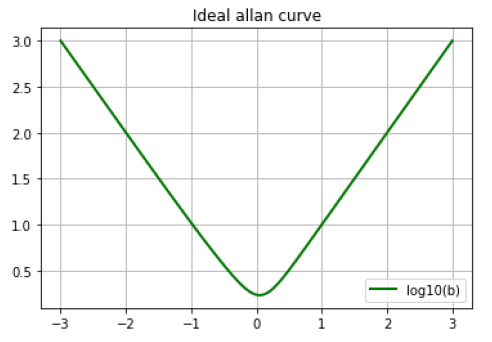

Front End : Odometry
========================

Calibration Camera (IMU LIDAR)
---------------------------------

Camera
>>>>>>>>>>>>>>>

Camera calibration is extremely important for SLAM system. Matlab and `OpenCV <https://docs.opencv.org/2.4/doc/tutorials/calib3d/camera_calibration/camera_calibration.html>`_ image calibration tool boxes are the most used tools (they basicly use the same algorithm,  however different in realize method. For example, they use different non-linear optimization methods).

.. math::
    n_{\mathrm{offset}} = \sum_{k=0}^{N-1} s_k n_k

This is to estimate the parameters of a lens and image sensor,
which will be used to correct for lens distortion, measure the size of an object in world units, or determine the location of the camera in the scene.
There are mainly two parts in camera calibration. Firstly, to project the 3D world to the camera sensor plane, secondly transform the image from the real world unit to pixel level. 

.. math::
   :nowrap:
   
   Z\begin{bmatrix} x\\y\\1\end{bmatrix}
   =\begin{bmatrix}
   f_{x} & 0 & 0\\0 & f_{y} & 0 \\ 0 & 0 & 1
   \end{bmatrix}
   \begin{bmatrix} X\\Y\\Z\end{bmatrix}
   
.. math::
    \begin{bmatrix} x_{pixel}\\y_{pixel}\\1\end{bmatrix}
    =\begin{bmatrix}
       \delta_{x} & 0 & c_{x}\\0 & \delta_{y} & c_{y} \\ 0 & 0 & 1
    \end{bmatrix}
    \begin{bmatrix} x\\y\\1\end{bmatrix}

The distortion is represented as follows:

.. math::
    x_{distorted} = x(1 + k_{1}r^{2} + k_{2}r^{4} + k_{3}r^{6}  )
    
    x_{distorted} = x + ( 2p_{1}xy + p_{2}(r^{2}+2x^{2}) )

IMU (Inertial measurement unit)
>>>>>>>>>>>>>>>>>>>>>>>>>>>>>>>>>>>>>>
Accelerometer(offer acceleration) + Gyroscope(offer angle velocity)

The most important parameters for IMU are bias and white noise. They can be calibrated with Allan variance model.
Example can be seen https://github.com/gggliuye/VIO/blob/master/IMU/allan%20plot.ipynb.

|pic1| and |pic2|

.. |pic2| image:: images/allancurves.PNG
   :width: 45%

LIDAR
>>>>>>>>>>>>>>>>>
(to do)

Pre-Processing
--------------

Before any further treatment, we need pretreat the image, to reduce some error or noise.
For example:

* gamma correction(https://www.cambridgeincolour.com/tutorials/gamma-correction.htm) for lighting problems.
* image blind deconvolution(https://nl.mathworks.com/help/images/ref/deconvblind.html) for image deblur, etc. 

Feature Extraction And Match
-----------------------------

For the feature, we have various way to detect features. 

* SIFT (mostly used in SFM system), has better property, however it is computationally expensive.
* FAST feature (mostly used in SLAM system), is extremely fast to calculate, however it lacks some important property. 
* And some Deep learning algorithms (e.g. GcnV2 features).

And most feature descriptor algorithms are very expensive to calculate. Even the BRIEF binary descriptor(used as ORB) is lumbersome for moblie phone. We need to carefully weight when to calculate descriptors, when we should use other algorithms(e.g. Optical Flow).

Direct Methods
------------------
we can also use direct methods for tracking. Depends on the intensity of pixels.
SVO LSD_SLAM

Pose Calculation
---------------------
* Use Homography matrix.
* Use Pnp(in some tracking algorithms) to calculate from 2d-3d points matches.
* Use bundle adjustment to optimization pose(as in ORBSLAM).
* Use Filter methods to calculate.

Match With Map
------------------
We can get a camera pose at this moment, however it is not satisifying at most time.
In most SLAM system(as I know for ORBSLAM and PTAM), the matching processing is adjusted to match between the current frame map points (not with a single frame).

All the map points will be projected into the image frame(by last calculated camera pose). And for each projected map point that is in the current view, best matched point will be found within a radius range around it from the current image frame, this pair of points will be treated as a match.

 * for ORBSLAM, their BRIEF descriptors will be used as criterion.
 * for PTAM, zero mean SSD and cross-correspondence will be used as criterion.

Multi-sensor Fusion
--------------------------

* IMU: 
  IMU is used in a lot of SLAM system, as VINS for drones, and MSCKF for AR kit, etc.
  

* GPS / Blue Tooth : They can difinitly give us some information. The problem is how to use it.

* LIDAR: e.g.VLOAM
