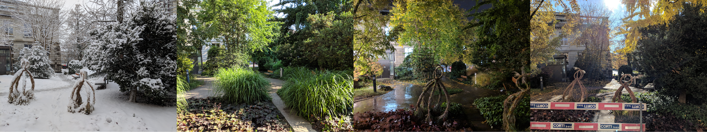
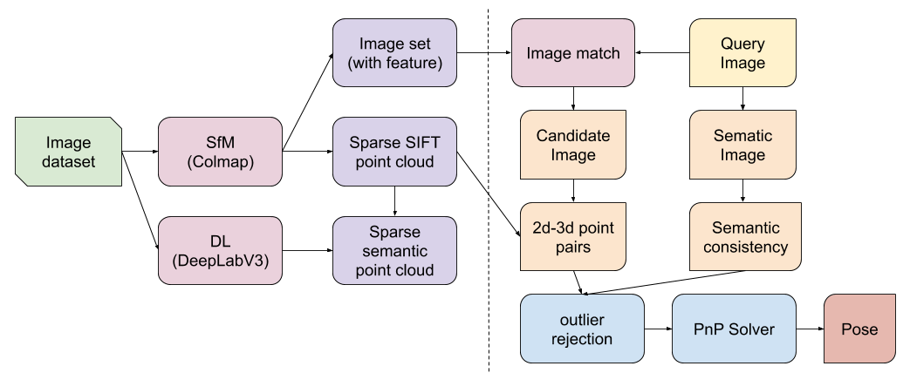
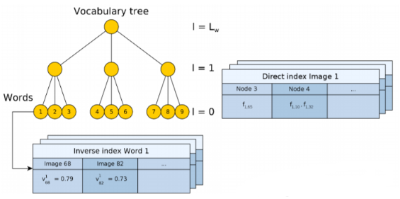

Visual Localization
===================

CVPR
----------------------

**EN:**
The objective of this `CVPR competition <https://www.visuallocalization.net/>`_ is localization in different environment changes (winter/spring, rain/snow/sunday, day/night, etc). The core of these algorithms is their robustness against these environment change. The main warpon is "Deep learning", for example EHTZ use its own HF-net [1]_ to extract features, and CAS uses `Deeplabv3 <https://github.com/rishizek/tensorflow-deeplab-v3>`_ (an open source deep learning architecture ) to extract semantic feature as a criterion for outlier rejection [2]_.

**CH：**
这个竞赛解决的核心问题是针对变化环境的鲁棒性处理(定位的精度并不是它的核心问题)。所以算法的核心在与：使用深度学习工具，构造出鲁棒性更好更加robust的系统。为了这个目的，苏黎世大学的方案是用深度学习提取特征，中国科学院的方式的把深度学习的语义信息用来排除外点。值得一提的是，他们在SFM建模都使用了colmap的开源框架，苏黎世自己创建了深度学习模型，中科院则是运用了开源框架deeplab。

1st EHTZ
~~~~~~~~~~~~~~~~~~~~

They use a **Hierarchical Localization** algorithm, using monolihic CNN to simultaneously(sharing of computations) predict **local features** and **global descriptors** for localization.  `github page <https://github.com/ethz-asl/hfnet>`_  and  `paper <https://arxiv.org/abs/1812.03506>`_

1. Global descriptor is used to retrieves candidate images.
2. Local features are used to esimate an accurate 6-DoF pose.

The robustness of localization is maximized while retaining tractable computational requirements.

**HF-Net**

It is composed of a single encoder (a **MobileNet** bakcbone: optimized for mobile inference) and three heads predicting : 

1. keypoint detection scores
2. dense local descriptors
3. a global image-wide descriptor.

The global descriptor is predicted by NetVLAD layer on top of the last feature map of Moblie Net.     

1st CAS
~~~~~~~~~~~~~~~~~~~~
**EN:** From China Academy of Sciences.
The following image shows the system pipeline. They used Colmap [3]_ for offline SfM reconstruction, DeeplabV3 [4]_ to offer semantic segmentation, and NetVLAD [5]_ to offer image match.  `paper page <https://arxiv.org/abs/1904.03803>`_ 

**CH:** 下图是整个系统的流程图解析，SfM离线建图的部分使用了Colmap，语义分割使用了Deeplabv3，图像匹配使用了NetVLAD。总的来说，排除外点的想法具有原创性。

**Contribute：**

**EN：**

* a new localization pipeline : use semantic infomation as outlier rejection criterion.
* do not need any additional restrictions (e.g. camera height, grivaty)

**CH：**

* 一个新的定位模式框架：使用语义信息提供新的排除外点的标准。
* 不需要一些额外信息（比如相机的高度和重力方向）。

**personal view**: lack of originality. 

Traditional methods
-------------------------
The place recognition problem has been traditional cast as an **instance retrieval task** , where the query image location is estimated using locations of the most similar images obtained by querying a large tagged database. Each database image is represented using local invariant features such as SIFT that are aggregated into a single vector representation for the entire image such as bag-of-visual-words [8]_ , VLAD [6]_ , or Fisher vector [7]_. [5]_

The image database can be further augmented by 3D sturcture that enables recovery of accurate camera pose.

BOW/BOF
~~~~~~~~~~~~~~~

It basicly use the same idea as bag-of-word used in NLP(nature language processing), except we treat the visual features as words, named visual words. Each image is a group of visual words, and using the vocabulary to compress the image into a vector. With the vectors and defined distance, we can find the nearest neighbour in the image data base.

We introduce here the basic popeline of DBOW [8]_ . `github <https://github.com/dorian3d/DBoW2>`_

* Collect image database offline to build a **vocabulary tree**. It includes two parts : **Inverse index** and **Direct index** , Each word has a table of inverse indexs, recording its weights. Each tree layer has a table of direct index, recording the words the current image owns in this layer.
* Inverse index is used to fast visit each weight of each word.
* Direct index is used to fast record feature of each image.
* Using k means/medians clustering with tf-idf weight to build a retrival data set.
* For a new process image, for all its features find the closest word in the vocabulary (normally use binary Hamming distance for fast process). With the words, encode the image to t-dim vector (t = number of words in the vocabulary). 

Fisher vector
~~~~~~~~~~~~~~~~~~~~~

Fisher vector is developed from GMM(Gaussian `mixture models <https://en.wikipedia.org/wiki/Mixture_model>`_ ). Which can be used to measure the similarity of two objects.

GMM is a mixture of multiple gaussian models ( :math:`\mathcal{N}( x | \mu_{k}, \Sigma_{k})` ) :

.. math::
    p(x) = \sum_{k=1}^{K} \pi_{k} \mathcal{N}( x | \mu_{k}, \Sigma_{k})

where :math:`\pi_{k}` are normalization parameters , 

.. math::
    \sum_{k=1}^{K} \pi_{k} = 1 , 0 \leqslant \pi_{k} \leqslant 1

In summary, we note all the parameters to be :math:`\theta` , :math:`\lbrace \pi_{k}, \mu_{k}, \Sigma_{k} \rbrace = \theta`  . We can treat the problem as a classification problem : find the best :math:`\theta` that maximum the probabity that a given input x is correct classified (to its most closest image in the data base): 

.. math::
    \hat{\theta} = arg \max_{\theta} \prod_{k=1}^{K} p(x_{k} | \theta)
    
.. math::
    \hat{\theta} = arg \max_{\theta} \sum_{k=1}^{K} \log (p(x_{k} | \theta))
    
.. math::
    \hat{\theta} = arg \max_{\theta} \mathcal{L}(\mathbf{x} | \theta)
    

VLAD
~~~~~~~~~~~~~~~

Ours
----------------------
They all used Colmap pipeline as basic, and used deep learning mehtod to upate the features(add semantic labels / deep learning extraction method). As a result, we choose to go with the same direction : start from colmap structure, and use deep learning to help updating.

Colmap
~~~~~~~~~~~~~~~~~~~~~~~
Colmap offers tool to enable second development. However, I think it is better to use its results only to make it a seperated system. 

1. **Decode Colmap's result.** Using SQL database C++ support, and also support python read gestion.
2. For new input image, **use the same feature extraction method to extract features.** Using **SIFT** feature extraction as used in original colmap. Time consumptions for CPU(i5), and number of points extracted(number of points are not a well-defined general parameter, but we used it here only to compare) are shown below. We found 1280 * 960 is the most suitable size for us.

       +-------+---------+----------+-----------+ 
       | width |  height |  time(s) |  #points  |
       +=======+=========+==========+===========+ 
       | 3648  |   2736  |  16.72   |  ~12500   |
       +-------+---------+----------+-----------+ 
       | 1280  |    960  |   2.31   |  ~10000   |
       +-------+---------+----------+-----------+ 
       | 640   |    480  |   0.55   |  ~3000    |
       +-------+---------+----------+-----------+ 

3. **Match with image database.** Possible choice: BOW, Exhaustive, Deep learning( `NetVLAD <https://www.di.ens.fr/willow/research/netvlad/>`_ ). Or **Match with map**.

4. **solve pose** for the input image. PnP + RANSAC.

Reference
-----------------

.. [1] Sarlin P E, Cadena C, Siegwart R, et al. From coarse to fine: Robust hierarchical localization at large scale[C]//Proceedings of the IEEE Conference on Computer Vision and Pattern Recognition. 2019: 12716-12725.

.. [2] Shi T, Shen S, Gao X, et al. Visual Localization Using Sparse Semantic 3D Map[J]. arXiv preprint arXiv:1904.03803, 2019.

.. [3] Schonberger J L, Frahm J M. Structure-from-motion revisited[C]//Proceedings of the IEEE Conference on Computer Vision and Pattern Recognition. 2016: 4104-4113.

.. [4] Chen L C, Papandreou G, Kokkinos I, et al. Deeplab: Semantic image segmentation with deep convolutional nets, atrous convolution, and fully connected crfs[J]. IEEE transactions on pattern analysis and machine intelligence, 2017, 40(4): 834-848.

.. [5] Arandjelovic R, Gronat P, Torii A, et al. NetVLAD: CNN architecture for weakly supervised place recognition[C]//Proceedings of the IEEE conference on computer vision and pattern recognition. 2016: 5297-5307.

.. [6] Jégou H, Douze M, Schmid C, et al. Aggregating local descriptors into a compact image representation[C]//CVPR 2010-23rd IEEE Conference on Computer Vision & Pattern Recognition. IEEE Computer Society, 2010: 3304-3311.

.. [7] Sánchez J, Perronnin F, Mensink T, et al. Image classification with the fisher vector: Theory and practice[J]. International journal of computer vision, 2013, 105(3): 222-245.

.. [8] Gálvez-López D, Tardos J D. Bags of binary words for fast place recognition in image sequences[J]. IEEE Transactions on Robotics, 2012, 28(5): 1188-1197.
