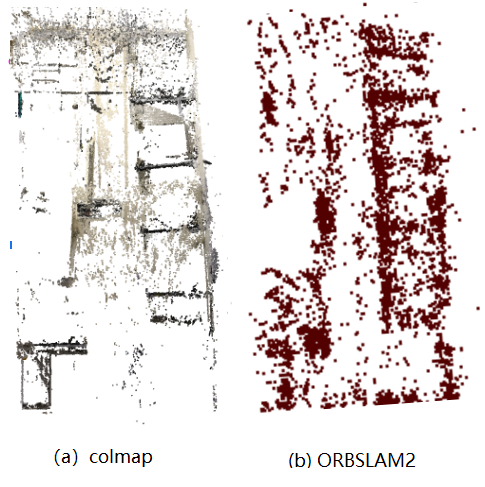
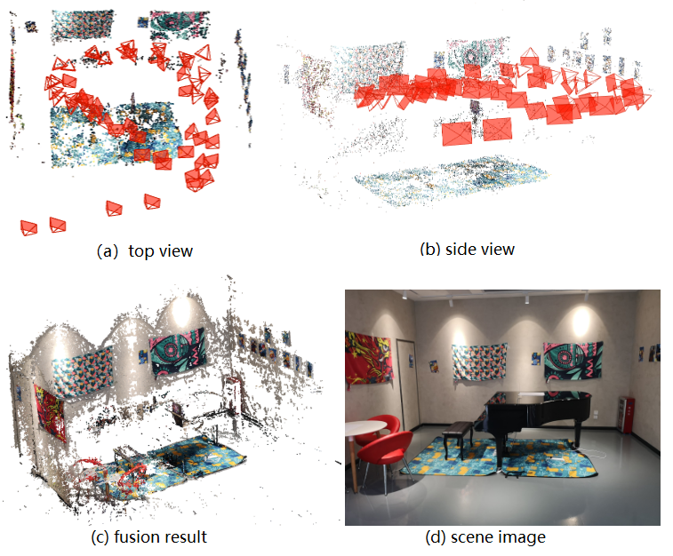
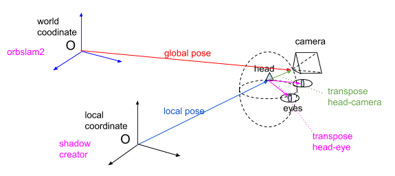
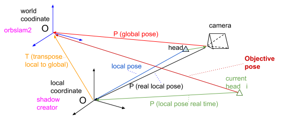
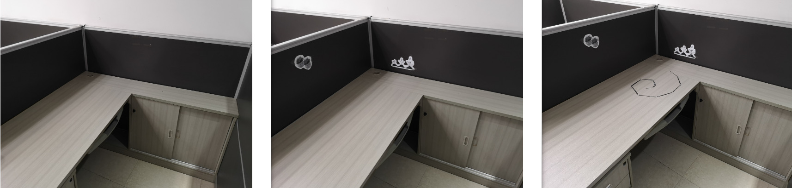
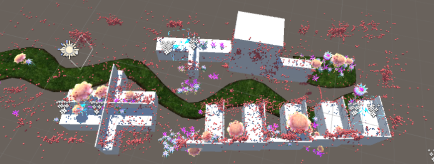
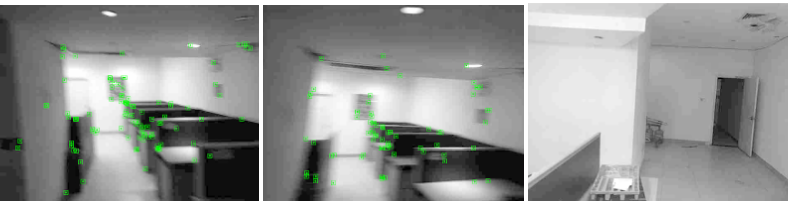
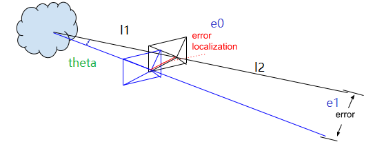
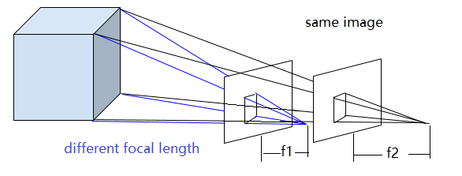

AR Garden
=========================================

1. 简介
--------------

这个项目的展示效果是“AR花园”，使用影创的AR眼镜设备，在我们的场景中，实现虚拟与现实的结合。同时现实的物体会遮挡虚拟物体，用户也可以实现和虚拟物体的互动。

主要的实现方法是：定期服务器提供绝对位置，影创眼镜设备则负责追踪。
我们第一阶段demo使用的是改良的ORBSLAM2框架作为云端定位的模型，设备的追踪则依靠影创提供了嵌入式VIO。之后通过算法，将两个系统的结果结合，最终得到我们想要的--实时的用户相对于世界坐标系的位姿（位姿：位置+姿态，它有六个自由度=3位移+3旋转）。

2. 本地追踪
-------------
本地追踪的最佳选择是VIO或者VISLAM技术。
这里影创使用的是使用双目和较高精度的IMU结合的VIO追踪算法。

3. 云端定位
-----------------------
对于云端定位，我们想到了两种备选结构，一种是在SFM（structure from motion运动恢复结构）基础上的，另一种是在SLAM基础上的（也就是我们目前使用的）。

3.1 背景
>>>>>>>>>>>>

* 在之前的交流中，我们发现商汤的云端定位是：使用手机（或者全景相机）拍摄照片流，进行离线建图，对于不同光照强度，则选择多采样的方式克服。
* 在和中科大的交流中，他们也给出了我们许多使用SFM和MVS的很多离线建图的例子，为我们树立了范例。

3.2 SFM和SLAM
>>>>>>>>>>>>>>>

SLAM和SFM的基本架构是一致的，尤其是 **SLAM** 和 **Incremental SFM** 。
SLAM和SFM的区别主要在与他们的目的性不同：SLAM的重要要求是 **实时性** ，而SFM则是 **离线** 实现的。
对每张图片SLAM的处理时间需要在百毫秒以内，而对于SFM而言，有的复杂建模甚至会要花费几周的时间计算。
以这个根本原因，导致了SLAM和SFM的系统有很多的不同。

* **图像**： SFM不要求实时性，所以大多会使用原始精度的图像，SLAM一般会缩放图片到适中的尺度，来减少处理图像的时间。
* **特征点**：SFM大多使用SIFT特征点（不变性更好，但是计算量更大）。而SLAM为了加速处理多采用FAST角点，配合BRIEF描述子（尺度不变性有缺憾，但是计算迅速）。SLAM也有使用直接法（例，SSD）做匹配的，但是直接法只能处理相对位移很小的匹配，不适合我们的系统。
* **匹配**： SFM中对匹配的点会做多次验证工作，而SLAM为了处理迅速会使用光流追踪，有的运用到了追踪的特性，会使用重投影地图点追踪。
* **优化**： SFM会多次进行优化（BA bundle adjustment），尤其是全局优化。比如Incremental SFM中，没新注册几张新图片之后，都会进行全局优化（global BA）直至收敛。SLAM中的BA则做的更少，比如ORBSLAM2中，Tracking线程只优化位姿，Localmapping只在有新关键帧加入时局部优化一次，而全局优化只在检测到回环之后优化一次。
* 另外还有很多不同，比如SLAM是对来连续视频流的处理，可以针对性简化一部分内容；SLAM和SFM都可以使用多传感器融合，但是方式可能会不同；SFM也有不同的分类，不同的SFM也会有不同的优劣之处。

3.3 实际场景测试
>>>>>>>>>>>>>>>>>>>>>>>

上图是SFM和SLAM对负一层AR花园场景建模的结果比较（上图中都只有提取到的特征点点云）。可以看出SFM和SLAM得到的结果基本一致，但是总的来说SFM的特征点位置看起来更加可靠准确。

上图是对钢琴场景的colmap建模测试，可以发现特征点（包括fusion）的结果都只能得到周围场景的认知，而对于反光严重的钢琴，则完全不能得到稳定可用的特征点（使用ORBSLAM得到的结果是类似的）。

4. 绝对位姿的计算
---------------------

4.1 系统坐标系
>>>>>>>>>>>>>>>>>>>>>
在整个系统中一共有两个坐标系：世界坐标系（云端定位系统的坐标系统，这也将是Unity3d的坐标系）和本地坐标系（影创眼镜VIO追踪的坐标系），即是下图中的world coordinate system和local coordinate system。

云端定位可以得到一个位姿，由于云端定位系统本质是图像定位，得到的结果是对应相机（camera）光心的位姿。影创的追踪系统（通过两个内置鱼眼相机和较高精度IMU）经过处理之后得到的眼镜环的中心（也就是“头head“）的坐标。
对于Unity的3d虚拟显示，需要两只虚拟眼的位置，所以在Unity系统中需要“头”和“双眼”的相对位置外参（transpose head-eye）。对于定位系统，由于需要统一两个坐标位姿，所以需要“头”和“相机”的相对位置外参（transpose head-camera）。

4.2 原始结果
>>>>>>>>>>>>>>>
我们可以分别得到云端定位和本地追踪的两个原始坐标。
一个是P（global pose），即云端定位的结果，是相机光心的位姿；以及P（local pose），即本地追踪的结果，是AR相机虚拟“头”的位姿。

* 这里要注意我们直接从ORBSLAM和影创SDK VIO中得到的原始结果都是相机在对应参考系的坐标，他们是对应变换矩阵的逆。
所以有如下关系。

.. math::
    P_{Local Pose} = T_{Local To Camera}^{-1}
    
    P_{Global Pose} = T_{Global To Camera}^{-1}

4.3 位置融合
>>>>>>>>>>>>>>>>>>>>>

* 我们的目的可以总结为：求两个坐标系（world和local）之间的相对位姿（下图中的黄色变换T transpose local to global）。
* 值得一提的是，由于影创SDK是VIO系统，所以误差会不停的累积，这就导致上面需要求的相对位姿其实不是一个固定的值，而是会随着本地追踪的误差而改变的值。这就要求我们定期的更新这个相对坐标，以保证系统长时间有效。
* 一旦求得了T（transpose local to global），在结合实时得到的P（local pose）我们就可以得到我们想要的用户“头”head，在世界坐标系中的位姿P（Objective pose）。
* 另外，这里描述的所有位姿或者变换，除了P（local pose real time）以外都不要求实时性。其他状态虽然不要求实时性，但是如果延迟太久，系统误差累积验证，也会造成很大的影响。

由上图和分析，我们可以得到下面的表达式。

.. math::
    P_{Real Local Pose} = P_{Local Pose} * T_{Camera To Head}

    T_{Local To Global} = P_{Real Local Pose} * P_{Global Pose}^{-1}

    P_{Objective Pose} = T_{Local To Global} * P_{Local Pose Real Time}

结合上面三式，我们可以得到。

.. math::
    P_{Objective Pose} = P_{Local Pose} * T_{Camera To Head} * P_{Global Pose}^{-1} * P_{Local Pose Real Time}

4.4 尺度统一
>>>>>>>>>>>>>>>>>>>>>
在实际实验中，我们发现影创的追踪结果（local pose）和云端定位结果（global pose）的尺度并不一致。影创的尺度似乎要比ORBSLAM2（RGBD版本，使用ZED mini双目相机）的大一些。由于我们肉眼也无法准确的判断，暂时将尺度参数设置为1.14左右， **这里是重要的误差点之一** 。

5. 场景布置
----------------

场景布置也需要注意。

* 由于相机的分辨率有限，太小的细节是没有帮助的（例如一张图片，可能只会有四个角点是有效的特征点）。
* 纹理特征适合追踪模式，但是对于重定位没有帮助，重定位需要的是图像的特征。例如，下面第一张图片，图片的纹理结构很好，追踪模式不会跟丢，但是却没有自己的特点，我们不知道它是第几排第几个桌子。但是在其中增加一些 **“个性”** 之后，定位的效果会明显增加，比如下面的第三张图片，我们就可以准确的说出它是第二张桌子了。

* **整体性**，特征希望可以分布的更加均匀，这样有助于减少误差。
* 特征点的描述子是和 **光强** 息息相关的，希望光强度保持稳定、均匀。（相对均匀的光强分布可以通过gamma correction得到）

6. Unity端
----------------

6.1 定位数据的发送接收
>>>>>>>>>>>>>>>>>

* 由于网络传输需要时间，这就会导致延迟和网络阻塞错位等很多问题。但是上面的分析告诉我们，这个纠正系统（计算Ttranspose local to global）对实时性的要求很低，所以我们在用户设备中做了这样的约定： **在收到前一张图片的定位结果之前不会发送新的图片** 。
* 为了降低干扰，提高稳定性，我们还设定系统在连续收到N（设为4）张未丢失的定位结果之后才会确认使用收到的结果。（todo:这样的条件可能其实并没有作用，有待验证）

6.2 模型的放置
>>>>>>>>>>>>>>>>>>>>
* 由于在Unity中没有对点云的渲染，所以我们专门建立了读取点云数据（规定为PLY格式）的脚本。
* 云端可以输出得到的特征点点云（输出为PLY格式），使用上面的脚本导入特征点点云之后，我们就可以得到场景的大致结构。
* 根据这个点云，将遮挡模型和虚拟物体放置到场景中（如下图所示）。
* **模型的摆放会有误差**
* 摆放准确之后，就可以将模型的shader设为遮挡的状态，将特征地图点消除。遮挡可以通过改变Unity的渲染顺序实现（例如： 在shader中修改为：Tags { "Queue" = "Geometry+1"}）

7. ORBSLAM2的改良
-----------------

7.1 离线优化
>>>>>>>>>>>>>>>>>

SLAM与SFM的区别之一就是全局优化的次数，由于我们没有了实时性的限制，所以我们对ORBSLAM2建图的结果进行了离线 **Global Bundle Adjustment** ,同时排除outlier。在进行全局优化之后，地图点的精度有了明显的提高，但是提高的程度仍然有限。

我们也考虑在ORBSLAM2中加入 **Retrangulation** 的过程。我们分析认为Retrangulation可以消除系统中大部分的重复点和outlier，会使得系统精度有很大的提高。但是由于SLAM框架的限制，没有找到合适的方法加入。

7.2 参数相关
>>>>>>>>>>>>>>>>>>
* 由于我们没有很强的实时性要求，我们增加了ORB特征点金字塔的大小，同时增加了特征点选取的数量。
* 由于我们需要定位的准确性。于是我们将重定位（Relocalization）的参数设置为从配置文件中读取，同时我们设置了更到的阈值，以增加重定位的精度。
* 由于ORBSLAM中经常将上一帧的位姿赋值给当前帧（后面可以会再进行其他的优化，或者筛选），所以导致，虽然系统是LOST的状态，参数系统仍然会有输出。这就要求我们判断系统的状态，保证只有系统处于Tracking状态时才将输出结果传递给设备。

7.3 其他处理
>>>>>>>>>>>>>>>>>>
* 运动模糊（todo）

* 光强修正（使用gamma=0.5的Gamma Correction）

7.4 Deep Learning
>>>>>>>>>>>>>>>>>>>
* 我们测试了使用 `GCNv2 <https://github.com/jiexiong2016/GCNv2_SLAM>`_ 提取特征点的SLAM定位，但是追踪的效果不理想。
* Deep Learning需要GPU，但是我们的服务器暂时没有GPU提供。

7.5 未来修正
>>>>>>>>>>>>>>>>>>>
现在定位还只是简单的套用之前ORBSLAM源代码的框架，可以考虑修改重定位的思路。

8. 误差分析
---------------------

8.1 ORBSLAM2的定位误差
>>>>>>>>>>>>>>>>>>>>>>

   
上图可以理解定位误差的影响（在这里只对位置讨论，旋转的误差造成的不良效果类似）。由于我们是基于图像定位的，云端定位的结果会优化
使得地图中对应的特征点投影到当前图片的相对位置。但是由于照片的分辨率限制，距离远的一个像素点的误差可能会导致定位误差（上图中的红色误差error localization）。
所以距离特征点越近，定位的误差就会越小。

另外，我们可以窥见定位误差在相机视野外的放大（尤其是到相机背后）。

* 正面的特征点可能相对准确。
* 但是其实定位已经有了“error localization”的误差
* 而相机视野背后的物体更是有了更大的误差(图中“error”）

**解决**  ： 增加定位使用图片的分辨率，减少运动模糊。增加SLAM定位的系统准确性，增加地图点的精度。

8.2 Unity
>>>>>>>>>>>>>>>>>>>>>>>>>>>>
Unity的模型摆放误差

8.3 影创VIO
>>>>>>>>>>>>>>>>>>>>>>>>>

* VIO的累积误差
* 影创与ZEDmini尺度不统一误差
* 影创相机参数标定误差。如下图所示，相同的图片，如果设定的定位标定参数不一样（这里只考虑了焦距），那么定位的结果也会不一样。

