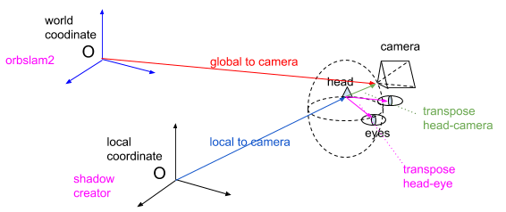

AR Garden
=========================================

简介
--------------

这个项目的展示效果是“AR花园”，使用影创的AR眼镜设备，在我们的场景中，实现虚拟与现实的结合。同时现实的物体会遮挡虚拟物体，用户也可以实现和虚拟物体的互动。

主要的实现方法是：定期服务器提供绝对位置，影创眼镜设备则负责追踪。
我们第一阶段demo使用的是改良的ORBSLAM2框架作为云端定位的模型，设备的追踪则依靠影创提供了嵌入式VIO。之后通过算法，将两个系统的结果结合，最终得到我们想要的--实时的用户相对于世界坐标系的位姿（位姿：位置+姿态，它有六个自由度=3位移+3旋转）。

系统坐标系
----------------
在整个系统中一共有两个坐标系：世界坐标系（云端定位系统的坐标系统，这也将是Unity3d的坐标系）和本地坐标系（影创眼镜VIO追踪的坐标系），即是下图中的world coordinate system和local coordinate system。

云端定位可以得到一个位姿，由于云端定位系统本质是图像定位，得到的结果是对应相机（camera）光心的位姿。影创的追踪系统（通过两个内置鱼眼相机和较高精度IMU）经过处理之后得到的眼镜环的中心（也就是“头head“）的坐标。
对于Unity的3d虚拟显示，需要两只虚拟眼的位置，所以在Unity系统中需要“头”和“双眼”的相对位置外参（transpose head-eye）。对于定位系统，由于需要统一两个坐标位姿，所以需要“头”和“相机”的相对位置外参（transpose head-camera）。

位置融合
--------------------

