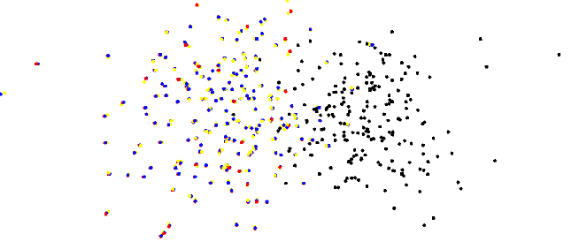

AR Garden + Pop Art
=========================================

1. 简介
--------------

这个项目的展示效果是“AR花园”，使用影创的AR眼镜设备，在我们的场景中，实现虚拟与现实的结合。同时现实的物体会遮挡虚拟物体，用户也可以实现和虚拟物体的互动。

主要的实现方法是：定期服务器提供绝对位置，影创眼镜设备则负责追踪。
我们第一阶段demo使用的是改良的ORBSLAM2框架作为云端定位的模型，设备的追踪则依靠影创提供了嵌入式VIO。之后通过算法，将两个系统的结果结合，最终得到我们想要的--实时的用户相对于世界坐标系的位姿（位姿：位置+姿态，它有六个自由度=3位移+3旋转）。

Pipeline
~~~~~~~~~~~~~~
1. 使用提供深度的设备扫描带有真实尺度的特征点地图。
2. （可选）使用特征点地图，加上深度设备，建立稠密的mesh地图。
3. 导入特征点地图（或者mesh地图，如果步骤2完成）入Unity3D，并摆放模型特效。
4. 服务器加载特征点地图待机准备定位。
5. 应用打包，设备连接wifi，启动应用。

2. 本地追踪
-------------
本地追踪的最佳选择是VIO或者VISLAM技术。
这里影创使用的是使用双目和较高精度的IMU结合的VIO追踪算法。

3. 云端定位
-----------------------
对于云端定位，我们想到了两种备选结构，一种是在SFM（structure from motion运动恢复结构）基础上的，另一种是在SLAM基础上的（也就是我们目前使用的）。

3.1 背景
~~~~~~~~~~~~~~~~~~~~

* 在之前的交流中，我们发现商汤的云端定位是：使用手机（或者全景相机）拍摄照片流，进行离线建图，对于不同光照强度，则选择多采样的方式克服。
* 在和中科大的交流中，他们也给出了我们许多使用SFM和MVS的很多离线建图的例子，为我们树立了范例。

3.2 SFM和SLAM
~~~~~~~~~~~~~~~~~~~~

SLAM和SFM的基本架构是一致的，尤其是 **SLAM** 和 **Incremental SFM** 。
SLAM和SFM的区别主要在与他们的目的性不同：SLAM的重要要求是 **实时性** ，而SFM则是 **离线** 实现的。
对每张图片SLAM的处理时间需要在百毫秒以内，而对于SFM而言，有的复杂建模甚至会要花费几周的时间计算。
以这个根本原因，导致了SLAM和SFM的系统有很多的不同。

* **图像**： SFM不要求实时性，所以大多会使用原始精度的图像，SLAM一般会缩放图片到适中的尺度，来减少处理图像的时间。
* **特征点**：SFM大多使用SIFT特征点（不变性更好，但是计算量更大）。而SLAM为了加速处理多采用FAST角点，配合BRIEF描述子（尺度不变性有缺憾，但是计算迅速）。SLAM也有使用直接法（例，SSD）做匹配的，但是直接法只能处理相对位移很小的匹配，不适合我们的系统。
* **匹配**： SFM中对匹配的点会做多次验证工作，而SLAM为了处理迅速会使用光流追踪，有的运用到了追踪的特性，会使用重投影地图点追踪。
* **优化**： SFM会多次进行优化（BA bundle adjustment），尤其是全局优化。比如Incremental SFM中，没新注册几张新图片之后，都会进行全局优化（global BA）直至收敛。SLAM中的BA则做的更少，比如ORBSLAM2中，Tracking线程只优化位姿，Localmapping只在有新关键帧加入时局部优化一次，而全局优化只在检测到回环之后优化一次。
* 另外还有很多不同，比如SLAM是对来连续视频流的处理，可以针对性简化一部分内容；SLAM和SFM都可以使用多传感器融合，但是方式可能会不同；SFM也有不同的分类，不同的SFM也会有不同的优劣之处。

3.3 实际场景测试
~~~~~~~~~~~~~~~~~~~~

.. image:: sfm_slam.png
   :align: center

上图是SFM和SLAM对负一层AR花园场景建模的结果比较（上图中都只有提取到的特征点点云）。可以看出SFM和SLAM得到的结果基本一致，但是总的来说SFM的特征点位置看起来更加可靠准确。

.. image:: colmap_piano.PNG
   :align: center

上图是对钢琴场景的colmap建模测试，可以发现特征点（包括fusion）的结果都只能得到周围场景的认知，而对于反光严重的钢琴，则完全不能得到稳定可用的特征点（使用ORBSLAM得到的结果是类似的）。

4. 绝对位姿的计算
---------------------

4.1 系统坐标系
~~~~~~~~~~~~~~~~~~~~

在整个系统中一共有两个坐标系：世界坐标系（云端定位系统的坐标系统，这也将是Unity3d的坐标系）和本地坐标系（影创眼镜VIO追踪的坐标系），即是下图中的world coordinate system和local coordinate system。

云端定位可以得到一个位姿，由于云端定位系统本质是图像定位，得到的结果是对应相机（camera）光心的位姿。影创的追踪系统（通过两个内置鱼眼相机和较高精度IMU）经过处理之后得到的眼镜环的中心（也就是“头head“）的坐标。
对于Unity的3d虚拟显示，需要两只虚拟眼的位置，所以在Unity系统中需要“头”和“双眼”的相对位置外参（transpose head-eye）。对于定位系统，由于需要统一两个坐标位姿，所以需要“头”和“相机”的相对位置外参（transpose head-camera）。

.. image:: pic1.png
   :width: 80%
   :align: center

4.2 原始结果
~~~~~~~~~~~~~~~~~~~~

我们可以分别得到云端定位和本地追踪的两个原始坐标。
一个是P（global pose），即云端定位的结果，是相机光心的位姿；以及P（local pose），即本地追踪的结果，是AR相机虚拟“头”的位姿。

* 这里要注意我们直接从ORBSLAM和影创SDK VIO中得到的原始结果都是相机在对应参考系的坐标，他们是对应变换矩阵的逆。
所以有如下关系。

.. math::
    P_{Local Pose} = T_{Local To Camera}^{-1}
    
    P_{Global Pose} = T_{Global To Camera}^{-1}

4.3 位置融合
~~~~~~~~~~~~~~~~~~~~

* 我们的目的可以总结为：求两个坐标系（world和local）之间的相对位姿（下图中的黄色变换T transpose local to global）。
* 值得一提的是，由于影创SDK是VIO系统，所以误差会不停的累积，这就导致上面需要求的相对位姿其实不是一个固定的值，而是会随着本地追踪的误差而改变的值。这就要求我们定期的更新这个相对坐标，以保证系统长时间有效。
* 一旦求得了T（transpose local to global），在结合实时得到的P（local pose）我们就可以得到我们想要的用户“头”head，在世界坐标系中的位姿P（Objective pose）。
* 另外，这里描述的所有位姿或者变换，除了P（local pose real time）以外都不要求实时性。其他状态虽然不要求实时性，但是如果延迟太久，系统误差累积验证，也会造成很大的影响。

.. image:: pic2.png
   :width: 80%
   :align: center

由上图和分析，我们可以得到下面的表达式。

.. math::
    P_{Real Local Pose} = P_{Local Pose} * T_{Camera To Head}

    T_{Local To Global} = P_{Real Local Pose} * P_{Global Pose}^{-1}

    P_{Objective Pose} = T_{Local To Global} * P_{Local Pose Real Time}

结合上面三式，我们可以得到。

.. math::
    P_{Objective Pose} = P_{Local Pose} * T_{Camera To Head} * P_{Global Pose}^{-1} * P_{Local Pose Real Time}

4.4 尺度统一
~~~~~~~~~~~~~~~~~~~~

在实际实验中，我们发现影创的追踪结果（local pose）和云端定位结果（global pose）的尺度并不一致。影创的尺度似乎要比ORBSLAM2（RGBD版本，使用ZED mini双目相机）的大一些。由于我们肉眼也无法准确的判断，暂时将尺度参数设置为1.14左右， **这里是重要的误差点之一** 。这个将在后面和激光高精点云匹配（标配）中解决。

5. 场景布置
----------------

场景布置也需要注意。

* 由于相机的分辨率有限，太小的细节是没有帮助的（例如一张图片，可能只会有四个角点是有效的特征点）。
* 纹理特征适合追踪模式，但是对于重定位没有帮助，重定位需要的是图像的特征。例如，下面第一张图片，图片的纹理结构很好，追踪模式不会跟丢，但是却没有自己的特点，我们不知道它是第几排第几个桌子。但是在其中增加一些 **“个性”** 之后，定位的效果会明显增加，比如下面的第三张图片，我们就可以准确的说出它是第二张桌子了。

.. image:: ../images/envo.PNG
   :width: 100%
   :align: center

* **整体性**，特征希望可以分布的更加均匀，这样有助于减少误差。
* 特征点的描述子是和 **光强** 息息相关的，希望光强度保持稳定、均匀。（相对均匀的光强分布可以通过gamma correction得到）

6. Unity端
----------------

6.1 定位数据的发送接收
~~~~~~~~~~~~~~~~~~~~

* 由于网络传输需要时间，这就会导致延迟和网络阻塞错位等很多问题。但是上面的分析告诉我们，这个纠正系统（计算Ttranspose local to global）对实时性的要求很低，所以我们在用户设备中做了这样的约定： **在收到前一张图片的定位结果之前不会发送新的图片** 。
* 为了降低干扰，提高稳定性，我们还设定系统在连续收到N（设为4）张未丢失的定位结果之后才会确认使用收到的结果。（todo:这样的条件可能其实并没有作用，有待验证）

6.2 模型的放置
~~~~~~~~~~~~~~~~~~~~

* 由于在Unity中没有对点云的渲染，所以我们专门建立了读取点云数据（规定为PLY格式）的脚本。
* 云端可以输出得到的特征点点云（输出为PLY格式），使用上面的脚本导入特征点点云之后，我们就可以得到场景的大致结构。
* 根据这个点云，将遮挡模型和虚拟物体放置到场景中（如下图所示）。
* **模型的摆放会有误差**
* 摆放准确之后，就可以将模型的shader设为遮挡的状态，将特征地图点消除。遮挡可以通过改变Unity的渲染顺序实现（例如： 在shader中修改为：Tags { "Queue" = "Geometry+1"}）

.. image:: put_model.PNG
   :align: center

6.3 坐标系的变换
~~~~~~~~~~~~~~~~~~~~

由于ORBSLAM使用的是常用的SLAM坐标系统，而Unity使用了常用的3D处理坐标系，坐标系之间存在差异。
统一坐标系是在Unity端完成的，包括了其他需要的四元数和旋转矩阵的转换，信息的解码等，详细可以参见 ` Convert Matrix <https://github.com/gggliuye/VIO/blob/master/docs/UnitySc/ConvertMatrix.cs>`_

6.4 对用户体验的优化
~~~~~~~~~~~~~~~~~~~~~~

定位的结果不停的输入系统，但是由于误差的随机游走特性，每一次得到的结果是不稳定的。在结果中的表现则是位姿会在得到定位之后跳动，这本质上是高斯噪音的随机游走特性，导致定位的结果会在真实值附近随机游走。为了减少跳动对用户体验的影响，我提出了两种解决方案

* **1.尽量消除噪音** 对结果进行进一步的优化（比如卡尔曼滤波），综合历史的所有结果优化数据。这样会使系统的结果更加接近真实值，由滤波的特性，系统对高斯噪音也会有估计和传递，这就消除一部分了结果中的噪音跳动。同时综合了所有历史的结果会更加精确。但是这可能会对计算量有一定的要求。

* **2.取巧的办法** 另外可以使用取巧的方法，系统定位的结果不是一瞬间反映到结果上，而是通过Unity中的Coroutine和yield return的方法，缓慢地作用。这种方法实现简单，系统不复杂，运算量要求也更低。

我使用了第二种取巧的办法来解决这个问题，使用Coroutine和Lerp函数实现：

.. code:: c#      
private IEnumerator WaitAndRotate(float waitTime)
{
    for (int i = 0; i < 30; i++)
    {
        float t = i * 0.1f;
        Quaternion tmpQ = Quaternion.Lerp(quaternionRelativeFrom, quaternionRelativeTo, t);
        Vector3 tmpP = Vector3.Lerp(positionRelativeFrom, positionRelativeTo, t);
        convertMatrixRelative = new ConvertMatrix(tmpQ, tmpP);
        yield return new WaitForSeconds(waitTime);
    }
}

* 另外，还设定了相对位移（云端定位和本地追踪坐标系的相对位移）的变化设定了阈值，如果发现产生了突变，则很大程度上是由于定位误差造成的，那么系统会自动舍弃这个结果。

7. ORBSLAM2的改良
-----------------

7.1 离线优化
~~~~~~~~~~~~~~~~~~~~

SLAM与SFM的区别之一就是全局优化的次数，由于我们没有了实时性的限制，所以我们对ORBSLAM2建图的结果进行了离线 **Global Bundle Adjustment** ,同时排除outlier。在进行全局优化之后，地图点的精度有了明显的提高，但是提高的程度仍然有限。

我们也考虑在ORBSLAM2中加入 **Retrangulation** 的过程。我们分析认为Retrangulation可以消除系统中大部分的重复点和outlier，会使得系统精度有很大的提高。但是由于SLAM框架的限制，没有找到合适的方法加入。

7.2 参数相关
~~~~~~~~~~~~~~~~~~~~

* 由于我们没有很强的实时性要求，我们增加了ORB特征点金字塔的大小，同时增加了特征点选取的数量。
* 由于我们需要定位的准确性。于是我们将重定位（Relocalization）的参数设置为从配置文件中读取，同时我们设置了更到的阈值，以增加重定位的精度。
* 由于ORBSLAM中经常将上一帧的位姿赋值给当前帧（后面可以会再进行其他的优化，或者筛选），所以导致，虽然系统是LOST的状态，参数系统仍然会有输出。这就要求我们判断系统的状态，保证只有系统处于Tracking状态时才将输出结果传递给设备。

7.3 其他处理
~~~~~~~~~~~~~~~~~~~~

* 运动模糊/检测

   
经过细致的相关文献调研，我们发现修正模糊图像的代价过大，处理时间会严重影响系统的效率，进而影响精度。所以我们决定舍弃模糊图像的处理，为此我们提出了运动模糊检测算法 （详情见 `Image Blurry <https://vio.readthedocs.io/en/latest/Prepare.html#image-blurry>`_）。 并且，在加入筛除模糊图像的算法加入后，系统的稳定性得到了很大程度的提高。

在上述调研中我们研究了两种算法：Laplacian Variance 检测模糊， Eigen Feature 检测模糊。
Eigen feature的检测准确率可以达到超过90%，但是由于其中涉及到SVD的计算，运算量的代价大。Laplacian方法检测的结果准确率达到77.8%，由于仅仅涉及了一个卷积运算，运算代价很小，同时准确率也能够满足我们的要求，所以，在我们的系统中，我们使用Laplacian Variance 检测模糊。
   
   
* 光强修正（使用gamma=0.5的Gamma Correction）

.. math::
    I_{i}^{\gamma} = ( I_{i} / 255) ^{\gamma} * 255

.. image:: ../images/night_images.png
   :width: 100%

.. image:: ../images/night_hists.png
   :width: 100%
   
7.4 Deep Learning
~~~~~~~~~~~~~~~~~~~~

* 我们测试了使用 `GCNv2 <https://github.com/jiexiong2016/GCNv2_SLAM>`_ 提取特征点的SLAM定位，但是追踪的效果不理想。
* Deep Learning需要GPU，但是我们的服务器暂时没有GPU提供。

7.5 服务器接口
~~~~~~~~~~~~~~~~~~~~

目前我们设定了三种接口，动态、静态、Map型。分别有函数操作创建，销毁和得到定位结果。

* **动态** 接口，将会返回指向系统的动态指针，通过指针操作。

.. highlight:: c
      :linenos:
extern "C" void* Internal_InitOrbslam(const char *pathVoc, const char* pathSetting, bool readmap);

extern "C" void Internal_DestroyOrbsalm(ORB_SLAM2::System* obj);

extern "C" float* Internal_TrackMonocular(ORB_SLAM2::System* obj,unsigned char* inputImage, float timeFrame, int bufferLength);

* **静态** 接口，将会调用唯一的一个静态对象（用作测试算法时使用）。

.. highlight:: c
      :linenos:
extern "C" int Internal_InitOrbslamStatic(bool readmap);

extern "C" int Internal_DestroyOrbsalmStatic();

extern "C" float* Internal_TrackMonocular_static(ORB_SLAM2::System* obj, unsigned char* inputImage, float timeFrame, int bufferLength);

* **Map** 接口，将会根据ID，创建或者销毁对象类，同时可以用ID指定做运算的对象。

.. highlight:: c
      :linenos:
extern "C" int Internal_InitOrbslamWithID(const char *pathVoc, const char* pathSetting, bool readmap);

extern "C" int Internal_DestroyOrbslamWithID(int idx);

extern "C" float* Internal_TrackMonocularWithID(int idx, unsigned char* inputImage, float timeFrame, int bufferLength);

8. 点云匹配
---------------------

之后我们会面临，激光点云模型的坐标系与我们特征点云的坐标系的统一的问题。这其实是两个不同的点云的标配问题。
我们采用的方式基本是：

* 预先设定额外的标定锚点。
* 分布从两张点云地图中提取中锚点，并相互匹配，得到三维点对的集合 { :math:`(p_{i}, p_{j} )` }。
* 使用优化的方式得到三维点对直接的转换关系，作为两个坐标系之间的相互变换。

8.1 点对关系
~~~~~~~~~~~~~~~~~~~~

两队点（两个坐标系）之间的变换关系可以由7个变量表示（一个尺度变量，三个旋转变量，三个位移变量）。数学上可以表示为：

.. math::
    \vec{x}_{j} = s(\mathbf{R}\vec{x}_{i} + \mathbf{t})

8.2 SVD方法
~~~~~~~~~~~~~~~~~~~~~
首先对两个点云计算质心的位置:

.. math::
    \hat{p}_{i} = \frac{1}{N} \sum_{k=1}^{N} p_{i,k}, \hat{p}_{j} = \frac{1}{N} \sum_{k=1}^{N} p_{j,k} 

细节推导在这里省略，从大部分的ICP推导为基础可以简单的得到，只需要注意我们的变量多了一个尺度scale参数，需要考虑。

8.3 非线性优化方法
~~~~~~~~~~~~~~~~~~~~
在取了这么多匹配的数据之后，这个问题可以转变为优化问题。这个系统中我们可以保持之前SLAM中的高斯分布观测的假设，仍然可以维持之前的最小二乘法。那么问题可以重新写为对能量（残差）方程求极值的问题：

.. math::
    E = \sum_{(i,j) matches} \| s(\mathbf{R}\vec{x}_{i} + \mathbf{t}) - \vec{x}_{j} \|_{2} = \sum_{(i,j) matches} \| f(x_{i}), x_{j}  \|

.. math::
    \xi = arg \min_{\xi} \sum_{(i,j) matches} \| s(\mathbf{R}\vec{x}_{i} + \mathbf{t}) - \vec{x}_{j} \|_{2}

其中的状态量为（我们假设点云之间是相似变换）：

.. math::
    \xi = \begin{bmatrix}  \vec{\theta} & \vec{t} & s  \end{bmatrix}

残差的雅各比矩阵可以写为：

.. math::
    \frac{\partial f} {\partial s} = R\vec{x}_{i} + \mathbf{t}

.. math::
    \frac{\partial f} {\partial \vec{t}} = s \mathbf{I}
    
.. math::
    \begin{aligned}
    \frac{\partial f} {\partial \vec{\theta}} & = \lim_{\delta \vec{\theta} \rightarrow \vec{0}} \frac{1}{\delta \vec{\theta}} f(\vec{\theta}\delta \vec{\theta}) \\
    & = \lim_{\delta \vec{\theta} \rightarrow \vec{0}} \frac{s}{\delta \vec{\theta}} (Rexp([\delta \theta]_{X})\vec{x}_{i} + \mathbf{t} - R\vec{x}_{i} - \mathbf{t}) \\
    & = \lim_{\delta \vec{\theta} \rightarrow \vec{0}} \frac{s}{\delta \vec{\theta}} (R\vec{x}_{i} + R[\delta \theta]_{X}\vec{x}_{i} - R\vec{x}_{i}) \\
    & = \lim_{\delta \vec{\theta} \rightarrow \vec{0}} \frac{s}{\delta \vec{\theta}} (- R[\vec{x}_{i}]_{X}\delta \theta) \\
    & = - sR[\vec{x}_{i}]_{X}
    \end{aligned}
    
8.4 模拟测试结果
~~~~~~~~~~~~~~~~~~~~~~~~

下图是使用模拟数据（黑点）加上一定的噪音投影到黄点。通过SVD得到红点的测试结果，再通过优化方法得到蓝点的结果。

从测试结果中发现：

* SVD方法在噪音较少的情况下开源得到非常精确的结果，但是噪音稍大情况下就不太理想。
* 非线性优化方法很依赖与初始值的设定（和所有的优化方法一样），但是对噪音的抗性非常好。
* 于是我们提出了，首先使用SVD方式得到状态估计，作为初始值传递给非线性优化模块进一步优化。（这就类似SLAM系统中的处理，先使用PnP计算初始位姿估计，再传递给BA优化器进一步求解，我猜测是出于同样的考量）

8.5 实际测试结果
~~~~~~~~~~~~~~~~~~~~~

使用上面所述方法，我们在实际情况中对算法进行了测试，成功的将Colmap得到的半稠密点云和ORBSLAM得到的稀疏点云融合。并且用ORBSLAM使用的深度相机的尺度数据，恢复了Colmap的尺度信息。

9. 误差分析
---------------------

在实际测试的时候，我们很遇到这样的疑问： 当旋转角度加大的时候漂移会变得愈发明显， 我们在这里分析一下原因：

   
上图可以理解定位误差的影响（在这里只对位置讨论，旋转的误差造成的不良效果类似）。由于我们是基于图像定位的，云端定位的结果会优化
使得地图中对应的特征点投影到当前图片的相对位置。但是由于照片的分辨率限制，距离远的一个像素点的误差可能会导致定位误差（上图中的红色误差error localization）。所以距离特征点越近，定位的误差就会越小。

基本上我们可以有如下关系：

.. math::
    \frac{e_{1}}{e_{0}} = \frac{l_{1} +l_{2}}{l_{1}}

另外，我们可以窥见定位误差在相机视野外的放大（尤其是到相机背后）。

* 正面的特征点可能相对准确。
* 但是其实定位已经有了“error localization”的误差
* 而相机视野背后的物体更是有了更大的误差(图中“error”）

**解决思路**  ： 增加定位使用图片的 **分辨率** ，减少 **运动模糊** 。增加SLAM定位的系统准确性，增加地图点的精度。

9.1 ORBSLAM2的定位误差
~~~~~~~~~~~~~~~~~~~~

云端定位系统的误差可以分为下面几项：

* 相机分辨率的原因（相机分辨率可能不高，导致会有几个像素的误差，但是一旦距离远了，这几个像素的误差就会造成很严重的错位）。
* 相机不停运动---图像的运动模糊， 图像的运动模糊进一步放大了像素的误差（具体可以看上面的运动模糊章节）。
* 系统本身的缺陷，由于SLAM系统为了追求实时性，本身就舍弃了一部分精度（具体分析可以看前面的 `SLAM和SFM的对比 <https://vio.readthedocs.io/en/latest/UnitySc/unityShadowCreator.html#sfmslam>`_ ），这也会导致误差。

**解决思路** ：

* 使用更高分辨率的相机。 -> 安卓部分遇到困难
* 运动模糊去模糊的算法代价过高，但是我们可以检测系统的模糊，并舍弃模糊图像。 -> 已经实现，系统稳定性得到提高
* 系统架构的重新设计。

9.2 Unity
~~~~~~~~~~~~~~~~~~~~

由于通过特征点摆放模型并不是十分可靠（特征点有噪声，而且特征点的视觉辨识度不是很高），
Unity的模型摆放存在误差。

**解决思路** ： 用高精模型摆放虚拟物体。

9.3 标定参数
~~~~~~~~~~~~~~~~~~~~

* VIO的累积误差
* 影创与ZEDmini尺度不统一误差

经过多次测试，逐渐优化其他部分之后，我们发现这一部分的误差成为了主导。（单次重定位的精度很高，但是一旦开始移动->影创跟踪算法接手，真实和虚拟之间就开始产生不协调）。
而且由于影创SDK的黑盒子特性，导致我们很难分析统一。
目前的思路是，使用高精扫描仪获取无限接近ground truth的高精模型标准，再分别将云端定位和影创的尺度与这个标准统一。

* 影创相机参数标定误差。如下图所示，相同的图片，如果设定的定位标定参数不一样（这里只考虑了焦距），那么定位的结果也会不一样。
.. image:: calibration.png
   :align: center

**解决思路** ： 高清相机，高精度标定。

9.4 两个系统的问题
~~~~~~~~~~~~~~~~~~~~

粗暴的将一个SLAM系统分裂成两个系统（云端和本地）会导致 **信息缺失** ：从SLAM最初的分析来看，SLAM系统给出的其实是一个预测的概率分布。但是demo中云端定位给到本地的信息，却是一个确定的值。系统的状态 **坍缩** 了！！

SLAM的原本的结果应该是一个最佳的状态估计，和很多的系统信息描述（隐藏在系统的各个部分）。简单的来说，系统状态估计是一个高斯函数（Gaussian Distribution），函数的平均值（:math:`\mu`）会作为系统的输出，但是方差信息（:math:`\Sigma`）会保留在系统中，为之后的系统状态估计所使用。

但是如果我们武断的只取出平均值（:math:`\mu`）,那么系统的状态分布会变成一个狄拉克函数（Dirac function）如上图所示。如果把高斯函数和狄拉克函数做对比，就可以清楚的发现方差信息（:math:`\Sigma`）都被忽略了（上图三中的灰色部分）。

这就是为什么我们发现运行完整的ORBSLAM做AR展示的时候，整个系统很稳定，但是如果将它拆分出来只使用它的结构之后，误差却会这么的明显。因为整个系统的信息缺失了。

**解决思路1** : 将误差信息加入黑盒子中的传输（也要考虑边缘化的信息损失），用滤波过程代替现在的信息损失过程。

**解决思路2** : 能否在移动设备上考虑将这些量整合为一个optimization系统。

Update Thoughts
-----------------------

2019/09/06
~~~~~~~~~~~~~~~~~~
**ORBSLAM：**

* I rethink the ORBSLAM system, and I cannot find any big drawback of its framework, especially its front end. And I thinks its front end framework is much better than other system. As it is a indirect method, it is using feature points. ORBSLAM makes the system keep finding corresponding point from the made map, and keep updating optimizing the already exist map points. Thanks to this, in my opinion ORBSLAM can make a better map than other algorithm. 
* However, it is not as good as I excepted. The main issue is **ORB** point, ORB points are sparse compared to the direct or semi-direct methods, and its descriptor perporty is not ideal. As a result, its extraction is not stable, its matching is not ideal. (i.e. SFM methods take SIFT points which make the constructed map better.)
* If we take **a better point extraction algorithm**, and **add more sensors**, ORBSLAM can be the best SLAM algorithm. 

**Point refinement:**

For fast implement, we do not have much time to build a better point extraction. So I try to optimize the existing ORB strategy. 

* In former tests, we found a lots of "bad" points existing in the map, which may make the localization less good. I re-read the relocalization algorithm and DBOW2 algorithm, the number of point in a keyframe, should not affect too much its visual words expression. So I consider to take **less points** when extracting , and set a **higher threshold** for point matching, frame matching, etc. And also develop a **strategy** to loop through all the points and delete some of the points.
* Considering that we could have **a high-accuracy lidar scan** of the scene, I am think to optimize the point position by the lidar scan. By first make the **corresponding** of the two point sets, then **merge** them.

**Image retrieval:**

When trying to implement visual localization based on Colmap, I found the image retrieval part is essential in the whole pipeline (for most SFM, SLAM pipelinee, image localization is based on keyframe image retrieval). If we correctly find the corresponding keyframe image, and with the high accuacy point poisition estimated by Colmap, we can obtain a very accuarcy localization result. By it has serval problems: 

* **Success rate**, it is hard to find an algorithm can find corresponding for all input image, in my opinion an algorithm with 80% retrieval rate is a great one.
* **Computational cost**, the cost of image retrieval can be high. i.e for colmap, it use SIFT points, and an option voc-tree method to retrieve, it will take serval seconds if we do not use a GPU. For ORBSLAM, it is much faster however its result cannot be as good as Colmap.

**Map point analysis 1.0**
 
 Fisrt I analysis the found time of a constructed map:
 
     num of points found less than  1  times is  0 %
 
     num of points found less than  2  times is  2 %
 
     num of points found less than  7  times is  17 %
 
     num of points found less than  2  times is  42 %
 
     num of points found less than  54  times is  67 %

which shows that, there are serval points not viewed much, which may not be well optimized (as a result of lack of observation). We can delete these points, for a better map.

2019/09/18
~~~~~~~~~~~~~~~~~~~~~

+ 使用激光设备的高精度扫描数据修正zed mini相机的尺度，得到激光扫描得到的尺度大约是zedmini的1.023倍。
+ 尝试使用AR core和服务器定位融合使用，但是由于AR core粗鲁地占领了相机的使用权，导致无法再获取图片定位，尝试失败。
+ 针对定位修正造成的抖动做了修正（详见“6.4 对用户体验的优化”章节）。在实际实验中验证，这样简单的修改，完全解决了定位抖动的问题，另外也排除了一些误匹配结果。
+ 使用了更加高清的图像数据进行定位和建图。具体反映在：
  -- 使用全高清的ZED mini双目IMU相机建图。GPU负荷很高，并且建图耗时和大小都有所增加。
  -- 在移动设备（AR眼镜）定位的时候使用相对高清的图像 1920 * 1080 （原来使用640 * 480）进行定位运算。

