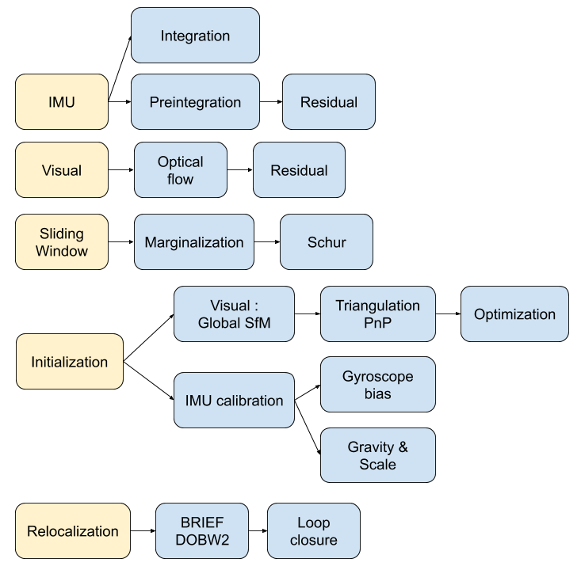
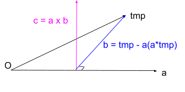
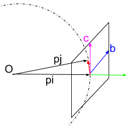
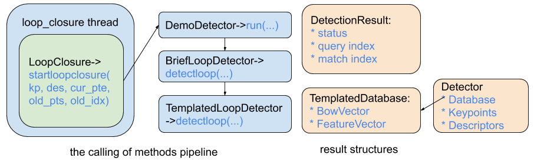

VINS code
=========================

Analysis the structure and the details of `VINS <https://github.com/HKUST-Aerial-Robotics/VINS-Mono>`_ code [#]_ . Take the android implement as example. As the original code is based on ROS(robot opeartion system), changes are made to create virtual ROS message, and manual call the ros callback functions. It has two main threads: **vins_estimator** and **loop_fusion**.

Top Node
----------------------------
In **naive-lib.cpp** all the intereface plugin functions are defined. In the android version code, there are lots of management of memory(mutex), query and buffer, and lots of global variables. It is the result of the absent of ROS, we need to take great consideration of these parts. 

The main node in VINS android is : **Estimator_node**. Where many fronter functions are defined : functions to run data set test, functions to run in real time. In the init() function , it starts three threads : **process**, **loop_detection**, **pose_graph**.
The main thread in ROS node is **process** it calls two essential functions **receive_IMU** and **receive_img**, they will call **img_callback**, **imu_callback**, and **feature_callback** respectively. And it is also responsible for loop deteciton and loop closure.

call from other
~~~~~~~~~~~~~~~~~~~~~~~

**receive_img**  (called in java plugins, used to show image in android application)

     -> img_callback : call this fcn when receive image
     
          -> proprecessing : gestion of frequence / error rejcetion judgements
          
          -> process the image (seperate the process of stereo camera and mono camera)
          
          -> calculate feature points ( **FeatureTracker** )-> call feature_callback (push the feature to buffer) 
          
          -> draw track messages to image (tracked points in green, not tracked points in red, etc)
          
     -> draw_mainui : call **DrawResult** class, to draw AR rendering(drawAR) or draw trajectory with map points(Reprojection)
     
     -> add more debug infomation to shown image

**receive_IMU** (called in **Phone Sensor**)

     -> imu_callback :
     
          -> add to process query 
          
          -> predict the current state (position, quaternion and velocity) by intergration (mean value). 

Details of mean value integration (in estimator_node -> predict()), where all the values are vectors:

.. math::
    \begin{cases}
    p_{k+1}  = p_{k} + v_{k} \delta t + \frac{1}{2} \bar{a}^{w} (\delta t)^{2}   \\
    v_{k+1} = v_{k} + \bar{a}^{w} \delta t   \\
    q_{k+1} = q_{k} \otimes \begin{bmatrix} 1 \\  \frac{1}{2}  \bar{\omega}  \delta t \end{bmatrix}  
    \end{cases}

.. math::
    \bar{\omega} = \frac{1}{2} (\omega_{k+1} + \omega_{k}) - b_{gyro} 

.. math::
    \bar{a}^{w} = \frac{1}{2} ( q_{k}(a_{k}^{b} - b_{acc}) + q_{k+1}(a_{k+1}^{b} - b_{acc}) ) - g_{k}

**Queation** : these results are never used, it is real necessary??

**Answer** : This is used as output between two camera frames, to achieve IMU-rate performance. This high-frequence state estimates can be utilized as state feedback for closed loop closure.

Process
~~~~~~~~~~~~~~~~~~~~~~~~~

* call sendIMU -> estimator.processIMU
* call estimator. processImage

**loop closure**
there are also loop closure process in this thread.

**Queation** we also have loop closure in process_loop_detection thread. Is is redundant??

process_loop_detection
~~~~~~~~~~~~~~~~~~~~~~~~~~~

* Take the first image from the keyframe buffer to process.
* Add the keyframe to **KeyFrameDatabase**.
* Extract Brief descriptors of the keyframe features.
* Start Loop Closure (**LoopClosure** class). if success, receive the looped kerframe's index. 
* if far enough, add this loop to process query<int> (optimize_posegraph_buf) : calculate the matches between current processing keyframe and the looped keyframe, then Pnp to get pose.
* if too many keyframe in database, downsample erase some keyframes.

process_pose_graph
~~~~~~~~~~~~~~~~~~~~~~~~~

* if we have loop in the query (optimize_posegraph_buf, as we may add loop in process_loop_detection thread).
* do optimize4DoFLoopPoseGraph (cerse solver, 4DOF as VINS has set the gravity direction to be vertical)
* update infomation for visualization
  
  
VINS estimator
----------------------------

Method called above in "top node" : estimator.processIMU, estimator.processImage, estimator.retrive_data_vector .  Its basic idea is to manage a **slide window** , make imu preintegration and imu observation, also marginalization, etc.

preintegration
~~~~~~~~~~~~~~~~~~

The system preintegation and the system state function can be write as :

.. math::
    R_{w}^{b_{k}}p_{b_{k+1}}^{w} = R_{w}^{b_{k}} ( p_{b_{k}}^{w} + v_{b_{k}}^{w} \Delta t_{k} - \frac{1}{2} g^{w} \Delta t_{k}^{2} ) + \alpha_{b_{k+1}}^{b_{k}}

.. math::
    R_{w}^{b_{k}}v_{b_{k+1}}^{w} = R_{w}^{b_{k}} ( v_{b_{k}}^{w} - g^{w} \Delta t_{k} ) + \beta_{b_{k+1}}^{b_{k}}
    
.. math::
    q_{w}^{b_{k}} \otimes q_{b_{k+1}}^{w} = \gamma _{b_{k+1}}^{b_{k}}

processIMU
~~~~~~~~~~~~~~~~~~~

A **IntegrationBase** class is made for pre-intergration management and calculation.

**IntegrationBase**
:::::::::::::::::::::::

* push back a new measurment : timestamp, gyrocope measure, and accelerometer measure. Add them to the buffer and **propagate** the system.
* midPointIntegration : basic it is the same expression as above, about we are doing integration for the **error term of preintegration** here (as a result, n gravity term here). (in the VINS source code, they note p, v, and q, however I found it being misleading, so I note them as alpha , beta and gamma as in [#]_ ).

.. math::
    \begin{cases}
    \alpha_{k+1}  = \alpha_{k} + \beta_{k} \delta t + \frac{1}{2} \bar{a}^{w} (\delta t)^{2}   \\
    \beta_{k+1} = \beta_{k} + \bar{a}^{w} \delta t   \\
    \gamma_{k+1} = \gamma_{k} \otimes \begin{bmatrix} 1 \\  \frac{1}{2}  \bar{\omega}  \delta t \end{bmatrix}  
    \end{cases}

.. math::
    \bar{\omega} = \frac{1}{2} (\omega_{k+1} + \omega_{k}) - b_{gyro} 

.. math::
    \bar{a}^{w} = \frac{1}{2} ( \gamma_{k}(a_{k}^{b} - b_{acc}) + \gamma_{k+1}(a_{k+1}^{b} - b_{acc}) )
    
* **Jacobian update** : (it is optinal, it is set true, However when considering First Estimation Jacobian , we should not update Jacobian) three matrix are calculated before to fasten. Noise is seen as gaussian. And the F matrix(15*15) and the error term propagation matrix V (15*18) are calculated. (remember to normalize quaternion). In the end, two 15*15 matrix : Jacobian and Covariance are calculated.

.. math::
    [R_{\omega}]_{X} = [ \bar{\omega} ]_{X} , 
    [R_{\tilde{a}_{k}}]_{X} = [a_{k}^{b} - b_{acc}]_{X},
    [R_{\tilde{a}_{k+1}}]_{X} = [a_{k+1}^{b} - b_{acc}]_{X}
 
.. math::
    R_{k} \leftarrow q_{k} , R_{k+1} \leftarrow q_{k+1}
    
Jacobian is (noted as F), F here is actual (I+F) in the original article:

.. math::
    \begin{bmatrix}
    I_{3 \times 3} & f_{12} & I_{3 \times 3} \delta t  & f_{14} & f_{15} \\
    0_{3 \times 3} & I -[R_{\omega}]_{X} \delta t & 0_{3 \times 3} & 0_{3 \times 3} & -I_{3 \times 3} \delta t \\
    0_{3 \times 3} & f_{32} & I_{3 \times 3} & f_{34} & f_{35} \\
    0_{3 \times 3} & 0_{3 \times 3} & 0_{3 \times 3} & I_{3 \times 3} & 0_{3 \times 3} & \\
    0_{3 \times 3} & 0_{3 \times 3} & 0_{3 \times 3} & 0_{3 \times 3} & I_{3 \times 3}
    \end{bmatrix}
    
.. math::
    f_{12} = - \frac{1}{4} R_{k} [R_{\tilde{a}_{k}}]_{X} (\delta t)^{2} - \frac{1}{4} R_{k+1} [R_{\tilde{a}_{k+1}}]_{X} (I - [R_{\omega}]_{X} \delta t) (\delta t)^{2}

.. math::
    f_{14} = - \frac{1}{4} ( R_{k} + R_{k+1} ) (\delta t)^{2}
    
.. math::  
    f_{15} = - \frac{1}{4} R_{k+1} [R_{\tilde{a}_{k+1}}]_{X}  (\delta t)^{2} (- \delta t)
    
.. math::
    f_{32} = - \frac{1}{2} R_{k} [R_{\tilde{a}_{k}}]_{X} \delta t - \frac{1}{2} R_{k+1} [R_{\tilde{a}_{k+1}}]_{X} (I - [R_{\omega}]_{X} \delta t) \delta t

.. math::
    f_{34} = - \frac{1}{2}( R_{k} + R_{k+1} )\delta t

.. math::
    f_{35} = - \frac{1}{2} R_{k+1} [R_{\tilde{a}_{k+1}}]_{X} \delta t (-\delta t)
    
The noise term matrix is (noted as V):
    
.. math::
    \begin{bmatrix}
    \frac{1}{4} R_{k}  (\delta t)^{2} & g_{12} & \frac{1}{4} R_{k+1}  (\delta t)^{2} \delta t & g_{14} & 0_{3 \times 3} & 0_{3 \times 3} \\
    0_{3 \times 3} & \frac{1}{2} I_{3 \times 3} \delta t & 0_{3 \times 3} & \frac{1}{2} I_{3 \times 3} \delta t & 0_{3 \times 3} & 0_{3 \times 3} \\
    \frac{1}{2} R_{k} \delta t & g_{32} & \frac{1}{2} R_{k+1} \delta t & g_{34} & 0_{3 \times 3} & 0_{3 \times 3} \\
    0_{3 \times 3} & 0_{3 \times 3} & 0_{3 \times 3} & 0_{3 \times 3} & I_{3 \times 3} \delta t & 0_{3 \times 3} & \\
    0_{3 \times 3} & 0_{3 \times 3} & 0_{3 \times 3} & 0_{3 \times 3} & 0_{3 \times 3} & I_{3 \times 3} \delta t
    \end{bmatrix}

.. math::
    g_{12} = g_{14} = - \frac{1}{4} R_{k+1} [R_{\tilde{a}_{k+1}}]_{X} (\delta t)^{2} (\frac{1}{2} \delta t)

.. math::
    g_{32} = g_{34} = - \frac{1}{2} R_{k+1} [R_{\tilde{a}_{k+1}}]_{X} \delta t (\frac{1}{2} \delta t)
    
This is a iteration process, as we can see below, as a result, the Jacobian is the acculumation of F.

.. math::
    \delta x_{k+1} = F_{k+1} \delta x_{k} = F_{k+1} F_{k} ... F_{1} \delta x_{0} = J_{k+1} \delta x_{0}

.. math::
    Jacobian_{k+1} = F_{k+1} * Jacobian_{k}

.. math::
    Covariance_{k+1} = F_{k+1} * Covariance_{k} * F_{k+1}^{T} + V_{k+1} * Noise * V_{k+1}^{T}
    
* **evaluate** : calcuates the residual (15*1 vector)

* also have checkJacobian : to check the calculation of jacobian of the system;  offer an option of eulerIntegration (however it is less precise than mid point integration); and compare the results of mid point integration and euler integration.

**Integration** 
:::::::::::::::::::

In the final part of processIMU, the integration terms of the real world **physics variables** are calculated as below, where j indicates ith window, k indicates kth imu data (between two received image). 
    
.. math::
    \begin{cases}
    P_{j,k+1} = P_{j,k} + V_{j,k} \delta t + \frac{1}{2} \bar{a}_{j,k+1}^{w} (\delta t)^{2}  \\
    V_{j,k+1} = V_{j,k} + \bar{a}_{j,k+1}^{w} \delta t  \\
    Q_{j,k+1} = Q_{j,k} \otimes \begin{bmatrix} 1 \\  \frac{1}{2}  \bar{\omega}  \delta t \end{bmatrix}
    \end{cases}
    
.. math::
    \bar{a}_{j,k+1}^{w} = \frac{1}{2}(Q_{j,k} (a_{j,k}^{b} - b_{acc,j})  + Q_{j,k+1} (a_{j,k+1}^{b} - b_{acc,j}) ) - g^{w}

.. math::
    \bar{\omega}_{j,k+1} = \frac{1}{2} (\omega_{k+1} + \omega_{k}) - b_{gyro,j} 

processImage
~~~~~~~~~~~~~~~~~~~~~~~

**Pipeline**:

* **addFeatureCheckParallax** check the image simliarity, to choose whether **marginalize** the oldest image in the window(to make space for the new coming , and the current image is treated as new keyframe) or the last image in the window (if the recent images are similar).
* create new image frame, and create the image pre-integration base.
* option : ( ESTIMATE_EXTRINSIC == 2 ) calibrate the extrinsic parameters.
* (solver_flag == INITIAL) -> fill the slide window and try to initialize **initialStructure**.
* (solver_flag == NON_LINEAR) -> initialize success, manage the slide window.

initialStructure
~~~~~~~~~~~~~~~~~~~~~~~~~~

* This is the main part of the initialization process of VINS, and it is realized by a global SFM. So I will cover its details in GLOBAL SFM part.

solveOdometry
~~~~~~~~~~~~~~~~~~~~

* f_manager.triangulate
* optimization()

slideWindow
~~~~~~~~~~~~~~~~~~~~~

* slideWindowOld : (solver_flag == NON_LINEAR ? true : false) f_manager.removeBackShiftDepth,  f_manager.removeBack
* slideWindowNew : f_manager.removeFront

optimization
~~~~~~~~~~~~~~~~~~~~~~~~~~

use ceres to optimize : CauchyLoss

* add pose local parameter block (of the slide window)
* add current frame pose block
* add residual of imu preintegrations (of the slide window) 
* add feature residual  (ESTIMATE_TD option)
* marginalization_info->addResidualBlockInfo of the upper resiudal

linear_solver_type set to ceres::DENSE_SCHUR, trust_region_strategy_type set to ceres::DOGLEG.

Slide window marginalization.

* marginalization_info->preMarginalize();
* marginalization_info->marginalize();

Marginalization
---------------------

ResidualBlockInfo
~~~~~~~~~~~~~~~~~
**Evaluate** : evaluate the ceres loss evaluate.
In ceres the evaluate result is a three-deminsion vector , where r is the squared norm. And the loss function is a costume defined function.

.. math::
    rho = \begin{bmatrix} \rho(r) & \rho ' (r) & \rho '' (r) \end{bmatrix}

.. math::
    r = \lVert \mathbf{r} \rVert^{2} 

And VINS uses an factor alpha to control its jacobian.

.. math::
    \alpha = 1 - \sqrt{  1 + 2  r \frac{rho_{2}}{rho_{1}} }

.. math::
    r_{scaled} =  \frac{ \sqrt{rho_{1}} }{1- \alpha}

.. math::
    \mathbf{J}_{i} \leftarrow \sqrt{rho_{1}} (\mathbf{J}_{i} - \frac{\alpha}{r} \mathbf{r} (\mathbf{r}^{T} \mathbf{J}_{i}))

MarginalizationInfo
~~~~~~~~~~~~~~~~~~~~~~~

* std::unordered_map<long, int> parameter_block_size; //global size
* std::unordered_map<long, int> parameter_block_idx; //local size

**preMarginalize** : retrive ResidualBlockInfo->cost_function->parameter_blocks

**marginalize**: from `viki page <https://en.wikipedia.org/wiki/Marginal_distribution>`_  and `CSDN <https://blog.csdn.net/heyijia0327/article/details/52822104>`_ we can learn about marginalize.
When a key frame is delete from the slide window, we should not directly delete all its parameters, as it will lead to infomation lose. The solution is to use marginalzation algorithm, in which way to keep part of the old infomation to the current state, while delete these old variables. 

we can rewrite the system state as :

.. math::
    \delta x = \begin{bmatrix} \delta x_{old} & \delta x_{recent}  \end{bmatrix} 

As the result the system function can be rewrite as : 

.. math::
    \begin{bmatrix} \Lambda_{a} &  \Lambda_{b} \\  \Lambda_{b}^{T} &  \Lambda_{c} \end{bmatrix}
    \begin{bmatrix} \delta x_{old} \\ \delta x_{recent}  \end{bmatrix} 
    = \begin{bmatrix} b_{old} \\ b_{recent}  \end{bmatrix} 

Then we can rewrite the function to the form:

.. math:: 
     \begin{bmatrix} \Lambda_{a} &  \Lambda_{b} \\  0 &  \Lambda_{c} - \Lambda_{b}^{T}\Lambda_{a}^{-1}\Lambda_{b} \end{bmatrix}
    \begin{bmatrix} \delta x_{old} \\ \delta x_{recent}  \end{bmatrix} 
    = \begin{bmatrix} b_{old} \\ b_{recent} - \Lambda_{b}^{T}\Lambda_{a}^{-1}b_{old} \end{bmatrix} 

In VINS source code,  A and b are defined as follow:

.. math:: 
    A = \Lambda_{c} - \Lambda_{b}^{T}\Lambda_{a}^{-1}\Lambda_{b}

.. math::
    b = b_{recent} - \Lambda_{b}^{T}\Lambda_{a}^{-1}b_{old}

In our non linear optimization we have :

.. math::
    J^{T}J \delta x = - J^{T}b   \Rightarrow  A \delta x = - J^{T}b \Rightarrow A = J^{T}J

**SVD**：We can express an matrix by its singular value decomposition (SVD) :
  
.. math::
    A = U \Lambda V^{T} = (U \sqrt{\Lambda}) ( \sqrt{\Lambda} V^{T})

where U,V are orthogonal matrices and \Lambda is a diagonal matrix that is compose of multiple singular values arranged in decreasing order. We can further use these eigen values (elements of Lambda) to decomprose the image into multiple rank 1 matrices :

.. math::
    A = \sum_{i=1}^{n} \lambda_{i} ( \mathbf{ u_{i} v_{i}^{T} } )

We can calculate the Jacobian by SVD, and also make it positive defined at the same time.
And Eigen::SelfAdjointEigenSolver is used to calculate the eigen values of A. And set the negative values of these eigenvalues (by selecting the elements smaller than eps=1e-8) set them to be zero. This is to choose the positive eigen values to make jacobian **positive defined** .

.. math::
    \vec{s} = \begin{bmatrix} \lambda_{1} & \lambda_{2} & ... & \lambda_{n} \end{bmatrix}
    
.. math::
    1/\vec{s} = \begin{bmatrix} 1/\lambda_{1} & 1/\lambda_{2} & ... & 1/\lambda_{n} \end{bmatrix}

.. math::
    \sqrt{\vec{s}} = \begin{bmatrix} \sqrt{\lambda_{1}} & \sqrt{\lambda_{2}} & ... & \sqrt{\lambda_{n}} \end{bmatrix}

.. math::
    V = \begin{bmatrix} \vec{v}_{1} & \vec{v}_{2} & ... & \vec{v}_{n} \end{bmatrix}

Then linearized jacobian and linearized residual are defined :

.. math::
    J_{l} = Diag[\sqrt{\vec{s}}] V^{T}

.. math::
    r_{l} = Diag[1/\sqrt{\vec{s}}] V^{T} b

This is similar to filter based image processing methods, such as in fourier transform filter or as we have seen before in `Image blury <https://vio.readthedocs.io/en/latest/Prepare.html#singular-feature>`_ . We can say,that it will keep most of the original infomation. 

MarginalizationFactor
~~~~~~~~~~~~~~~~~~~~~~~
It is derivated from ceres::CostFunction. The **Evaluate** function is redefined here.

**point position**

.. math::
    \Delta x = p - \bar{p}
    
**camera pose**

.. math::
    \Delta x = \Delta x_{p} + \Delta x_{q}

.. math::
    \Delta x_{p} = p - \bar{p}
    
.. math::
    \Delta x_{q} = 2 \bar{q}^{-1} \otimes q

.. math::
    if: \Delta x_{q}.w < 0 \rightarrow \Delta x_{q} = - \Delta x_{q}

**sum**

.. math::
    \sum{r_{l}} = \sum {J_{l} * \Delta x}

**update jacobian**

set the elements related to the old frame to be zeros. And set the rest elements by the linearized jacobian (as calculated above in MarginalizationInfo).

Feature Manager
---------------------
* list<FeaturePerId> feature
* vector<FeaturePerFrame> feature_per_frame

Global SfM
-----------------------

This is a simplified Global SfM method, reduced lots of algorithm details (outlier rejection, retriangulation, multiply global BA, etc). However, it works well for a real time SLAM application, and we can try multiply times to initialize. 

Main process loop
~~~~~~~~~~~~~~~~~~~~~

1. check IMU state. where Delta V is the result of preintegration between two frames in integration base, Delta t is the time interval between frames. To make sure the IMU data in the window have enough variance, so that it may give enough triangulation possibility. The main process is realized by :

.. math::
    \bar{g} = \frac{1}{Size_{window}} \sum_{window} \frac{\Delta v} {\Delta t}

.. math::
    \Delta g = \frac{\Delta v}{\Delta t} - \bar{g}
    
.. math::
    Var = \sqrt{ \frac{1}{Size_{window}} \sum_{window} (\Delta g)^{T} (\Delta g)  }

* if Var < 0.25 : "IMU excitation not enouth!" (that is to say , IMU hasn't enough variance). But in real AR application test, we found this part may not be necessary. 

2. Initialize a sfm features vector by **FeatureManager** .
3. Check the relative pose, if not enough features or parallax, ask to move the device.
4. **GlobalSFM** process, this is the main part of the whole process. And global SFM process will return a value "l", which indicates the reference frame index. As a result, the lth frame will be our world frame.
5. If global sfm succeed, solve PnP for all frames. To calcuate all the pose with respect to the lth frame.
6. **fcn visualInitialAlign** which is to optimize and refine the IMU parameters.   

Notice that, in Estimator::initialStructure(), the system will solve PnP again, after this Global SfM process. Why?

Their are several port to call this process:

1. Initialization state (when the system begin).
2. When failure detected. They are some criterions to tell that the system may fail (for example, un normal movement). This part should be paied enough attention. (In real application, it is mostly the estimated bias of accelerator too large, which is un norml)

triangulate point
~~~~~~~~~~~~~~~~

Given two corresponding points image pixel positions and corresponding camera poses, result in its 3d position. (notice: the image pixel poistion is the homo-pose in camera reference, which is [x/z, y/z] ). VINS uses DLT method to solve the problem as explained in section triangulation in chapter SFM.

solveFrameByPnP
~~~~~~~~~~~~~~~~~
In the **SFM Feature** class, saved all the observation of this point. Retrieve these observation, find the processing frame id to collect 3d and 2d infomation.
Then use opencv sove pnp method to solve pose (none RANSAC).

triangulateTwoFrames
~~~~~~~~~~~~~~~~~~~~~~~
Use **SFM Feature** to collect matching infomation. Triangulate all the correspoding points between two frames, and set these 3d values to a vector of SFM Feature (by **overwriting**).

construct
~~~~~~~~~~~~
Main process of this class. Use global struction from motion method to initialize the map. ("l" is actually "l+1" in the source code, to simplify keep "l")

**init**:

* Create array to save all camera poses (boost::shared_array for armeabi-v7a ndk to not getting any error).
* Initialize two camera view: the lth and the last. Set the lth camera pose as identity, and set the last pose by giving relative transform(current frame to lth frame) as input.

**triangulate points and solve PnP for frames** :

* Triangulate lth frame with the current frame.
* Solve PnP lth to (current-1) frames, and triangulate each of them with the current frame.
* Triangulate all other frames with the 1st frame.
* Solve PnP for the 1st frame to (l-1)th frame, and triangulate each of them with the lth frame.
* Triangulate all other points (by the first and the last observation)
* if any of the upper PnP failed, return false (initialization failed)

**Global BA**:

* Fully BA : fail -> initialization failed; success -> assign quaternion and translation.

VisualIMUAlignment
-----------------------------
IMU calibration process is done here by visual and IMU alignment.

The first order approximation of :math:`\alpha, \beta, \gamma` with respect to biases can be write as:

.. math::
    \alpha_{b_{k+1}}^{b_{k}} \approx \hat{\alpha}_{b_{k+1}}^{b_{k}} + J_{b_{acc}}^{\alpha} \delta b_{acc_{k}} + J_{b_{gyro}}^{\alpha}\delta b_{gyrp_{k}}
    
.. math::
    \beta_{b_{k+1}}^{b_{k}} \approx \hat{\beta}_{b_{k+1}}^{b_{k}} + J_{b_{acc}}^{\beta} \delta b_{acc_{k}} + J_{b_{gyro}}^{\beta}\delta b_{gyrp_{k}}
    
.. math::
    \gamma_{b_{k+1}}^{b_{k}} \approx \hat{\gamma}_{b_{k+1}}^{b_{k}} \otimes 
             \begin{bmatrix}  1 \\  \frac{1}{2} J_{b_{gyro}}^{\gamma} \delta b_{gyrp_{k}} \end{bmatrix}

Gyroscope Bias Calibration
~~~~~~~~~~~~~~~~~~~~~~~~
In function **solveGyroscopeBias**. For all consecutive frames in the Global SfM optimized slide window (:math:`b_{i},b_{i+1}`).
The preintegration between these two frames can be got from upper steps (:math:`\alpha, \beta, \gamma`).
We have their poses (:math:`q_{b_{i}}, q_{b_{i+1}}`) from Global SfM process, their relative pose is:

.. math::
    q_{b_{i},b_{i+1}} = q_{b_{i}}^{-1} \otimes q_{b_{i+1}}

To calibration the gyroscope, we try to minimize the following cost function:

.. math::
    \min_{\delta b_{gyro}} \sum_{k} \| q_{i+1}^{-1} \otimes q_{i} \otimes  \gamma_{b_{k+1}}^{b_{k}}  \|^{2} 

Take the inverse of the upper function:

.. math::
    \min_{\delta b_{gyro}} \sum_{k} \| (\gamma_{b_{k+1}}^{b_{k}})^{-1} \otimes  q_{b_{i},b_{i+1}}  \|^{2}

Add the first order approximation w.r.t bias of gyroscope:

.. math::
    \min_{\delta b_{gyro}} \sum_{k} \| (\hat{\gamma}_{b_{k+1}}^{b_{k}} \otimes \begin{bmatrix}  1 \\  \frac{1}{2} J_{b_{gyro}}^{\gamma} \delta b_{gyrp_{k}} \end{bmatrix} )^{-1} \otimes  q_{b_{i},b_{i+1}}  \|^{2}

As the :math:`\delta b_{gyro}` part is very small, we can rewrite the function as :

.. math::
    \min_{\delta b_{gyro}} \sum_{k} \| \begin{bmatrix}  1 \\  - \frac{1}{2} J_{b_{gyro}}^{\gamma} \delta b_{gyrp_{k}} \end{bmatrix} (\hat{\gamma}_{b_{k+1}}^{b_{k}})^{-1} \otimes  q_{b_{i},b_{i+1}}  \|^{2}

For a quaternion, its "w" term is always one, so we delete this part from the function, only consider the vector part in the following part, as a result the upper problem becomes:

.. math::
    \min_{\delta b_{gyro}} \sum_{k} \| 2(\hat{\gamma}_{b_{k+1}}^{b_{k}})^{-1} \otimes  q_{b_{i},b_{i+1}}  -  J_{b_{gyro}}^{\gamma} \delta b_{gyrp_{k}} \|^{2} = \min_{\delta b_{gyro}} \sum_{k} \| b - A\delta b_{gyrp_{k}} \|^{2}

The problem can be rewrite as :

.. math::
     b_{gyro}  = arg \min_{b_{gyro}} \sum_{k} \| b_{k}-  A_{k} b_{gyrp_{k}}\|^{2}

Reorder the problem, and times :math:`A_{k}^{T}` in both sides (as :math:`A^{T}A` is a positive definite matrix, make it for LDLT solver).

.. math::
     \sum_{k} b = (\sum_{k} A) (b_{gyrp_{k}})

.. math::
     (\sum_{k} A^{T}b) = (\sum_{k} A^{T}A) (b_{gyrp_{k}})

Then **LDLT** (Robust Cholesky decomposition of a matrix with pivoting) will be used to solve.
Then :math:`\delta b_{gyro}` will be added to the original bias to update.
After the gyroscope bias updated, repropagation step will be done to update all IMU preintegration terms.

TangentBasis
~~~~~~~~~~~~~~~~~~~
VINS will set the gravity direction to be the z axis, this function will be used to calculate the other two axises.
The result b and c vector is shown below:

LinearAlignment
~~~~~~~~~~~~~~~~~~~~~~

**Velocity, Gravity Vector and Metric Scale Initialization** (The gravity scale will not be traited as a pre-defined value in this process)

**Accelerometer bias**, as the author claimed, the accelerometer bias is coupled with gravity, and due to the large magnitude of the gravity vector comparing to platform dynamics, and the relatively short during of the initailization phase, these bias terms are hard to observe. 

As a result, therefor the state variable should be :

.. math::
    Dof = 3 \times N_{Frames} + 3_{Gravity Direction} + 1_{Scale}

.. math::
    \mathcal{X}_{I} = \begin{bmatrix} \mathbf{v}_{b_{0}}^{b_{0}} & \mathbf{v}_{b_{1}}^{b_{1}} & ... & \mathbf{v}_{b_{n}}^{b_{n}} & \mathbf{g}^{c_{0}} & s \end{bmatrix}

where :math:`\mathbf{v}_{b_{i}}^{b_{i}}` is the velocity in body frame while taking the ith image,  :math:`{g}^{c_{0}}` is the gravity vector, and s the scale factor to metric units.

We can rewrite the system function of **two images** in slide window (in preintegration section), adding the scale factor:

.. math::
    \alpha_{b_{k+1}}^{b_{k}} = R_{w}^{b_{k}} ( s (p_{b_{k+1}}^{w} - p_{b_{k}}^{w}) - v_{b_{k}}^{w} \Delta t_{k} + \frac{1}{2} g^{w} \Delta t_{k}^{2} ) 
    
.. math::
    \Longrightarrow  \alpha_{b_{k+1}}^{b_{k}} = R_{w}^{b_{k}} ( s (p_{b_{k+1}}^{w} - p_{b_{k}}^{w}) - R_{b_{k}}^{w}v_{b_{k}}^{b_{k}} \Delta t_{k} + \frac{1}{2} g^{w} \Delta t_{k}^{2} ) 

.. math::
    \beta_{b_{k+1}}^{b_{k}} = R_{w}^{b_{k}} ( v_{b_{k+1}}^{w} - v_{b_{k}}^{w} + g^{w} \Delta t_{k} ) 
    
.. math::
    \Longrightarrow  \beta_{b_{k+1}}^{b_{k}} = R_{w}^{b_{k}} ( R_{b_{k+1}}^{w} v_{b_{k+1}}^{b_{k+1}} - R_{b_{k}}^{w} v_{b_{k}}^{b_{k}} + g^{w} \Delta t_{k} ) 

Rerange the upper functions into the form below:

.. math::
    \begin{cases}
    \alpha_{b_{k+1}}^{b_{k}} = - \Delta t_{k}v_{b_{k}}^{b_{k}} + 0 *v_{b_{k+1}}^{b_{k+1}} + \frac{1}{2} R_{w}^{b_{k}} \Delta t_{k}^{2} g^{w} + R_{w}^{b_{k}} (p_{b_{k+1}}^{w} - p_{b_{k}}^{w}) s 
    
    \beta_{b_{k+1}}^{b_{k}} = - v_{b_{k}}^{b_{k}} + R_{w}^{b_{k}} R_{b_{k+1}}^{w} v_{b_{k+1}}^{b_{k+1}} + R_{w}^{b_{k}} \Delta t_{k}g^{w} + 0*s 
    \end{cases}

As a result the system can be rewrite as:

.. math::
    \begin{bmatrix} \alpha_{b_{k+1}}^{b_{k}} \\ 
    \beta_{b_{k+1}}^{b_{k}}  \end{bmatrix} =
    \begin{bmatrix}    - \Delta t_{k} \mathbf{I} & \mathbf{0} &  \frac{1}{2} R_{w}^{b_{k}} \Delta t_{k}^{2} & R_{w}^{b_{k}} (p_{b_{k+1}}^{w} - p_{b_{k}}^{w}) \\
    -\mathbf{I} &  R_{w}^{b_{k}} R_{b_{k+1}}^{w}  & R_{w}^{b_{k}} \Delta t_{k} & \mathbf{0}
    \end{bmatrix}
    \begin{bmatrix} v_{b_{k}}^{b_{k}} \\ v_{b_{k+1}}^{b_{k+1}} \\  g^{w} \\ s  \end{bmatrix}
    
.. math::
    \hat{z}_{b_{k+1}}^{b_{k}} = \mathbf{H}_{b_{k+1}}^{b_{k}} \mathcal{X}_{I} 

Turn the upper z into our relative preintegration in the body frame:

.. math::
    \hat{z}_{b_{k+1}}^{b_{k}} = 
    \begin{bmatrix} \hat{\alpha}_{b_{k+1}}^{b_{k}} - p_{c}^{b} + R_{w}^{b_{k}}R_{b_{k+1}}^{w}p_{c}^{b} \\ 
    \hat{\beta}_{b_{k+1}}^{b_{k}}  \end{bmatrix} 
    = \mathbf{H}_{b_{k+1}}^{b_{k}} \mathcal{X}_{I} 

The problem becomes :

.. math::
    \mathcal{X}_{I} = arg \min_{ \mathcal{X}_{I} } \sum_{k}  \|  \hat{z}_{b_{k+1}}^{b_{k}} - \mathbf{H}_{b_{k+1}}^{b_{k}} \mathcal{X}_{I} \|^{2}

where :math:`\hat{z}_{b_{k+1}}^{b_{k}}` can be obtained from preintegration.

.. math::
    \hat{z}_{b_{k+1}}^{b_{k}} = \mathbf{H}_{b_{k+1}}^{b_{k}} \mathcal{X}_{I}
    
.. math::
    (\mathbf{H}_{b_{k+1}}^{b_{k}})^{T} \hat{z}_{b_{k+1}}^{b_{k}} = (\mathbf{H}_{b_{k+1}}^{b_{k}})^{T} \mathbf{H}_{b_{k+1}}^{b_{k}} \mathcal{X}_{I}

We can use **IDIT** to solve it (Same as before, times the transpose of H in both sides, to make a positive definite matrix).
After this linear alignment , gravity will be refined.

RefineGravity
~~~~~~~~~~~~~~~~~~~~~
The gravity vector obatined from the previous linear initialization step can be refined by constraining the magnitude.
As a result the gravity will remain 2 degree of freedom. Therefore the gravity will be re-parameterized with two variables on its tangent space (by TangentBasis function).

.. math::
    \bar{\mathbf{g}} = g \hat{\mathbf{g}} + w_{b} \mathbf{b} + w_{c} \mathbf{c} 

This new gravity form will be substituted into the upper linear alignment process. The new state will be:

.. math::
    Dof = 3 \times N_{Frames} + 1_{w_{b}} + 1_{w_{c}} + 1_{Scale}

.. math::
    \mathcal{X}_{I} = \begin{bmatrix} \mathbf{v}_{b_{0}}^{b_{0}} & \mathbf{v}_{b_{1}}^{b_{1}} & ... & \mathbf{v}_{b_{n}}^{b_{n}} & w_{b} & w_{c} & s \end{bmatrix}

The system function should be rewrite as :

.. math::
    \begin{bmatrix} \hat{\alpha}_{b_{k+1}}^{b_{k}} - p_{c}^{b} + R_{w}^{b_{k}}R_{b_{k+1}}^{w}p_{c}^{b} - \frac{1}{2} R_{w}^{b_{k}} g_{0} \Delta t_{k}^{2}\\ 
    \hat{\beta}_{b_{k+1}}^{b_{k}} - R_{w}^{b_{k}} g_{0} \Delta t_{k} \end{bmatrix} = 
    \begin{bmatrix}    - \Delta t_{k} \mathbf{I} & \mathbf{0} &  \frac{1}{2} R_{w}^{b_{k}} \mathbf{b} \Delta t_{k}^{2} &  \frac{1}{2} R_{w}^{b_{k}} \mathbf{c} \Delta t_{k}^{2} & R_{w}^{b_{k}} (p_{b_{k+1}}^{w} - p_{b_{k}}^{w}) \\
    -\mathbf{I} &  R_{w}^{b_{k}} R_{b_{k+1}}^{w}  & R_{w}^{b_{k}}\mathbf{b} \Delta t_{k} & R_{w}^{b_{k}} \mathbf{c} \Delta t_{k} & \mathbf{0}
    \end{bmatrix}
    \begin{bmatrix} v_{b_{k}}^{b_{k}} \\ v_{b_{k+1}}^{b_{k+1}} \\  w_{b} \\ w_{c} \\ s  \end{bmatrix}

Use the IDLT as the same before to solve it. Then update the new gravity re-parameterizition.

This process will be done four iterations (not as the article said : until gravity converges).

Factors
---------------------
In factors,  we have the residual calculations and corresponding jacobian calculations.

Projection Factor
~~~~~~~~~~~~~~~~~~~~
Projection factor corresponding to **visual reprojection error** which can also be called as visual measurement residual.
Considering a feature first seen in the ith frame, and analysis the residual for the feature observation in the jth frame.
The camera model can be seen as a ray casting from the camera optical center, so the 3d matched point vector (to the jth camera center) and the 2d feature vector should be in the same direction. As a result, the residual is evaluated within the tangant plane.

.. math::
    p_{j} = \pi_{c}^{-1} \begin{bmatrix} u_{c_{j}} \\ v_{c_{j}}  \end{bmatrix} = \begin{bmatrix} \bar{X}_{c_{j}} \\ \bar{Y}_{c_{j}} \\ \bar{Z}_{c_{j}}  \end{bmatrix}

where [ :math:`\bar{X}_{c_{j}} , \bar{Y}_{c_{j}} , \bar{Z}_{c_{j}}`] is a unit vector in the jth camera frame (:math:`\pi^{-1}` realize this operation using camera intrinsic parameters).

.. math::
    \hat{p}_{i} = R_{b}^{c} (R_{w}^{b_{j}} (R_{b_{i}}^{w} ( R_{c}^{b} \frac{1}{\lambda} \pi_{c}^{-1} \begin{bmatrix} u_{c_{i}} \\ v_{c_{i}}  \end{bmatrix} + p_{c}^{b} ) + p_{b_{i}}^{w} ) + p_{w}^{b_{j}} ) + p_{b}^{c}

Which is a chaine of transform : ith camera :math:`\rightarrow` ith body :math:`\rightarrow` world :math:`\rightarrow` jth body :math:`\rightarrow` jth camera (VINS system use the inverse depth rather than 3d pose as variable, so lambda appears here as the inverse of depth).
Vector in red in the upper image can be expressed as : 

.. math::
    \mathbf{d} = p_{j} - p_{i} = p_{j} - \frac{ \hat{p}_{i} } { \| \hat{p}_{i} \|}

Finally, the residual can be write as (the square sum of the residual is actually the length of d):

.. math::
    \mathbf{r} = \begin{bmatrix} \mathbf{b} \cdot \mathbf{d} \\ \mathbf{c} \cdot \mathbf{d}  \end{bmatrix}
    
DT optimization
~~~~~~~~~~~~~~~~~~~~
Here we talk about the optimization of the error of timestamp **td** (the error of timestamp of the camera sensor and the IMU sensor). It is mostly introduced by the explosion time of camera, and also influenced by other hardware processing. It is included as a part of VINS-mono, but is removed in VINS-Fusion. 

This is realized by rewrite point poisition in the reprojection error factor with :

.. math::
    p_{i} \leftarrow p_{i} - [(td - td_{i}) + \frac{TR}{ROW}row_{i}] * v_{i}
    
    p_{j} \leftarrow p_{j} - [(td - td_{j}) + \frac{TR}{ROW}row_{j}] * v_{j}

Where, TR is the rolling camera parameter (the time of each rolling), for global shutter camera TR equals zero.

Loop Closure
---------------------

VINS uses DBOW2 for the detection of loops. The basic pipeline and some important structures can be seen in the figure below.

The processing in the detectloop function is :

1. Transform the descriptor into **BowVector** and **FeatureVector** (which are types of DBOW).
2. If the query id is large enough. Query the transformed two vectors into the bag-of-words database to find matches.
3. Add the two vectors to the bag-of-words database anyway.
4. Delete the candidates with low scores, after which, initialize the match index as the candidate with the highest score if exists.
    * And will transform the query result into a vector of "islands" (that is, divide all the candidates into blocks in ascending order of ids)
    * Find the island with the highest score. 
5. Check geometrically consistent by **isGeometricallyConsistent_DI**.
    * Use the island with the highest score (we have found above) to check
6. Save the keypoints, descriptors (for geometry check), and this BowVector(for NSS normalization).

Map save
~~~~~~~~~~~
As a result, if I want to save the map. I need :

* DBOW2 Bag-of-words database.
* All the history keypoints and descriptors. (If I want to enable the geometry check) 

As DBOW2's database has its own load/save support, this will be a easy work. As for the keypoints and descripotrs we need to save them in correct format in binary file (txt/json/xml/etc will work too, but binary is the fastest choice).

Reference
---------------------

.. [#] Qin T, Li P, Shen S. Vins-mono: A robust and versatile monocular visual-inertial state estimator[J]. IEEE Transactions on Robotics, 2018, 34(4): 1004-1020.
.. [#] Sola J. Quaternion kinematics for the error-state Kalman filter[J]. arXiv preprint arXiv:1711.02508, 2017.

