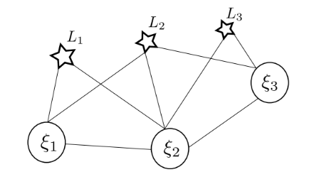
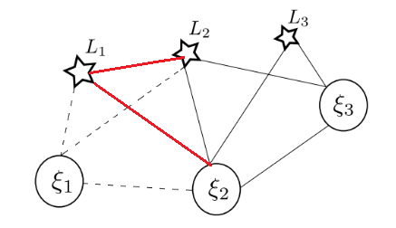
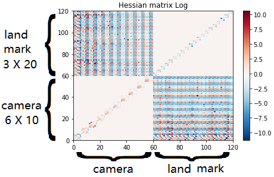
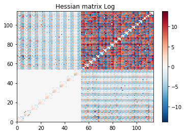
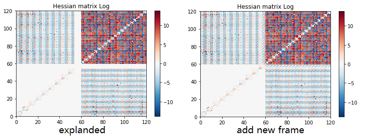

VIO deep blue
-------------------------

**Question 1**: 
~~~~~~~~~~~~~~~~~

At a certain time, the cameras and landmarks seen of a SLAM system can be seen as the image below. xi is the camera pose, L represents the observed landmark. When a landmark k was seen by ith camera in the world frame, the reprojection error is noted as r(xi_i, L_k)

**1.1 the information matrix of the upper system** :

In our system, the state variable x can be written as :

.. math::
    \mathbf{x} = \begin{bmatrix}  \xi_{1} & \xi_{2} & \xi_{3} & L_{1} & L_{2} & L_{3}   \end{bmatrix}

As a result, we have seven elements in the reprojection error term:

.. math:: 
    r_{1,1} = r(\xi_{1}, L_{1}) , r_{1,2} = r(\xi_{1}, L_{2})

.. math:: 
    r_{2,1} = r(\xi_{2}, L_{1}) , r_{2,2} = r(\xi_{2}, L_{2}), r_{2,3} = r(\xi_{2}, L_{3})

.. math:: 
    r_{3,2} = r(\xi_{3}, L_{2}) ,  r_{3,3} = r(\xi_{3}, L_{3})

Add the constrains between cameras :

.. math::
    r_{8} = r(\xi_{1}, \xi_{2}), r_{9} = r(\xi_{2}, \xi_{3})
    
The system jacobian can be written as :
    
.. math::
    J = \frac{\partial \mathbf{r}}{\partial \mathbf{x}}
    = \begin{bmatrix}
    \frac{\partial r_{1,1}}{\partial \xi_{1}} & 0 & 0 & \frac{\partial r_{1,1}}{\partial L_{1}} & 0 & 0 \\
    \frac{\partial r_{1,2}}{\partial \xi_{1}} & 0 & 0 & 0 & \frac{\partial r_{1,2}}{\partial L_{2}} & 0 \\
    0 & \frac{\partial r_{2,1}}{\partial \xi_{2}} & 0 & \frac{\partial r_{2,1}}{\partial L_{1}} & 0 & 0 \\
    0 & \frac{\partial r_{2,2}}{\partial \xi_{2}} & 0 & 0 & \frac{\partial r_{2,2}}{\partial L_{2}} & 0 \\
    0 & \frac{\partial r_{2,3}}{\partial \xi_{2}} & 0 & 0 & 0 & \frac{\partial r_{2,3}}{\partial L_{3}} \\
    0 & 0 & \frac{\partial r_{3,2}}{\partial \xi_{3}} & 0 & \frac{\partial r_{3,2}}{\partial L_{2}} & 0 \\
    0 & 0 & \frac{\partial r_{3,3}}{\partial \xi_{3}} & 0 & 0 & \frac{\partial r_{3,3}}{\partial L_{3}} \\     
    \frac{\partial r_{8}}{\partial \xi_{1}} & \frac{\partial r_{8}}{\partial \xi_{2}} & 0 & 0 & 0 & 0   \\
    0 & \frac{\partial r_{9}}{\partial \xi_{2}} & \frac{\partial r_{9}}{\partial \xi_{3}} & 0 & 0 & 0   
    \end{bmatrix}

.. math::
    J^{T}
    = \begin{bmatrix}
    (\frac{\partial r_{1,1}}{\partial \xi_{1}})^{T} & (\frac{\partial r_{1,2}}{\partial \xi_{1}})^{T} & 0 & 0 & 0 & 0 & 0 & (\frac{\partial r_{8}}{\partial \xi_{1}})^{T} & 0 \\
    0 & 0 & (\frac{\partial r_{2,1}}{\partial \xi_{2}})^{T} & (\frac{\partial r_{2,2}}{\partial \xi_{2}})^{T} & (\frac{\partial r_{2,3}}{\partial \xi_{2}})^{T} & 0 & 0 & (\frac{\partial r_{8}}{\partial \xi_{2}})^{T} & (\frac{\partial r_{9}}{\partial \xi_{2}})^{T}  \\
    0 & 0 & 0 & 0 & 0 & (\frac{\partial r_{3,2}}{\partial \xi_{3}})^{T} & (\frac{\partial r_{3,3}}{\partial \xi_{3}})^{T} & 0 & (\frac{\partial r_{9}}{\partial \xi_{3}})^{T} \\
    (\frac{\partial r_{1,1}}{\partial L_{1}})^{T} & 0 & (\frac{\partial r_{2,1}}{\partial L_{1}})^{T} & 0 & 0 & 0 & 0 & 0 & 0\\
    0 & (\frac{\partial r_{1,2}}{\partial L_{2}})^{T} & 0 & (\frac{\partial r_{2,2}}{\partial L_{2}})^{T} & 0 & (\frac{\partial r_{3,2}}{\partial L_{2}})^{T} & 0 & 0 & 0\\
    0 & 0 & 0 & 0 & (\frac{\partial r_{2,3}}{\partial L_{3}})^{T} & 0 & (\frac{\partial r_{3,3}}{\partial L_{3}})^{T} & 0 & 0    
    \end{bmatrix}
    
The corresponding covariance matirx is :

.. math::
    \mathbf{\Sigma} = Diag(
    \begin{bmatrix} \Sigma_{1,1} & \Sigma_{1,2} & \Sigma_{2,1} & \Sigma_{2,2} & \Sigma_{2,3} & \Sigma_{3,2} & \Sigma_{3,3} & \Sigma_{8} & \Sigma_{9} \end{bmatrix}
    )
    
.. math::
    \mathbf{\Sigma}^{-1} = Diag(
    \begin{bmatrix} \Sigma_{1,1}^{-1} & \Sigma_{1,2}^{-1} & \Sigma_{2,1}^{-1} & \Sigma_{2,2}^{-1} & \Sigma_{2,3}^{-1} & \Sigma_{3,2}^{-1} & \Sigma_{3,3}^{-1} & \Sigma_{8}^{-1} & \Sigma_{9}^{-1} \end{bmatrix}
    )

With the expression of the non linear problem : 

.. math::
    \Lambda = J^{T}\Sigma^{-1} J

.. math::
    \Lambda = J^{T} 
     \begin{bmatrix}
    \Sigma_{1,1}^{-1}\frac{\partial r_{1,1}}{\partial \xi_{1}} & 0 & 0 & \Sigma_{1,1}^{-1}\frac{\partial r_{1,1}}{\partial L_{1}} & 0 & 0 \\
    \Sigma_{1,2}^{-1}\frac{\partial r_{1,2}}{\partial \xi_{1}}  & 0 & 0 & 0 & \Sigma_{1,2}^{-1}\frac{\partial r_{1,2}}{\partial L_{2}} & 0 \\
    0 & \Sigma_{2,1}^{-1}\frac{\partial r_{2,1}}{\partial \xi_{2}} & 0 & \Sigma_{2,1}^{-1}\frac{\partial r_{2,1}}{\partial L_{1}} & 0 & 0 \\
    0 & \Sigma_{2,2}^{-1}\frac{\partial r_{2,2}}{\partial \xi_{2}} & 0 & 0 & \Sigma_{2,2}^{-1}\frac{\partial r_{2,2}}{\partial L_{2}} & 0 \\
    0 & \Sigma_{2,3}^{-1}\frac{\partial r_{2,3}}{\partial \xi_{2}} & 0 & 0 & 0 & \Sigma_{2,3}^{-1}\frac{\partial r_{2,3}}{\partial L_{3}} \\
    0 & 0 & \Sigma_{3,2}^{-1}\frac{\partial r_{3,2}}{\partial \xi_{3}} & 0 & \Sigma_{3,2}^{-1}\frac{\partial r_{3,2}}{\partial L_{2}} & 0 \\
    0 & 0 & \Sigma_{3,3}^{-1}\frac{\partial r_{3,3}}{\partial \xi_{3}} & 0 & 0 & \Sigma_{3,3}^{-1}\frac{\partial r_{3,3}}{\partial L_{3}} \\
    \Sigma_{8}^{-1}\frac{\partial r_{8}}{\partial \xi_{1}} & \Sigma_{8}^{-1}\frac{\partial r_{8}}{\partial \xi_{2}} & 0 & 0 & 0 & 0   \\
    0 & \Sigma_{9}^{-1}\frac{\partial r_{9}}{\partial \xi_{2}} & \Sigma_{9}^{-1}\frac{\partial r_{9}}{\partial \xi_{3}} & 0 & 0 & 0   \\
    \end{bmatrix}

.. math:: 
    = \begin{bmatrix}
   \Lambda_{1,1} & 0 & 0 & (\frac{\partial r_{1,1}}{\partial \xi_{1}})^{T}\Sigma_{1,1}^{-1}\frac{\partial r_{1,1}}{\partial L_{1}} & (\frac{\partial r_{1,2}}{\partial \xi_{1}})^{T}\Sigma_{1,2}^{-1}\frac{\partial r_{1,2}}{\partial L_{2}} & 0 \\
    0 & \Lambda_{2,2} & 0 & (\frac{\partial r_{2,1}}{\partial \xi_{2}})^{T}\Sigma_{2,1}^{-1}\frac{\partial r_{2,1}}{\partial L_{1}} & (\frac{\partial r_{2,2}}{\partial \xi_{2}})^{T}\Sigma_{2,2}^{-1}\frac{\partial r_{2,2}}{\partial L_{2}} & (\frac{\partial r_{2,3}}{\partial \xi_{2}})^{T}\Sigma_{2,3}^{-1}\frac{\partial r_{2,3}}{\partial L_{3}} \\
    0 & 0 & \Lambda_{3,3} & 0 & (\frac{\partial r_{3,2}}{\partial \xi_{3}})^{T}\Sigma_{3,2}^{-1}\frac{\partial r_{3,2}}{\partial L_{2}} & (\frac{\partial r_{3,3}}{\partial \xi_{3}})^{T}\Sigma_{3,3}^{-1}\frac{\partial r_{3,3}}{\partial L_{3}} \\
    (\frac{\partial r_{1,1}}{\partial L_{1}})^{T}\Sigma_{1,1}^{-1}\frac{\partial r_{1,1}}{\partial \xi_{1}} & (\frac{\partial r_{2,1}}{\partial L_{1}})^{T}\Sigma_{2,1}^{-1}\frac{\partial r_{2,1}}{\partial \xi_{2}} & 0 & \Lambda_{4,4} & 0 & 0  \\
    (\frac{\partial r_{1,2}}{\partial L_{2}})^{T}\Sigma_{1,2}^{-1}\frac{\partial r_{1,2}}{\partial \xi_{1}} & (\frac{\partial r_{2,2}}{\partial L_{2}})^{T}\Sigma_{2,2}^{-1}\frac{\partial r_{2,2}}{\partial \xi_{2}} & (\frac{\partial r_{3,2}}{\partial L_{2}})^{T}\Sigma_{3,2}^{-1}\frac{\partial r_{3,2}}{\partial \xi_{3}} & 0 & \Lambda_{5,5} & 0 \\
    0 & (\frac{\partial r_{2,3}}{\partial L_{3}})^{T}\Sigma_{2,3}^{-1}\frac{\partial r_{2,3}}{\partial \xi_{2}} & (\frac{\partial r_{3,3}}{\partial L_{3}})^{T}\Sigma_{3,3}^{-1}\frac{\partial r_{3,3}}{\partial \xi_{3}} & 0 & 0 & \Lambda_{6,6}
    \end{bmatrix}

.. math::
    \Lambda_{1,1} =  (\frac{\partial r_{1,1}}{\partial \xi_{1}})^{T}\Sigma_{1,1}^{-1}\frac{\partial r_{1,1}}{\partial \xi_{1}} + (\frac{\partial r_{1,2}}{\partial \xi_{1}})^{T}\Sigma_{1,2}^{-1}\frac{\partial r_{1,2}}{\partial \xi_{1}}
    
.. math::
    \Lambda_{2,2} =  (\frac{\partial r_{2,1}}{\partial \xi_{2}})^{T}\Sigma_{2,1}^{-1}\frac{\partial r_{2,1}}{\partial \xi_{2}} + (\frac{\partial r_{2,2}}{\partial \xi_{2}})^{T}\Sigma_{2,2}^{-1}\frac{\partial r_{2,2}}{\partial \xi_{2}} + (\frac{\partial r_{2,3}}{\partial \xi_{2}})^{T}\Sigma_{2,3}^{-1}\frac{\partial r_{2,3}}{\partial \xi_{2}} 
    
.. math::
    \Lambda_{3,3} = (\frac{\partial r_{3,2}}{\partial \xi_{3}})^{T}\Sigma_{3,2}^{-1}\frac{\partial r_{3,2}}{\partial \xi_{3}} + (\frac{\partial r_{3,3}}{\partial \xi_{3}})^{T}\Sigma_{3,3}^{-1}\frac{\partial r_{3,3}}{\partial \xi_{3}}

.. math::
    \Lambda_{4,4} = (\frac{\partial r_{1,1}}{\partial L_{1}})^{T}\Sigma_{1,1}^{-1}\frac{\partial r_{1,1}}{\partial L_{1}} + (\frac{\partial r_{2,1}}{\partial L_{1}})^{T}\Sigma_{2,1}^{-1}\frac{\partial r_{2,1}}{\partial L_{1}}

.. math::
    \Lambda_{5,5} =  (\frac{\partial r_{1,2}}{\partial L_{2}})^{T}\Sigma_{1,2}^{-1}\frac{\partial r_{1,2}}{\partial L_{2}} + (\frac{\partial r_{2,2}}{\partial L_{2}})^{T}\Sigma_{2,2}^{-1}\frac{\partial r_{2,2}}{\partial L_{2}} + (\frac{\partial r_{3,2}}{\partial L_{2}})^{T}\Sigma_{3,2}^{-1}\frac{\partial r_{3,2}}{\partial L_{2}} 

.. math::
    \Lambda_{6,6} = (\frac{\partial r_{2,3}}{\partial L_{3}})^{T}\Sigma_{2,3}^{-1}\frac{\partial r_{2,3}}{\partial L_{3}} + (\frac{\partial r_{3,3}}{\partial L_{3}})^{T}\Sigma_{3,3}^{-1}\frac{\partial r_{3,3}}{\partial L_{3}}

**1.2 marginalize xi_1** :

.. math::
   \Lambda =  \left[
    \begin{array}{c|ccccc}
   \Lambda_{1,1} & 0 & 0 & \Lambda_{1,4} &  \Lambda_{1,5} & 0 \\ \hline
    0 & \Lambda_{2,2} & 0 &  \Lambda_{2,4} &  \Lambda_{2,5} &  \Lambda_{2,6} \\
    0 & 0 & \Lambda_{3,3} & 0 &  \Lambda_{3,5} &  \Lambda_{3,6} \\
    \Lambda_{4,1} &  \Lambda_{4,2} & 0 & \Lambda_{4,4} & 0 & 0  \\
     \Lambda_{5,1} &  \Lambda_{5,2} &  \Lambda_{5,3} & 0 & \Lambda_{5,5} & 0 \\
    0 &  \Lambda_{6,2} &  \Lambda_{6,3} & 0 & 0 & \Lambda_{6,6}
   \end{array}
   \right]
    = \begin{bmatrix} \mathbf{\Lambda_{mm}} & \mathbf{\Lambda_{mr}} \\
        \mathbf{\Lambda_{rm}} & \mathbf{\Lambda_{rr}}  
       \end{bmatrix}

By the schur complement:

.. math::
    \Lambda_{p} = \Lambda_{rr} - \Lambda_{rm}\Lambda_{mm}^{-1} \Lambda_{mr}
        
We shuold have:

.. math::
    \Lambda_{p}= \Lambda_{rr} - \begin{bmatrix}
    0 & 0 & 0 & 0 & 0 \\
    0 & 0 & 0 & 0 & 0 \\
    0 & 0 & \Lambda_{4,1}\Lambda_{1,1}^{-1}\Lambda_{1,4} & \Lambda_{4,1}\Lambda_{1,1}^{-1}\Lambda_{1,5} & 0 \\
    0 & 0 & \Lambda_{5,1}\Lambda_{1,1}^{-1}\Lambda_{1,4} & \Lambda_{5,1}\Lambda_{1,1}^{-1}\Lambda_{1,5} & 0 \\
    0 & 0 & 0 & 0 & 0 \\
    \end{bmatrix}
         
.. math::
    \Lambda_{p}= \begin{bmatrix}
    \Lambda_{2,2} & 0 & \Lambda_{2,4} & \Lambda_{2,5} & \Lambda_{2,6} \\
    0 & \Lambda_{3,3} & 0 & \Lambda_{3,5} & \Lambda_{3,6} \\
    \Lambda_{4,2} & 0 & \Lambda_{4,4} - \Lambda_{4,1}\Lambda_{1,1}^{-1}\Lambda_{1,4} & -\Lambda_{4,1}\Lambda_{1,1}^{-1}\Lambda_{1,5} & 0 \\
    \Lambda_{5,2} & \Lambda_{5,3} & -\Lambda_{5,1}\Lambda_{1,1}^{-1}\Lambda_{1,4} & \Lambda_{5,5} - \Lambda_{5,1}\Lambda_{1,1}^{-1}\Lambda_{1,5} & 0 \\
    \Lambda_{6,2} & \Lambda_{6,3} & 0 & 0 & \Lambda_{6,6} \\
    \end{bmatrix}

The corresponding state variable vector is :

.. math::
    \mathbf{x} = \begin{bmatrix}  \xi_{2} & \xi_{3} & L_{1} & L_{2} & L_{3}   \end{bmatrix}

As a result, the magrinalization of the first camera pose, introduces the correlationship between the Landmark 1 and the Landmark 2.

**Queation 2**
~~~~~~~~~~~~~~~~~~~~~

**1.1** Simulation with 10 camera poses and 20 landmarks. Data shown in the following image (with the first the frame as the reference):

.. image:: images/sim.png
   :width: 60%
   :align: center

The objective is to minimize the reprojection error:

.. math::
    argmin\lVert \mathbf{e} \lVert_{2}^{2} = argmin \frac{1}{2} \sum_{i=1}^{n} \lVert \mathbf{u}_{i} - \frac{1}{s_{i}} \mathbf{K} exp([\mathbf{\xi}]_{X}) \mathbf{P}_{i}   \lVert_{2}^{2}

**1.2 for the Landmark points** :

.. math::
    J_{\mathbf{P}} = \frac{\partial \mathbf{e}}{\partial \mathbf{P}} = \frac{\partial \mathbf{e}}{\partial exp([\mathbf{\xi}]_{X}) \mathbf{P}}  \frac{\partial exp([\mathbf{\xi}]_{X}) \mathbf{P}}{\partial \mathbf{P}}

We note:

.. math::
    \mathbf{P}' = exp([\mathbf{\xi}]_{X}) \mathbf{P}_{i} = \mathbf{R}\mathbf{P} + \mathbf{t}
                = \begin{bmatrix} X' & Y' & Z'  \end{bmatrix} ^{T}

We can easily get:

.. math::
    \frac{\partial \mathbf{P'}} {\partial \mathbf{P}} = \mathbf{R}

For the other term:

.. math::
    s\mathbf{e} = \begin{bmatrix} su \\ sv \\ s  \end{bmatrix} - 
                \begin{bmatrix} f_{x} & 0 & c_{x}\\
                                0 & f_{y} & c_{y} \\
                                0 & & 1   \end{bmatrix} ^{T}
                \begin{bmatrix} X' \\ Y' \\ Z'  \end{bmatrix}
                =  \begin{bmatrix} su - f_{x} X' - c_{x} Z' \\
                                   sv - f_{y} Y' - c_{y} Z' \\ 
                                   s - Z'  \end{bmatrix}

To minimize error, we have s = Z' from the third equation. The error will left two terms, the derivative should be 2 times 3.

.. math::
    \mathbf{e} =  \begin{bmatrix} u - f_{x} X' / Z' - c_{x} \\
                                   v - f_{y} Y' /Z'- c_{y} \end{bmatrix}

.. math::
    \frac{\partial \mathbf{e}}{\partial \mathbf{P'}} 
    = \begin{bmatrix} \frac{e_{1}}{X'} & \frac{e_{1}}{Y'} & \frac{e_{1}}{Z'}  \\
         \frac{e_{2}}{X'} & \frac{e_{2}}{Y'} & \frac{e_{2}}{Z'}  \end{bmatrix}
    = \begin{bmatrix} - f_{x}/Z' & 0 & f_{x}X'/Z'^{2}  \\
         0 & - f_{y}/Z' & f_{y}Y'/Z'^{2}  \end{bmatrix}

Finally, the jacobian of landmark points is:

.. math::
    J_{\mathbf{P}} = \begin{bmatrix} - f_{x}/Z' & 0 & f_{x}X'/Z'^{2}  \\
         0 & - f_{y}/Z' & f_{y}Y'/Z'^{2}  \end{bmatrix}  \mathbf{R}

**1.3 for camera poses**:

.. math::
    J_{\mathbf{\xi}} = \frac{\partial \mathbf{e}}{\partial \mathbf{\xi}} = \frac{\partial \mathbf{e}}{\partial \mathbf{P'}} \frac{\partial \mathbf{P'}}{\partial \mathbf{\xi}}

Use the left disturbance model:

.. math::
    \frac{\partial \mathbf{P'}} {\partial \mathbf{\xi}} 
    = \lim_{\delta \xi \rightarrow 0}\frac{ exp( [\delta \xi]_{X} ) \mathbf{P'} - \mathbf{P'} }{\delta \xi } 
    = \lim_{\delta \xi \rightarrow 0}\frac{ (\mathbf{I} + [\delta \xi]_{X} )\mathbf{P'} - \mathbf{P'} }{\delta \xi } 

.. math::
    \frac{\partial \mathbf{P'}} {\partial \mathbf{\xi}}  = \lim_{\delta \xi \rightarrow 0}\frac{ [\delta \xi]_{X} exp([\xi]_{X} )\mathbf{P} }{\delta \xi }

Or if we try to keep P' as variables:

.. math::
    \frac{\partial \mathbf{P'}} {\partial \mathbf{\xi}}  = \lim_{\delta \xi \rightarrow 0}\frac{ [\delta \xi]_{X} \mathbf{P'} }{\delta \xi } 
    = \lim_{\delta \xi \rightarrow 0}\frac{ - [\mathbf{P'}]_{X} \delta \xi }{\delta \xi }
    = - [\mathbf{P'}]_{X}

Finally get the camera pose term jacobian:

.. math::
    J_{\mathbf{\xi}} = 
        \begin{bmatrix} - f_{x}/Z' & 0 & f_{x}X'/Z'^{2} & f_{x}X'Y'/Z'^{2} & - f_{x} - f_{x}X'^{2}/Z'^{2} & f_{x}Y'/Z' \\
         0 & - f_{y}/Z' & f_{y}Y'/Z'^{2} & f_{y} + f_{y}Y'^{2}/Z'^{2} & -f_{y}X'Y'/Z'^{2} &  -f_{y}X'/Z'  \end{bmatrix} 

The negative operator will be canceled out, as the Hessian matrix is basicly the 'square' of Jacobian matirx.

**1.4 Hessian**

We defined the jacobian matrix of camera i and point j to be : 

.. math::
    J_{i,j} = \begin{bmatrix} J_{Ti} & J_{Pj}  \end{bmatrix}

As a result, the Hessian matrix can be calculated as follows, and we take Sigma to be ones.

.. math::
    H = \sum_{i} \sum_{j} H_{i,j} = \sum_{i} \sum_{j} J_{i,j}^{T} \Sigma_{i,j}  J_{i,j}
    
.. math::
    H_{i,j} = J_{i,j}^{T} J_{i,j}
            = \begin{bmatrix} J_{Ti}^{T} \\ J_{Pj}^{T}  \end{bmatrix} 
              \begin{bmatrix} J_{Ti} & J_{Pj}  \end{bmatrix}
            = \begin{bmatrix} J_{Ti}^{T}J_{Ti} & J_{Ti}^{T}J_{Pj} \\
               J_{Pj}^{T}J_{Ti} & J_{Pj}^{T}J_{Pj}\end{bmatrix}

We can take a sum of all the Jacobian part to get our final result.
Then we can re-range the order of state variables (camera poses at the beginning, following we set the points positions). The result Hessian matirx has 120 * 120 elements. We show the log values of the Hessian in the follwoing image:

As it shown, there is no corelation between different cameras nor between different landmarks.

If we calculate the eigen values of this matrix, we found the last seven eigen values to be almost zero. This system should have multiply solutions. And we need 7 more constrains to make it a singal solution problem.

* scale : 1 
* original reference frame : 6 

**1.5 Marginalization**

We test to marginalize the first camera pose, and recalculate the Hessian matrix:

As we can see, if we marginalize one camera pose, all the landmarks seen by this frame will gain corelationship, as the infomation in the first camera is left to these landmarks (in the top right part the image). The hessian has been changed to a dense matrix from a sparse one. And the zero space remain 7.

**1.6 add new observation**

Then we explanded the matrix, and add a new observation frame, get the new Hessian matrix.

The result zero space remains 7.

.. [#] Dong-Si T C, Mourikis A I. Consistency analysis for sliding-window visual odometry[C]//2012 IEEE International Conference on Robotics and Automation. IEEE, 2012: 5202-5209.

.. [#] Jauffret C. Observability and Fisher information matrix in nonlinear regression[J]. IEEE Transactions on Aerospace and Electronic Systems, 2007, 43(2): 756-759.
