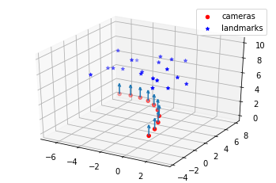
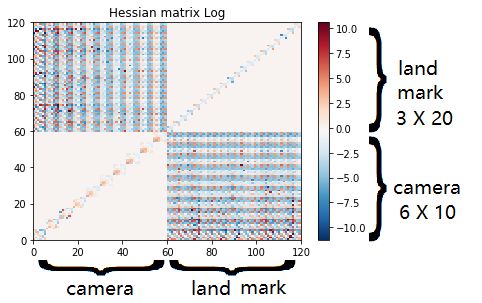

VIO deep blue
-------------------------

**Question 1**: 
~~~~~~~~~~~~~~~~~

At a certain time, the cameras and landmarks seen of a SLAM system can be seen as the image below. xi is the camera pose, L represents the observed landmark. When a landmark k was seen by ith camera in the world frame, the reprojection error is noted as r(xi_i, L_k)

.. image:: images/week4_1.PNG
   :width: 40%
   :align: center

**1.1 the information matrix of the upper system** :

In our system, the state variable x can be written as :

.. math::
    \mathbf{x} = \begin{bmatrix}  \xi_{1} & \xi_{2} & \xi_{3} & L_{1} & L_{2} & L_{3}   \end{bmatrix}

As a result, we have seven elements in the reprojection error term:

.. math:: 
    r_{1,1} = r(\xi_{1}, L_{1}) , r_{1,2} = r(\xi_{1}, L_{2})

.. math:: 
    r_{2,1} = r(\xi_{2}, L_{1}) , r_{2,2} = r(\xi_{2}, L_{2}), r_{2,3} = r(\xi_{2}, L_{3})

.. math:: 
    r_{3,2} = r(\xi_{3}, L_{2}) ,  r_{3,3} = r(\xi_{3}, L_{3})

The other terms are zeros. In summary we have:

.. math::
    \mathbf{r} = \sum_{i=1}^{3}\sum_{k=1}^{3} r_{i,k}
    
The system jacobian can be written as :
    
.. math::
    J = \frac{\partial \mathbf{r}}{\partial \mathbf{x}}
    = \begin{bmatrix}
    \frac{\partial r_{1,1}}{\partial \xi_{1}} & 0 & 0 & \frac{\partial r_{1,1}}{\partial L_{1}} & 0 & 0 \\
    \frac{\partial r_{1,2}}{\partial \xi_{1}} & 0 & 0 & 0 & \frac{\partial r_{1,2}}{\partial L_{2}} & 0 \\
    0 & \frac{\partial r_{2,1}}{\partial \xi_{2}} & 0 & \frac{\partial r_{2,1}}{\partial L_{1}} & 0 & 0 \\
    0 & \frac{\partial r_{2,2}}{\partial \xi_{2}} & 0 & 0 & \frac{\partial r_{2,2}}{\partial L_{2}} & 0 \\
    0 & \frac{\partial r_{2,3}}{\partial \xi_{2}} & 0 & 0 & 0 & \frac{\partial r_{2,3}}{\partial L_{3}} \\
    0 & 0 & \frac{\partial r_{3,2}}{\partial \xi_{3}} & 0 & \frac{\partial r_{3,2}}{\partial L_{2}} & 0 \\
    0 & 0 & \frac{\partial r_{3,3}}{\partial \xi_{3}} & 0 & 0 & \frac{\partial r_{3,3}}{\partial L_{3}}     
    \end{bmatrix}

.. math::
    J^{T}
    = \begin{bmatrix}
    (\frac{\partial r_{1,1}}{\partial \xi_{1}})^{T} & (\frac{\partial r_{1,2}}{\partial \xi_{1}})^{T} & 0 & 0 & 0 & 0 & 0 \\
    0 & 0 & (\frac{\partial r_{2,1}}{\partial \xi_{2}})^{T} & (\frac{\partial r_{2,2}}{\partial \xi_{2}})^{T} & (\frac{\partial r_{2,3}}{\partial \xi_{2}})^{T} & 0 & 0  \\
    0 & 0 & 0 & 0 & 0 & (\frac{\partial r_{3,2}}{\partial \xi_{3}})^{T} & (\frac{\partial r_{3,3}}{\partial \xi_{3}})^{T} \\
    (\frac{\partial r_{1,1}}{\partial L_{1}})^{T} & 0 & (\frac{\partial r_{2,1}}{\partial L_{1}})^{T} & 0 & 0 & 0 & 0 \\
    0 & (\frac{\partial r_{1,2}}{\partial L_{2}})^{T} & 0 & (\frac{\partial r_{2,2}}{\partial L_{2}})^{T} & 0 & (\frac{\partial r_{3,2}}{\partial L_{2}})^{T} & 0 \\
    0 & 0 & 0 & 0 & (\frac{\partial r_{2,3}}{\partial L_{3}})^{T} & 0 & (\frac{\partial r_{3,3}}{\partial L_{3}})^{T}     
    \end{bmatrix}
    
The corresponding covariance matirx is :

.. math::
    \mathbf{\Sigma} = Diag(
    \begin{bmatrix} \Sigma_{1,1} & \Sigma_{1,2} & \Sigma_{2,1} & \Sigma_{2,2} & \Sigma_{2,3} & \Sigma_{3,2} & \Sigma_{3,3}        \end{bmatrix}
    )
    
.. math::
    \mathbf{\Sigma}^{-1} = Diag(
    \begin{bmatrix} \Sigma_{1,1}^{-1} & \Sigma_{1,2}^{-1} & \Sigma_{2,1}^{-1} & \Sigma_{2,2}^{-1} & \Sigma_{2,3}^{-1} & \Sigma_{3,2}^{-1} & \Sigma_{3,3}^{-1}        \end{bmatrix}
    )

With the expression of the non linear problem : 

.. math::
    \Lambda = J^{T}\Sigma^{-1} J

.. math::
    \Lambda = J^{T} 
     \begin{bmatrix}
    \Sigma_{1,1}^{-1}\frac{\partial r_{1,1}}{\partial \xi_{1}} & 0 & 0 & \Sigma_{1,1}^{-1}\frac{\partial r_{1,1}}{\partial L_{1}} & 0 & 0 \\
    \Sigma_{1,2}^{-1}\frac{\partial r_{1,2}}{\partial \xi_{1}}  & 0 & 0 & 0 & \Sigma_{1,2}^{-1}\frac{\partial r_{1,2}}{\partial L_{2}} & 0 \\
    0 & \Sigma_{2,1}^{-1}\frac{\partial r_{2,1}}{\partial \xi_{2}} & 0 & \Sigma_{2,1}^{-1}\frac{\partial r_{2,1}}{\partial L_{1}} & 0 & 0 \\
    0 & \Sigma_{2,2}^{-1}\frac{\partial r_{2,2}}{\partial \xi_{2}} & 0 & 0 & \Sigma_{2,2}^{-1}\frac{\partial r_{2,2}}{\partial L_{2}} & 0 \\
    0 & \Sigma_{2,3}^{-1}\frac{\partial r_{2,3}}{\partial \xi_{2}} & 0 & 0 & 0 & \Sigma_{2,3}^{-1}\frac{\partial r_{2,3}}{\partial L_{3}} \\
    0 & 0 & \Sigma_{3,2}^{-1}\frac{\partial r_{3,2}}{\partial \xi_{3}} & 0 & \Sigma_{3,2}^{-1}\frac{\partial r_{3,2}}{\partial L_{2}} & 0 \\
    0 & 0 & \Sigma_{3,3}^{-1}\frac{\partial r_{3,3}}{\partial \xi_{3}} & 0 & 0 & \Sigma_{3,3}^{-1}\frac{\partial r_{3,3}}{\partial L_{3}}     
    \end{bmatrix}

.. math:: 
    = \begin{bmatrix}
   \Lambda_{1,1} & 0 & 0 & (\frac{\partial r_{1,1}}{\partial \xi_{1}})^{T}\Sigma_{1,1}^{-1}\frac{\partial r_{1,1}}{\partial L_{1}} & (\frac{\partial r_{1,2}}{\partial \xi_{1}})^{T}\Sigma_{1,2}^{-1}\frac{\partial r_{1,2}}{\partial L_{2}} & 0 \\
    0 & \Lambda_{2,2} & 0 & (\frac{\partial r_{2,1}}{\partial \xi_{2}})^{T}\Sigma_{2,1}^{-1}\frac{\partial r_{2,1}}{\partial L_{1}} & (\frac{\partial r_{2,2}}{\partial \xi_{2}})^{T}\Sigma_{2,2}^{-1}\frac{\partial r_{2,2}}{\partial L_{2}} & (\frac{\partial r_{2,3}}{\partial \xi_{2}})^{T}\Sigma_{2,3}^{-1}\frac{\partial r_{2,3}}{\partial L_{3}} \\
    0 & 0 & \Lambda_{3,3} & 0 & (\frac{\partial r_{3,2}}{\partial \xi_{3}})^{T}\Sigma_{3,2}^{-1}\frac{\partial r_{3,2}}{\partial L_{2}} & (\frac{\partial r_{3,3}}{\partial \xi_{3}})^{T}\Sigma_{3,3}^{-1}\frac{\partial r_{3,3}}{\partial L_{3}} \\
    (\frac{\partial r_{1,1}}{\partial L_{1}})^{T}\Sigma_{1,1}^{-1}\frac{\partial r_{1,1}}{\partial \xi_{1}} & (\frac{\partial r_{2,1}}{\partial L_{1}})^{T}\Sigma_{2,1}^{-1}\frac{\partial r_{2,1}}{\partial \xi_{2}} & 0 & \Lambda_{4,4} & 0 & 0  \\
    (\frac{\partial r_{1,2}}{\partial L_{2}})^{T}\Sigma_{1,2}^{-1}\frac{\partial r_{1,2}}{\partial \xi_{1}} & (\frac{\partial r_{2,2}}{\partial L_{2}})^{T}\Sigma_{2,2}^{-1}\frac{\partial r_{2,2}}{\partial \xi_{2}} & (\frac{\partial r_{3,2}}{\partial L_{2}})^{T}\Sigma_{3,2}^{-1}\frac{\partial r_{3,2}}{\partial \xi_{3}} & 0 & \Lambda_{5,5} & 0 \\
    0 & (\frac{\partial r_{2,3}}{\partial L_{3}})^{T}\Sigma_{2,3}^{-1}\frac{\partial r_{2,3}}{\partial \xi_{2}} & (\frac{\partial r_{3,3}}{\partial L_{3}})^{T}\Sigma_{3,3}^{-1}\frac{\partial r_{3,3}}{\partial \xi_{3}} & 0 & 0 & \Lambda_{6,6}
    \end{bmatrix}

.. math::
    \Lambda_{1,1} =  (\frac{\partial r_{1,1}}{\partial \xi_{1}})^{T}\Sigma_{1,1}^{-1}\frac{\partial r_{1,1}}{\partial \xi_{1}} + (\frac{\partial r_{1,2}}{\partial \xi_{1}})^{T}\Sigma_{1,2}^{-1}\frac{\partial r_{1,2}}{\partial \xi_{1}}
    
.. math::
    \Lambda_{2,2} =  (\frac{\partial r_{2,1}}{\partial \xi_{2}})^{T}\Sigma_{2,1}^{-1}\frac{\partial r_{2,1}}{\partial \xi_{2}} + (\frac{\partial r_{2,2}}{\partial \xi_{2}})^{T}\Sigma_{2,2}^{-1}\frac{\partial r_{2,2}}{\partial \xi_{2}} + (\frac{\partial r_{2,3}}{\partial \xi_{2}})^{T}\Sigma_{2,3}^{-1}\frac{\partial r_{2,3}}{\partial \xi_{2}} 
    
.. math::
    \Lambda_{3,3} = (\frac{\partial r_{3,2}}{\partial \xi_{3}})^{T}\Sigma_{3,2}^{-1}\frac{\partial r_{3,2}}{\partial \xi_{3}} + (\frac{\partial r_{3,3}}{\partial \xi_{3}})^{T}\Sigma_{3,3}^{-1}\frac{\partial r_{3,3}}{\partial \xi_{3}}

.. math::
    \Lambda_{4,4} = (\frac{\partial r_{1,1}}{\partial L_{1}})^{T}\Sigma_{1,1}^{-1}\frac{\partial r_{1,1}}{\partial L_{1}} + (\frac{\partial r_{2,1}}{\partial L_{1}})^{T}\Sigma_{2,1}^{-1}\frac{\partial r_{2,1}}{\partial L_{1}}

.. math::
    \Lambda_{5,5} =  (\frac{\partial r_{1,2}}{\partial L_{2}})^{T}\Sigma_{1,2}^{-1}\frac{\partial r_{1,2}}{\partial L_{2}} + (\frac{\partial r_{2,2}}{\partial L_{2}})^{T}\Sigma_{2,2}^{-1}\frac{\partial r_{2,2}}{\partial L_{2}} + (\frac{\partial r_{3,2}}{\partial L_{2}})^{T}\Sigma_{3,2}^{-1}\frac{\partial r_{3,2}}{\partial L_{2}} 

.. math::
    \Lambda_{6,6} = (\frac{\partial r_{2,3}}{\partial L_{3}})^{T}\Sigma_{2,3}^{-1}\frac{\partial r_{2,3}}{\partial L_{3}} + (\frac{\partial r_{3,3}}{\partial L_{3}})^{T}\Sigma_{3,3}^{-1}\frac{\partial r_{3,3}}{\partial L_{3}}

**1.2 marginalize xi_1** :

We can simply delete the elements related with xi_1

.. math:: 
    \begin{bmatrix}
    \Lambda_{2,2} & 0 & (\frac{\partial r_{2,1}}{\partial \xi_{2}})^{T}\Sigma_{2,1}^{-1}\frac{\partial r_{2,1}}{\partial L_{1}} & (\frac{\partial r_{2,2}}{\partial \xi_{2}})^{T}\Sigma_{2,2}^{-1}\frac{\partial r_{2,2}}{\partial L_{2}} & (\frac{\partial r_{2,3}}{\partial \xi_{2}})^{T}\Sigma_{2,3}^{-1}\frac{\partial r_{2,3}}{\partial L_{3}} \\
    0 & \Lambda_{3,3} & 0 & (\frac{\partial r_{3,2}}{\partial \xi_{3}})^{T}\Sigma_{3,2}^{-1}\frac{\partial r_{3,2}}{\partial L_{2}} & (\frac{\partial r_{3,3}}{\partial \xi_{3}})^{T}\Sigma_{3,3}^{-1}\frac{\partial r_{3,3}}{\partial L_{3}} \\
    (\frac{\partial r_{2,1}}{\partial L_{1}})^{T}\Sigma_{2,1}^{-1}\frac{\partial r_{2,1}}{\partial \xi_{2}} & 0 & \Lambda_{4,4} & 0 & 0  \\
    (\frac{\partial r_{2,2}}{\partial L_{2}})^{T}\Sigma_{2,2}^{-1}\frac{\partial r_{2,2}}{\partial \xi_{2}} & (\frac{\partial r_{3,2}}{\partial L_{2}})^{T}\Sigma_{3,2}^{-1}\frac{\partial r_{3,2}}{\partial \xi_{3}} & 0 & \Lambda_{5,5} & 0 \\
    (\frac{\partial r_{2,3}}{\partial L_{3}})^{T}\Sigma_{2,3}^{-1}\frac{\partial r_{2,3}}{\partial \xi_{2}} & (\frac{\partial r_{3,3}}{\partial L_{3}})^{T}\Sigma_{3,3}^{-1}\frac{\partial r_{3,3}}{\partial \xi_{3}} & 0 & 0 & \Lambda_{6,6}
    \end{bmatrix}
    
.. math::
    \Lambda_{2,2} =  (\frac{\partial r_{2,1}}{\partial \xi_{2}})^{T}\Sigma_{2,1}^{-1}\frac{\partial r_{2,1}}{\partial \xi_{2}} + (\frac{\partial r_{2,2}}{\partial \xi_{2}})^{T}\Sigma_{2,2}^{-1}\frac{\partial r_{2,2}}{\partial \xi_{2}} + (\frac{\partial r_{2,3}}{\partial \xi_{2}})^{T}\Sigma_{2,3}^{-1}\frac{\partial r_{2,3}}{\partial \xi_{2}} 
    
.. math::
    \Lambda_{3,3} = (\frac{\partial r_{3,2}}{\partial \xi_{3}})^{T}\Sigma_{3,2}^{-1}\frac{\partial r_{3,2}}{\partial \xi_{3}} + (\frac{\partial r_{3,3}}{\partial \xi_{3}})^{T}\Sigma_{3,3}^{-1}\frac{\partial r_{3,3}}{\partial \xi_{3}}

.. math::
    \Lambda_{4,4} = (\frac{\partial r_{2,1}}{\partial L_{1}})^{T}\Sigma_{2,1}^{-1}\frac{\partial r_{2,1}}{\partial L_{1}}

.. math::
    \Lambda_{5,5} = (\frac{\partial r_{2,2}}{\partial L_{2}})^{T}\Sigma_{2,2}^{-1}\frac{\partial r_{2,2}}{\partial L_{2}} + (\frac{\partial r_{3,2}}{\partial L_{2}})^{T}\Sigma_{3,2}^{-1}\frac{\partial r_{3,2}}{\partial L_{2}} 

.. math::
    \Lambda_{6,6} = (\frac{\partial r_{2,3}}{\partial L_{3}})^{T}\Sigma_{2,3}^{-1}\frac{\partial r_{2,3}}{\partial L_{3}} + (\frac{\partial r_{3,3}}{\partial L_{3}})^{T}\Sigma_{3,3}^{-1}\frac{\partial r_{3,3}}{\partial L_{3}}

**Queation 2**
~~~~~~~~~~~~~~~~~~~~~

**1.1** Simulation with 10 camera poses and 20 landmarks. Data shown in the following image (with the first the frame as the reference):

The objective is to minimize the reprojection error:

.. math::
    argmin\lVert \mathbf{e} \lVert_{2}^{2} = argmin \frac{1}{2} \sum_{i=1}^{n} \lVert \mathbf{u}_{i} - \frac{1}{s_{i}} \mathbf{K} exp([\mathbf{\xi}]_{X}) \mathbf{P}_{i}   \lVert_{2}^{2}

**1.2 for the Landmark points** :

.. math::
    J_{\mathbf{P}} = \frac{\partial \mathbf{e}}{\partial \mathbf{P}} = \frac{\partial \mathbf{e}}{\partial exp([\mathbf{\xi}]_{X}) \mathbf{P}}  \frac{\partial exp([\mathbf{\xi}]_{X}) \mathbf{P}}{\partial \mathbf{P}}

We note:

.. math::
    \mathbf{P}' = exp([\mathbf{\xi}]_{X}) \mathbf{P}_{i} = \mathbf{R}\mathbf{P} + \mathbf{t}
                = \begin{bmatrix} X' & Y' & Z'  \end{bmatrix} ^{T}

We can easily get:

.. math::
    \frac{\partial \mathbf{P'}} {\partial \mathbf{P}} = \mathbf{R}

For the other term:

.. math::
    s\mathbf{e} = \begin{bmatrix} su \\ sv \\ s  \end{bmatrix} - 
                \begin{bmatrix} f_{x} & 0 & c_{x}\\
                                0 & f_{y} & c_{y} \\
                                0 & & 1   \end{bmatrix} ^{T}
                \begin{bmatrix} X' \\ Y' \\ Z'  \end{bmatrix}
                =  \begin{bmatrix} su - f_{x} X' - c_{x} Z' \\
                                   sv - f_{y} Y' - c_{y} Z' \\ 
                                   s - Z'  \end{bmatrix}

To minimize error, we have s = Z' from the third equation. The error will left two terms, the derivative should be 2 times 3.

.. math::
    \mathbf{e} =  \begin{bmatrix} u - f_{x} X' / Z' - c_{x} \\
                                   v - f_{y} Y' /Z'- c_{y} \end{bmatrix}

.. math::
    \frac{\partial \mathbf{e}}{\partial \mathbf{P'}} 
    = \begin{bmatrix} \frac{e_{1}}{X'} & \frac{e_{1}}{Y'} & \frac{e_{1}}{Z'}  \\
         \frac{e_{2}}{X'} & \frac{e_{2}}{Y'} & \frac{e_{2}}{Z'}  \end{bmatrix}
    = \begin{bmatrix} - f_{x}/Z' & 0 & f_{x}X'/Z'^{2}  \\
         0 & - f_{y}/Z' & f_{y}Y'/Z'^{2}  \end{bmatrix}

Finally, the jacobian of landmark points is:

.. math::
    J_{\mathbf{P}} = \begin{bmatrix} - f_{x}/Z' & 0 & f_{x}X'/Z'^{2}  \\
         0 & - f_{y}/Z' & f_{y}Y'/Z'^{2}  \end{bmatrix}  \mathbf{R}

**1.3 for camera poses**:

.. math::
    J_{\mathbf{\xi}} = \frac{\partial \mathbf{e}}{\partial \mathbf{\xi}} = \frac{\partial \mathbf{e}}{\partial \mathbf{P'}} \frac{\partial \mathbf{P'}}{\partial \mathbf{\xi}}

Use the left disturbance model:

.. math::
    \frac{\partial \mathbf{P'}} {\partial \mathbf{\xi}} 
    = \lim_{\delta \xi \rightarrow 0}\frac{ exp( [\delta \xi]_{X} ) \mathbf{P'} - \mathbf{P'} }{\delta \xi } 
    = \lim_{\delta \xi \rightarrow 0}\frac{ (\mathbf{I} + [\delta \xi]_{X} )\mathbf{P'} - \mathbf{P'} }{\delta \xi } 

.. math::
    = \lim_{\delta \xi \rightarrow 0}\frac{ [\delta \xi]_{X} exp([\xi]_{X} )\mathbf{P} }{\delta \xi } 
    = \lim_{\delta \xi \rightarrow 0}\frac{ - [exp([\xi]_{X} )]_{X} \delta \xi }{\delta \xi } \mathbf{P}
    = - [exp([\xi]_{X} )]_{X} \mathbf{P}

Or if we try to keep P' as variables:

.. math::
    = \lim_{\delta \xi \rightarrow 0}\frac{ [\delta \xi]_{X} \mathbf{P'} }{\delta \xi } 
    = \lim_{\delta \xi \rightarrow 0}\frac{ - [\mathbf{P'}]_{X} \delta \xi }{\delta \xi }
    = - [\mathbf{P'}]_{X}

Finally get the camera pose term jacobian:

.. math::
    J_{\mathbf{\xi}} = 
        \begin{bmatrix} - f_{x}/Z' & 0 & f_{x}X'/Z'^{2} & f_{x}X'Y'/Z'^{2} & - f_{x} - f_{x}X'^{2}/Z'^{2} & f_{x}Y'/Z' \\
         0 & - f_{y}/Z' & f_{y}Y'/Z'^{2} & f_{y} + f_{y}Y'^{2}/Z'^{2} & -f_{y}X'Y'/Z'^{2} &  -f_{y}X'/Z'  \end{bmatrix} 

**1.4**

We defined the jacobian matrix of camera i and point j to be : 

.. math::
    J_{i,j} = \begin{bmatrix} J_{Ti} & J_{Pj}  \end{bmatrix}

As a result, the Hessian matrix can be calculated as follows, and we take Sigma to be ones.

.. math::
    H = \sum_{i} \sum_{j} H_{i,j} = \sum_{i} \sum_{j} J_{i,j}^{T} \Sigma_{i,j}  J_{i,j}
    
.. math::
    H_{i,j} = J_{i,j}^{T} J_{i,j}
            = \begin{bmatrix} J_{Ti}^{T} \\ J_{Pj}^{T}  \end{bmatrix} 
              \begin{bmatrix} J_{Ti} & J_{Pj}  \end{bmatrix}
            = \begin{bmatrix} J_{Ti}^{T}J_{Ti} & J_{Ti}^{T}J_{Pj} \\
               J_{Pj}^{T}J_{Ti} & J_{Pj}^{T}J_{Pj}\end{bmatrix}

We can take a sum of all the Jacobian part to get our final result.
Then we can re-range the order of state variables (camera poses at the beginning, following we set the points positions). The result Hessian matirx has 120 * 120 elements.

If we calculate the eigen values of this matrix, we found the last seven eigen values to be almost zero. This system should have multiply solutions. And we need 7 more constrains to have a singal solution.

* scale : 1 
* original reference frame : 6 

