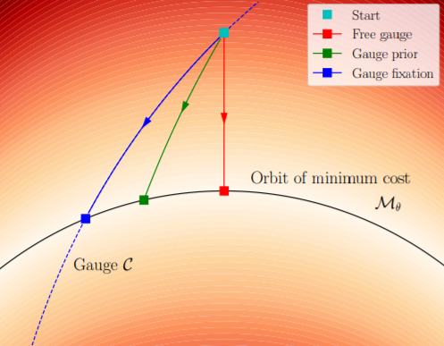

Paper read
=========================

Gauge Freedom
-----------------------

文章 [#]_ 主要探讨了 **Gauge Freedom** 对VI系统的影响。Gauge Freedom可以理解为系统的不确定性，不能观测的变量，或者Hessian矩阵的零空间大小。对于纯视觉SLAM来说，维度是 **7** ，包含了六个初始位姿的不确定和尺度scale的不确定性。对VI视觉+IMU系统来说，由于引入了重力的大小和方向，系统的Gauge freedom为 **4** 维，包括三个平移不确定和yaw角度不确定。

比较/分析手段
~~~~~~~~~~~~~~~~~~~~~~~~~~~~

为了稳定的求解VISLAM的系统，需要对这4个自由度做处理。在文章中，分别讨论了三种处理方式，并且分别做了数值分析和讨论。

1. **fixing** the unobservable states to some given values. 固定这些不能观测的量，具体的来说就是固定初始的位姿 :math:`p_{0}^{0}, R_{0}^{0}` 。
2. setting a **prior** on such states. 给这些不能观测量加入先验知识。具体来说，给初始位姿对应的Hessian矩阵通过叠加对角阵的形式增加先验信息。
3. letting the states evolve **freely** . 什么都不做，任其发展。

Prior方式的处理相当于另外两种的平均。和Fixation方式一样，它也是给不可观测量增加约束，但是同时加入了状态的不确定性。所以：

* 如果叠加的对角阵的元素值非常大，结果会和Fixation gauge基本一致。
* 如果叠加的对角阵元素非常小，接近零，结果则会和Free gauge的方式一致。

在分析方面，对三个方向进行分析：

1. accuracy. 精度方面，先将结果的trajectory统一align。之后，位置的误差通过关键帧的物理距离衡量，旋转的误差，通过相对角度的大小衡量。
2. computational cost. 运算时间，通过模拟50次优化，分别衡量总时间、迭代次数、每次迭代的时间。
3. estimated covariance. 结果的方差。由于他们在分形空间中不统一，作者采取了线性转换的形式将他们在高维的参数空间中统一，之后分析。

问题阐述
~~~~~~~~~~~~~~~~~~~~~~~~~~~
在VISLAM中，由于缺少了整体的平移和yaw角度的观测，系统是有多组解的（没有唯一解）。那么多解可以描述为：**参数空间中的流型（~特殊的高维几何）** ，在这个流型 **M** 上的所有点都是系统的解。为了得到唯一解，可以选择在空间中增加约束，约束会通过另一个高维几何体 **C** 的形式体现，而约束之后的解一定会落在 **M** 和 **C** 的交集（参数空间的几何上的交界处）上。

   
如上图所示，Fixation gauge方式的结果会在 **M** 和 **C** 的交界处，Free gauge方式的结果会落在 **M** 上（具体位置会收到Start初值影响）。根据前面的分析，Prior gauge方式的结果则会落在另外两种方式之间，具体位置由叠加的先验信息矩阵决定。

.. [#] Zhang Z, Gallego G, Scaramuzza D. On the comparison of gauge freedom handling in optimization-based visual-inertial state estimation[J]. IEEE Robotics and Automation Letters, 2018, 3(3): 2710-2717.
